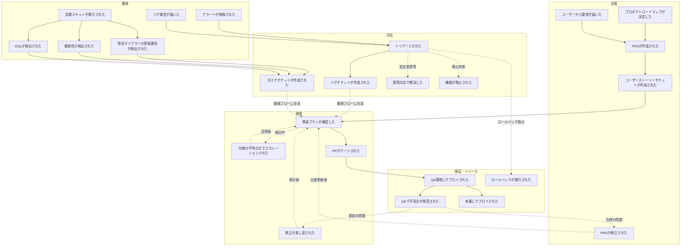
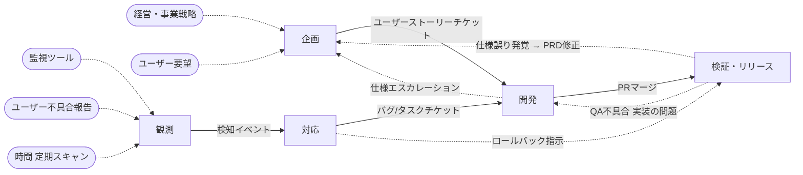

# Big Picture — プロダクト開発・運用保守

社内プロダクト開発および運用保守の全体像をイベントストーミング Big Picture で整理したもの。

## スコープ

- 対象: 社内で活用するソフトウェアの開発および運用メンテナンス
- 形態: 汎用（特定のソフトウェア形態を前提としない）

## ドメインイベント一覧

Big Picture の粒度原則（コンテキスト境界を跨ぐ・重要な状態遷移点・業務フロー間の合流分岐点）に従い24個を抽出した。単一コンテキスト内部の細かい工程は Design Level で掘る。

| # | イベント名 | 説明 | 所属コンテキスト |
|---|---|---|---|
| 1 | プロダクトロードマップが決定した | 経営・事業戦略からの方針確定 | 企画 |
| 2 | ユーザーから要望が届いた | 社員ユーザーからの要望到達 | 企画 |
| 3 | PRDが作成された | なぜ・要求・成果指標・ユーザーストーリー概要を含む文書作成 | 企画 |
| 4 | PRDが修正された | QAで仕様誤りが発覚した場合の更新 | 企画 |
| 5 | ユーザーストーリーチケットが作成された | PRDをブレークダウンしたチケット起票 | 企画 |
| 6 | 実装プランが確定した | エスカレーション・技術相談を経てプラン承認 | 開発 |
| 7 | 仕様の不明点がエスカレーションされた | プラン作成中の質問を上流に返送 | 開発 |
| 8 | 修正が差し戻された | レビュー/QAからの再作業要求 | 開発 |
| 9 | PRがマージされた | レビュー通過後にマージ | 開発 |
| 10 | QA環境にデプロイされた | マージ後にQA環境反映 | 検証・リリース |
| 11 | QAで不具合が発見された | 探索的テスト中に問題検出 | 検証・リリース |
| 12 | 本番にデプロイされた | 本番反映 | 検証・リリース |
| 13 | ロールバックが実行された | インシデント対応で前バージョンを再デプロイ | 検証・リリース |
| 14 | アラートが発報された | 監視系からの異常通知 | 観測 |
| 15 | バグ報告が届いた | ユーザーからの不具合報告 | 観測 |
| 16 | 定期スキャンが実行された | 依存・脆弱性・EOLスキャンがトリガー | 観測 |
| 17 | 依存ライブラリの更新通知が検出された | スキャン結果として更新識別 | 観測 |
| 18 | 脆弱性が検出された | スキャン結果として脆弱性識別 | 観測 |
| 19 | EOLが検出された | スキャン結果としてサポート期限超過識別 | 観測 |
| 20 | トリアージされた | 対応要否・優先度・担当が判断された | 対応 |
| 21 | バグチケットが作成された | 不具合対応のためのチケット起票 | 対応 |
| 22 | タスクチケットが作成された | EOL/脆弱性/その他対応のためのチケット起票 | 対応 |
| 23 | 運用対応で解決した | 設定変更等で運用内完結 | 対応 |
| 24 | 機能が廃止された | 利用されなくなった機能を撤去 | 対応 |

### 採用した方針

- **チケット種別を3分類**: ユーザーストーリー（プロダクト機能）/ バグ（不具合）/ タスク（EOL・脆弱性・その他）
- **脆弱性の緊急度判定はタスクチケット作成の属性として扱う**: 独立イベントには立てない
- **バグ・障害は調査→トリアージ→起票の順序**: 脆弱性・EOL・依存更新はスキャン検出→直接チケット作成の順序
- **SLOは対象外**: 現状SLOを定義していないため
- **画面仕様確定イベントは省略**: PRD作成時に必須か未定のためホットスポット化
- **ユーザー行動ログ・サービス終了は対象外**
- **障害検知イベントは削除**: アラート発報→トリアージに直結
- **稼働状態とリリース成果物の視点分離**: 観測コンテキストは特定のデプロイから因果的にトリガーされず、外部トリガー駆動で独立動作する
- **本番デプロイは自動/手動を統合**: 1イベントで扱う
- **修正差し戻しの戻り先は実装プラン確定**: 実装プランは永続的ではなく、差し戻し時には再作成する

### 省略したイベント（Design Level で深掘り）

- **開発内部**: Design Level 実施済み → `docs/development/event-storming.md`（セルフ動作確認は検証ゲートに統合）
- **検証内部**: Design Level 実施済み → `docs/qa/event-storming.md`（探索的テスト・リグレッションテスト・不具合起票の詳細を3集約で定義）
- **対応内部**: 初期調査が実施された、緊急度が判定された（タスクチケット作成の属性）

## イベントフロー図

### 線種の凡例

| 線種 | 意味 |
|---|---|
| 実線 | 主フロー |
| 点線 | 分岐・逆流・合流・コンテキスト跨ぎの連携 |

## コンテキスト一覧

| # | コンテキスト名 | 責務 | 含む主要イベント |
|---|---|---|---|
| 1 | 企画 | プロダクトの方向性決定と要求の文書化。何を作るかを決める | プロダクトロードマップが決定した、ユーザーから要望が届いた、PRDが作成された、PRDが修正された、ユーザーストーリーチケットが作成された |
| 2 | 開発 | チケットから実装プランを立て、コードとテストを書き、PRマージまで持っていく | 実装プランが確定した、仕様の不明点がエスカレーションされた、修正が差し戻された、PRがマージされた |
| 3 | 検証・リリース | QA環境での品質保証と本番反映判断、およびロールバック実行 | QA環境にデプロイされた、QAで不具合が発見された、本番にデプロイされた、ロールバックが実行された |
| 4 | 観測 | 稼働中システムの状態を受動的・自動的に検知する | アラートが発報された、バグ報告が届いた、定期スキャンが実行された、依存ライブラリの更新通知が検出された、脆弱性が検出された、EOLが検出された |
| 5 | 対応 | 検知された問題を評価し、処理方針を決定・起票する | トリアージされた、バグチケットが作成された、タスクチケットが作成された、運用対応で解決した、機能が廃止された |

### 分割の根拠

- **企画を1つにまとめた**: ロードマップ起点とユーザー要望起点は入口が違うだけで、最終的に「PRDを作る→チケットを作る」に収束する
- **開発を1つにまとめた**: 実装プラン確定から PRマージまでは同じ開発者が一貫して責任を持ち、チケット単位で完結する
- **検証・リリースを統合**: QA環境デプロイ・探索的テスト・本番デプロイ・ロールバックは「開発完了後〜稼働開始まで」という同じライフサイクル段階にある
- **観測と対応を分離**: 観測は受動的・自動的・ツール中心の責務（見る・検知する）で、対応は能動的・判断的・人間中心の責務（評価する・決める）
- **機能廃止は対応側**: 廃止は「運用継続かコスト削減か」の判断の一形態

### 観測コンテキストの拡張余地

現時点ではイベント一覧に含まれていないが、観測コンテキストは将来的に以下も担う可能性がある:

- KPI・利用率の計測
- 機能ごとの稼働状況の観測

これらを整備すれば、企画コンテキストへのフィードバックループが成立する（現状は未整備、ホットスポット #5）。

## コンテキスト間の依存関係

### 連携一覧

| # | 上流 | 下流 | 連携トリガー | 下流で発生するイベント | 方向性 |
|---|---|---|---|---|---|
| 1 | 企画 | 開発 | ユーザーストーリーチケットが作成された | 実装プランが確定した | 順方向（主フロー） |
| 2 | 開発 | 検証・リリース | PRがマージされた | QA環境にデプロイされた | 順方向（主フロー） |
| 3 | 観測 | 対応 | アラート発報／バグ報告／脆弱性・EOL・依存更新の検出 | トリアージされた または タスクチケットが作成された | 順方向（主フロー） |
| 4 | 対応 | 開発 | バグチケットが作成された／タスクチケットが作成された | 実装プランが確定した | 順方向（合流） |
| 5 | 開発 | 企画 | 仕様の不明点がエスカレーションされた | （企画側で回答が用意される） | 逆方向（エスカレーション） |
| 6 | 検証・リリース | 企画 | QAで不具合が発見された（仕様起因） | PRDが修正された | 逆方向（PRD修正） |
| 7 | 検証・リリース | 開発 | QAで不具合が発見された（実装問題） | 修正が差し戻された → 実装プランが確定した | 逆方向（差し戻し） |
| 8 | 対応 | 検証・リリース | トリアージされた（ロールバック判断） | ロールバックが実行された | 逆方向（ロールバック） |

### 構造の特徴

**主フローは2つの独立した系に分かれる:**

- **系1（プロダクト変更フロー）**: 経営・ユーザー要望 → 企画 → 開発 → 検証・リリース（ここで終端）
- **系2（運用対応フロー）**: 監視・ユーザー不具合報告・時間 → 観測 → 対応 → 開発 → 検証・リリース（ここで合流して終端）

**2つの系は独立したトリガー源を持ちつつ、開発と検証・リリースで合流する:**

- 開発コンテキストは「企画由来のチケット」と「対応由来のチケット」の両方を受け取る合流点
- 検証・リリースコンテキストは両系の最終ゲート
- 観測コンテキストは他コンテキストからの因果的な上流を持たず、外部トリガー駆動で独立して動く

**逆方向連携は4本:**

- エスカレーション（開発→企画）
- PRD修正（検証・リリース→企画）
- 差し戻し（検証・リリース→開発）
- ロールバック（対応→検証・リリース）

## ホットスポット

| # | ホットスポット | 関連するコンテキスト | 解消アクション |
|---|---|---|---|
| 1 | PRD作成時に画面仕様（Figma）が必須かどうかのポリシーが未定 | 企画 | PRD作成基準を定義する |
| 2 | リリース後にPRDが更新されないため情報が陳腐化している。鮮度維持ポリシーがない | 企画 | PRDの鮮度維持責任・更新タイミングを定義する、または「PRDは開発時点の意思決定記録」と割り切るかの判断 |
| 3 | 機能廃止の判断基準・トリガー条件が未定義。実例も少ない | 企画 / 対応 | 廃止判断の基準（利用率・運用コスト等）と発動条件を定義する |
| 4 | 同種バグ・要望の累積を検知する仕組みがない | 観測 / 対応 / 企画 | 累積検知の仕組み（バグ傾向分析・要望集約）を整備するか判断する |
| 5 | KPI計測から企画へのフィードバックループが未整備 | 観測 / 企画 | KPI計測イベントを定義し、企画への定期フィードバック経路を作る |
| 6 | アラート発報と誤検知の判定プロセスが未整理 | 観測 / 対応 | アラートトリアージの基準と誤検知判定のタイミングを定義する |
| 7 | 「修正が差し戻された」の起点（レビュー/QA/動作確認）ごとの条件・粒度が曖昧 | 開発 / 検証 | **開発側は解消済み** → `docs/development/event-storming.md`。**検証側は整理済み** → `docs/qa/event-storming.md`（テスト実行は結果報告で完了し、差し戻し判断は外部のトリアージ機構に委ねる） |
| 8 | リソース配分見直しのための企画層巻き込み判断の所在が不明確 | 対応 / 企画 | インシデント規模に応じたエスカレーション基準と、関与者が担う責務の定義 |
| 9 | 「稼働状態」（継続的）と「リリース成果物」（バージョン単位）の視点の違いが整理されていない | リリース / 観測 | Design Level で「リリース成果物」集約のライフサイクル（生成→デプロイ→稼働→廃止）を整理する。検証・リリース分割（#15）により、リリース側コンテキストの所在が先決 |
| 10 | 観測コンテキストは「イベント駆動」ではなく「継続観測」の性質を持つが、Big Picture でのイベント表現だけでは責務が捉えきれない | 観測 | Design Level で継続観測の内部構造（メトリクス・ダッシュボード・アラートルール等）を掘る |
| 11 | 用語の多義性: 「チケット」は企画起票（ユーザーストーリー）と運用起票（バグ・タスク）で出自・ライフサイクルが異なる | 企画 / 対応 / 開発 | **開発側は解消済み** → `docs/development/event-storming.md`（開発コンテキスト内では全種別同一フロー。種別差はチケットの属性）。企画/対応側は未着手 |
| 12 | 用語の多義性: 「デプロイ」は QA環境と本番で意味合いが異なる | 検証 / リリース | **検証側は整理済み** → `docs/qa/event-storming.md`（検証コンテキストがQAデプロイのプロセス（指示権）を所有。CI/CDはメカニズム実行者）。本番デプロイはリリース側コンテキストで整理（#15が先決） |
| 13 | 用語の多義性: 「テスト」は自動テスト（TDD）と探索的テスト（手動）で性質が違う | 開発 / 検証 | **開発側は解消済み** → `docs/development/event-storming.md`。**検証側は解消済み** → `docs/qa/event-storming.md`（リグレッションテスト＝E2E自動テスト、探索的テスト＝QA担当者による手動テストとして分離定義） |
| 14 | バグチケット／タスクチケットを経由して実装プラン確定に合流する際、ユーザーストーリー由来と同じプロセスで扱われるのか不明 | 対応 / 開発 | **解消済み** → `docs/development/event-storming.md`（全種別が同一メインボード・同一フローで合流。開発コンテキスト内ではプロセスの違いなし） |
| 15 | 検証・リリースのコンテキスト分割が必要 | 検証 / リリース | **検証側は分離済み** → `docs/qa/event-storming.md`。リリース側は未決定。議論の結果、以下が判明: (1) リリース（成果物の公開）とデプロイ（実行環境への投入）は別概念、(2) ドメインモデルはプロセス（判断・指示）を扱い、メカニズム（技術的実行）はCI/CD外部システムの責務、(3) 検証コンテキストがQAデプロイのプロセスを所有すべき、(4) 本番デプロイのプロセス所有コンテキストは#16（トリアージ機構）・#17（PdMリリース可否判断）の解決が先決。Big Pictureのコンテキスト一覧・フロー図・依存図の更新を含む |
| 16 | トリアージ機構の所在が不明 | 検証 / 対応 / 企画 | バグの「リリースブロッカー判定」を誰が・どこで・誰に回答するかが未定義。QA文脈ではブロッカー判定、プロダクト管理文脈ではバックログリファインメントと、同じトリアージ行為が文脈で意味を変える |
| 17 | PdMのリリース可否判断の責務帰属が不明 | 検証 / 企画 | PdMがリリース基準を判定する行為が企画コンテキストの責務か、別の責務かを明確にする |

## 用語の多義性

| 用語 | コンテキスト | そのコンテキストでの意味 |
|---|---|---|
| チケット | 企画 | PRDをブレークダウンした `ユーザーストーリーチケット`。プロダクト機能の実装単位 |
| チケット | 対応 | 検知された問題への対応単位。`バグチケット`（不具合対応）と `タスクチケット`（EOL/脆弱性/その他）の2種類がある |
| チケット | 開発 | 種別を問わず `実装プランが確定した` の入力として扱われる作業単位 |
| デプロイ | 検証・リリース | 2種類ある。`QA環境にデプロイ`（テスト準備）と `本番にデプロイ`（稼働開始）で意味と影響範囲が異なる |
| テスト | 開発 | 自動テスト。TDDで実装前に作成されるコードによる検証 |
| テスト | 検証・リリース | 探索的テスト。QA担当が手動で実施する人間による検証 |

## Design Level への導線

各コンテキストの内部構造・集約・状態遷移は Design Level で深掘りする。特に以下の論点は Design Level で優先的に整理する価値がある:

- **検証**: Design Level 実施済み → `docs/qa/event-storming.md`
- **リリース**: リリース（成果物の公開）とデプロイ（実行環境への投入）の概念整理、本番デプロイのプロセス所有コンテキスト決定、リリース成果物のライフサイクル（ホットスポット #15 の解決が先決）
- **観測**: 継続観測の内部構造、メトリクス・ダッシュボード・アラートルールの設計
- **対応**: トリアージの判断ロジック、チケット種別ごとの分岐、インシデント対応時の意思決定階層
- **開発**: Design Level 実施済み → `docs/development/event-storming.md`
- **企画**: PRDのライフサイクル、機能廃止判断、KPI計測との関係
