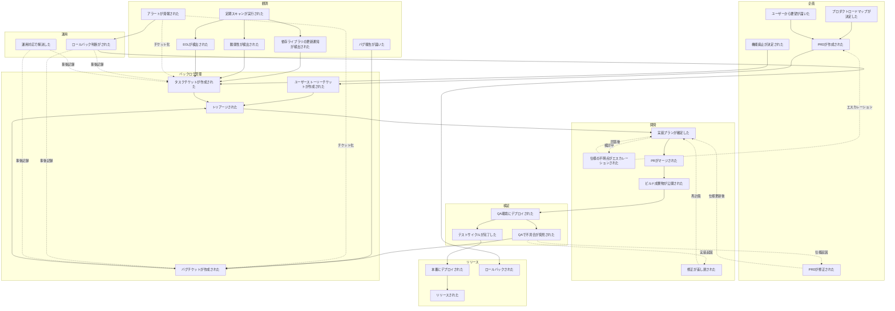
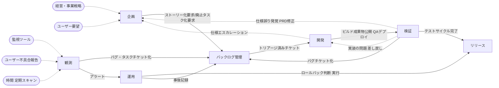

# Big Picture — プロダクト開発・運用保守

社内プロダクト開発および運用保守の全体像をイベントストーミング Big Picture で整理したもの。

## スコープ

- 対象: 社内で活用するソフトウェアの開発および運用メンテナンス
- 形態: 汎用（特定のソフトウェア形態を前提としない）

## ドメインイベント一覧

Big Picture の粒度原則（コンテキスト境界を跨ぐ・重要な状態遷移点・業務フロー間の合流分岐点）に従い28個を抽出した。単一コンテキスト内部の細かい工程は Design Level で掘る。

| # | イベント名 | 説明 | 所属コンテキスト |
|---|---|---|---|
| 1 | プロダクトロードマップが決定した | 経営・事業戦略からの方針確定 | 企画 |
| 2 | ユーザーから要望が届いた | 社員ユーザーからの要望到達 | 企画 |
| 3 | PRDが作成された | なぜ・要求・成果指標・ユーザーストーリー概要を含む文書作成 | 企画 |
| 4 | PRDが修正された | QAで仕様誤りが発覚した場合の更新 | 企画 |
| 5 | 機能廃止が決定された | 利用されなくなった機能の廃止方針確定 | 企画 |
| 6 | 実装プランが確定した | エスカレーション・技術相談を経てプラン承認 | 開発 |
| 7 | 仕様の不明点がエスカレーションされた | プランニング中の質問を上流に返送 | 開発 |
| 8 | 修正が差し戻された | レビュー/QAからの再作業要求 | 開発 |
| 9 | PRがマージされた | レビュー通過後にマージ | 開発 |
| 10 | QA環境にデプロイされた | マージ後にQA環境反映 | 検証 |
| 11 | QAで不具合が発見された | 探索的テスト中に問題検出 | 検証 |
| 12 | ビルド成果物が公開された | ビルド成果物（バージョン付き）が registry に公開された | 開発 |
| 13 | 本番にデプロイされた | ビルド成果物が本番実行環境に投入された | リリース |
| 14 | リリースされた | ユーザーに機能価値が届いた | リリース |
| 15 | ロールバックされた | 前バージョンの成果物が本番環境に再デプロイされた | リリース |
| 16 | アラートが発報された | 監視系からの異常通知 | 観測 |
| 17 | バグ報告が届いた | ユーザーからの不具合報告 | 観測 |
| 18 | 定期スキャンが実行された | 依存・脆弱性・EOLスキャンがトリガー | 観測 |
| 19 | 依存ライブラリの更新通知が検出された | スキャン結果として更新識別 | 観測 |
| 20 | 脆弱性が検出された | スキャン結果として脆弱性識別 | 観測 |
| 21 | EOLが検出された | スキャン結果としてサポート期限超過識別 | 観測 |
| 22 | ロールバック判断がされた | インシデント対応の中でロールバック方針が決定された | 運用 |
| 23 | 運用対応で解決した | 設定変更等で運用内完結 | 運用 |
| 24 | トリアージされた | 対応要否・優先度・担当が判断された | バックログ管理 |
| 25 | ユーザーストーリーチケットが作成された | PRDをブレークダウンしたチケット起票 | バックログ管理 |
| 26 | バグチケットが作成された | 不具合対応のためのチケット起票 | バックログ管理 |
| 27 | タスクチケットが作成された | EOL/脆弱性/依存更新/機能廃止等のためのチケット起票 | バックログ管理 |
| 28 | テストサイクルが完了した | QA環境でのテストが完了しリリース可能と判断された | 検証 |

### 採用した方針

- **チケット種別を3分類**: ユーザーストーリー（プロダクト機能）/ バグ（不具合）/ タスク（EOL・脆弱性・依存更新・機能廃止・その他）
- **チケット起票の集約**: 起票イベントはバックログ管理コンテキストの入り口として扱う。起票元コンテキスト（企画・検証・観測・運用）は発見イベントを発火し、コンテキスト間連携でバックログ管理がチケット化する
- **トリアージの一元化**: バックログ管理コンテキストが全作業要求（ユーザーストーリー・バグ・タスク）のトリアージを所有する。チームリソース配分の統合判断点として機能する
- **脆弱性の緊急度判定はタスクチケット作成の属性として扱う**: 独立イベントには立てない
- **バグ・障害は調査→トリアージ→起票の順序**: 脆弱性・EOL・依存更新はスキャン検出→直接チケット作成の順序
- **SLOは対象外**: 現状SLOを定義していないため
- **画面仕様確定イベントは省略**: PRD作成時に必須か未定のためホットスポット化
- **ユーザー行動ログ・サービス終了は対象外**
- **障害検知イベントは削除**: アラート発報→運用インシデント対応に直結
- **稼働状態とビルド成果物の視点分離**: 観測コンテキストは特定のデプロイから因果的にトリガーされず、外部トリガー駆動で独立動作する
- **本番デプロイは自動/手動を統合**: 1イベントで扱う
- **修正差し戻しの戻り先は実装プラン確定**: 実装プランは永続的ではなく、差し戻し時には再作成する
- **用語の3語体系採用**: ビルド成果物公開（技術的公開）・デプロイ（実行環境投入）・リリース（ユーザーへの機能提供）を別概念として扱う。同じCI/CDパイプラインの別フェーズとしてイベント化する
- **CI/CD の責務分離**: CI（ビルド・テスト・統合）とCD（Continuous Delivery＝ビルド成果物公開まで）は開発コンテキストの責務。本番デプロイ判断・投入指示はリリースコンテキストの責務。「ビルド成果物管理」（公開・保管）は開発所有、「ビルド成果物の利用判断」（デプロイ可否判定・リリース候補選択）はリリース所有で切り分ける。registry が外部マネージドか self-host かは実装選択で Design Level の関心
- **プロセスとメカニズムの分離**: ドメインモデルはプロセス（判断・指示）を扱い、メカニズム（技術的実行）はCI/CD等の外部システムの責務とする
- **機能廃止の二段階化**: 決定（企画）のみ独立イベント化し、実行はタスクチケットとして既存の開発→検証→リリースのフローを流用する
- **ロールバックの分割**: 判断（運用）と結果（リリース）の2イベントで表現する。判断は緊急事象駆動、結果は本番環境への変更実行としてリリースが観測する
- **capacity境界の反映**: 開発capacity・運用capacity・観測（自動）・横断調整（バックログ管理）等、異なるcapacity源泉をコンテキストに反映する
- **業務層と横断調整層の2層構造**: 業務コンテキスト6（企画・開発・検証・リリース・運用・観測）+ 横断調整1（バックログ管理）で構成する
- **リリース判断とロールバック判断の非対称**: 通常リリース判断はリリースコンテキスト、ロールバック判断は運用コンテキストに所属する。ITIL Change Management と Incident Management の分離に沿う設計判断（ホットスポット #13）
- **QA環境デプロイはビルド成果物公開を起点とする**: QA環境への投入（自動/手動いずれも）はビルド成果物公開の下流として扱う。ビルド成果物公開は開発コンテキスト所属のため、QAデプロイのトリガー連携は 開発→検証 となる。デプロイというメカニズム自体の所属は揃えず、起点となるドメインイベントのみコンテキストに配置する

### 省略したイベント（Design Level で深掘り）

- **開発内部**: Design Level 実施済み → `docs/development/event-storming.md`（セルフ動作確認は検証ゲートに統合）
- **検証内部**: Design Level 実施済み → `docs/qa/event-storming.md`（探索的テスト・リグレッションテスト・不具合起票の詳細を3集約で定義）
- **リリース内部**: Design Level 未実施（新設）。リリース判断プロセス、デプロイ可否判定、リリース候補選択、本番デプロイ指示、ロールバック実行の詳細を扱う
- **運用内部**: Design Level 未実施（新設）。インシデント対応プロセス、ロールバック判断基準、運用対応範囲を扱う
- **バックログ管理内部**: Design Level 未実施（新設）。トリアージ判断ロジック、Severity×Priorityマトリクス、capacity割当方法を扱う

## イベントフロー図

### 線種の凡例

| 線種 | 意味 |
|---|---|
| 実線 | 主フロー |
| 点線 | 分岐・逆流・合流・コンテキスト跨ぎの連携 |

## コンテキスト一覧

| # | コンテキスト名 | 責務 | 含む主要イベント |
|---|---|---|---|
| 1 | 企画 | プロダクトの方向性決定と要求の文書化。何を作るかを決める | プロダクトロードマップが決定した、ユーザーから要望が届いた、PRDが作成された、PRDが修正された、機能廃止が決定された |
| 2 | 開発 | チケットから実装プランを立て、コードとテストを書き、PRマージを経てビルド成果物公開まで持っていく。ビルド成果物の公開・保管を所有 | 実装プランが確定した、仕様の不明点がエスカレーションされた、修正が差し戻された、PRがマージされた、ビルド成果物が公開された |
| 3 | 検証 | QA環境での品質保証。テスト計画・実行・不具合起票 | QA環境にデプロイされた、QAで不具合が発見された |
| 4 | リリース | デプロイ可否判定・リリース候補選択・本番デプロイ指示・ロールバック実行。本番環境への変更実行を所有 | 本番にデプロイされた、リリースされた、ロールバックされた |
| 5 | 運用 | インシデント対応・運用対応・ロールバック判断。事象駆動の緊急対応を所有 | ロールバック判断がされた、運用対応で解決した |
| 6 | 観測 | 稼働中システムの状態を受動的・自動的に検知する | アラートが発報された、バグ報告が届いた、定期スキャンが実行された、依存ライブラリの更新通知が検出された、脆弱性が検出された、EOLが検出された |
| 7 | バックログ管理 | 全作業要求のトリアージ・優先度付け・capacity割当。横断調整層 | トリアージされた、ユーザーストーリーチケットが作成された、バグチケットが作成された、タスクチケットが作成された |

### 分割の根拠

- **企画を1つにまとめた**: ロードマップ起点とユーザー要望起点は入口が違うだけで、最終的に「PRDを作る→チケット化要求を発火する」に収束する。機能廃止の決定も同じ「何を作るか・残すか」の判断軸
- **開発を1つにまとめた**: 実装プラン確定から PRマージまでは同じ開発者が一貫して責任を持ち、チケット単位で完結する
- **検証とリリースを分離**: QA活動（品質判断）と本番環境への変更指示（プロセス判断）は本質的に異なる責務。capacityの性質も異なる（QA capacity vs リリース判断capacity）
- **運用を独立**: インシデント対応・ロールバック判断は事象駆動の緊急業務であり、計画的な業務（企画〜リリース）とは時間軸・プロセス性質が異なる
- **観測と運用を分離**: 観測は受動的・自動的・ツール中心の責務（見る・検知する）で、運用は能動的・判断的・人間中心の責務（評価する・決める）
- **バックログ管理を横断調整層として独立**: 全作業要求（ストーリー・バグ・タスク）のトリアージ・優先度付けは同一のチームリソース配分判断を扱う。業務コンテキストから独立させ、横断調整責務として明示する

### 観測コンテキストの拡張余地

現時点ではイベント一覧に含まれていないが、観測コンテキストは将来的に以下も担う可能性がある:

- KPI・利用率の計測
- 機能ごとの稼働状況の観測

これらを整備すれば、企画コンテキストへのフィードバックループが成立する（現状は未整備、ホットスポット #5）。

## コンテキスト間の依存関係

### 連携一覧

| # | 上流 | 下流 | 連携トリガー | 下流で発生するイベント | 方向性 |
|---|---|---|---|---|---|
| 1 | 企画 | バックログ管理 | PRDが作成された | ユーザーストーリーチケットが作成された | 順方向（主フロー） |
| 2 | 企画 | バックログ管理 | 機能廃止が決定された | タスクチケットが作成された | 順方向 |
| 3 | バックログ管理 | 開発 | トリアージされた | 実装プランが確定した | 順方向(主フロー) |
| 4 | 開発 | 検証 | ビルド成果物が公開された | QA環境にデプロイされた | 順方向（主フロー） |
| 5 | 検証 | リリース | テストサイクルが完了した | 本番にデプロイされた | 順方向（主フロー） |
| 6 | 検証 | バックログ管理 | QAで不具合が発見された | バグチケットが作成された | 順方向 |
| 7 | 観測 | バックログ管理 | バグ報告が届いた | バグチケットが作成された | 順方向（主フロー） |
| 8 | 観測 | バックログ管理 | 脆弱性/EOL/依存更新の検出 | タスクチケットが作成された | 順方向（主フロー） |
| 9 | 観測 | 運用 | アラートが発報された | （インシデント対応開始） | 順方向（主フロー） |
| 10 | 運用 | リリース | ロールバック判断がされた | ロールバックされた | 順方向 |
| 11 | 運用 | バックログ管理 | インシデント対応中の発見・事後記録 | バグチケット/タスクチケットが作成された | 順方向 |
| 12 | 検証 | 企画 | QAで不具合が発見された（仕様起因） | PRDが修正された | 逆方向（PRD修正） |
| 13 | 検証 | 開発 | QAで不具合が発見された（実装起因） | 修正が差し戻された | 逆方向（差し戻し） |
| 14 | 開発 | 企画 | 仕様の不明点がエスカレーションされた | （企画側で回答が用意される） | 逆方向（エスカレーション） |

※ 観測コンテキストへの上流連携は存在しない（外部トリガー駆動で独立動作するため）。詳細は次節「構造の特徴」参照。

### 構造の特徴

**主フローは2つの独立した系に分かれる:**

- **系1（プロダクト変更フロー）**: 経営・ユーザー要望 → 企画 → バックログ管理 → 開発（PRマージ・ビルド成果物公開） → 検証（QAデプロイ・テスト） → リリース（本番デプロイ・リリース）
- **系2（運用対応フロー）**: 監視・ユーザー不具合報告・時間 → 観測 → バックログ管理/運用 → （開発・リリースに合流）

**2つの系はバックログ管理・開発・リリースで合流する:**

- バックログ管理コンテキストは「企画由来のチケット」と「観測・運用由来のチケット」の両方を受け取る合流点
- 開発コンテキストはトリアージ済みチケットを全種別同一フローで処理する合流点
- リリースコンテキストは通常リリース（系1）と運用起点のロールバック要請（系2）を統合する
- 観測コンテキストは他コンテキストからの因果的な上流を持たず、外部トリガー駆動で独立して動く

**逆方向連携は3本:**

- エスカレーション（開発→企画）
- PRD修正（検証→企画）
- 差し戻し（検証→開発）

**横断連携（バックログ管理）:**

- 起票: 企画・検証・観測・運用 → バックログ管理
- トリアージ出力: バックログ管理 → 開発

## ホットスポット

| # | ホットスポット | 関連するコンテキスト | 解消アクション |
|---|---|---|---|
| 1 | PRD作成時に画面仕様（Figma）が必須かどうかのポリシーが未定 | 企画 | PRD作成基準を定義する |
| 2 | リリース後にPRDが更新されないため情報が陳腐化している。鮮度維持ポリシーがない | 企画 | PRDの鮮度維持責任・更新タイミングを定義する、または「PRDは開発時点の意思決定記録」と割り切るかの判断 |
| 3 | 機能廃止の判断基準・トリガー条件が未定義。実例も少ない | 企画 | 廃止判断の基準（利用率・運用コスト等）と発動条件を定義する |
| 4 | 同種バグ・要望の累積を検知する仕組みがない | 観測 / バックログ管理 / 企画 | 累積検知の仕組み（バグ傾向分析・要望集約）を整備するか判断する |
| 5 | KPI計測から企画へのフィードバックループが未整備 | 観測 / 企画 | KPI計測イベントを定義し、企画への定期フィードバック経路を作る |
| 6 | アラート発報と誤検知の判定プロセスが未整理 | 観測 / 運用 | アラートトリアージの基準と誤検知判定のタイミングを定義する |
| 7 | 「修正が差し戻された」の起点（レビュー/QA/動作確認）ごとの条件・粒度が曖昧 | 開発 / 検証 | **開発側は解消済み** → `docs/development/event-storming.md`。**検証側は差し戻し判断を持たない設計**（バックログ管理コンテキストのトリアージが担う） |
| 8 | リソース配分見直しのための企画層巻き込み判断の所在が不明確 | バックログ管理 / 企画 | インシデント規模に応じたエスカレーション基準と、関与者が担う責務の定義 |
| 9 | 「稼働状態」（継続的）と「ビルド成果物」（バージョン単位）の視点の違いが整理されていない | 開発 / リリース / 観測 | **解消済み**: ビルド成果物は 開発（公開・保管） → リリース（デプロイ候補選択・投入） の2コンテキストで完結する。公開後の状態遷移（アーカイブ等）は現時点で扱わない。稼働状態は観測コンテキストの継続観測関心として別視点で扱う |
| 10 | 観測コンテキストは「イベント駆動」ではなく「継続観測」の性質を持つが、Big Picture でのイベント表現だけでは責務が捉えきれない | 観測 | Design Level で継続観測の内部構造（メトリクス・ダッシュボード・アラートルール等）を掘る |
| 11 | 用語の多義性: 「チケット」は起票元で出自が異なる | 企画 / 運用 / 観測 / 検証 / バックログ管理 | **解消済み**（バックログ管理コンテキストに集約、全種別が同一メインボード・同一フローで合流。種別差はチケットの属性） |
| 12 | 用語の多義性: 「テスト」は自動テスト（開発）と探索的テスト（検証）で性質が違う | 開発 / 検証 | **解消済み** → `docs/development/event-storming.md` および `docs/qa/event-storming.md`（両側で定義済み） |
| 13 | 通常リリース判断とロールバック判断の所属が非対称 | リリース / 運用 | 本番環境への変更判断がリリース（通常）と運用（緊急）に分散している。ITIL Change Management と Incident Management の分離に沿う設計だが、本番環境への変更判断の一元管理という観点では統合する設計もありうる。組織運用の実態を見ながら将来判断する |
| 14 | バックログ管理から観測・運用への逆方向連携が未設計 | バックログ管理 / 観測 / 運用 | バックログ管理の優先度判定で「観測強化が必要」等の判断を下した場合の経路、および緊急対応指示の経路を整備するか判断する |
| 15 | Feature Flag等によるデプロイ・リリース分離機構の未導入 | リリース | 現状はFeature Flag等のデカップル機構が未導入のため、本番デプロイ=リリースとなる。判断の時間的余裕が少ない。Feature Flag導入の是非を検討する |
| 16 | 運用コンテキスト内部構造の未整理 | 運用 | インシデント対応プロセス、ロールバック判断基準、運用対応範囲を Design Level で整理する |

## 用語の多義性

| 用語 | コンテキスト | そのコンテキストでの意味 |
|---|---|---|
| テスト | 開発 | 自動テスト。TDDで実装前に作成されるコードによる検証 |
| テスト | 検証 | 探索的テスト。QA担当が手動で実施する人間による検証 |

用語整理により「リリース」「デプロイ」「ビルド成果物公開」は3語体系で一義化された。「チケット」はバックログ管理コンテキストに集約されたため多義性を持たない。

## Design Level への導線

各コンテキストの内部構造・集約・状態遷移は Design Level で深掘りする。

| コンテキスト | 状態 | 参照先 / 主要論点 |
|---|---|---|
| 企画 | 未実施 | PRDのライフサイクル、機能廃止判断、KPI計測との関係 |
| 開発 | **実施済み** | `docs/development/event-storming.md` |
| 検証 | **実施済み** | `docs/qa/event-storming.md` |
| リリース | 未実施（新設） | リリース判断プロセス、デプロイ可否判定、リリース候補選択、本番デプロイ指示、ロールバック実行 |
| 運用 | 未実施（新設） | インシデント対応プロセス、ロールバック判断基準、運用対応範囲 |
| 観測 | 未実施 | 継続観測の内部構造、メトリクス・ダッシュボード・アラートルール |
| バックログ管理 | 未実施（新設） | トリアージ判断ロジック、Severity×Priorityマトリクス、capacity割当方法 |

### 着手優先度

1. **リリース・運用・バックログ管理**（新設3コンテキスト、構造確定のため優先）
2. **観測**（継続観測の性質整理）
3. **企画**（PRDライフサイクル等）
