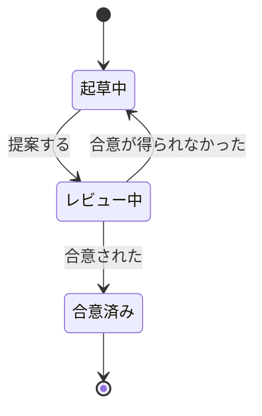
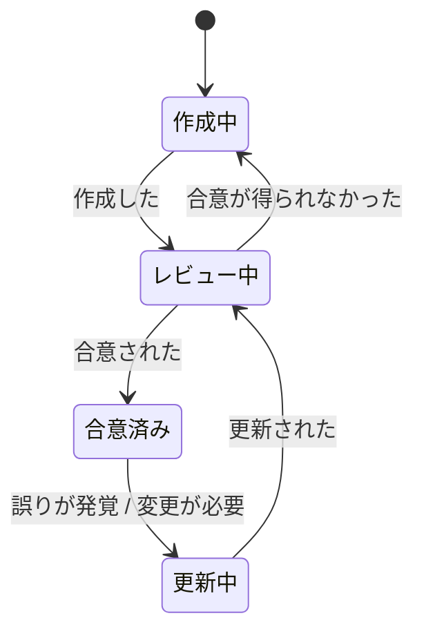
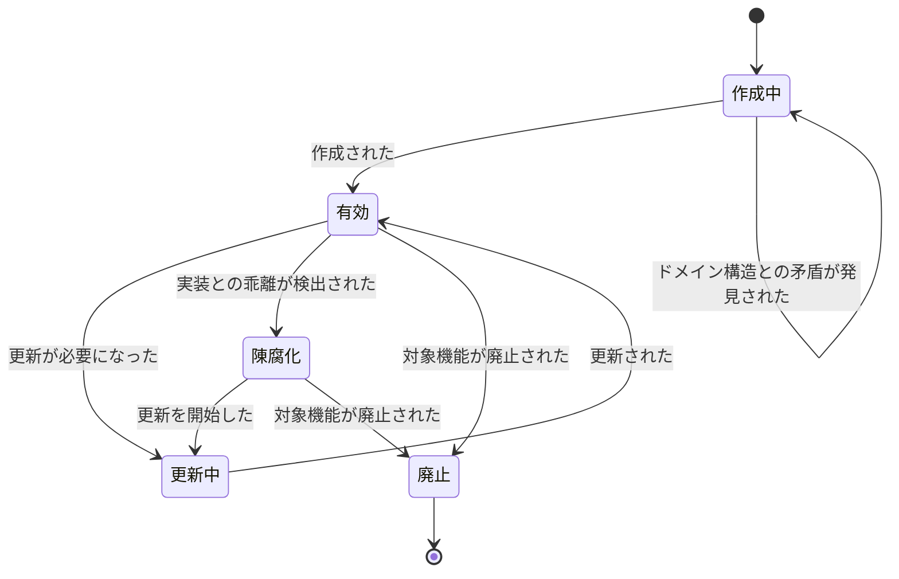
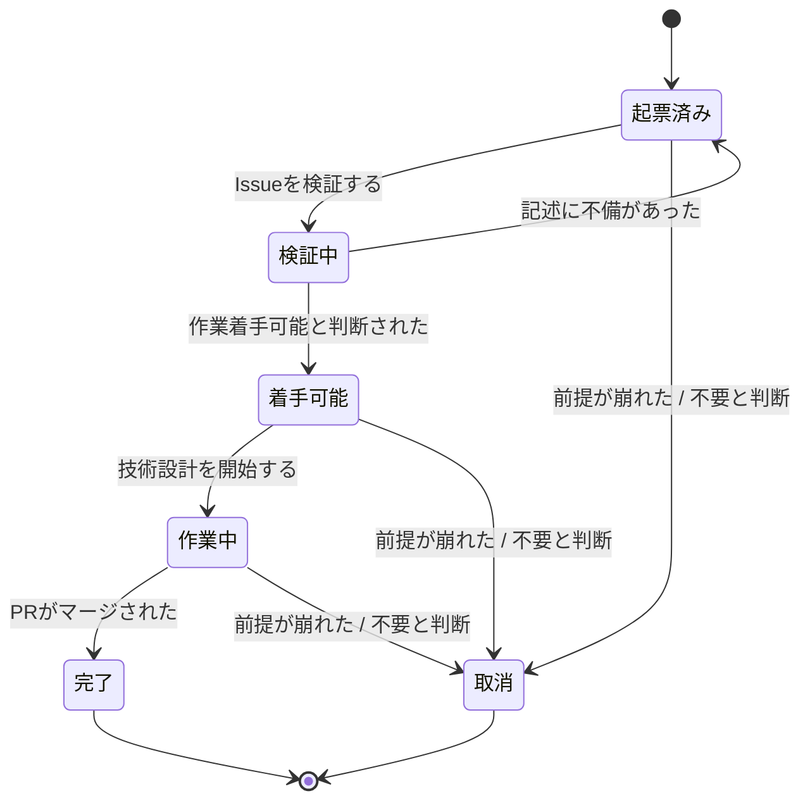
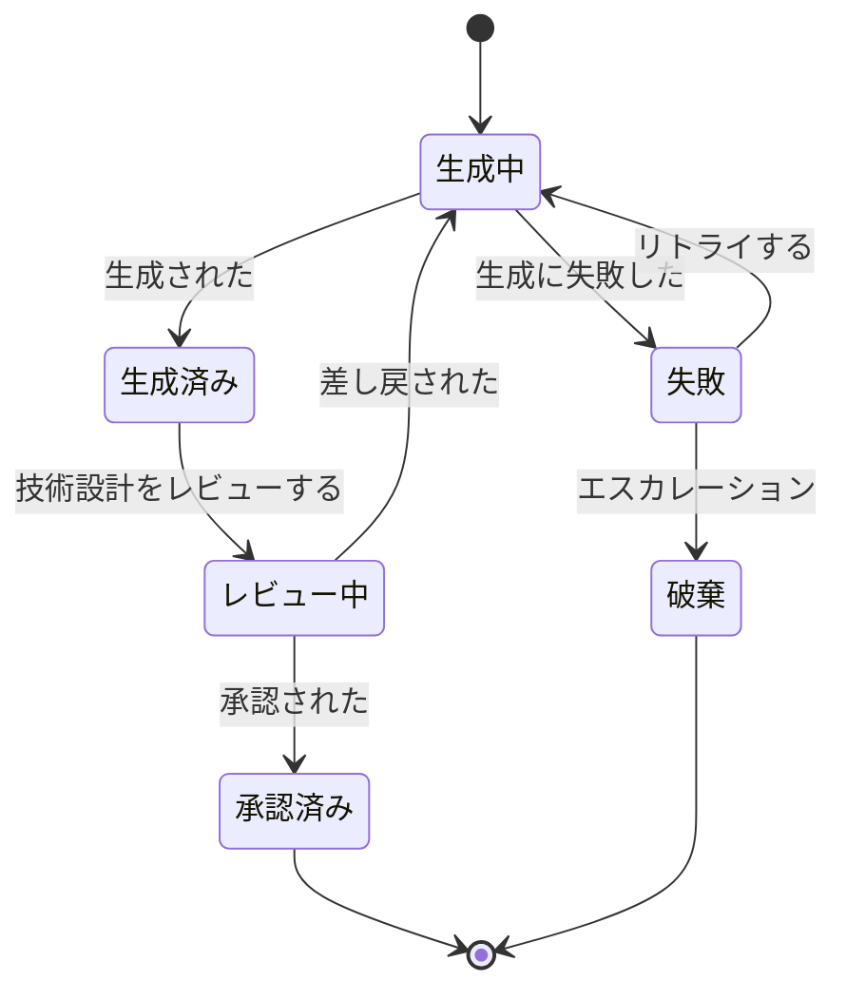
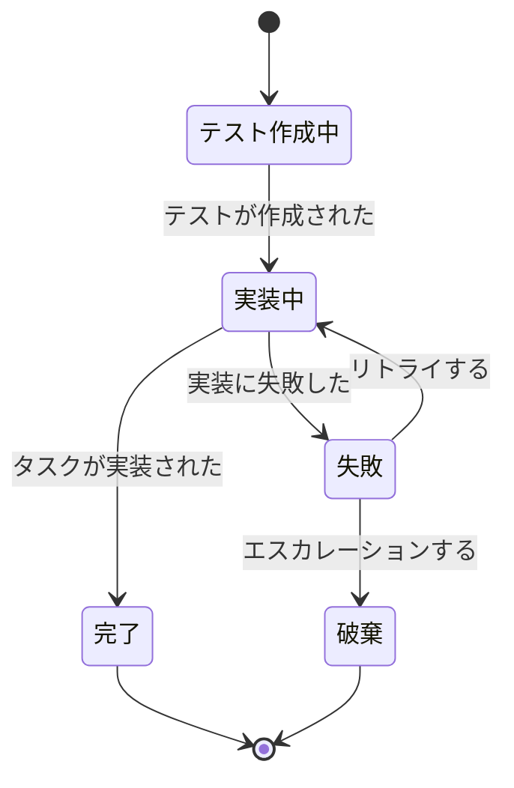
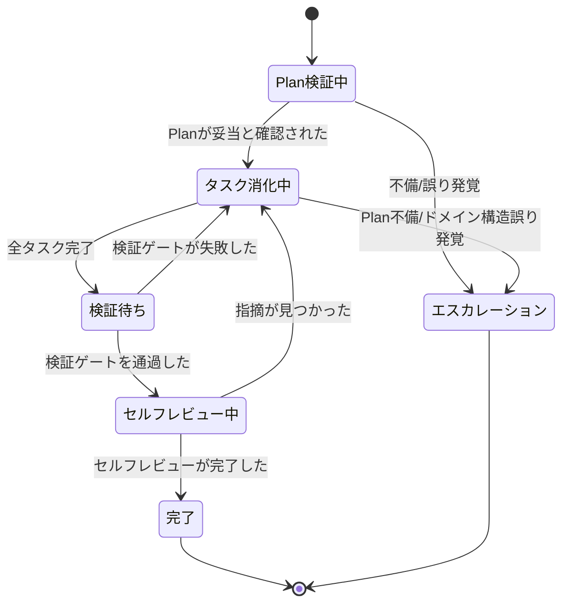
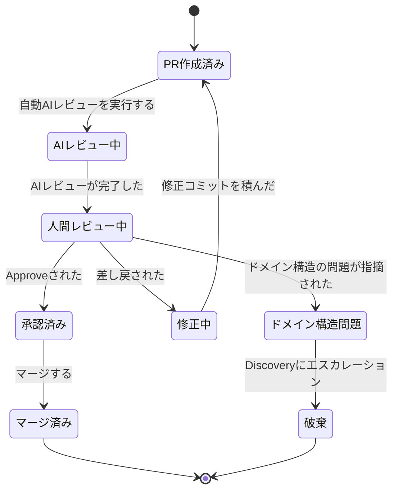

# delivery-workflow イベントストーミング

## ドメインイベント

### Discovery — 問題定義

| # | イベント名（過去形） | 説明 |
|---|---|---|
| 1 | 問題定義が合意された | ユーザーセグメント・課題・KPIが確定 |
| 2 | 問題定義の合意が得られなかった | 切り口やKPIに異論があり差し戻し |

### Discovery — ドメイン構造

| # | イベント名（過去形） | 説明 |
|---|---|---|
| 3 | ドメイン構造が作成された | イベント・集約・状態遷移を初回定義 |
| 4 | ドメイン構造が合意された | 人間がビジネスプロセスとの整合性を確認 |
| 5 | ドメイン構造の合意が得られなかった | 集約境界や状態遷移に異論があり差し戻し |

### Discovery — ユースケース仕様

| # | イベント名（過去形） | 説明 |
|---|---|---|
| 6 | ユースケース仕様が作成された | AC・ドメインマッピングを含む仕様が完成 |
| 7 | ユースケース仕様とドメイン構造の矛盾が発見された | 仕様作成時にドメイン構造の不備・不整合に気づいた |

### Discovery — デリバリーアイテム準備

| # | イベント名（過去形） | 説明 |
|---|---|---|
| 8 | Issueが起票された | ポリシーにより作業チケットが作成された |
| 9 | Issueが作業着手可能と判断された | AC・スコープ・粒度が十分であることを検証 |
| 10 | Issueの記述に不備があった | ACの不足、スコープの曖昧さ等が見つかり修正を要求 |
| 11 | Deliveryに移行した | Discovery完了の定義を満たした |

### Delivery — 技術設計

| # | イベント名（過去形） | 説明 |
|---|---|---|
| 12 | 技術設計が生成された | 技術設計＋タスク分解を出力 |
| 13 | 技術設計が承認された | 人間がアーキテクチャ一貫性・技術設計変更妥当性・タスク粒度等を確認しゲート通過 |
| 14 | 技術設計が差し戻された | アーキテクチャ不整合、タスク粒度の問題等で再設計を要求 |
| 15 | 技術設計の生成に失敗した | トークン枯渇・エラー等でAIが完了できなかった |

### Delivery — タスク実装

| # | イベント名（過去形） | 説明 |
|---|---|---|
| 16 | テストが作成された | TDDサイクルでテストコードを先行作成 |
| 17 | タスクが実装された | 1タスク＝1コミットの粒度で実装完了 |
| 18 | 実装に失敗した | テストが通らない、実装方針が行き詰まる等で完了できなかった |

### Delivery — デリバリー実行

| # | イベント名（過去形） | 説明 |
|---|---|---|
| 19 | Planが妥当と確認された | 実装開始前にPlanの妥当性を検証し、問題なしと判断 |
| 20 | 実装中にPlanの不備が発覚した | タスク分解の漏れや前提の誤りに気づいた |
| 21 | 実装中にドメイン構造の誤りが発覚した | 集約境界や状態遷移がビジネス実態と合わないことが判明 |
| 22 | 検証ゲートを通過した | 型チェック＋lint＋テスト全パス |
| 23 | 検証ゲートが失敗した | 型エラー・lint違反・テスト失敗 |
| 24 | セルフレビューが完了した | 別コンテキストのAIによるレビューで問題なし |
| 25 | セルフレビューで指摘が見つかった | セルフレビューで修正が必要と判断 |

### Delivery — PRレビュー

| # | イベント名（過去形） | 説明 |
|---|---|---|
| 26 | PRが作成された | セルフレビュー通過後にPRを作成 |
| 27 | 自動AIレビューが完了した | CIのAIレビューボットが差分を分析 |
| 28 | 人間レビューでApproveされた | 人間レビュアーが承認 |
| 29 | PRが差し戻された | 人間レビューでRequest Changes |
| 30 | レビューでドメイン構造の問題が指摘された | レビュー中に集約・状態遷移レベルの設計問題が発覚 |
| 31 | PRがマージされた | CI全通過＋人間Approve後にマージ |

### 成果物ライフサイクル

| # | イベント名（過去形） | 説明 |
|---|---|---|
| 32 | ドメイン構造が更新された | イベント・集約・状態遷移を改訂 |
| 33 | ユースケース仕様が更新された | 受け入れ基準の追記・変更 |
| 34 | ユースケース仕様が陳腐化した | 実装との乖離が一定以上になった |
| 35 | ユースケース仕様の対象機能が廃止された | 機能そのものが不要になった |

### 横断的イベント（どのコマンド実行中でも発生しうる）

| # | イベント名（過去形） | 説明 |
|---|---|---|
| 36 | ユースケース仕様の前提が崩れた | 外部要因や発見により仕様の前提条件が無効化 |
| 37 | AIがエラーで停止した | トークン上限・API障害・タイムアウト等のオペレーション的障害 |

## コマンド

### Discovery — 問題定義

| # | コマンド名 | トリガーするイベント |
|---|---|---|
| 1 | 問題定義を提案する | 問題定義が合意された / 合意が得られなかった |

### Discovery — ドメイン構造

| # | コマンド名 | トリガーするイベント |
|---|---|---|
| 2 | ドメイン構造を作成する | ドメイン構造が作成された |
| 3 | ドメイン構造を承認する | ドメイン構造が合意された / 合意が得られなかった |

### Discovery — ユースケース仕様

| # | コマンド名 | トリガーするイベント |
|---|---|---|
| 4 | ユースケース仕様を作成する | ユースケース仕様が作成された / ドメイン構造との矛盾が発見された |

### Discovery — デリバリーアイテム準備

| # | コマンド名 | トリガーするイベント |
|---|---|---|
| 5 | Issueを起票する | Issueが起票された |
| 6 | Issueを検証する | Issueが作業着手可能と判断された / 記述に不備があった |
| 7 | Deliveryへの移行を判断する | Deliveryに移行した |

### Delivery — 技術設計

| # | コマンド名 | トリガーするイベント |
|---|---|---|
| 8 | 技術設計を生成する | 技術設計が生成された / 生成に失敗した |
| 9 | 技術設計をレビューする | 技術設計が承認された / 差し戻された |

### Delivery — タスク実装

| # | コマンド名 | トリガーするイベント |
|---|---|---|
| 10 | テストを作成する | テストが作成された |
| 11 | プロダクションコードを実装する | タスクが実装された / 実装に失敗した |

### Delivery — デリバリー実行

| # | コマンド名 | トリガーするイベント |
|---|---|---|
| 12 | Planを検証する | Planが妥当と確認された / Planの不備が発覚した / ドメイン構造の誤りが発覚した |
| 13 | 検証ゲートを実行する | 検証ゲートを通過した / 失敗した |
| 14 | セルフレビューを実行する | セルフレビューが完了した / 指摘が見つかった |

### Delivery — PRレビュー

| # | コマンド名 | トリガーするイベント |
|---|---|---|
| 15 | PRを作成する | PRが作成された |
| 16 | 自動AIレビューを実行する | 自動AIレビューが完了した |
| 17 | PRをレビューする | Approveされた / 差し戻された / ドメイン構造の問題が指摘された |
| 18 | PRをマージする | PRがマージされた |

### 成果物ライフサイクル

| # | コマンド名 | トリガーするイベント |
|---|---|---|
| 19 | ドメイン構造を更新する | ドメイン構造が更新された |
| 20 | ユースケース仕様を更新する | ユースケース仕様が更新された |
| 21 | ユースケース仕様の鮮度を確認する | 陳腐化した / 対象機能が廃止された |

## アクター

### 人間アクター

| # | アクター名 | 種別 | 発行するコマンド |
|---|---|---|---|
| 1 | ドメインエキスパート | 人間 | 問題定義を提案する、ドメイン構造を承認する |
| 2 | 開発者（人間） | 人間 | ユースケース仕様を作成する、Deliveryへの移行を判断する、技術設計をレビューする、PRをレビューする、PRをマージする、ドメイン構造を更新する、ユースケース仕様を更新する |

### AIアクター

| # | アクター名 | 種別 | 発行するコマンド |
|---|---|---|---|
| 3 | AI（event-storming） | AI | ドメイン構造を作成する |
| 4 | AI（refine-issue） | AI | Issueを検証する |
| 5 | AI（plan-issue） | AI | 技術設計を生成する |
| 6 | AI（dev-loop） | AI | Planを検証する、テストを作成する、プロダクションコードを実装する、セルフレビューを実行する |
| 7 | AI（CIレビューボット） | AI | 自動AIレビューを実行する |

## ポリシー

| # | ポリシー | トリガー | 実行するコマンド |
|---|---|---|---|
| 1 | 仕様変更検出ポリシー | ユースケース仕様が作成/更新された時、ドメイン構造が更新された時 | 変更を検出する |
| 2 | Issue起票ポリシー | 変更が検出された時 | Issueを起票する |
| 3 | 検証ゲートポリシー | コミットされた時 / PR作成時 | 検証ゲートを実行する |
| 4 | PRポリシー | セルフレビューが通った時 | PRを作成する |
| 5 | 鮮度確認ポリシー | PRがマージされた時 / 定期（Sprint振り返り等） | ユースケース仕様の鮮度を確認する |

## 集約

### 問題定義

**責務**: プロジェクトの課題・KPI・スコープの管理

**含むコマンド**: 問題定義を提案する

**含むイベント**: 問題定義が合意された、合意が得られなかった

#### 状態遷移

| 状態 | 定義 | 遷移元 | 遷移先 |
|---|---|---|---|
| 起草中 | 問題定義の内容を検討・作成している | 初期状態, レビュー中 | レビュー中 |
| レビュー中 | 関係者に提案し合意を求めている | 起草中 | 合意済み, 起草中 |
| 合意済み | 問題定義が確定し、以降の活動の前提となる | レビュー中 | 終了 |

### ドメイン構造

**責務**: イベント・集約・状態遷移の全体像の管理

**含むコマンド**: ドメイン構造を作成する、承認する、更新する

**含むイベント**: 作成された、合意された、合意が得られなかった、更新された、誤りが発覚した

#### 状態遷移

| 状態 | 定義 | 遷移元 | 遷移先 |
|---|---|---|---|
| 作成中 | イベント・集約・状態遷移を初回定義している | 初期状態, レビュー中 | レビュー中 |
| レビュー中 | 人間がビジネスプロセスとの整合性を確認している | 作成中, 更新中 | 合意済み, 作成中 |
| 合意済み | ドメイン構造が確定し、仕様作成・実装の前提となる | レビュー中 | 更新中 |
| 更新中 | Delivery中の発見やフィードバックを反映している | 合意済み | レビュー中 |

プロジェクトが続く限り生き続けるため、明示的な終端なし。

### ユースケース仕様

**責務**: 個別ユースケースのAC・ドメインマッピング・ライフサイクルの管理

**含むコマンド**: 仕様を作成する、更新する、鮮度を確認する

**含むイベント**: 作成された、更新された、矛盾が発見された、陳腐化した、対象機能が廃止された

#### 状態遷移

| 状態 | 定義 | 遷移元 | 遷移先 |
|---|---|---|---|
| 作成中 | AC・ドメインマッピングを作成している | 初期状態 | 有効, 作成中（矛盾発見時） |
| 有効 | 仕様が実装と整合しており、参照可能 | 作成中, 更新中 | 更新中, 陳腐化, 廃止 |
| 更新中 | 受け入れ基準の変更・追記を行っている | 有効, 陳腐化 | 有効 |
| 陳腐化 | 実装との乖離が検出され、更新が必要 | 有効 | 更新中, 廃止 |
| 廃止 | 対象機能が不要になり、仕様としての役割を終えた | 有効, 陳腐化 | 終了 |

### デリバリーアイテム（Issue）

**責務**: 作業チケットの起票・検証・ライフサイクルの管理

**含むコマンド**: Issueを起票する、Issueを検証する

**含むイベント**: 起票された、作業着手可能と判断された、記述に不備があった

#### 状態遷移

| 状態 | 定義 | 遷移元 | 遷移先 |
|---|---|---|---|
| 起票済み | Issueが作成されたが、記述の十分さが未検証 | 初期状態, 検証中 | 検証中, 取消 |
| 検証中 | AC・スコープ・粒度を検証している | 起票済み | 着手可能, 起票済み |
| 着手可能 | 検証を通過し、技術設計に着手できる | 検証中 | 作業中, 取消 |
| 作業中 | 技術設計〜実装〜マージまでの作業進行中 | 着手可能 | 完了, 取消 |
| 完了 | PRがマージされ、デリバリーアイテムとしての価値が完結 | 作業中 | 終了 |
| 取消 | 前提の崩壊や優先度変更により作業が不要になった | 起票済み, 着手可能, 作業中 | 終了 |

### 技術設計（Plan）

**責務**: 技術設計・タスク分解の管理

**含むコマンド**: 技術設計を生成する、レビューする

**含むイベント**: 生成された、承認された、差し戻された、生成に失敗した

#### 状態遷移

| 状態 | 定義 | 遷移元 | 遷移先 |
|---|---|---|---|
| 生成中 | AIが技術設計＋タスク分解を生成している | 初期状態, 失敗, レビュー中 | 生成済み, 失敗 |
| 生成済み | 技術設計が出力され、人間のレビューを待っている | 生成中 | レビュー中 |
| 失敗 | トークン枯渇・エラー等で生成が完了しなかった | 生成中 | 生成中, 破棄 |
| レビュー中 | 人間がアーキテクチャ一貫性・ドメイン構造整合・技術設計変更妥当性・テストレベル選択・タスク粒度を確認している | 生成済み | 承認済み, 生成中 |
| 承認済み | 人間が技術設計を承認し、デリバリー実行に引き渡す | レビュー中 | 終了 |
| 破棄 | 生成失敗からのリカバリを断念した | 失敗 | 終了 |

### タスク実装

**責務**: TDDサイクルによる1タスクのコード生成管理

**含むコマンド**: テストを作成する、プロダクションコードを実装する

**含むイベント**: テストが作成された、タスクが実装された、実装に失敗した

#### 状態遷移

| 状態 | 定義 | 遷移元 | 遷移先 |
|---|---|---|---|
| テスト作成中 | TDDサイクルでテストコードを先行作成している | 初期状態 | 実装中 |
| 実装中 | プロダクションコードを作成している | テスト作成中, 失敗 | 完了, 失敗 |
| 失敗 | 実装方針が行き詰まり、リトライかエスカレーションの判断が必要 | 実装中 | 実装中, 破棄 |
| 完了 | タスクが実装され、コミット可能 | 実装中 | 終了 |
| 破棄 | 実装を断念し、デリバリー実行にエスカレーション | 失敗 | 終了 |

### デリバリー実行

**責務**: Plan検証からセルフレビュー通過までのデリバリーアイテム実行管理

**含むコマンド**: Planを検証する、検証ゲートを実行する、セルフレビューを実行する

**含むイベント**: Planが妥当と確認された、Plan不備発覚、ドメイン構造誤り発覚、検証ゲート通過/失敗、セルフレビュー完了/指摘

#### 状態遷移

| 状態 | 定義 | 遷移元 | 遷移先 |
|---|---|---|---|
| Plan検証中 | 実装開始前にPlanの妥当性を検証している | 初期状態 | タスク消化中, エスカレーション |
| タスク消化中 | タスク実装のインスタンスを順次管理し、TDDサイクルを回している | Plan検証中, 検証待ち, セルフレビュー中 | 検証待ち, エスカレーション |
| 検証待ち | 全タスク完了後、型チェック＋lint＋テストの自動検証を待っている | タスク消化中 | セルフレビュー中, タスク消化中 |
| セルフレビュー中 | 別コンテキストのAIがレビューしている | 検証待ち | 完了, タスク消化中 |
| 完了 | セルフレビューを通過し、PR作成に進める | セルフレビュー中 | 終了 |
| エスカレーション | Plan不備やドメイン構造の誤りにより、技術設計またはDiscoveryに差し戻し | Plan検証中, タスク消化中 | 終了 |

### PRレビュー

**責務**: レビュー・マージのゲート管理

**含むコマンド**: PRを作成する、自動AIレビューを実行する、PRをレビューする、PRをマージする

**含むイベント**: PR作成、AIレビュー完了、Approve、差し戻し、ドメイン構造の問題指摘、マージ

#### 状態遷移

| 状態 | 定義 | 遷移元 | 遷移先 |
|---|---|---|---|
| PR作成済み | PRが作成され、レビューサイクルに入った | 初期状態, 修正中 | AIレビュー中 |
| AIレビュー中 | CIのAIレビューボットが差分を分析している | PR作成済み | 人間レビュー中 |
| 人間レビュー中 | 人間レビュアーが確認している | AIレビュー中 | 承認済み, 修正中, ドメイン構造問題 |
| 修正中 | 人間レビューの指摘に対して修正コミットを作成している | 人間レビュー中 | PR作成済み |
| ドメイン構造問題 | 集約・状態遷移レベルの設計問題が発覚し、Discoveryへのエスカレーションが必要 | 人間レビュー中 | 破棄 |
| 承認済み | 人間レビュアーがApproveし、マージ可能 | 人間レビュー中 | マージ済み |
| マージ済み | PRがマージされ、デリバリーアイテムの実装が反映された | 承認済み | 終了 |
| 破棄 | ドメイン構造問題によりPRを破棄し、Discoveryに戻る | ドメイン構造問題 | 終了 |

## ホットスポット

### ゲートの失敗・リカバリ（#97関連）

| # | ホットスポット | 関連する集約/イベント | 解消アクション |
|---|---|---|---|
| 1 | 技術設計が差し戻された後のリカバリフローが未定義（再生成？手動修正？） | 技術設計 | リカバリパスを設計し、workflow-design.mdに記述 |
| 2 | 実装に失敗した後の判断基準がない（リトライ？タスク再分解？Plan差し戻し？） | タスク実装 / デリバリー実行 | 失敗の種類別にエスカレーション先を定義 |
| 3 | PRが差し戻された後のリカバリフローが未定義（修正コミット？dev-loopやり直し？） | PRレビュー | 差し戻しの深刻度別にリカバリパスを定義 |
| 4 | 検証ゲート失敗時の対応が暗黙的（dev-loop内で自動修正？人間に戻す？） | デリバリー実行 | dev-loop内の自動修正範囲と人間エスカレーションの境界を定義 |

### フィードバックループ（#97関連）

| # | ホットスポット | 関連する集約/イベント | 解消アクション |
|---|---|---|---|
| 5 | 実装中にドメイン構造の誤りが発覚した場合、即時中断かSprint末かの判断基準がない | ドメイン構造 / デリバリー実行 | 影響範囲（集約境界変更 vs 属性追加等）で判断基準を定義 |
| 6 | レビューでドメイン構造の問題が指摘された場合の差し戻し先が不明（Discovery？Plan？） | ドメイン構造 / PRレビュー | 問題の深刻度別にエスカレーション先を定義 |
| 7 | Planの不備が発覚した場合のフローが未定義（実装中断→Plan修正→再開？） | 技術設計 / デリバリー実行 | Plan検証のタイミングと不備発覚時のフローを定義 |

### 成果物ライフサイクル（#95関連）

| # | ホットスポット | 関連する集約/イベント | 解消アクション |
|---|---|---|---|
| 8 | ユースケース仕様の陳腐化を「誰が・いつ」検出するかが未定義 | ユースケース仕様 | 鮮度確認ポリシーのトリガー条件を具体化 |
| 9 | 廃止されたユースケース仕様の扱いが未定義（削除？アーカイブ？ステータス付与？） | ユースケース仕様 | 廃止フローを定義 |

### 仕様変更・技術設計変更（#96関連）

| # | ホットスポット | 関連する集約/イベント | 解消アクション |
|---|---|---|---|
| 10 | 「振る舞い変更」の定義が例示のみで基準がない | 技術設計 | **解消済み（#96, #106）**: 仕様変更・技術設計変更の2層に分離して定義。event-storming.mdへの反映済み |
| 11 | 振る舞い変更検出ポリシーの検出対象（システム間連携IF等）の網羅基準がない | 技術設計 | **解消済み（#96, #106）**: カテゴリ列挙は行わず、原則ベースで定義。event-storming.mdへの反映済み |

### 横断的

| # | ホットスポット | 関連する集約/イベント | 解消アクション |
|---|---|---|---|
| 12 | AIがエラーで停止した場合の再開・引き継ぎ手順が未定義 | 横断 | エラー種別ごとのリカバリ手順を定義 |
| 13 | ユースケース仕様の前提が崩れた場合の影響波及（進行中の実装・関連Issue）の扱いが未定義 | 横断 | 前提崩壊時の影響範囲評価と対応フローを定義 |
| 14 | テーマ・Sprint管理のイベントフロー（計画→実行→振り返り）がworkflow-design.mdで未定義 | スコープ外 | 別途イベントストーミングを実施 |
| 15 | デリバリーアイテムが取り消された後、検出済みのユースケース仕様の変更をどう扱うか未定義（次回起票に引き継ぐ？変更自体を取り消す？） | デリバリーアイテム / ユースケース仕様 | 取消時の仕様変更の扱いルールを定義 |
| 16 | 仕様変更検出ポリシーが「いつからいつまでの変更」を検出対象とするか未定義（前回検出時点からの差分？最終マージからの差分？） | デリバリーアイテム | 変更検出の基準時点を定義 |
| 17 | ポリシー#1,#2が参照するコマンド（「変更を検出する」）とイベント（「変更が検出された」）がドメインイベント/コマンド一覧に未定義 | ポリシー | #95対応時にコマンド/イベント定義を追加 |

## 用語集（ユビキタス言語）

| 用語 | 定義 | 備考 |
|---|---|---|
| 問題定義 | プロジェクトが解く「誰のどんな問題か」の合意文書 | 成果物: `docs/problem-statement.md` |
| ドメイン構造 | イベント・集約・状態遷移によるドメインの全体像 | 成果物: `docs/{domain}/event-storming.md` |
| ユースケース仕様 | 個別ユースケースのAC・ドメインマッピング・スコープを定義する文書 | 成果物: `docs/{domain}/use-cases/{name}/spec.md` |
| デリバリーアイテム | ユースケース仕様からACを転記した作業チケット。マージ時点で何らかの価値が完結する | GitHub Issue等で管理 |
| 技術設計（Plan） | Issueに対する技術設計＋タスク分解の文書 | 成果物: `docs/plans/issue-{番号}.md` |
| 仕様変更 | ドメイン構造やユースケース仕様が変わる変更（変更パターンA/Cに該当） | 仕様変更検出ポリシー（ポリシー#1）の検出対象。技術設計への影響は技術設計変更セクションに必ず記述 |
| 技術設計変更 | コードベースだけでは妥当性を判断しにくく、修正コストが高い設計判断 | 技術設計変更セクションの記述対象。仕様変更に伴う技術設計への影響も対象に含む |
| 変更検出 | 仕様・ドメイン構造の差分から作業が必要かを判断するポリシー | ドメインモデル・ユースケース仕様・表示の変更を対象。結果としてIssue起票をトリガーする |
| 検証ゲート | 型チェック＋lint＋テスト全パスの機械的な品質チェック | 実装完了後、セルフレビュー前に実行 |
| セルフレビュー | 実装とは別コンテキストのAIによるコードレビュー | 自己評価バイアスの排除が目的 |
| フェーズゲート | フェーズの境界で集中的にレビューする仕組み | 原則②に基づく |
| ホットスポット | セッション中に浮上した未解決事項・曖昧な領域 | 赤い付箋に相当 |
| Discovery | 「何を作るか」を明確にするフェーズ。人間主導 | |
| Delivery | Discoveryの成果物を起点に価値を届けるフェーズ。AI自走＋人間ゲートキーパー | |
