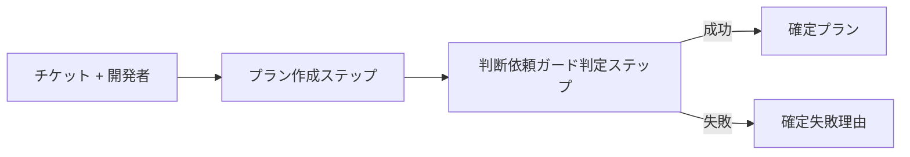
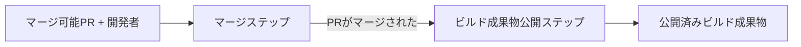
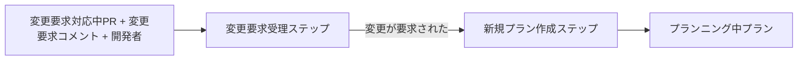
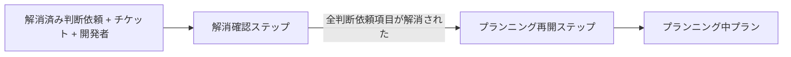

# 開発コンテキスト 関数型ドメインモデル

開発コンテキスト（プランニング開始からビルド成果物公開まで）の関数型ドメインモデル。Design Level 文書 `docs/development/event-storming.md` で定義された集約・コマンド・イベント・ポリシー・運用ルールを、記法ガイド `skills/domain-modeling/references/domain-model-notation.md` に準拠した擬似コードで形式化する。

## スコープ

- 対象コンテキスト: 開発コンテキスト
- 対応するDL: `docs/development/event-storming.md`
- 含む集約: 実装プラン / 判断依頼 / 実装 / PRレビュー / ビルド成果物 / 技術方針（仮称）
- 入力: チケット（種別問わず同一フロー）
- 出力: ビルド成果物公開（検証コンテキスト・リリースコンテキストへの引き渡し）

## 概観

集約と主要コマンド・イベントの早見表。

| 集約 | 状態型 | 主要コマンド | 発火する主要イベント |
|---|---|---|---|
| 実装プラン | プランニング中 / 判断依頼中 / 確定 | プランニングを開始する、実装プランを確定する | プランニングが開始された、実装プランが確定した |
| 判断依頼 | 未解消 / 解消済み | 判断依頼を発行する、回答を受理する | 判断依頼が発行された、全判断依頼項目が解消された |
| 実装 | タスク消化中 / 検証中 / 完了 | 検証ゲートを実行する | 検証ゲートを通過した、検証ゲートが失敗した |
| PRレビュー | PR作成済み / レビュー中 / 変更要求対応中 / マージ可能 / マージ済み / 破棄済み | PRを作成する、レビュー依頼をする、変更を要求する、レビューを承認する、PRをマージする、PRを破棄する | PRが作成された、レビュー依頼がされた、変更が要求された、レビューが承認された、必要Approve数に達した（派生）、PRがマージされた、PRが破棄された |
| ビルド成果物 | 公開済み | ビルド成果物を公開する | ビルド成果物が公開された |
| 技術方針（仮称） | 骨子のみ（Issue #130 で詳細化予定） | 横断的な技術方針を決定する | 横断的な技術方針が決定された |

集約間連携の概要:

- 実装プラン集約と判断依頼集約は **チケット ID 経由の疎結合** で関連付ける（直接参照を持たない、F7 集約疎結合方針）
- ポリシー P2（変更要求対応）は PRレビュー集約 `変更が要求された` を契機に実装プラン集約 `プランニングを開始する` を発火する
- ポリシー P3（ビルド成果物公開）は PRレビュー集約 `PRがマージされた` を契機にビルド成果物集約 `ビルド成果物を公開する` を発火する
- 運用ルール「プランニング再開」「回答受理」は人間開発者の手動操作を要するため、自動ポリシーから分離して別節で規定する
- 外部コンテキスト連携は外部イベント `外部_判断回答が返された`（企画コンテキスト由来）の1件のみ

## 共通値

複数集約で参照される値のみを共通値として定義する（記法ガイド §共通値の判定基準）。各集約固有の値は集約節で定義する。

```
チケットID = 文字列

開発者ID = 文字列
開発者 =
    ID: 開発者ID
    AND 名前: 文字列

レビュアーID = 文字列
レビュアー =
    ID: レビュアーID
    AND 名前: 文字列

テックリードID = 文字列
テックリード =
    ID: テックリードID
    AND 名前: 文字列
```

`日時` は記法ガイド §よく使う原始型に従い、定義なしで使用する。

`レビュアー` は PRレビュー集約のみで、`テックリード` は技術方針（仮称）集約のみで参照される。記法ガイド §共通値の判定基準は「2つ以上の集約で参照される型のみ」を共通とする方針だが、本ドキュメントでは `開発者` と並ぶアクター型を共通値節に集約することを命名規則の統一として優先した。判定基準逸脱の論点は論点節に記録する。

## 実装プラン集約

### 責務

プランニング行為と実装プラン（成果物）のライフサイクル管理。

### 固有値

```
プランID = 文字列

タスク =
    ID: 文字列
    AND 内容: 文字列
    AND 順序: 整数
```

タスクは実装プラン集約のサブエンティティ。順序・内容を持ち、実装プランに 0 個以上含まれる。タスク内部の TDD フェーズ（Red / Green / Refactor）は実装集約のサブエンティティ「タスクの内部遷移」として扱われ、本集約の関心ではない。

### 入力イベント（他集約から）

| イベント名 | 発火元集約 | 受信時の扱い |
|---|---|---|
| 全判断依頼項目が解消された | 判断依頼集約 | 運用ルール「プランニング再開」の契機。開発者が手動で `プランニングを開始する` を発行する |
| 変更が要求された | PRレビュー集約 | P2 変更要求対応ポリシーで `プランニングを開始する` を発火する |

### 発火するイベント

```
プランニングが開始された =
    プランID
    AND チケットID
    AND 開始者: 開発者ID
    AND 開始日時

実装プランが確定した =
    プランID
    AND チケットID
    AND 確定者: 開発者ID
    AND 確定日時
```

`プランニングが開始された` は新規集約インスタンス生成時、および WIP 集約での再開時のいずれでも発火される。

### 状態型

```
実装プラン =
    プランニング中
    OR 判断依頼中
    OR 確定

プランニング中プラン =
    ID: プランID
    AND チケットID
    AND 開始日時
    AND タスクの一覧

判断依頼中プラン =
    ID: プランID
    AND チケットID
    AND 開始日時
    AND タスクの一覧

確定プラン =
    ID: プランID
    AND チケットID
    AND 開始日時
    AND タスクの一覧
    AND 確定者: 開発者ID
    AND 確定日時
```

`判断依頼中` 状態は判断依頼集約から導出される（実装プラン集約内部に「判断依頼中」フラグは持たない）。`プランニング中プラン` と `判断依頼中プラン` は属性構成が等しいが、状態の意味づけ（外部から見える状態）が異なるため別レコード型として定義する。

### コマンド

```
プランニングを開始する:
    入力: チケットID AND 開発者
    出力（成功時）: プランニングが開始された
    出力（失敗時）: プランニング開始失敗理由

プランニング開始失敗理由 =
    チケット未トリアージ

実装プランを確定する:
    入力: プランニング中プラン AND 開発者 AND 当該チケットIDの未解消判断依頼集約一覧
    出力（成功時）: 実装プランが確定した
    出力（失敗時）: 確定失敗理由

確定失敗理由 =
    未解消の判断依頼あり (判断依頼IDの一覧を持つ)
```

`実装プランを確定する` の入力 `当該チケットIDの未解消判断依頼集約一覧` は外部リソース（判断依頼集約群）から都度取得する事前条件であり、記法ガイド §不変条件「外部リソースに依存する事前条件」に従い関数の入力として表現する（型に埋め込めない）。

### 状態遷移

```
プランニングを開始する状態遷移:
    入力: チケットID AND 開発者
    出力: プランニング中プラン

判断依頼の発行を反映する:
    入力: プランニング中プラン
    出力: 判断依頼中プラン

判断依頼の解消を反映する:
    入力: 判断依頼中プラン
    出力: プランニング中プラン

確定する:
    入力: プランニング中プラン AND 開発者 AND 当該チケットIDの未解消判断依頼集約一覧
    出力（成功時）: 確定プラン
    出力（失敗時）: 確定失敗理由
```

`判断依頼の発行を反映する` `判断依頼の解消を反映する` は判断依頼集約の状態変化に伴う導出遷移であり、独立コマンドではない（本集約内部の状態導出を明示するための状態遷移として記述）。

### ポリシー

```
変更要求対応ポリシー:
    きっかけ: 変更が要求された
    実行するコマンド: プランニングを開始する
```

P2 変更要求対応ポリシーは、確定済み状態の実装プランに対する変更要求を契機に新しい実装プラン集約インスタンスを生成する。確定済み状態からの発火のため WIP 非存在となり、必然的に新規インスタンス作成となる。

### 型で表せなかった不変条件

| # | 不変条件 | 担保方法 |
|---|---|---|
| 1 | 確定の判断主体は人間開発者のみ（コーディングエージェントは確定できない） | `実装プランを確定する` 実行時に発行主体の種別を確認。型では表現困難 |
| 2 | 確定時、当該チケットIDに紐づく未解消の判断依頼集約インスタンスが存在しない | `当該チケットIDの未解消判断依頼集約一覧` を入力で受け取り、空でなければ `未解消の判断依頼あり` を返す |
| 3 | 変更要求時は新規インスタンスを作成する（WIP非存在のため必然的に新規） | P2 ポリシーが確定済み状態からのみ発火することで担保 |
| 4 | 旧実装プラン（確定済み）は履歴として保持し、新実装プランから参照関係を持つ | 集約のライフサイクル外（チケット管理上の参照）で担保 |

## 判断依頼集約

### 責務

開発側で発生した判断必要事項を上流/外部に問い合わせ、回答を受理して解消状態を管理する。1 判断依頼 = 複数項目を束ねた 1 集約インスタンス。真の保管先はチケット管理システム（GitHub Issue コメント等）であり、ローカル markdown はキャッシュ相当として扱う。

### 固有値

```
判断依頼ID = 文字列
項目ID = 文字列
質問内容 = 文字列
回答内容 = 文字列
発火元 = 実装プラン集約
```

`発火元` は判断依頼を発行した集約種別。現行は単一値で `実装プラン集約` のみを取る。Issue #146 で `実装集約` を追加する時点で OR 型へ拡張する（論点節参照）。

判断依頼項目（サブエンティティ）:

```
判断依頼項目 =
    未回答項目
    OR 回答済み項目

未回答項目 =
    ID: 項目ID
    AND 質問内容

回答済み項目 =
    ID: 項目ID
    AND 質問内容
    AND 回答内容
    AND 回答日時
```

各項目は状態（未回答 / 回答済み）を持ち、状態ごとに必要な属性が異なるため独立レコード型として定義する。

### 入力イベント（他集約から）

| イベント名 | 発火元 | 受信時の扱い |
|---|---|---|
| 外部_判断回答が返された | 企画コンテキスト（外部） | 運用ルール「回答受理」の契機。開発者が手動で `回答を受理する` を発行する |

### 発火するイベント

```
判断依頼が発行された =
    判断依頼ID
    AND チケットID
    AND 発火元
    AND 発行者: 開発者ID
    AND 発行日時
    AND 項目の一覧（1個以上）

全判断依頼項目が解消された =
    判断依頼ID
    AND チケットID
    AND 解消日時
```

`全判断依頼項目が解消された` は派生イベント。全項目が回答済みになった時点で発火される。

### 状態型

```
判断依頼 =
    未解消
    OR 解消済み

未解消判断依頼 =
    ID: 判断依頼ID
    AND チケットID
    AND 発火元
    AND 発行日時
    AND 項目の一覧（1個以上）

解消済み判断依頼 =
    ID: 判断依頼ID
    AND チケットID
    AND 発火元
    AND 発行日時
    AND 項目の一覧（1個以上、全て回答済み項目）
    AND 解消日時
```

集約状態は項目状態から導出される。全項目が回答済みになった時点で `未解消判断依頼` から `解消済み判断依頼` に遷移する。

### コマンド

```
判断依頼を発行する:
    入力: チケットID AND 発火元 AND 開発者 AND 質問内容の一覧（1個以上）
    出力（成功時）: 判断依頼が発行された
    出力（失敗時）: 発行失敗理由

発行失敗理由 =
    質問内容の一覧が空

回答を受理する:
    入力: 未解消判断依頼 AND 対象項目ID AND 回答内容 AND 開発者
    出力（成功時、最終項目）: 全判断依頼項目が解消された
    出力（成功時、中間項目）: イベント発火なし（項目状態のみ更新、集約状態は `未解消判断依頼` を維持）
    出力（失敗時）: 受理失敗理由

受理失敗理由 =
    対象項目が存在しない
    OR 対象項目が既に回答済み
```

`回答を受理する` は運用ルール「回答受理」由来であり、人間開発者のみが発行可能。コーディングエージェントは発行できない。

### 状態遷移

```
発行する:
    入力: チケットID AND 発火元 AND 質問内容の一覧（1個以上）
    出力: 未解消判断依頼

項目を回答済みにする:
    入力: 未解消判断依頼 AND 対象項目ID AND 回答内容
    出力（成功時）: 未解消判断依頼 OR 解消済み判断依頼
    出力（失敗時）: 受理失敗理由
```

`項目を回答済みにする` は対象項目を回答済み状態に遷移させる。全項目が回答済みになった場合は集約全体が `解消済み判断依頼` に遷移する。

### ポリシー

なし。本集約は受け手側ポリシーを持たない。回答受理は運用ルール「回答受理」として独立節で規定する。

### 型で表せなかった不変条件

| # | 不変条件 | 担保方法 |
|---|---|---|
| 1 | 全項目が回答済みになった時点で集約状態が `解消済み判断依頼` に導出される | `項目を回答済みにする` 状態遷移内で全項目チェック |
| 2 | 同一チケット内で複数インスタンスが並行して存在可能であり、既存インスタンスにマージしない | `判断依頼を発行する` は常に新規 `判断依頼ID` を発行 |
| 3 | 実装プラン集約への直接参照を持たない（チケットID経由の疎結合） | 状態型・コマンド入出力で `プランID` 等を持たない |
| 4 | 回答受理は人間開発者のみが発行可能 | `回答を受理する` 実行時に発行主体の種別を確認 |

## 実装集約

### 責務

TDDサイクルによるコード変更の管理。タスク消化と検証ゲート実行を扱う。

### 固有値

```
実行コンテキスト =
    ローカル
    OR CI

検証失敗種別 =
    型エラー
    OR Lint違反
    OR テスト失敗
```

タスク（サブエンティティ、TDDサイクル）:

```
TDDフェーズ =
    Red
    OR Green
    OR Refactor
```

タスクの内部遷移（Red → Green → Refactor）は集約レベルのドメインイベントを発火しない。タスク消化中状態の内部工程である。

### 入力イベント（他集約から）

| イベント名 | 発火元 | 受信時の扱い |
|---|---|---|
| 実装プランが確定した | 実装プラン集約 | 実装集約の開始トリガー。`タスク消化中` 状態で集約インスタンスが生成される |

### 発火するイベント

```
検証ゲートを通過した =
    チケットID
    AND 実行コンテキスト
    AND 通過日時

検証ゲートが失敗した =
    チケットID
    AND 実行コンテキスト
    AND 検証失敗種別
    AND 失敗日時
```

### 状態型

```
実装 =
    タスク消化中
    OR 検証中
    OR 完了

タスク消化中実装 =
    チケットID
    AND 開始日時

検証中実装 =
    チケットID
    AND 開始日時
    AND 検証開始日時

完了実装 =
    チケットID
    AND 開始日時
    AND 検証通過日時
```

`event-storming.md` 設計判断「集約間の疎結合（Issue #127 F7）」に従い、実装プラン集約への直接参照（`プランID`）は持たず、`チケットID` 経由のみで関連付ける。「どの実装プランから派生したか」の参照は運用情報（Git branch、コミット、PR description）で担保する。

### コマンド

```
検証ゲートを実行する:
    入力: 検証中実装 AND 実行コンテキスト
    出力（成功時）: 検証ゲートを通過した
    出力（失敗時）: 検証ゲートが失敗した
```

検証ゲート実行ポリシーの扱い:
- CI: PR作成/更新時に自動実行。マージブロッカー
- ローカル: 開発者が手動実行。本ワークフロー上は必須
- 詳細は `event-storming.md` 「検証ゲート実行ポリシー（H5補足）」を参照

### 状態遷移

```
タスクを開始する:
    入力: チケットID
    出力: タスク消化中実装

検証を開始する:
    入力: タスク消化中実装 AND 全タスク完了の確認
    出力: 検証中実装

完了する:
    入力: 検証中実装
    出力: 完了実装

タスク消化中に戻す:
    入力: 検証中実装 AND 検証失敗種別
    出力: タスク消化中実装
```

`タスクを開始する` は実装プラン集約 `実装プランが確定した` イベント受信を契機に発動する（イベント自体は本集約の状態遷移入力ではなく、契機として本文で説明する）。`検証を開始する` は全タスク完了を事前条件として要求する。検証失敗時は `タスク消化中` に戻り、修正後に再度 `検証を開始する` → `検証ゲートを実行する` を実行する。

### ポリシー

なし。検証失敗時のタスク消化中への遷移は集約内部の状態遷移として表現し、独立したポリシーは設けない（`event-storming.md` 設計判断「検証失敗時のポリシー廃止」）。

### 型で表せなかった不変条件

| # | 不変条件 | 担保方法 |
|---|---|---|
| 1 | 検証ゲート実行は全タスク完了後のみ可能 | `検証を開始する` 状態遷移の事前条件で確認 |
| 2 | タスクの内部遷移（Red/Green/Refactor）は集約レベルのドメインイベントを発火しない | サブエンティティ「タスク」内で完結 |
| 3 | 実装プラン集約への直接参照を持たない（チケットID経由の疎結合、F7） | 状態型・イベント・コマンド入出力で `プランID` 等を持たない |

## PRレビュー集約

### 責務

レビュー・マージのゲート管理。1実装プランに対し複数PRが並行する場合は、それぞれ独立した集約インスタンスとして扱う（特別な構造は設けない）。

### 固有値

```
PRID = 文字列

必要Approve数 = 1以上の整数

必要Approve数を作る:
    入力: 整数
    出力（成功時）: 必要Approve数
    出力（失敗時）: 必要Approve数の作成失敗

必要Approve数の作成失敗 =
    ゼロ以下

変更要求コメント = 文字列
承認 =
    レビュアーID: レビュアーID
    AND 承認日時
```

### 入力イベント（他集約から）

なし（PR作成は開発者の `PRを作成する` コマンド発行から始まる）。

### 発火するイベント

```
PRが作成された =
    PRID
    AND チケットID
    AND 作成者: 開発者ID
    AND 必要Approve数
    AND 作成日時

レビュー依頼がされた =
    PRID
    AND 依頼者: 開発者ID
    AND 依頼日時
    AND レビュアーIDの一覧（1個以上）

変更が要求された =
    PRID
    AND レビュアーID
    AND 変更要求コメント
    AND 要求日時

レビューが承認された =
    PRID
    AND レビュアーID
    AND 承認日時

必要Approve数に達した =
    PRID
    AND 到達日時

PRがマージされた =
    PRID
    AND チケットID
    AND マージ実行者: 開発者ID
    AND マージ日時

PRが破棄された =
    PRID
    AND 破棄実行者: 開発者ID
    AND 破棄日時
```

`必要Approve数に達した` は派生イベント。`レビューが承認された` の蓄積によりレビュイーが定めた承認基準を満たした時点で発火される（独立コマンドからは発火しない）。

### 状態型

```
PRレビュー =
    PR作成済み
    OR レビュー中
    OR 変更要求対応中
    OR マージ可能
    OR マージ済み
    OR 破棄済み

PR作成済みPR =
    ID: PRID
    AND チケットID
    AND 作成者: 開発者ID
    AND 必要Approve数
    AND 作成日時

レビュー中PR =
    ID: PRID
    AND チケットID
    AND 必要Approve数
    AND 依頼日時
    AND レビュアーIDの一覧（1個以上）
    AND 承認の一覧

変更要求対応中PR =
    ID: PRID
    AND チケットID
    AND 必要Approve数
    AND 変更要求コメントの一覧（1個以上）
    AND 要求日時

マージ可能PR =
    ID: PRID
    AND チケットID
    AND 必要Approve数
    AND 承認の一覧（必要Approve数以上）
    AND 到達日時

マージ済みPR =
    ID: PRID
    AND チケットID
    AND マージ実行者: 開発者ID
    AND マージ日時

破棄済みPR =
    ID: PRID
    AND 破棄実行者: 開発者ID
    AND 破棄日時
```

### コマンド

```
PRを作成する:
    入力: チケットID AND 開発者 AND 必要Approve数
    出力（成功時）: PRが作成された
    出力（失敗時）: PR作成失敗理由

PR作成失敗理由 =
    必要Approve数の作成失敗

レビュー依頼をする:
    入力: PR作成済みPR AND 開発者 AND レビュアーIDの一覧（1個以上） AND 検証ゲート通過の確認
    出力（成功時）: レビュー依頼がされた
    出力（失敗時）: レビュー依頼失敗理由

レビュー依頼失敗理由 =
    検証ゲート未通過
    OR レビュアー未指定

変更を要求する:
    入力: レビュー中PR AND レビュアー AND 変更要求コメント
    出力: 変更が要求された

レビューを承認する:
    入力: レビュー中PR AND レビュアー
    出力: レビューが承認された AND 必要Approve数に達した（派生）

PRをマージする:
    入力: マージ可能PR AND 開発者
    出力（成功時）: PRがマージされた
    出力（失敗時）: マージ失敗理由

マージ失敗理由 =
    必要Approve数未達

PRを破棄する:
    入力: PRレビュー（マージ済み・破棄済み以外） AND 開発者
    出力: PRが破棄された
```

`レビュー依頼をする` の入力 `検証ゲート通過の確認` は実装集約の `検証ゲートを通過した` イベント受信を事前条件として要求する（外部リソース依存の事前条件として関数入力に表現）。

`レビューを承認する` は単一コマンドの中で `レビューが承認された` を発火し、承認の蓄積結果が必要Approve数に達した場合は派生イベント `必要Approve数に達した` も合わせて発火する。`必要Approve数に達した` を独立に発火するコマンドは存在しない。

### 状態遷移

```
PRを作成する状態遷移:
    入力: チケットID AND 開発者 AND 必要Approve数
    出力: PR作成済みPR

レビュー依頼を反映する:
    入力: (PR作成済みPR OR 変更要求対応中PR) AND レビュアーIDの一覧（1個以上）
    出力: レビュー中PR

承認を蓄積する:
    入力: レビュー中PR AND レビュアー
    出力: レビュー中PR OR マージ可能PR

変更要求を反映する:
    入力: レビュー中PR AND 変更要求コメント
    出力: 変更要求対応中PR

マージする:
    入力: マージ可能PR AND 開発者
    出力: マージ済みPR

破棄する:
    入力: (PR作成済みPR OR レビュー中PR OR 変更要求対応中PR) AND 開発者
    出力: 破棄済みPR
```

`承認を蓄積する` は承認の蓄積結果を判定し、必要Approve数に達した場合は `マージ可能PR` に遷移する（派生イベント `必要Approve数に達した` を発火）。

### ポリシー

なし。本集約は受け手側ポリシーを持たない（変更要求対応ポリシー P2 は実装プラン集約、ビルド成果物公開ポリシー P3 はビルド成果物集約のセクションに配置）。

### 型で表せなかった不変条件

| # | 不変条件 | 担保方法 |
|---|---|---|
| 1 | マージは必要Approve数到達後のみ実行可能 | `マージ可能PR` への遷移は `承認を蓄積する` の判定を通る |
| 2 | レビュー依頼は検証ゲート通過後のみ可能 | `レビュー依頼をする` の入力 `検証ゲート通過の確認` で確認 |
| 3 | 同一レビュアーの二重承認を防ぐ | `承認を蓄積する` 実行時に既存承認の `レビュアーID` をチェック。型では表現困難 |
| 4 | マージ済み状態は終端であり、リバートは新PRレビュー集約インスタンスとして扱う | `マージ済みPR` からの遷移を持たないことで担保 |
| 5 | 1実装プランに対し複数PRが並行する場合、独立インスタンスとして扱い親子関係は持たない | 集約構造で担保（特別な参照関係を持たない） |

## ビルド成果物集約

### 責務

ビルド成果物の公開・保管。registry が外部マネージドか self-host かは実装選択であり、集約責務としては同一。

### 固有値

```
ビルド成果物バージョン = 文字列

URL = 制約を持つ値

URLを作る:
    入力: 文字列
    出力（成功時）: URL
    出力（失敗時）: URL作成失敗

URL作成失敗 =
    形式不正
    OR 空文字列

公開先registry = URL
```

### 入力イベント（他集約から）

| イベント名 | 発火元集約 | 受信時の扱い |
|---|---|---|
| PRがマージされた | PRレビュー集約 | P3 ビルド成果物公開ポリシーで `ビルド成果物を公開する` を発火する |

### 発火するイベント

```
ビルド成果物が公開された =
    ビルド成果物バージョン
    AND チケットID
    AND 公開先registry
    AND 公開日時
```

### 状態型

```
ビルド成果物 =
    公開済み

公開済みビルド成果物 =
    バージョン: ビルド成果物バージョン
    AND チケットID
    AND 公開先registry
    AND 公開日時
```

公開後の状態遷移は現時点で持たない（将来アーカイブ等の状態が必要になれば再設計する）。

### コマンド

```
ビルド成果物を公開する:
    入力: チケットID AND ビルド成果物バージョン AND 公開先registry
    出力（成功時）: ビルド成果物が公開された
    出力（失敗時）: 公開失敗理由

公開失敗理由 =
    バージョン重複
```

registry 接続失敗等のインフラ層の失敗は実装側の関心として分離する（記法ガイド §失敗の扱い「内部エラー（DB接続失敗等）は実装側の関心として分離する」に従う）。ドメイン語彙の失敗理由は registry 上の一意制約違反である `バージョン重複` のみ。

### 状態遷移

```
公開する:
    入力: チケットID AND ビルド成果物バージョン AND 公開先registry
    出力: 公開済みビルド成果物
```

### ポリシー

```
ビルド成果物公開ポリシー:
    きっかけ: PRがマージされた
    実行するコマンド: ビルド成果物を公開する
```

P3 ビルド成果物公開ポリシーは、PRレビュー集約 `PRがマージされた` を契機にビルド成果物公開を起動する（CI が自動実行する想定）。記法ガイド §ポリシーの配置に従い、コマンドを発行する側（受け手集約 = ビルド成果物集約）のセクションに配置する。

### 型で表せなかった不変条件

| # | 不変条件 | 担保方法 |
|---|---|---|
| 1 | 公開先 registry の URL は形式不正・空文字列ではない | `URLを作る` 生成ルールで検査 |
| 2 | バージョンは registry 内で一意 | `公開する` 状態遷移内でクエリして確認 |
| 3 | ビルド成果物が本番にデプロイされるかどうかは本集約の関心外（リリースコンテキスト責務） | 本集約の状態型・コマンドにデプロイ概念を持たないことで担保 |

## 技術方針（仮称）集約

### 責務

複数の実装プラン集約を横断する技術方針（アーキテクチャ・設計方針）の管理。実装プラン集約から切り出した独立集約であり、実装プラン集約のライフサイクルとは独立に存在する。

> **詳細設計は Issue #130 で扱う**: 集約名・内部構造・状態型・ライフサイクル・状態遷移・ADR との対応などの具体設計は Issue #130（H4）に委ねる。本節では切り出しの方向性とイベント・コマンドの骨子のみを記述する。

### 固有値

骨子段階のため固有値は定義しない（Issue #130 で定義予定）。

### 入力イベント（他集約から）

なし。

### 発火するイベント

```
横断的な技術方針が決定された =
    方針内容: 文字列
    AND 決定者: テックリードID
    AND 決定日時
```

決定者は `テックリードID` であり、実装プラン集約・PRレビュー集約のアクター（`開発者` `レビュアー`）とは別アクター。

### 状態型

骨子段階のため状態型は定義しない（Issue #130 で定義予定）。

### コマンド

```
横断的な技術方針を決定する:
    入力: テックリード AND 方針内容: 文字列
    出力: 横断的な技術方針が決定された
```

### 状態遷移

Issue #130 で定義予定。

### ポリシー

なし（骨子段階）。

### 型で表せなかった不変条件

| # | 不変条件 | 担保方法 |
|---|---|---|
| 1 | アクターはテックリード/チームであり、開発者・レビュアーとは別 | `決定者: テックリードID` の型で担保 |
| 2 | 実装プラン集約から直接参照を持たず、ドメインイベント経由で連携する（F7 疎結合方針） | 集約構造で担保 |

## ワークフロー

集約横断のユースケース契約を示す（記法ガイド §7 ワークフロー）。1集約内で完結するコマンドはワークフローとしては記述しない。

### 実装プランを確定する

```
実装プランを確定する:
    入力: チケット AND 開発者
    出力（成功時）: 確定プラン
    出力（失敗時）: 確定失敗理由

    ステップ:
        1. プラン作成ステップ（実装プラン集約）
        2. 判断依頼ガード判定ステップ（実装プラン集約 + 判断依頼集約への都度クエリ）
```



判断依頼ガード判定ステップは、実装プラン集約のチケットIDをキーに判断依頼集約を都度クエリし、未解消インスタンスが1つでも存在すれば `未解消の判断依頼あり` で失敗を返す。

### PRをマージしてビルド成果物を公開する

```
PRをマージしてビルド成果物を公開する:
    入力: マージ可能PR AND 開発者
    出力: 公開済みビルド成果物

    ステップ:
        1. マージステップ（PRレビュー集約）
        2. ビルド成果物公開ステップ（ビルド成果物集約）
```



ステップ間の連携は P3 ビルド成果物公開ポリシーが担う。`PRがマージされた` イベントを契機に `ビルド成果物を公開する` コマンドが起動される。

### 変更要求から再プランニングする

```
変更要求から再プランニングする:
    入力: 変更要求対応中PR AND 変更要求コメント AND 開発者
    出力: プランニング中プラン

    ステップ:
        1. 変更要求受理ステップ（PRレビュー集約）
        2. 新規プラン作成ステップ（実装プラン集約）
```



ステップ間の連携は P2 変更要求対応ポリシーが担う。`変更が要求された` イベントを契機に `プランニングを開始する` コマンドが起動される（確定済み状態からの発火のため、新規インスタンス作成となる）。

### プランニングを再開する

```
プランニングを再開する:
    入力: 解消済み判断依頼 AND チケット AND 開発者
    出力: プランニング中プラン

    ステップ:
        1. 解消確認ステップ（人間操作）
        2. プランニング再開ステップ（実装プラン集約）
```



ステップ間の連携は運用ルール「プランニング再開」が担う。`全判断依頼項目が解消された` イベントを開発者が確認し、手動で `プランニングを開始する` コマンドを起動する（自動ポリシーではない）。WIP インスタンスがあれば同一インスタンスで作業継続、なければ新規作成。

## コンテキスト境界

開発コンテキスト外のイベント・コマンドは「外部イベント」「外部コマンド」として明示する（記法ガイド §コンテキスト境界の扱い）。

### 外部イベント（他コンテキスト由来）

```
外部_判断回答が返された =
    チケットID
    AND 回答内容: 文字列
    AND 回答者: 文字列
    AND 回答日時
```

発行元: 企画コンテキスト（チケット管理システム経由）。受信後、運用ルール「回答受理」に従い開発者が手動で `回答を受理する` コマンドを発行する。ACL 層の自動変換は行わない。

### 外部コマンド（他コンテキストへの依頼）

```
判断回答を返す:
    入力: 質問内容 AND 回答内容
    観測するイベント: 外部_判断回答が返された
```

発行先: 企画コンテキスト。本コンテキストは依頼の送出と結果の受信のみを扱い、処理責任は企画コンテキストに委ねる。

## 運用ルール

ポリシー（イベントに対する自動反応）では表現できない、人間系の判断・手動操作を要するルール。本ドキュメントではポリシー節とは独立して規定する（記法ガイド §ポリシーは自動反応に限定）。

| ルール名 | 契機 | 実行する操作 | 主体 | 備考 |
|---|---|---|---|---|
| プランニング再開 | 派生イベント `全判断依頼項目が解消された` の発生を開発者が確認 | `プランニングを開始する` コマンド発行 | 開発者（人間） | WIP インスタンスがあれば同一インスタンスで作業継続、なければ新規作成 |
| 回答受理 | チケット管理システム上で外部回答（`外部_判断回答が返された` に対応するやり取り）を開発者が確認 | `回答を受理する` コマンド発行 | 開発者（人間） | 外部イベントの発行元はチケット管理システム（外部システム）。ACL 層の自動変換は行わない |

運用ルールはポリシーと異なり、契機イベントの発生から操作までに人間の意図判断（外部回答の内容確認、WIP の有無判断など）を介する。記法ガイド §ポリシーは自動反応のみを対象とするため、本節は記法ガイドの非カバー領域となる（論点節「記法拡張案」を参照）。

## DL文書との対応表

`event-storming.md` の各定義と本ドキュメント内の型定義の対応を示す。

### イベント対応

| DL イベント | 型 | 所属集約 | 区分 |
|---|---|---|---|
| プランニングが開始された | `プランニングが開始された` | 実装プラン | 内部 |
| 実装プランが確定した | `実装プランが確定した` | 実装プラン | 内部 |
| 判断依頼が発行された | `判断依頼が発行された` | 判断依頼 | 内部 |
| 全判断依頼項目が解消された | `全判断依頼項目が解消された` | 判断依頼 | 派生（内部） |
| 横断的な技術方針が決定された | `横断的な技術方針が決定された` | 技術方針（仮称） | 内部 |
| 検証ゲートを通過した | `検証ゲートを通過した` | 実装 | 内部 |
| 検証ゲートが失敗した | `検証ゲートが失敗した` | 実装 | 内部 |
| PRが作成された | `PRが作成された` | PRレビュー | 内部 |
| レビュー依頼がされた | `レビュー依頼がされた` | PRレビュー | 内部 |
| 変更が要求された | `変更が要求された` | PRレビュー | 内部 |
| レビューが承認された | `レビューが承認された` | PRレビュー | 内部 |
| 必要Approve数に達した | `必要Approve数に達した` | PRレビュー | 派生（内部） |
| PRがマージされた | `PRがマージされた` | PRレビュー | 内部 |
| PRが破棄された | `PRが破棄された` | PRレビュー | 内部 |
| ビルド成果物が公開された | `ビルド成果物が公開された` | ビルド成果物 | 内部 |
| 外部_判断回答が返された | `外部_判断回答が返された` | 企画コンテキスト（外部） | 外部 |

合計 16 イベント（DL の全イベント網羅）。内部 15 件 + 外部 1 件。

### コマンド対応

| DL コマンド | 型 | 所属集約 | 区分 |
|---|---|---|---|
| プランニングを開始する | `プランニングを開始する` | 実装プラン | 内部 |
| 実装プランを確定する | `実装プランを確定する` | 実装プラン | 内部 |
| 判断依頼を発行する | `判断依頼を発行する` | 判断依頼 | 内部 |
| 回答を受理する | `回答を受理する` | 判断依頼 | 内部 |
| 横断的な技術方針を決定する | `横断的な技術方針を決定する` | 技術方針（仮称） | 内部 |
| 検証ゲートを実行する | `検証ゲートを実行する` | 実装 | 内部 |
| PRを作成する | `PRを作成する` | PRレビュー | 内部 |
| レビュー依頼をする | `レビュー依頼をする` | PRレビュー | 内部 |
| 変更を要求する | `変更を要求する` | PRレビュー | 内部 |
| レビューを承認する | `レビューを承認する` | PRレビュー | 内部 |
| PRをマージする | `PRをマージする` | PRレビュー | 内部 |
| PRを破棄する | `PRを破棄する` | PRレビュー | 内部 |
| ビルド成果物を公開する | `ビルド成果物を公開する` | ビルド成果物 | 内部 |
| 判断回答を返す | `判断回答を返す` | 企画コンテキスト（外部） | 外部 |

合計 14 コマンド（DL の全コマンド網羅）。内部 13 件 + 外部 1 件。

### 集約対応

| DL 集約 | 状態型 | 状態の数 |
|---|---|---|
| 実装プラン | `実装プラン`（プランニング中 / 判断依頼中 / 確定） | 3 |
| 判断依頼 | `判断依頼`（未解消 / 解消済み） | 2 |
| 実装 | `実装`（タスク消化中 / 検証中 / 完了） | 3 |
| PRレビュー | `PRレビュー`（PR作成済み / レビュー中 / 変更要求対応中 / マージ可能 / マージ済み / 破棄済み） | 6 |
| ビルド成果物 | `ビルド成果物`（公開済み） | 1 |
| 技術方針（仮称） | 骨子のみ（Issue #130 で定義予定） | - |

合計 6 集約（DL の全集約網羅）。

### ポリシー・運用ルール対応

| DL 区分 | 名称 | 配置先集約 | 種別 |
|---|---|---|---|
| ポリシー P2 | 変更要求対応 | 実装プラン集約 | 自動反応 |
| ポリシー P3 | ビルド成果物公開 | ビルド成果物集約 | 自動反応 |
| 運用ルール | プランニング再開 | 運用ルール節 | 人間操作 |
| 運用ルール | 回答受理 | 運用ルール節 | 人間操作 |

## モデル化で露出した論点

型定義を試みる過程で明らかになった論点を記録する。

### 旧PR #141 で挙がっていた論点（M1〜M7）の振り分け

旧PR #141（クローズ済み）の「モデル化で露出した論点」（diff 行 672〜684）の各項目を、現行 `event-storming.md` の記述を根拠に「解消済み・再構成・後続Issue委譲」のいずれかに振り分ける。

| # | 旧PR #141 の論点 | 旧PR #141 参照箇所 | 振り分け | 現行 event-storming.md 根拠 |
|---|---|---|---|---|
| M1 | 必要Approve数の決定タイミングがDLに明記されていない | diff 行 678 | **解消済み** | ホットスポット H6「必要Approve数の決定基準が暗黙的」を「低優先度（対応不要）」と確定。チーム最低制約「1 Approve 以上」のみ明文化、それ以上はレビュイー個人裁量で動的決定可とした |
| M2 | 実装集約の開始トリガーがDLで明示されていない | diff 行 679 | **解消済み** | 実装集約の状態遷移図で `[*] → タスク消化中: 実装プランが確定した` と明示（event-storming.md L165〜171）。`実装プランが確定した` イベントを開始トリガーとして規定 |
| M3 | エスカレーション時のタスク保持の仕様未明記 | diff 行 680 | **再構成** | 旧PR #141 ではエスカレーションを実装プラン集約のサブエンティティ扱いだったが、現行では判断依頼を独立集約化（Issue #139 F1）。実装プラン集約のタスク一覧は判断依頼中状態でも保持され続け、論点自体が解消 |
| M4 | 変更要求時の旧プラン扱い（破棄/履歴保持/参照関係）が未定義 | diff 行 681 | **解消済み** | 設計判断「旧実装プランの履歴保持と参照関係（Issue #127 F1）」で「変更要求で新実装プランが作成された場合、旧実装プラン（確定済み）は履歴として保持し、新実装プランから参照関係を持つ。破棄はしない」と確定 |
| M5 | 複数PRの並行レビューモデルが未検討 | diff 行 682 | **解消済み** | PRレビュー集約の備考「1実装プランに対し複数PRが並行する場合、それぞれ独立したPRレビュー集約インスタンスとして扱う。特別な構造は設けない」（event-storming.md L234）で確定 |
| M6 | CI失敗時のリトライフローが集約の状態遷移に含まれていない | diff 行 683 | **解消済み** | 「検証ゲート実行ポリシー（H5補足）」と設計判断「ポリシー分岐の本質とWIP/確定分類」で確定。CI失敗時は実装集約内の状態遷移（検証中 → タスク消化中）で表現し、変更要求対応（新規実装プランインスタンス作成）と挙動が異なる理由は「集約のライフサイクル状態（WIPインスタンスの有無）による分岐の結果」と明示 |
| M7 | 横断的技術方針イベントの集約所属の不整合 | diff 行 684 | **後続Issue委譲** | 技術方針（仮称）集約として独立切り出し済み（設計判断「横断的技術方針の独立集約化（Issue #127 F8）」）。集約名・内部構造・ライフサイクル・ADR対応などの詳細設計は **Issue #130（H4）** に委譲 |

### 新規論点

本ドキュメント作成時に新たに露出した論点を記録する。

#### 運用ルールの記法拡張案

**論点**: 記法ガイド `domain-model-notation.md` は「ポリシー = イベント受信を契機にコマンドを発行する自動反応」を前提としており、人間操作を介する運用ルールの記述方法は規定されていない。

**現状の対応**: 本ドキュメントでは独立節「運用ルール」を新設し、契機（イベント名）・実行する操作（コマンド名）・主体（人間開発者）を表で記述した。

**提起**: 記法ガイドに「運用ルール」セクションを追加するか、ポリシー節の拡張として人間操作を含める記法を定義するか検討する余地がある。

**委譲先**: 別 Issue として記法ガイド改善提案を起票する候補（本ドキュメントでの一時的な対応で済むため、緊急度は低い）。

#### 判断依頼集約「発火元」属性の OR 化検討

**論点**: 判断依頼集約の `発火元` 属性は現行値が `実装プラン集約` のみ（単一値）。Issue #146 で「実装集約発の判断依頼」が追加される予定であり、その時点で `発火元 = 実装プラン集約 OR 実装集約` の OR 化が必要となる。

**現状の対応**: 単一値で記述（`発火元 = 実装プラン集約`）。

**委譲先**: **Issue #146 解決後** に本ドキュメントを更新して OR 化する。

#### 技術方針（仮称）集約の状態型詳細化

**論点**: 技術方針（仮称）集約は本ドキュメントでは骨子のみを記述しており、状態型・固有値・状態遷移・ポリシーは未定義。

**現状の対応**: 集約節を立て、責務・コマンド・イベントの骨子のみ記述。状態型は記述せず、Issue #130 で詳細化予定の旨を明記。

**委譲先**: **Issue #130（H4: ADRライフサイクル管理）** で集約名・内部構造・ライフサイクル・状態遷移・ADR との対応を確定する。

#### 共通値判定基準の逸脱（アクター型の集約）

**論点**: 記法ガイド §共通値の判定基準は「2つ以上の集約で参照される型のみ」を共通値とする方針だが、本ドキュメントでは `レビュアー`（PRレビュー集約のみで参照）と `テックリード`（技術方針（仮称）集約のみで参照）を共通値節に集約した。

**現状の対応**: アクター型 `開発者` `レビュアー` `テックリード` を一箇所にまとめる命名規則の統一を優先し、判定基準を逸脱して共通値節に配置した。

**代替案**: 各アクター型を参照集約（PRレビュー集約 / 技術方針（仮称）集約）の固有値節に移す。判定基準には厳密に従えるが、アクター型が散在し命名規則の統一感は失われる。

**提起**: 記法ガイドに「同種の概念（アクター型等）は1集約参照でも共通値に集約してよい」という例外規定を追加する余地がある。

**委譲先**: 別 Issue として記法ガイド改善提案を起票する候補（緊急度は低い）。

#### 判断依頼集約のID発番方針

**論点**: 責務節で「真の保管先はチケット管理システム（GitHub Issue コメント等）」と明言する一方、`判断依頼ID = 文字列` および `項目ID = 文字列` を独自固有値として定義している。チケット管理システム上の識別子（GitHub Issue 番号、コメントID 等）との対応関係は未規定。

**現状の対応**: ID 型のみを定義し、発番元・採番ルール・チケット管理システム上のIDとの紐付けは記述していない。

**選択肢**:
- A) 採番元をチケット管理システムに委ねる（GitHub Issue 番号や コメントID を流用）。ローカル markdown キャッシュは外部IDをそのまま保持
- B) ローカルで独自採番し、チケット管理システム上の対応IDをメタデータとして持つ
- C) 両者のハイブリッド（判断依頼ID は独自、項目ID はチケット管理システム由来）

**委譲先**: 別 Issue として発番方針の確定を起票する候補（実装着手前に決定が必要となる）。

#### ワークフロー粒度の判断基準

**論点**: 記法ガイド §7 ワークフローは「外部に公開するユースケース」「集約内部で完結するコマンドには書かなくてよい」と規定するが、集約内部完結と集約横断の境界判断（例: 単独の `判断依頼を発行する` を集約内完結とみなすか、判断依頼集約 → 開発者通知という経路を持つ集約横断とみなすか）の指針は明示されていない。

**現状の対応**: 4 ワークフロー（実装プランを確定する / PRをマージしてビルド成果物を公開する / 変更要求から再プランニングする / プランニングを再開する）はいずれも明確な集約横断であり、判断に迷う粒度は含めなかった。

**提起**: 記法ガイドに「ワークフロー粒度の判断基準」セクションを追加し、集約内部完結と横断の境界条件を明示する余地がある。

**委譲先**: 別 Issue として記法ガイド改善提案を起票する候補（緊急度は低い）。

## 参考文献

- `docs/development/event-storming.md` — 開発コンテキスト Design Level（本ドキュメントの主要入力源）
- `skills/domain-modeling/references/domain-model-notation.md` — 関数型ドメインモデル記法ガイド（準拠対象、Issue #140 でマージ済み。Issue #57 で `docs/references/` から `skills/domain-modeling/references/` へ移設）
- `docs/big-picture.md` — Big Picture（コンテキスト境界の上位文書、外部コンテキスト名の出典）
- [PR #141（クローズ済み）](https://github.com/kuchita-el/claude-shared-skills/pull/141) — 前任のドメインモデル化試行。本ドキュメントは記法・骨格・論点記述のみ参照し、ゼロベースで再構築（差分適用ではない）
- [Issue #130（OPEN）](https://github.com/kuchita-el/claude-shared-skills/issues/130) — 技術方針（仮称）集約の詳細設計を委譲する後続Issue
- [Issue #140（マージ済み）](https://github.com/kuchita-el/claude-shared-skills/issues/140) — 記法ガイドの追加 Issue
- [Issue #146（OPEN）](https://github.com/kuchita-el/claude-shared-skills/issues/146) — 判断依頼集約「発火元」属性の OR 化候補となる「実装集約発の判断依頼」追加 Issue
- [Issue #147（クローズ済み）](https://github.com/kuchita-el/claude-shared-skills/issues/147) — プラン確定ガード・判断依頼永続化の設計確定 Issue（H9 解消）
