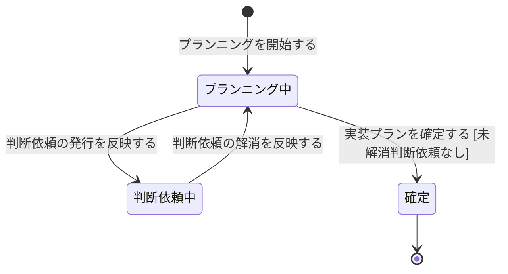
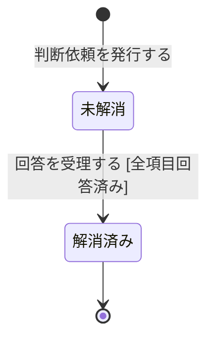
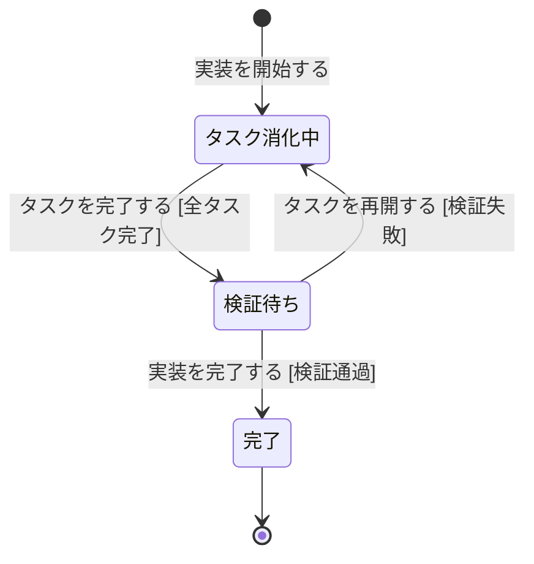
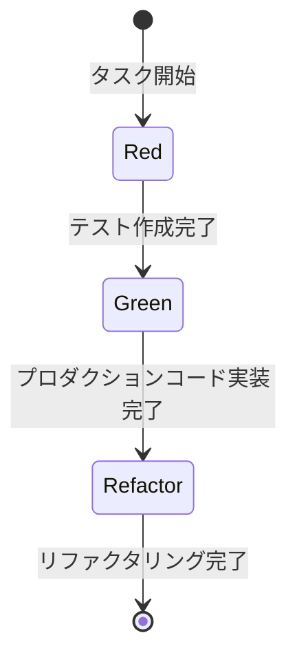
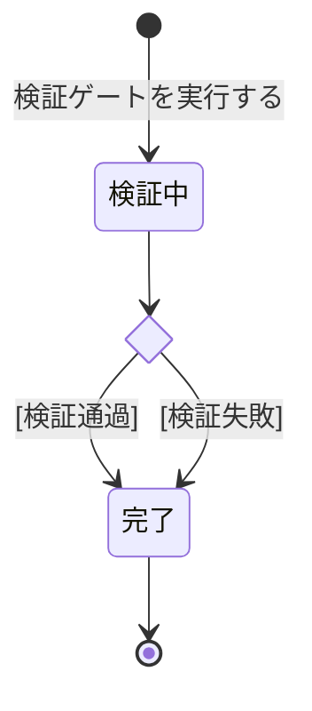
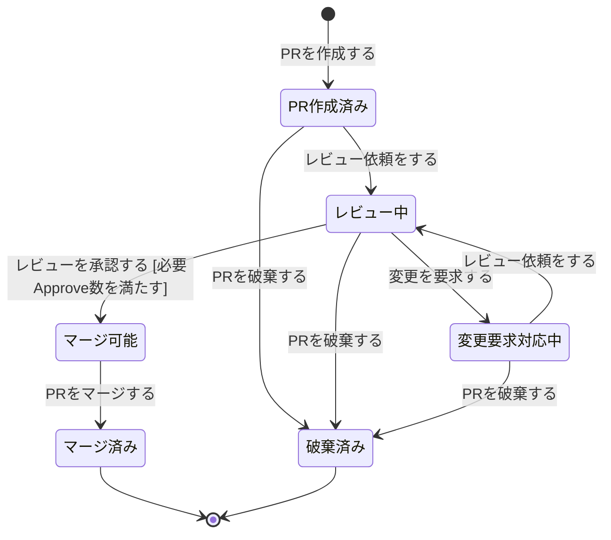
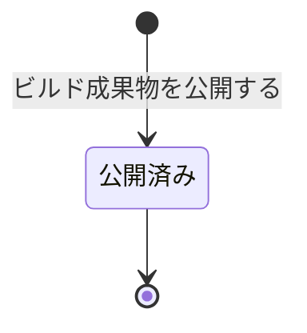
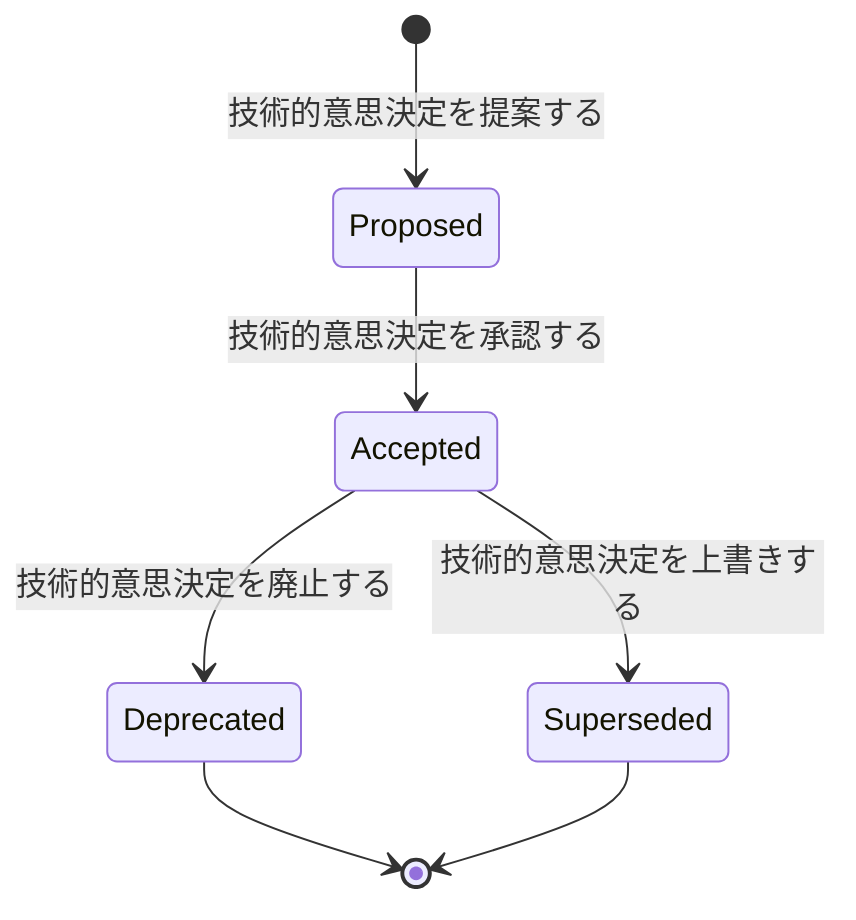

# 開発コンテキスト イベントストーミング

Big Picture（`docs/big-picture.md`）の開発コンテキストをDesign Levelで深掘りしたもの。

## スコープ

- 対象: プランニング開始からビルド成果物公開まで
- 入力: チケット（種別問わず同一フロー。ユーザーストーリー/バグ/タスクはメインボード上で合流済み）
- 出力: ビルド成果物公開（検証コンテキストへQAデプロイのトリガーとして、リリースコンテキストへデプロイ候補として引き渡し）

## ドメインイベント

| イベント名（過去形） | 説明 | 所属集約 |
|---|---|---|
| プランニングが開始された | プランニング行為の開始。新規集約生成時、または WIP 集約での再開時のいずれでも発行される | 実装プラン |
| 実装プランが確定した | プランニング行為の完了。開発者が実装に入れると判断した | 実装プラン |
| プランが判断依頼待ちに入った | 判断依頼集約発の `判断依頼が発行された` を契機に、実装プラン集約の状態が `プランニング中 → 判断依頼中` に遷移。受け手集約観点でのライフサイクルイベント（Issue #181、#188 確定方針） | 実装プラン |
| プランが判断依頼待ちから戻った | 判断依頼集約発の `全判断依頼項目が解消された` を契機に、実装プラン集約の状態が `判断依頼中 → プランニング中` に遷移。受け手集約観点でのライフサイクルイベント（Issue #181、#188 確定方針） | 実装プラン |
| 判断依頼が発行された | プランニング中に発生した判断必要事項を上流/外部に問い合わせる。1判断依頼で複数項目を束ねる | 判断依頼 |
| 外部_判断回答が返された | 企画担当が開発側へ回答を返送（部分回答を含む）。運用ルール「回答受理」により判断依頼集約が処理 | 企画コンテキスト（外部） |
| 全判断依頼項目が解消された | 判断依頼集約の全未回答項目が解消されたことを示す派生イベント。プランニング再開（運用ルール）の契機 | 判断依頼 |
| 技術的意思決定が提案された | 技術的意思決定の起案。Proposed 状態への遷移時に発行（Issue #130） | 技術的意思決定 |
| 技術的意思決定が承認された | 実装プラン確定の前提となるアーキテクチャ・設計方針の決定。Accepted 状態への遷移時に発行（Issue #130 で旧名 `横断的な技術方針が決定された` から改名し、命名規則を集約内で統一） | 技術的意思決定 |
| 技術的意思決定が廃止された | 運用中の意思決定が廃止された。Deprecated 状態への遷移時に発行（Issue #130） | 技術的意思決定 |
| 技術的意思決定が上書きされた | 運用中の意思決定が後続意思決定により上書きされた。Superseded 状態への遷移時に発行（Issue #130） | 技術的意思決定 |
| 実装が開始された | 実装集約のライフサイクル開始。`実装を開始する` コマンド処理時に発行（Issue #184） | 実装 |
| 全タスクが完了した | タスク消化中の全タスクが完了したことを示す派生イベント。実装集約を `タスク消化中 → 検証待ち` に遷移させ、P5（検証実行起動ポリシー）のトリガーとなる | 実装 |
| 実装が完了した | 検証ゲート通過の事実を反映して実装集約が `検証待ち → 完了` に遷移した。`実装を完了する` コマンド処理時に発行（Issue #179） | 実装 |
| タスクが再開された | 検証ゲート失敗を受けて実装集約が `検証待ち → タスク消化中` に戻った。`タスクを再開する` コマンド処理時に発行（Issue #179） | 実装 |
| 検証ゲートを通過した | 型チェック＋Lint＋テスト全パスの複合検証 | 検証実行 |
| 検証ゲートが失敗した | 型エラー・Lint違反・テスト失敗のいずれか | 検証実行 |
| PRが作成された | PRをGitHub上に作成 | PRレビュー |
| レビュー依頼がされた | 検証ゲート通過後、レビュアーにレビューを依頼 | PRレビュー |
| 変更が要求された | レビュアーによるRequest Changes。ブロッキング要素を含む | PRレビュー |
| レビューが承認された | 個別レビュアーによる承認 | PRレビュー |
| 必要Approve数に達した | レビュイーが定めた承認基準を満たした | PRレビュー |
| PRがマージされた | レビュー通過後にマージ | PRレビュー |
| PRが破棄された | 対応が終了された（GitHub上でのCloseに対応） | PRレビュー |
| ビルド成果物が公開された | ビルド成果物（バージョン付き）が registry に公開された | ビルド成果物 |

## コマンド

| コマンド名 | トリガーするイベント | 備考 |
|---|---|---|
| プランニングを開始する | プランニングが開始された | WIP有無により挙動分岐（WIPあれば同一インスタンスで再開、なければ新規作成）。詳細は運用ルール「プランニング再開」および P2 参照 |
| 実装プランを確定する | 実装プランが確定した | 未解消の判断依頼集約インスタンスが存在しないことが不変条件。判定は都度クエリで判断依頼集約の状態を参照する |
| 判断依頼の発行を反映する | プランが判断依頼待ちに入った | 実装プラン集約のシステム内部コマンド。P8（判断依頼発行反映ポリシー）から発行。アクターからの直接発行はない |
| 判断依頼の解消を反映する | プランが判断依頼待ちから戻った | 実装プラン集約のシステム内部コマンド。P9（判断依頼解消反映ポリシー）から発行。アクターからの直接発行はない |
| 判断依頼を発行する | 判断依頼が発行された | 複数項目を束ねた1コマンド。判断依頼集約を新規生成する（既存インスタンスにマージしない） |
| 回答を受理する | 全判断依頼項目が解消された | 人間開発者のみ発行可（運用ルール「回答受理」）。該当項目を回答済みに遷移させ、全項目解消時に派生イベント発行 |
| 判断回答を返す | 外部_判断回答が返された | 外部コマンド（企画コンテキスト） |
| 技術的意思決定を提案する | 技術的意思決定が提案された | 技術的意思決定集約。発行アクター: 提案者。状態遷移 `[*] → Proposed` の起点コマンド（Issue #130） |
| 技術的意思決定を承認する | 技術的意思決定が承認された | 技術的意思決定集約。発行アクター: 承認者。状態遷移 `Proposed → Accepted` の遷移トリガー。Issue #130 で旧コマンド「横断的な技術方針を決定する」を置換し、発火イベントも旧名 `横断的な技術方針が決定された` から改名（破壊的変更） |
| 技術的意思決定を廃止する | 技術的意思決定が廃止された | 技術的意思決定集約。発行アクター: 承認者。状態遷移 `Accepted → Deprecated` の遷移トリガー（Issue #130） |
| 技術的意思決定を上書きする | 技術的意思決定が上書きされた | 技術的意思決定集約。発行アクター: 承認者。状態遷移 `Accepted → Superseded` の遷移トリガー。後継ADR識別子（`ADR-YYYYMMDD[-N]` 形式）を入力に含む（Issue #130） |
| 検証ゲートを実行する | 検証ゲートを通過した / 検証ゲートが失敗した | 検証実行集約のコマンド（Issue #179 で実装集約から移管）。契機は検証実行起動ポリシー（P5、実装集約の `全タスクが完了した` 受信）。アクターからの直接発行は廃止。実行コンテキスト（CI/ローカル/git hook）の運用情報は「検証ゲート実行ポリシー（H5補足）」 |
| 実装を開始する | 実装が開始された | 実装集約の起点コマンド。発行主体は「開発者（直接発行）+ ポリシー P10（自動発行）」の併存。P10（実装開始反映ポリシー）が `実装プランが確定した` 受信時に自動発行するほか、開発者が直接発行することも可能（Issue #184） |
| タスクを完了する | 全タスクが完了した（最後のタスク完了時のみ）| サブエンティティ「タスク」のコマンド。開発者が個別タスクの完了を宣言する。コマンド処理結果として当該タスクを完了済みに遷移させ、全タスク完了時には集約状態 `タスク消化中 → 検証待ち` の遷移と派生イベント `全タスクが完了した` の発火を伴う |
| 実装を完了する | 実装が完了した | 実装集約のシステム内部コマンド。P6（実装完了反映ポリシー）が `検証ゲートを通過した` 受信時に発行する。アクターからの直接発行はない（Issue #179） |
| タスクを再開する | タスクが再開された | 実装集約のシステム内部コマンド。P7（検証失敗時タスク再開ポリシー）が `検証ゲートが失敗した` 受信時に発行する。アクターからの直接発行はない（Issue #179） |
| PRを作成する | PRが作成された | |
| レビュー依頼をする | レビュー依頼がされた | 前提条件: 検証ゲート通過 |
| 変更を要求する | 変更が要求された | |
| レビューを承認する | レビューが承認された | |
| PRをマージする | PRがマージされた | 前提条件: 必要Approve数に達した（＝マージ可能状態） |
| PRを破棄する | PRが破棄された | 変更要求対応を打ち切る、またはレビュー依頼前に取り下げる場合に発行 |
| ビルド成果物を公開する | ビルド成果物が公開された | PRマージを起点にCIが自動実行 |

## アクター

| # | アクター名 | 種別 | 発行するコマンド |
|---|---|---|---|
| 1 | 開発者 | 人間 | プランニングを開始する、実装プランを確定する、実装を開始する、タスクを完了する、判断依頼を発行する、回答を受理する、PRを作成する、レビュー依頼をする、PRをマージする、PRを破棄する |
| 2 | レビュアー | 人間 | 変更を要求する、レビューを承認する |
| 3 | 企画担当 | 人間（外部） | 判断回答を返す |
| 4-a | 提案者 | 人間 | 技術的意思決定を提案する |
| 4-b | 承認者 | 人間 | 技術的意思決定を承認する、技術的意思決定を廃止する、技術的意思決定を上書きする |
| 5 | CI | システム | ビルド成果物を公開する（PRマージ時） |
| 6 | チケット管理システム | 外部システム | （コマンド発行なし。外部イベント `外部_判断回答が返された` の発行元） |

- 本プロジェクトはAIエージェント前提のスキルライブラリ。「開発者」はコーディングエージェントと人間開発者の両方を含む。ただし以下のコマンドは人間開発者のみが発行する:
    - 実装プランを確定する（設計判断「実装プラン確定の判断主体」参照）
    - 回答を受理する（外部回答の内容確認と判断依頼項目の状態遷移を伴う意図判断）
    - PRをマージする（履歴上マージ済みとして残る操作）
    - PRを破棄する（意図判断を要する）
- ACL 層（メッセージング基盤）はコンテキスト間の翻訳責務に特化する。ドメインコマンドの発行主体としてはモデリングしない（設計判断「ACL 層の翻訳特化」参照）
- チケット管理システム（GitHub 等）は外部システムとして外部イベント `外部_判断回答が返された` を発行する。受信後のコマンド発行は運用ルール「回答受理」として開発者が手動実行する（ACL 層の自動変換は行わない）
- 検証ゲートの実行は実装集約イベントを起点とする検証実行起動ポリシー（P5）で自動駆動される。アクターからの直接発行（旧「開発者: 検証ゲートを実行する」「CI: 検証ゲートを実行する」）は廃止（Issue #179）。実行コンテキスト（ローカル/CI/git hook）の運用情報は「検証ゲート実行ポリシー（H5補足）」を参照
- 実装集約のシステム内部コマンド `実装を完了する` `タスクを再開する` はそれぞれ P6（実装完了反映ポリシー）/ P7（検証失敗時タスク再開ポリシー）が自動発行する。アクターからの直接発行はない（Issue #179）
- アクター #4-a「提案者」・#4-b「承認者」は技術的意思決定の役割を抽象化したアクター。組織内の具体的役職（テックリード・アーキテクト等）への対応付けは運用ルール（Issue #169）で定義する。`#4-a` `#4-b` は既存アクター #4「テックリード / チーム」（Issue #130 で削除）の分割継承を表す表記であり、設計判断「ID付与の方針」が抑止する**新規採番**ではない

## 集約

> 状態遷移図の遷移ラベルは、当該遷移を駆動する**コマンド**（自集約コマンドまたはサブエンティティコマンド）と**ガード条件**を記述する。コマンドはコマンド一覧に定義された名称を用い、ガード条件は `[条件]` 形式で表記する。
>
> 起点遷移（`[*] → 状態`）には、集約インスタンスを生成するコマンドを記載する。コマンドが業務的に存在しない場合は、ガード条件のみを記載する。
>
> 中間遷移の記法は3パターン:
> - **コマンド + ガード条件**: 駆動コマンドが存在し、追加の遷移条件もある場合（例: 実装集約の `タスク消化中 → 検証待ち: タスクを完了する [全タスク完了]`）
> - **コマンドのみ**: 駆動コマンドの発行時点で遷移条件が常時成立する場合（例: 実装プラン集約の `プランニング中 → 判断依頼中: 判断依頼の発行を反映する`）
> - **ガード条件のみ**: 駆動コマンドが業務的に存在しない場合（例: 同一コマンドの処理過程で結果分岐する場合は choice node `<<choice>>` を用い、分岐後の各遷移にガード条件を記述する。検証実行集約の `[検証通過]` `[検証失敗]` を参照）
>
> 終端遷移（`状態 → [*]`）はライフサイクル終了の表現にとどまり、ラベルを付さない。
>
> 各遷移の結果として発行されるドメインイベントは、ラベルではなく各集約の状態定義テーブルの「entry時発行イベント」列に記述する。

### 実装プラン

**責務**: プランニング行為と実装プラン（成果物）のライフサイクル管理

**含むコマンド**: プランニングを開始する、実装プランを確定する

**含むイベント**: プランニングが開始された、実装プランが確定した

**内部構造**:
- タスク（サブエンティティ）× N。タスクの定義・順序・依存関係を管理する
- チケット ID（属性）: 判断依頼集約との疎結合な関連キー。両集約が同一チケット ID を保持することで関連を表現し、直接参照は持たない

#### 状態遷移



| 状態 | 定義 | 遷移元 | 遷移先 | entry時発行イベント |
|---|---|---|---|---|
| プランニング中 | 技術設計・タスク分解を進めている | 初期状態, 判断依頼中 | 判断依頼中, 確定 | `[*]` 入路: `プランニングが開始された` / `判断依頼中` 入路: `プランが判断依頼待ちから戻った` |
| 判断依頼中 | 未解消の判断依頼集約インスタンスが存在する状態（判断依頼集約の状態から導出される） | プランニング中 | プランニング中 | `プランが判断依頼待ちに入った` |
| 確定 | 開発者が実装に入れると判断した状態。未解消の判断依頼集約インスタンスが存在しないことが不変条件（都度クエリで判定） | プランニング中 | 終了 | `実装プランが確定した` |

- 確定の判断主体は常に開発者。作成主体（人間/エージェント）によらない
- 運用ルール「プランニング再開」の契機時、WIPインスタンス（＝プランニング中の実装プラン集約）があれば同一インスタンスで作業継続。WIPがなければ新規作成
- P2（変更要求対応）は確定済み状態からの発火となるため、WIP非存在。必然的に新規インスタンスを作成する
- 変更要求で新実装プランが作成された場合、旧実装プラン（確定済み）は履歴として保持され、新実装プランから参照関係を持つ
- イベント「プランニングが開始された」は、新規集約インスタンス生成時と WIP 集約での再開時（プランニング再開パスで WIP 有の場合）の両方で発行される。mermaid 状態遷移図の `[*] → プランニング中` は集約が状態プランニング中に入ったことを示すに留まり、インスタンス生成の有無は運用ルール「プランニング再開」および P2 ポリシーによる分岐で決まる
- 判断依頼集約とは直接参照を持たず、チケット ID 経由で疎結合に関連付ける（F7 集約疎結合方針と整合）。両集約が同一チケット ID を保持し、ドメインイベントおよび都度クエリで連携する
- プラン確定ガードは都度クエリで判断依頼集約の現状（当該チケット ID に紐づく全インスタンスの状態）を参照する。未解消インスタンスが1つでも存在すれば、コマンドは不変条件違反で拒否される
- 「判断依頼中」状態は判断依頼集約の状態から導出される（実装プラン集約内部に独立したフラグは持たない）。状態遷移を駆動するイベント `プランが判断依頼待ちに入った` / `プランが判断依頼待ちから戻った` は、判断依頼集約発のイベント（`判断依頼が発行された` / `全判断依頼項目が解消された`）を契機に集約境界またぎポリシー（P8/P9）経由で発火される、受け手集約観点でのライフサイクルイベントである（Issue #181、#188 確定方針）

### 判断依頼

**責務**: 開発側で発生した判断必要事項を上流/外部に問い合わせ、回答を受理して解消状態を管理する。1判断依頼 = 複数項目を束ねた1集約インスタンス。真の保管先はチケット管理システム（GitHub Issue コメント等）上であり、ローカル markdown はキャッシュ相当として扱う（消失してもチケット上のやり取りから再構築可能）

**含むコマンド**: 判断依頼を発行する、回答を受理する

**含むイベント**: 判断依頼が発行された、全判断依頼項目が解消された

**内部構造**:
- 判断依頼項目（サブエンティティ）× N。各項目は状態（未回答/回答済み）を持つ。全項目が回答済みになると派生イベント `全判断依頼項目が解消された` が発行される
- 発火元（属性）: 当該判断依頼を発行した集約種別。現行値は `実装プラン集約` のみ。将来的に `実装集約`（Issue #146 で追加予定）・`その他` を想定
- チケット ID（属性）: 実装プラン集約との疎結合な関連キー。プラン確定ガードはチケット ID をキーとして判断依頼集約を走査する

#### 状態遷移



| 状態 | 定義 | 遷移元 | 遷移先 | entry時発行イベント |
|---|---|---|---|---|
| 未解消 | 未回答の判断依頼項目が1つ以上残っている状態 | 初期状態 | 解消済み | `判断依頼が発行された` |
| 解消済み | 全判断依頼項目が回答済みになった状態（項目状態から導出される） | 未解消 | 終了 | `全判断依頼項目が解消された` |

- 集約状態は項目状態から導出される（全項目が回答済み → 解消済み）
- 同一チケット内で複数インスタンスが並行して存在可能（既存インスタンスにマージせず、判断依頼ごとに新規生成）。インスタンス間に依存関係はなく、独立に判定される。プラン確定ガードは当該チケット ID に紐づく全インスタンスを走査し、未解消が1つでもあれば確定をブロックする
- 実装プラン集約とは直接参照を持たず、チケット ID 経由で疎結合に関連付ける（F7 集約疎結合方針と整合）
- 外部イベント `外部_判断回答が返された` 発生後、運用ルール「回答受理」に従い開発者が「回答を受理する」コマンドを発行し、該当項目を回答済みに遷移させる。全項目解消時に派生イベント `全判断依頼項目が解消された` を発行する

#### 判断依頼項目

判断依頼集約のサブエンティティ。各項目は状態（未回答/回答済み）を持ち、全項目が回答済みになった時点で派生イベント `全判断依頼項目が解消された` が発行される。

| 状態 | 定義 |
|---|---|
| 未回答 | 上流コンテキスト（企画）に問い合わせ済みで、回答待ちの状態 |
| 回答済み | 開発側で回答を受信し、項目に対する回答が確定した状態 |

- 当面は全項目をブロッカー扱いとする（未解消項目が1つでも残っていれば集約状態は「未解消」）。将来的にブロッカー種別等の項目レベル属性を追加する余地を構造上維持する（例: 仕様判断はプラン確定をブロック、優先順位判断はブロックしない等）

### 実装

**責務**: TDDサイクルによるコード変更の管理と、検証ゲート結果の自集約ライフサイクルへの反映。検証ゲートの実行自体は検証実行集約に分離（Issue #179）。

**含むコマンド**: 実装を開始する、タスクを完了する（サブエンティティコマンド）、実装を完了する、タスクを再開する（`実装を完了する` `タスクを再開する` はシステム内部コマンドで P6/P7 が自動発行。`実装を開始する` は P10 自動発行と開発者直接発行のハイブリッド。`タスクを完了する` は開発者発行）

**含むイベント**: 実装が開始された、全タスクが完了した、実装が完了した、タスクが再開された

#### 状態遷移



| 状態 | 定義 | 遷移元 | 遷移先 | entry時発行イベント |
|---|---|---|---|---|
| タスク消化中 | TDDサイクル（Red→Green→Refactor）をタスク単位で繰り返している。全タスク完了時に `全タスクが完了した` イベントを発火し、検証実行集約のライフサイクル開始（P5）を契機する | 初期状態, 検証待ち | 検証待ち | `[*]` 入路: `実装が開始された` / `検証待ち` 入路: `タスクが再開された` |
| 検証待ち | 全タスク消化済み、検証実行集約による検証ゲート結果を待っている状態。検証通過なら P6 経由で `完了` へ、失敗なら P7 経由で `タスク消化中` に戻る | タスク消化中 | 完了, タスク消化中 | `全タスクが完了した` |
| 完了 | 検証通過。レビュー依頼に進める | 検証待ち | 終了 | `実装が完了した` |

- `検証待ち → 完了` 遷移は実装完了反映ポリシー（P6）が検証実行集約の `検証ゲートを通過した` イベントを受信し、`実装を完了する` コマンドを当該実装集約に発行することで駆動される。コマンド処理結果として自集約イベント `実装が完了した` を発行する
- `検証待ち → タスク消化中` 遷移は検証失敗時タスク再開ポリシー（P7）が `検証ゲートが失敗した` イベントを受信し、`タスクを再開する` コマンドを発行することで駆動される。コマンド処理結果として自集約イベント `タスクが再開された` を発行する。再修正後に再度 `全タスクが完了した` を発火すると検証実行集約の新インスタンスが起動する
- 検証実行集約とは直接参照を持たず、ドメインイベントとチケット ID 経由で連携する（F7 集約疎結合方針と整合）
- 旧設計の `検証中` 状態は本集約から削除し、検証実行（独立集約）に移管した。実装集約には新たに `検証待ち` 状態を設けて検証結果待ち期間を独立表現する（Issue #179）

#### タスクの内部遷移（集約レベルのドメインイベントではない）

タスクは実装集約のサブエンティティであり、TDDのRed-Green-Refactorサイクルに従って内部遷移する。これらはタスク消化中状態の内部工程であり、集約の状態遷移を引き起こさない。



| フェーズ | 定義 |
|---|---|
| Red | テストコードを先行作成する（設計行為） |
| Green | テストを通すためのプロダクションコードを実装する |
| Refactor | テストが通る状態を維持しつつコードを改善する |

### 検証実行

**責務**: 検証ゲート（仕様）の実行と、通過/失敗事実のドメインイベント化。実行コンテキスト（ローカル/CI）の違いはモデル内では区別しない（設計判断「セルフ動作確認の統合」を踏襲）。

**含むコマンド**: 検証ゲートを実行する

**含むイベント**: 検証ゲートを通過した、検証ゲートが失敗した

**内部構造**:
- 仕様としての「検証ゲート」（型チェック＋Lint＋テスト全パスの値オブジェクト/仕様）を実行する。集約名「検証実行」と仕様名「検証ゲート」の二語彙体系（Issue #179）
- チケット ID（属性）: 実装集約との疎結合な関連キー。両集約が同一チケット ID を保持して関連を表現し、直接参照は持たない（F7 と整合）

#### 状態遷移



| 状態 | 定義 | 遷移元 | 遷移先 | entry時発行イベント |
|---|---|---|---|---|
| 検証中 | 検証ゲート（型チェック＋Lint＋テスト）を実行中 | 初期状態 | 結果分岐（choice node） | なし（コマンド受理時点ではドメインイベントは発行されない） |
| 完了 | 検証ゲートの通過/失敗事実が確定し、ドメインイベントが発火された状態 | 結果分岐（choice node） | 終了 | 検証通過時: `検証ゲートを通過した` / 検証失敗時: `検証ゲートが失敗した`（choice node `結果分岐` でガード条件により分岐） |

- 失敗時は終端状態を `完了` で統一し、再実行は新規インスタンスとして扱う。`検証ゲートを通過した` `検証ゲートが失敗した` の2イベントが終端的事実として発火される（状態粒度の選定根拠は設計判断「検証実行集約の独立化（Issue #179）」参照）
- 開始コマンド `検証ゲートを実行する` は P5（検証実行起動ポリシー）が実装集約の `全タスクが完了した` を受信して発行する。アクターからの直接発行は廃止（Issue #179）
- 実装集約・PRレビュー集約への直接参照を持たず、ドメインイベント経由で連携する（F7 集約疎結合方針と整合）

### PRレビュー

**責務**: レビュー・マージのゲート管理

**含むコマンド**: PRを作成する、レビュー依頼をする、変更を要求する、レビューを承認する、PRをマージする、PRを破棄する

**含むイベント**: PRが作成された、レビュー依頼がされた、変更が要求された、レビューが承認された、必要Approve数に達した、PRがマージされた、PRが破棄された

#### 状態遷移



| 状態 | 定義 | 遷移元 | 遷移先 | entry時発行イベント |
|---|---|---|---|---|
| PR作成済み | PRが作成され、検証ゲート通過後のレビュー依頼を待っている | 初期状態 | レビュー中, 破棄済み | `PRが作成された` |
| レビュー中 | レビュアーが確認中。個別の承認（レビューが承認された）はこの状態内で蓄積 | PR作成済み, 変更要求対応中 | 変更要求対応中, マージ可能, 破棄済み | `PR作成済み` 入路: `レビュー依頼がされた` / `変更要求対応中` 入路: `レビュー依頼がされた`（再依頼） |
| 変更要求対応中 | 変更要求を受けており、再依頼または破棄の判断・対応を検討中の状態 | レビュー中 | レビュー中, 破棄済み | `変更が要求された` |
| マージ可能 | 必要Approve数に到達。開発者がマージを実行できる | レビュー中 | マージ済み | `必要Approve数に達した` |
| マージ済み | マージ完了。ビルド成果物集約へ引き渡し（P3ポリシー） | マージ可能 | 終了 | `PRがマージされた` |
| 破棄済み | PRが破棄され、対応が終了した状態 | PR作成済み, レビュー中, 変更要求対応中 | 終了 | `PRが破棄された`（PR作成済み・レビュー中・変更要求対応中いずれの入路でも同一イベント） |

- 「必要Approve数に達した」は派生イベント。個別の「レビューが承認された」が蓄積し、レビュイーが定めた承認基準を満たした時点で発生する（コマンドやポリシーによるトリガーではない）
- 「変更要求対応中」はPRレビュー集約内の状態。実装プラン集約側の動き（新実装プラン作成、旧実装プラン参照関係）は集約外の話として含めない。新規プランニングはP2ポリシー（変更要求対応）により「プランニングを開始する」が発火されて起動する
- 1実装プランに対し複数PRが並行する場合、それぞれ独立したPRレビュー集約インスタンスとして扱う。特別な構造は設けない
- 「マージ可能」状態は、人間開発者が `PRをマージする` コマンドを発行するまでの滞留を許容する。追加レビュー待ち、依存PR待ち、リリースタイミング調整等の事情で即時マージしない選択はドメインモデル上は同一状態として表現され、独立した待機状態は設けない

### ビルド成果物

**責務**: ビルド成果物の公開・保管

**含むコマンド**: ビルド成果物を公開する

**含むイベント**: ビルド成果物が公開された

**内部構造**: バージョン付きビルド成果物を一意なエンティティとして扱う。保管先（registry）が外部マネージドかself-hostかは実装選択で、集約責務としては同一

#### 状態遷移



| 状態 | 定義 | 遷移元 | 遷移先 | entry時発行イベント |
|---|---|---|---|---|
| 公開済み | registry に登録完了。検証コンテキスト（QAデプロイ）・リリースコンテキスト（デプロイ候補選択）から参照可能 | 初期状態 | 終了 | `ビルド成果物が公開された` |

- 公開後の状態遷移は現時点で持たない（将来アーカイブ等の状態が必要になれば再設計する）
- ビルド成果物が本番にデプロイされるかどうかはリリースコンテキストの責務であり、本集約の関心外

### 技術的意思決定

**責務**: 複数の実装プラン集約を横断する技術的意思決定（アーキテクチャ・設計方針）のライフサイクル管理。集約の実体は ADR（Architecture Decision Records）形式の Markdown ファイルとして `docs/adr/` 配下に保管される。

**含むコマンド**: 技術的意思決定を提案する、技術的意思決定を承認する、技術的意思決定を廃止する、技術的意思決定を上書きする

**含むイベント**: 技術的意思決定が提案された、技術的意思決定が承認された、技術的意思決定が廃止された、技術的意思決定が上書きされた

**内部構造**:
- ADR識別子（属性、全状態で保持）: 採番方式 `ADR-YYYYMMDD[-N]`（同日2件目以降のみ `-N` 付与）。集約インスタンスを一意に識別する
- 配置パス（属性、全状態で保持）: `docs/adr/` 配下の Markdown ファイル
- 後継ADR参照（属性、Superseded 状態のみ保持）: 後続ADRの識別子を文字列として保持する値オブジェクト。集約インスタンスへの直接参照は持たず、自己参照・循環参照の構造的不整合を防ぐ

#### 状態遷移



| 状態 | 定義 | 遷移元 | 遷移先 | entry時発行イベント |
|---|---|---|---|---|
| Proposed | 提案者により起案され、承認者の判断を待っている状態 | 初期状態 | Accepted | `技術的意思決定が提案された` |
| Accepted | 承認者により承認され、運用中の意思決定 | Proposed | Deprecated, Superseded | `技術的意思決定が承認された` |
| Deprecated | 運用中の意思決定が廃止された状態。後継参照は持たない | Accepted | 終了 | `技術的意思決定が廃止された` |
| Superseded | 運用中の意思決定が後続ADRに上書きされた状態。後継ADR識別子を保持 | Accepted | 終了 | `技術的意思決定が上書きされた` |

- 状態遷移起点は Proposed 必須。Proposed をスキップして直接 Accepted に到達する経路は持たない。即承認のケースは「提案 → 承認」を運用ルール上の連続実行として表現する
- 実装プラン集約からは直接参照を持たず、ドメインイベント経由で連携する（F7 集約疎結合方針と整合）。実装プラン集約は本集約のイベントを購読しない（参照層の整備は Issue #169 / #171 で扱う）
- Accepted 状態への遷移時に発火するイベントは `技術的意思決定が承認された`。Issue #127 F8 由来の旧名 `横断的な技術方針が決定された` から Issue #130 で改名し、集約内のイベント命名（`技術的意思決定が*`）を統一した
- Accepted イベントを契機にしたポリシーは現時点で定義しない（参照層・捕捉プロセスは Issue #169 / #170 / #171 に委譲）
- 採番方式 `ADR-YYYYMMDD[-N]`・配置 `docs/adr/`・テンプレート・粒度判定基準などの運用基盤詳細は Issue #169（Phase 0）で確定する。本ドキュメントでは集約モデル上の扱いのみを規定する

## ポリシー

| # | ポリシー名 | トリガーイベント | 実行するコマンド | 備考 |
|---|---|---|---|---|
| P2 | 変更要求対応 | 変更が要求された | プランニングを開始する（確定済み＝WIP非存在のため必然的に新規インスタンス） | |
| P3 | ビルド成果物公開 | PRがマージされた | ビルド成果物を公開する | |
| P5 | 検証実行起動 | 全タスクが完了した | 検証ゲートを実行する | 実装集約から検証実行集約への駆動。集約境界またぎポリシー化（Issue #179） |
| P6 | 実装完了反映 | 検証ゲートを通過した | 実装を完了する | 検証実行集約から実装集約への戻し遷移（成功時、`検証待ち → 完了`）。集約境界またぎポリシー化（Issue #179、設計判断「検証失敗時のポリシー廃止」を上書き） |
| P7 | 検証失敗時タスク再開 | 検証ゲートが失敗した | タスクを再開する | 検証実行集約から実装集約への戻し遷移（失敗時、`検証待ち → タスク消化中`）。再修正後の `全タスクが完了した` 再発火で検証実行集約の新インスタンスが起動する（Issue #179、設計判断「検証失敗時のポリシー廃止」を上書き） |
| P8 | 判断依頼発行反映 | 判断依頼が発行された | 判断依頼の発行を反映する | 判断依頼集約から実装プラン集約への駆動。受け手集約観点でのイベント言語化（Issue #181、#188 確定方針）。実装プラン集約のシステム内部コマンドを発行 |
| P9 | 判断依頼解消反映 | 全判断依頼項目が解消された | 判断依頼の解消を反映する | 判断依頼集約から実装プラン集約への戻し駆動。受け手集約観点でのイベント言語化（Issue #181、#188 確定方針）。同一イベントを契機とする運用ルール「プランニング再開」と独立に並存（自動反応と人間操作の役割分担） |
| P10 | 実装開始反映 | 実装プランが確定した | 実装を開始する | 実装プラン集約から実装集約への駆動（人間アクター直接発行と併存）。集約境界またぎポリシー（Issue #184） |

- 本表にはイベント→コマンドの自動反応のみ記載する。外部回答の受理・プランニング再開は人間系の判断を要するため、後続「運用ルール」セクションで規定する
- P1・P4 は Issue #147 で運用ルールに移設したため採番が欠番となるが、他ドキュメント・Issue・メモリからの参照破壊を避けるため再採番は行わない
- P5/P6/P7 は Issue #179 で新規採番。集約境界をまたぐポリシーで、いずれも実行するコマンド欄に当該集約のコマンド名が入る標準形式（QAコンテキストのポリシー表と同じ）。実装集約に発行される P6/P7 のコマンド（`実装を完了する` / `タスクを再開する`）はシステム内部コマンドであり、アクターからの直接発行はない
- P8/P9 は Issue #181 で新規採番。判断依頼集約のドメインイベントを契機に実装プラン集約のシステム内部コマンド（`判断依頼の発行を反映する` / `判断依頼の解消を反映する`）を発行する集約境界またぎポリシー。アクターからの直接発行はない

## 運用ルール

ポリシー（イベントに対する自動反応）では表現できない、人間系の判断・手動操作を要するルール。外部システム連携の信頼性・意図判断の必要性から、モデルの自動反応として扱わない。

| ルール名 | 契機 | 実行する操作 | 備考 |
|---|---|---|---|
| プランニング再開 | 派生イベント `全判断依頼項目が解消された` の発生を開発者が確認 | プランニングを開始する（WIP インスタンスがあれば同一インスタンスで作業継続、なければ新規作成） | 自動ポリシー化しない理由は設計判断「プランニング再開・回答受理の運用ルール化」参照 |
| 回答受理 | チケット管理システム上で外部回答（`外部_判断回答が返された` に対応するやり取り）を開発者が確認 | 回答を受理する | 外部イベントの発行元はチケット管理システム（外部システム）。ACL 層の自動変換は行わない |

## ホットスポット

| # | ホットスポット | 関連する集約/イベント | 解消アクション |
|---|---|---|---|
| H1 | 「承認済み」ステータスがPR承認とQA確認待ちの二重責務を持っている | PRレビュー / メインボードの状態定義 | **解消済み（Issue #128）**: メインボードのチケットライフサイクルはPRマージ時点で完了とし、QA活動の進捗・結果はメインボードで管理しない方針を採用。これにより「マージ前のApprove済み」と「マージ後のQA待ち」の命名衝突は構造的に解消。チケットステータス遷移の連携設計はバックログ管理コンテキストの責務に確定（Big Picture「採用した方針」参照） |
| H2 | チケットステータスとの連携が未整備。開発イベントがチケットステータス遷移をトリガーするが連携方法が手動/暗黙的。上流チケット（インシデント/サポート）との情報連携も弱い | 全集約 / コンテキスト間連携 | **部分解消（Issue #128）**: 連携設計の責務帰属はバックログ管理コンテキストに確定（コンシューマー型。バックログ管理が開発イベントを購読してチケットステータスを更新する）。実装メカニズム（購読ポリシー・状態遷移設計等）はバックログ管理コンテキストDLで扱う。上流チケット（インシデント/サポート）との連携はボード追加に伴うコンテキスト境界の議論として別Issueで扱う |
| H3 | Pull型起票（開発者が自発的にインシデント/サポートからチケットを作る）のため対応漏れリスクがある | 運用コンテキスト側の課題 | スコープ外。運用コンテキストDLで検討 |
| H4 | ADR（Architecture Decision Records）のライフサイクル管理が未定義。横断的技術方針の蓄積・参照・廃止の仕組みがない | 技術的意思決定 / 組織横断 | **解消済み（Issue #130）**: 「技術的意思決定」集約として正式モデル化。状態遷移（Proposed/Accepted/Deprecated/Superseded）・ライフサイクルコマンド/イベント・アクター解像度（提案者/承認者）を確定。運用基盤（テンプレート・採番運用・参照導線・粒度判定基準）は #169 / #170 / #171 に委譲 |
| H5 | 検証ゲートのローカル実行とCI実行の使い分けポリシーが未定義（git hook導入判断含む） | 実装 / 検証実行（Issue #179 で集約分離） | **解消済み**: 「検証ゲート実行ポリシー（H5補足）」参照。Issue #179 で検証実行集約を分離し、モデル上はローカル/CIを区別しない（運用情報のみ補足セクションに残す） |
| H6 | 必要Approve数の決定基準が暗黙的（レビュイーの個人判断） | PRレビュー | **低優先度（対応不要）**: GitHubで設定可能な必要承認数（ブランチ保護ルール）を超えるリッチな要件の実現は現実的でないため、積極的な解消は行わない方針。背景として: チーム最低制約「1 Approve以上」は明文化済み。それ以上はレビュイー個人裁量で、決定タイミングも動的（事前確定不可なケースあり）。モデル化・DoR組み込みは却下（マージ判断はユーザーから不可視、モデル化は過剰）。暗黙運用の現状記録にとどめる |
| H7 | 実装プランのNo-op判定基準が未定義（差し戻し時、どこまでが「軽微」か） | 実装プラン | **解消済み**: 変更要求を受けた場合は常に新しい実装プランを作成する（P2ポリシー）。実装プランの粒度は開発者判断 |
| H8 | 差し戻し時の同一インスタンス巻き戻し vs 新規インスタンス作成の判断が未定義 | 実装プラン / 実装 | **解消済み（導出結果）**: 独立決定ではなく、WIP/確定の状態分類から導出される。WIPインスタンスがあれば状態遷移で再開、なければ新規作成。変更要求時はWIP非存在のため必然的に新規作成となる（運用ルール「プランニング再開」および P2 参照） |
| H9 | プラン確定ガードの判定メカニズム・判断依頼集約の永続化設計 | 実装プラン / 判断依頼 | **解消済み（Issue #147）**: 発火元識別・内容種別分類・プラン⇔判断依頼の関連・判定方式・保管先・ACL層責務・運用ルール化の7論点を確定。詳細は「プラン確定ガードと判断依頼永続化（H9補足）」参照 |

### 検証ゲート実行ポリシー（H5補足）

#### 集約境界とアクター（Issue #179）

モデル上は検証実行集約が `検証ゲートを実行する` コマンドを受け取り、ローカル/CI の区別はしない（設計判断「セルフ動作確認の統合」を踏襲）。コマンドの発行主体は P5（検証実行起動ポリシー）であり、アクター（開発者・CI）からの直接発行は廃止された。本セクションは集約境界の外側にある運用情報（実行コンテキストの使い分け）を記述する。

実行コンテキストごとの扱い:

| 実行コンテキスト | 扱い |
|---|---|
| CI | PR作成/更新時に自動実行。マージブロッカーとして必須 |
| ローカル | 開発者が手動実行。本ワークフロー上は必須 |
| git hook（pre-commit / pre-push 等） | 導入可否は各プロジェクトの判断に委ねる。共通ポリシーでは規定しない |

ローカル必須の根拠:

1. コーディングエージェントによる高速フィードバックループ（失敗→即修正→再実行）が同期的に回る
2. 非同期ジョブ完了待機が不要
3. PRを作らずに検証可能で、検証目的のdraft PR乱発を防げる

失敗時運用:

- **ローカル失敗時**: 検証ゲート通過まで実装/修正を継続する。解決不能時はIssueにコメントして判断依頼を発行する
- **CI失敗時**: レビュー・マージのブロッカーとなる。修正後、再度ローカル検証ゲートから通してpushし直す

### プラン確定ガードと判断依頼永続化（H9補足）

Issue #147 で確定した設計判断の要旨。詳細な論拠は設計判断セクションの該当項目を参照。

- **発火元識別**: 判断依頼集約は「発火元」属性を持つ。現行値は `実装プラン集約` のみ。Issue #146 で `実装集約` を追加予定。発火元別の挙動差はモデル上持たず、属性値の存在のみ明示する
- **内容種別分類**: 当面は全項目をブロッカー扱いとし、項目レベルの種別分類は導入しない。将来的にブロッカー種別等の項目レベル属性を追加する余地は構造上維持する
- **プラン⇔判断依頼の関連**: チケット ID 疎結合。両集約が同一チケット ID を保持することで関連を表現し、直接参照・集約 ID の相互保持はしない（F7 疎結合方針を維持）
- **プラン確定ガードの判定方式**: 都度クエリ。判断依頼集約を都度クエリで参照し、当該チケット ID に紐づく未解消インスタンスが1つでも存在すれば不変条件違反で拒否する。実装プラン集約内部に「判断依頼中」フラグは持たない
- **判断依頼集約の保管先**: チケット管理システム（GitHub Issue コメント等）。ローカル markdown はキャッシュ相当であり、消失してもチケット上のやり取りから再構築可能
- **ACL 層の責務**: 翻訳特化。コンテキスト間翻訳責務に特化し、判断依頼の永続化責務は担わず、ドメインコマンドの発行主体としてもモデリングしない
- **プランニング再開・回答受理の運用ルール化**: ポリシーではなく運用ルールとして分離。実行主体が開発者（人間）の手動操作であり、ポリシー（イベント→コマンドの自動反応）として分類するとモデル上の嘘となるため。ポリシー ID の P1・P4 は欠番として維持する

## 設計判断

本ドキュメント作成時に下した設計判断の記録。

- **テスト/型チェック/Linterのモデリング**: TDDのRed-Green-Refactorサイクル（テスト作成・実装・リファクタリング）はタスクの内部遷移として扱い、集約レベルのドメインイベントからは降格した。検証ゲート（品質ゲート）は集約の状態遷移を起こすイベントとして維持。検証ゲート内部の構成（型チェック・Lint・テスト）は個別イベントに分けない（失敗時のアクションが同質のため）
- **タスク内部遷移の明示化**: TDDのRed-Green-Refactorの3フェーズをタスクの内部遷移として定義した。旧「テストが作成された」「実装された」は集約の状態遷移を起こさず、同一タスク消化中状態の内部工程であるため、ドメインイベントとしては過剰だった
- **検証失敗時のポリシー廃止（Issue #179 で上書き）**: ~~検証ゲート失敗→タスク消化中への遷移は実装集約の状態遷移図で直接表現されており、独立したポリシーとして定義する必要がない。状態遷移図が権威ある定義~~ → Issue #179 で検証実行集約を実装集約から分離した結果、検証ゲート失敗からの戻し遷移は集約をまたぐポリシー連携となり、実装集約の状態遷移図のみでは表現できなくなった。P7（検証失敗時タスク再開ポリシー）として再導入する。実装集約に新設した `検証待ち` 状態から `タスク消化中` への戻し遷移を伴う集約境界またぎポリシーとし、`タスクを再開する` コマンドを発行する
- **チケット種別による分岐（BPホットスポット #11, #14）**: 開発コンテキスト内では不要。全種別が同一メインボード・同一ステータス遷移を通る。バグ固有の原因調査やタスク固有の影響調査は「進行中」の内部工程であり、フロー分岐ではない
- **セルフ動作確認の統合**: ローカル実行とCI実行はチェック内容・失敗時アクションが同一。「検証ゲート」として統合し、実行コンテキストの違いはモデルでは区別しない
- **検証ゲート実行ポリシー**: CI=マージブロッカーとして必須、ローカル=本ワークフロー上必須、git hook=各プロジェクト判断。根拠・失敗時運用の詳細は「検証ゲート実行ポリシー（H5補足）」参照
- **レビューイベントの構造**: レビュー提出は判定（Approve / Request Changes / Comment）と指摘（コメント群）で構成される。ドメインイベントは判定軸で分割し、「変更が要求された」（Request Changes）と「レビューが承認された」（Approve）の2つ。Comment判定は状態遷移を起こさないためイベント化しない。QA起因の再作業はPRマージ後に発生するため開発コンテキスト外。「変更が要求された」「レビューが承認された」はGitHubのレビュー提出（Submit review）単位で発火する。1レビュー提出に複数の指摘コメントが含まれる場合でも、判定が Request Changes ならイベントは1回。個別の指摘コメントはイベントのペイロード内部情報とし、ドメインイベントとしては扱わない
- **PR作成とレビュー依頼の分離**: PRの作成（GitHub上のPRオブジェクト作成）とレビュー依頼（レビュアーへの依頼）を別イベントとして扱う。レビュー依頼の前提条件として検証ゲート通過を要求する
- **実装プラン確定の判断主体**: 作成主体（人間開発者/コーディングエージェント）によらず、人間開発者が「実装に入れる」と判断した時点で確定。外部の承認は不要
- **集約の不採用判断**: コミット（内部工程）、チケット（外部責務）は独立集約としない（ADRの扱いは技術方針集約として切り出し、Issue #130 で「技術的意思決定」集約として正式名称・内部構造・ライフサイクルを確定）
- **ブランチ作成の不採用**: ブランチ作成は開発環境のセットアップであり、ドメインの関心事ではない。状態遷移を起こさず、ポリシーのトリガーにもならないため、イベント・コマンドとしてモデリングしない
- **既存 `delivery-workflow/event-storming.md` からの取捨選択**: Discovery全般（企画スコープ）、AI固有イベント、セルフレビューは取り込まない。検証ゲートの定義、実装中のPlan不備発覚パターンは差し戻し対応の設計に反映
- **ビルド成果物公開を開発コンテキスト所属とする**: CI（ビルド・テスト・統合）とCD（Continuous Delivery＝ビルド成果物公開まで）は開発コンテキストが所有。ビルド設定・テスト・依存解決の知識領域と整合する。成果物の利用判断（デプロイ可否判定・リリース候補選択）はリリースコンテキスト所有で、「ビルド成果物管理」と「ビルド成果物の利用判断」を切り分ける（Issue #125）。ビルド成果物公開は下流トリガーとして機能する: 検証コンテキスト（QAデプロイ自動指示）・リリースコンテキスト（デプロイ候補として参照）への連携起点となる
- **ポリシー分岐の本質とWIP/確定分類（Issue #127 F1, Issue #147 で運用ルール化を反映）**: 運用ルール「プランニング再開」と P2 ポリシーのコマンドが同一（「プランニングを開始する」）であるのは、集約のライフサイクル状態（WIPインスタンスの有無）による分岐の結果。WIPあれば同一インスタンスで作業継続、なければ新規集約ライフサイクル開始。P2は確定済み状態からの発火のためWIP非存在、必然的に新規作成となる。WIP消失は異常系ではなく正常系として扱う。実装プランの粒度（No-opに近い軽微なものから大幅な見直しまで）は開発者が判断する
- **旧実装プランの履歴保持と参照関係（Issue #127 F1）**: 変更要求で新実装プランが作成された場合、旧実装プラン（確定済み）は履歴として保持し、新実装プランから参照関係を持つ。破棄はしない
- **外部/内部イベント分離（Issue #127 F2, Issue #139 で部分上書き, Issue #147 で運用ルール化）**: 企画コンテキスト境界を明示するため、企画発の外部イベント（`外部_判断回答が返された`）を `外部_` プレフィックスで明示する。`外部_` プレフィックスは他コンテキスト発の外部イベント（本コンテキストから見た受信対象）を示す命名規則。~~対応する内部イベント（`仕様の回答が届いた`）はコンテキスト境界での受信時にメッセージング/ACL層で発行される（コマンドとしてはモデリングしない）~~ → Issue #139 F1 で上書き: 外部イベント受信後は「回答を受理する」コマンドに変換する（内部イベント不要）。Issue #147 でコマンド発行は運用ルール「回答受理」として開発者の手動操作と確定（ポリシーによる自動変換ではない）
- **判断依頼項目のサブエンティティ化（Issue #127 F2, Issue #139 F1 で上書き）**: ~~エスカレーション項目は実装プラン集約に閉じる（他集約から参照されず、実装プラン集約と運命を共にし、独立トランザクション境界を要しない）ため、独立集約化は過剰。実装プラン集約のサブエンティティとしてフラット構造で扱う。業務用語「エスカレーション」は1回の問い合わせ行為として用語・イベント・コマンドに残し、モデル内部は項目フラット。~~ ※ **永続性の観点から Issue #139 で再検討した結果、独立集約化に変更**: 本プロジェクトの成果物はローカルmarkdownファイルで、WIP実装プラン削除時に判断依頼項目情報が失われ解消判定不能となる問題が識別された。Issue #139 F1「判断依頼の独立集約化」で上書きし、判断依頼項目は判断依頼集約のサブエンティティとする
- **実装プラン確定の不変条件（Issue #127 F2, Issue #139 で部分更新, Issue #147 で判定方式確定）**: 実装プラン確定の不変条件として「未解消の判断依頼集約インスタンスが存在しない」ことを要求し、再開トリガーは派生イベント `全判断依頼項目が解消された` とする。判定方式は都度クエリで判断依頼集約を参照する（Issue #147 H9 解消）
- **集約間の疎結合（実装プラン集約⇔PRレビュー集約で直接参照なし）（Issue #127 F7）**: 3集約（実装プラン/実装/PRレビュー）は直接参照を持たず、ドメインイベント経由のみで連携する。「○○のPRに対する」「○○の実装プランから生まれた」といった参照はドメインモデルに含めず、運用情報（Git branch、コミット、PR description）で担保する
- **並行複数PRの扱い（Issue #127 F7）**: 1実装プランに対し複数PRが並行する場合、それぞれ独立したPRレビュー集約インスタンスとして扱う。特別な構造（親子関係、グルーピング等）は設けない
- **「変更要求対応中」状態の純化（Issue #127 F7）**: 変更要求対応中はPRレビュー側の状態として、再依頼または破棄の判断・対応を検討中であることを示す。実装プラン集約側の動き（新実装プラン作成、旧実装プラン参照関係）は集約外の話として切り離す。P2ポリシーは `変更が要求された` イベント発行時に独立起動する
- **PR破棄時のチケットステータス連携**: `PRが破棄された` 時のチケット側遷移は自動連携しない。破棄の意図（別アプローチでの仕切り直し / 対応中止）はコンテキスト依存で開発者の判断を要するため、一律のルール化はしない。PRがCloseされた事実の連携は GitHub 機能（ブランチ/PR状態の可視化）で実現される前提とする
- **横断的技術方針の独立集約化（Issue #127 F8、Issue #130 で詳細設計確定）**: 複数の実装プラン集約を横断・実装プラン集約と運命を共にしない・独立した意思決定プロセス・別アクター（テックリード/チーム）という性質から、実装プラン集約の関心事外として切り出す（Issue #127 F8）。**Issue #130 で詳細設計確定**: 集約名を「技術的意思決定」に正式化。ADR形式の Markdown ファイル（`docs/adr/` 配下、採番方式 `ADR-YYYYMMDD[-N]`）を実体として位置付け。ライフサイクル4状態（Proposed/Accepted/Deprecated/Superseded）と対応するコマンド/イベント（提案/承認/廃止/上書き）を追加。「横断的な技術方針を決定する」コマンドは「技術的意思決定を承認する」に置換（破壊的変更）。Accepted 状態への遷移時イベントは旧名 `横断的な技術方針が決定された` から `技術的意思決定が承認された` に改名し、集約内イベント命名（`技術的意思決定が*`）の統一を優先（破壊的変更）。運用基盤（テンプレート・採番運用・参照導線・粒度判定基準）は Issue #169 / #170 / #171 に委譲
- **アクター解像度（テックリード/チーム → 提案者/承認者）（Issue #133 N6 申し送り、Issue #130 で確定）**: Issue #133 N6 でアクター #4「テックリード/チーム」が個人と集合の混在で意思決定単位が曖昧と指摘され、本Issueの運用設計と一体で判断するため Issue #130 に申し送られた。Issue #130 のプラン作成段階で「全組織にテックリードがいるとは限らない」を踏まえ、組織前提に依存しない**ロール抽象化**（提案者/承認者）に方針を確定。アクター #4 は「4-a 提案者」「4-b 承認者」に分割継承（既存ID分割継承であり「ID付与の方針」が抑止する新規採番ではない）。組織内の具体的役職への対応付けは運用ルール（Issue #169）に委譲
- **ID付与の方針（Issue #127 F9, Issue #138で既存ID削除を適用, Issue #147で運用ルール化による欠番発生, Issue #130でアクター分割継承を許容）**: ポリシー（P2・P3、旧 P1・P4 は Issue #147 で運用ルールに移設）・ホットスポット（H1-H9）のID体系は維持。ドメインイベント・コマンドの#連番IDは Issue #138 で削除し、名前参照に統一した。以降の新規追加（イベント・コマンド・アクター）は名前参照を基本とし、ID付与は行わない。運用ルールは採番しない（命名参照のみ）。連番IDは項目追加・削除で番号がズレ、他文書からの参照が壊れやすいため、既存採番は欠番を許容しても再採番しない方針。**例外: 既存IDの分割継承**は許容する（例: Issue #130 でアクター #4 を 4-a/4-b に分割継承）。これは新規採番ではなく既存IDの細分化であり、他文書からの `#4` 参照は破壊されないため再採番禁止の趣旨と整合する
- **技術的意思決定集約の状態名を英文表記とする（Issue #130）**: 技術的意思決定集約の状態名 `Proposed / Accepted / Deprecated / Superseded` を英文表記で確定。他集約の状態名（「プランニング中」「確定」「タスク消化中」「公開済み」等の和文表記）と命名規則が揃わないが、以下の理由で意図的選択とする。
    - **ADR業界慣例との整合**: Nygard ADR テンプレート・MADR 等で `Proposed/Accepted/Deprecated/Superseded` が定着しており、国際的に通じる用語
    - **集約の実体（ADR形式の Markdown ファイル）の Status 欄表記との一致**: ドメインモデル名と ADR ファイル内表記が乖離すると、ファイル参照時の認知コストが増える
    - **状態名以外（コマンド名・イベント名・集約名・アクター名）は和文を維持**: 和文表記の対象（業務概念・操作）と英文表記の対象（業界慣例の確立した状態名）を区別する
    - **代替案と却下理由**:
        - 和文統一（例: 提案中/承認済/廃止済/上書き済）→ ADR ファイル内 Status 欄との二重管理が発生し、業界慣例との乖離が大きい
        - 併記（例: 提案中（Proposed））→ mermaid ラベル・状態定義表・コマンド入力型 `対象: Proposed` 等の多数の参照箇所が冗長になる
    - 用語集の `Superseded` エントリ補足記述（「ADR慣例に倣い英文表記」）と本決定が整合する
- **判断依頼の独立集約化（Issue #139 F1: Issue #127 F2 上書き）**: 判断依頼を実装プラン集約のサブエンティティではなく独立集約として扱う。
    - 粒度: 1判断依頼 = 複数項目を束ねた1集約インスタンス
    - 並行性: 同一チケット内で複数インスタンス並行 OK
    - 生成: 既存インスタンスにマージせず、判断依頼ごとに新規生成
    - 連携: 実装プラン集約とは直接参照を持たず、チケット ID 経由で疎結合に関連付ける（F7 踏襲）。確定ガードは都度クエリで判断依頼集約の現状を参照する（Issue #147 で「二層化設計」の記述を都度クエリ一層に整理）
    - 命名: 用語「エスカレーション」を「判断依頼」に汎化（部分汎化: 開発コンテキスト内に閉じる）。代表用例の追加列挙なし
    - 回答受理: 新コマンド「回答を受理する」（Issue #139 時点では新ポリシー P4「回答受理」を併設したが、Issue #147 で運用ルール「回答受理」に移設し P4 は削除。発行主体は開発者=人間開発者のみ）。F2 既存判断「ACL層で内部イベント発行、コマンド化なし」を上書き
    - 本 Issue のモデル化範囲: 実装プラン集約発の判断依頼のみ。実装集約発（検証ゲート解決不能→チーム等）は理論的に発火可能だが本 Issue ではモデル化しない（別 Issue）
- **マージ済みからの取り消し（リバート）の扱い**: マージ済みを終端とする設計を維持。リバートおよびリバートの取り消しは、GitHub準拠で新PRレビュー集約インスタンスとして扱う（revert PR）。マージ済み状態からの遷移は設けない
- **判断依頼集約化の永続性論点（Issue #139 F2, Issue #147 で解消）**: WIP実装プラン削除時に未解消の判断必要事項が失われ、解消判定不能となる永続性問題（PR #135 レビューで識別）を契機に、判断依頼を独立集約化してライフサイクル管理下に置いた。これにより実装プラン集約のライフサイクルとは独立に永続化できる構造となる。残論点として扱われていた判断依頼集約自身の永続化メカニズム（保管先、履歴保持ポリシー等）は Issue #147 で「真の保管先はチケット管理システム、ローカル markdown はキャッシュ相当」と確定
- **プラン確定ガードの判定方式（Issue #147 H9 解消）**: 実装プラン確定ガードは判断依頼集約を都度クエリで参照し、当該チケット ID に紐づく未解消インスタンスが1つでも存在すれば不変条件違反で拒否する。実装プラン集約内部に「判断依頼中」フラグは持たず、状態は判断依頼集約から導出されるのみ。Issue #139 F1 で許容していた「二層化設計（イベント駆動フラグ＋都度クエリ）」は、並行複数インスタンス下でフラグが整合しない問題（PR #145 レビュー指摘）を踏まえ、都度クエリ一層に統一した
- **プラン⇔判断依頼のチケット ID 疎結合（Issue #147 H9 解消）**: 両集約が同一チケット ID を保持することで関連を表現する。直接参照・集約 ID の相互保持はしない（F7 疎結合方針を維持）。プラン確定ガードはチケット ID をキーに判断依頼集約インスタンス群を走査する
- **判断依頼集約の発火元属性（Issue #147 H9 解消）**: 判断依頼集約は「発火元」属性を持つ。現行値は `実装プラン集約` のみ。Issue #146 で `実装集約` を追加予定。発火元別の挙動差はモデル上は持たず、属性値の存在のみ明示する
- **判断依頼集約の保管先（Issue #147 H9 解消）**: 真の保管先はチケット管理システム（GitHub Issue コメント等）。ローカル markdown はキャッシュ相当であり、消失してもチケット上のやり取りから再構築可能。履歴保持ポリシー（解消済みインスタンスの扱い等）はドメインモデル上では規定せず、チケット管理システム側の機能に委ねる
- **ACL 層の翻訳特化（Issue #147 H9 解消, Issue #139 F1 の一部上書き）**: ACL 層（メッセージング基盤）はコンテキスト間翻訳責務に特化する。判断依頼の永続化責務は担わず、ドメインコマンドの発行主体としてもモデリングしない。チケット管理システムからのイベント購読による自動連携は現実的に成立しないため、プランニング再開・回答受理は運用ルールとして分離し、開発者（人間）の手動操作とする（詳細は「プランニング再開・回答受理の運用ルール化」参照）。Issue #139 F1 で「アクター: システム/ACL層」としていた記述を Issue #147 で「アクター: 開発者（人間）」に上書き
- **回答受理の発行主体（Issue #147 H9 解消）**: 「回答を受理する」コマンドは人間開発者のみが発行可能。理由: 外部回答（チケット管理システム上のコメント等）の内容確認と判断依頼項目の状態遷移判断を伴い、意図判断を要するため。実装プラン確定・PR マージ・PR 破棄と同列の制約
- **判断依頼項目の将来拡張余地（Issue #147 H9 解消）**: 当面は全項目をブロッカー扱いとする（未解消項目が1つでも残れば集約状態は「未解消」となりプラン確定がブロックされる）。将来的にブロッカー種別等の項目レベル属性を追加する余地は構造上維持する（例: 仕様判断はプラン確定をブロック、優先順位判断はブロックしない等の分類）。本 Issue では項目レベル分類は導入しない
- **プランニング再開・回答受理の運用ルール化（Issue #147 H9 解消, Issue #139 F1 の一部上書き）**: Issue #139 時点で P1（プランニング再開）・P4（回答受理）をポリシー表に定義していたが、Issue #147 で両者をポリシー表から削除し、運用ルール「プランニング再開」「回答受理」として独立セクションに移設した。理由: 実行主体が開発者（人間）の手動操作であり、ポリシー（イベント→コマンドの自動反応）として分類するとモデル上の嘘となるため。チケット管理システムからのイベント購読による自動連携は現実的に成立せず、ACL 層も翻訳特化で自動実行責務を持たない。手動操作であることをモデル上明示する目的でポリシーと分離した。ポリシー ID の P1・P4 は欠番とし（P2・P3 はそのまま維持）、他ドキュメント・Issue・メモリからの参照破壊を避けるため再採番は行わない。運用ルールには採番しない（命名参照のみ）
- **検証実行集約の独立化と二視点併存解消（Issue #179）**: ローカル実行（開発者視点・オーケストレーター視点）とCI実行（外部委任視点・待ち状態）が同一コマンド `検証ゲートを実行する` で併存していた構造問題（Issue #173 パターン3）を解消するため、検証実行を実装集約から分離独立集約として扱う方針（E方針）を採用した。
    - 二語彙体系: 集約名「検証実行」、仕様/値オブジェクト名「検証ゲート（型チェック＋Lint＋テスト全パスの仕様）」を分離。同一コマンド名 `検証ゲートを実行する` は維持（命名安定性優先、#182 D方針への波及を回避）
    - 視点統合: モデル内ではローカル/CI を区別しない（設計判断「セルフ動作確認の統合」を踏襲）。実行コンテキストの違いは運用情報として H5 補足に残し、アクターからの直接発行（旧「開発者: 検証ゲートを実行する」「CI: 検証ゲートを実行する」）は廃止
    - 集約境界またぎポリシー化: 集約間連携を P5（検証実行起動）/P6（実装完了反映）/P7（検証失敗時タスク再開）で表現。実装集約は `全タスクが完了した` イベントを発火し、P5 が検証実行集約の `検証ゲートを実行する` コマンドを発行する。検証ゲート結果は P6 / P7 が実装集約のシステム内部コマンド `実装を完了する` / `タスクを再開する` に変換し、実装集約のライフサイクルに反映する
    - 状態粒度（検証実行集約）: `検証中 / 完了` の2状態。失敗時も終端を `完了` に統一し、再実行は新インスタンスとして扱う（終端状態を分けると失敗時のライフサイクル方針規定が論点拡散を招くため）
    - 状態粒度（実装集約）: `タスク消化中 / 検証待ち / 完了` の3状態。`検証待ち` は全タスク消化済み・検証ゲート結果待ちのライフサイクル区間を独立表現する。`完了` の意味（検証通過、レビュー依頼に進める）を維持しつつ、責務（TDDサイクル + 検証結果反映）と状態セマンティクスを整合させる
    - パターン2（自集約イベント→自集約状態遷移）の取り扱い: `タスク消化中 → 検証待ち` 遷移は自集約イベント `全タスクが完了した` で駆動するため、Issue #173 パターン2を実装集約に再導入する形となる。これはライフサイクル区間を状態として正直に表現するための意図的な選択であり、二視点併存（パターン3）を解消する代償として許容する。Issue #184 で R1 規約適用に伴い、サブエンティティコマンド `タスクを完了する` を導入し、当該遷移の駆動を「サブエンティティコマンド + ガード条件 `[全タスク完了]`」に再構成。状態遷移の表現はそのまま、規約整合性（コマンド+ガード条件記述）を確保した
    - 実装集約の含むコマンド: 旧設計の「コマンドなし」状態を脱し、システム内部コマンド `実装を完了する` / `タスクを再開する` を保持する。両コマンドは P6 / P7 が自動発行し、アクターからの直接発行はない（QAコンテキストのポリシー表と同じ「ポリシー発行コマンド」形式）
    - F7 集約疎結合の踏襲: 検証実行集約も実装集約・PRレビュー集約への直接参照を持たず、ドメインイベントとチケット ID 経由で連携する
    - 設計判断「検証失敗時のポリシー廃止」の上書き: 集約分離により失敗時の戻し遷移が集約をまたぐポリシー連携となるため、当該設計判断を上書きし P7 を再導入した
    - 新規イベント追加: `全タスクが完了した`（旧 mermaid 図のガード条件テキスト「全タスク完了」をドメインイベント化、実装集約の `タスク消化中 → 検証待ち` 遷移を駆動し P5 のトリガーとなる）、`実装が完了した`（`実装を完了する` の処理結果）、`タスクが再開された`（`タスクを再開する` の処理結果）の3つを追加
    - **P6/P7 分割の根拠**: トリガーイベント（`検証ゲートを通過した` / `検証ゲートが失敗した`）と発行するコマンド（`実装を完了する` / `タスクを再開する`）、駆動する状態遷移方向（`検証待ち → 完了` / `検証待ち → タスク消化中`）がそれぞれ異なるため、別ポリシーIDに分割した。単一ポリシーで成功/失敗を分岐させる記法も選択肢としてあったが、ポリシー表で「1イベント=1ポリシー行」の対応を維持する方が読解しやすいと判断した
    - **mermaid 起点ラベル規約の論点**: ~~検証実行集約の起点遷移にコマンド名 `検証ゲートを実行する` を使用している点が他集約の起点遷移ラベル（自集約過去形イベント または クロス集約イベント）の慣例と揃わない論点。~~ → Issue #184 で R1 規約（コマンド + ガード条件、UML 標準）採用により、本集約のラベル系統が他集約と整合しない論点は消失。R1 規約では全集約の起点遷移を「コマンド名」で統一表現するため、検証実行集約の特殊性（コマンドラベルを採用せざるを得ない事情）はそのまま規約適合となる
    - **後続Issue #182（パターン2 戦術設計）への前提条件**: 実装集約は新コマンド `実装を完了する` / `タスクを再開する` を保持し、`検証ゲートを実行する` は検証実行集約に移管された。`docs/development/domain-model.md` の関連箇所（集約サマリ表、実装集約定義、検証実行集約定義、検証ゲート関連の型・関数定義、新コマンドの戦術設計、関数一覧表）の更新は #182 で実施する
    - **後続Issue #181（パターン1 集約間依存の受け手集約観点でのイベント言語化）への前提条件**: 集約境界またぎポリシーの先行例として本Issueの記法（P5/P6/P7、実行コマンド欄に標準形式の集約コマンド名を採用）を参照可能。直接の影響はなし（独立軸）
    - **`docs/big-picture.md` 「省略したイベント」節**: 「セルフ動作確認は検証ゲートに統合」の記述は据え置き。「検証ゲート」は仕様名として維持されるため、Big Picture レベルでは表記変更不要
- **失敗時イベント発火記法の取り扱い（Issue #180）**: 関数型ドメインモデル記法ガイド（`plugins/dev-workflow/skills/domain-modeling/references/domain-model-notation.md`、公開契約）の `失敗時:` フィールドが Either.Left 系失敗とドメインイベント系失敗を区別できない問題を受けて、方針C（複数イベント返却）を採用した。
    - 記法の改訂内容: `成功時:` を `イベント:` にリネームし、複数イベントを `OR` で並列列挙可と定義。`失敗時:` は Either.Left 系（同期失敗）に限定し、空なら省略可とする。判定基準は「集約境界を超えて他者が観測する事実か / 同期返答に閉じるか」を厳密版として明文化
    - 新記法サンプル（本Issueの具体例 `検証ゲートが失敗した` の表現）:

        ```
        検証ゲートを実行する:
            契機: ポリシー（検証実行起動ポリシー）
            入力: 検証中実行
            イベント: 検証ゲートを通過した OR 検証ゲートが失敗した
        ```

      `失敗時:` は同期失敗なしのため省略。Issue #180 冒頭で課題とされた「`検証ゲートが失敗した` を同コマンドエントリ内で表現する手段がない」状態が解消された（※ サンプル中の `契機:` フィールドは Issue #187 / PR #196 で規約自体を完全廃止済み。本サンプルは Issue #180 議論時点の表現を経緯保存目的で温存）
    - 後方影響範囲: (a) `domain-model.md`（Issue #166 で書き換え予定）への影響あり、`イベント:` フィールド命名への置換は #166 のスコープで対応 (b) 本ドキュメント（`event-storming.md`）のテーブル本体（ドメインイベント／コマンド／集約）は命名規則が記法と独立で表現可能なため修正不要 (c) lint fixture（`scripts/fixtures/lint-domain-doc/{valid,invalid}/*.md`）は本Issueで `イベント:` 命名に揃えた (d) `docs/qa/event-storming.md` ・他 skills のドメインモデルテーブルは命名規則が記法と独立のため影響なし
    - **#173 結論後の整合再確認**: 本Issueは #173 検証ゲート集約特化メタとは別軸で進行（記法レイヤー vs 集約境界レイヤー）。具体例として `検証ゲートが失敗した` を引用しているため、#173 結論で検証ゲートの集約境界・反応経路（ポリシー / 他集約）が確定した時点で、新記法による表現整合を再確認する必要がある

## 用語集（ユビキタス言語）

| 用語 | 定義 | 備考 |
|---|---|---|
| プランニング | 技術設計・タスク分解を進める行為。プランニング中状態の継続・再開により遂行 | 1回の集約ライフサイクルの中で複数回の再開を含みうる |
| 実装プラン | プランニングの成果物（文書）。チケットに対する技術設計＋タスク分解を記述 | |
| 実装プラン集約 | プランニング行為と成果物（実装プラン）のライフサイクルを管理するDDD集約 | |
| タスク | 実装プラン集約のサブエンティティ。TDDサイクル1回分に対応する実装の最小単位 | |
| TDDサイクル | Red（テスト先行作成）→Green（プロダクションコード実装）→Refactor（コード改善）の開発サイクル | テスト作成は設計行為として扱う。タスクの内部遷移として定義 |
| リファクタリング | テストが通る状態を維持しつつ、コードの内部品質を改善する行為。TDDサイクルのRefactorフェーズに対応 | タスクの内部遷移。集約レベルのドメインイベントではない |
| 検証ゲート | 型チェック＋Lint＋テスト全パスの機械的な品質チェックの仕様（値オブジェクト/仕様）。集約名は「検証実行」として独立（Issue #179）。実行コンテキスト（CI/ローカル/git hook）の運用ポリシーは「検証ゲート実行ポリシー（H5補足）」参照 | TDDのテスト作成とは別の概念。レビュー依頼の前提条件。詳細な値オブジェクト型定義は #182（戦術設計）で扱う |
| 検証実行 | 検証ゲート（仕様）の実行と通過/失敗事実のドメインイベント化を担うDDD集約（Issue #179） | モデル上はローカル/CIを区別しない。直接発行アクターは持たず、P5（検証実行起動ポリシー）が起動する。実装集約とはドメインイベントとチケット ID で疎結合に連携 |
| 判断依頼 | 開発コンテキスト内で判断必要事項を上流/外部に問い合わせる行為。1回の判断依頼で複数項目を束ねて問い合わせる | 真の保管先はチケット管理システム（GitHub Issue コメント等）。ローカル markdown はキャッシュ相当 |
| 判断依頼項目 | 判断依頼として問い合わせた個別の判断必要事項。判断依頼集約のサブエンティティとして状態（未回答/回答済み）を持つ。全項目が回答済みになると派生イベント `全判断依頼項目が解消された` が発行される | 当面は全項目ブロッカー扱い。将来的にブロッカー種別等の項目レベル属性を追加する余地を構造上維持 |
| 変更要求 | レビュアーがRequest Changesでブロッキング要素を含む修正を要求すること | P2ポリシー（変更要求対応）により「プランニングを開始する」が発火される。PR側は破棄判断も取りうる |
| 必要Approve数 | PRマージに必要なレビュアー承認の数。レビュイーが案件ごとに決定 | |
| レビュイー | PRの作成者。レビューを受ける側。必要Approve数の決定責任を持つ | |
| レビュアー | PRをレビューする人。チーム内レビューが必須 | |
| メインボード | スクラムチームのチケット管理ボード。全種別（ユーザーストーリー/バグ/タスク）が同一ボード上で管理される | |
| レビュー依頼 | 検証ゲート通過後、レビュアーにレビューを依頼する行為 | PR作成とは別のイベント |
| ビルド成果物 | CIがマージ後に registry に公開するバージョン付きのデプロイ可能な成果物 | registry が外部マネージドかself-hostかは実装選択 |
| 技術的意思決定 | 横断的な技術方針（アーキテクチャ・設計方針）の意思決定を表すドメイン集約。実体は ADR 形式の Markdown ファイル | Issue #130 で「技術方針（仮称）」から正式名称に確定。ライフサイクル4状態（Proposed/Accepted/Deprecated/Superseded）を持つ |
| ADR | Architecture Decision Records。技術的意思決定集約の実体として `docs/adr/` 配下に保管される Markdown ファイル形式 | 採番方式・テンプレート・粒度判定などの運用基盤詳細は Issue #169 で扱う |
| 提案者 | 技術的意思決定を起案するアクター（ロール抽象化） | 組織内の具体的役職（テックリード・アーキテクト等）への対応付けは運用ルール（Issue #169）で定義 |
| 承認者 | 技術的意思決定を承認・廃止・上書きするアクター（ロール抽象化） | 組織内の具体的役職への対応付けは運用ルール（Issue #169）で定義 |
| Superseded | 技術的意思決定の状態名のひとつ。運用中の意思決定が後続ADRにより上書きされ、後継ADR識別子を保持する状態 | 状態名は ADR 慣例に倣い英文表記。コマンド名は和文「技術的意思決定を上書きする」 |
| 採番方式 ADR-YYYYMMDD[-N] | 技術的意思決定集約のインスタンスを一意に識別するADR識別子の採番規則。同日2件目以降のみ `-N` 付与 | 詳細運用は Issue #169 に委譲 |
