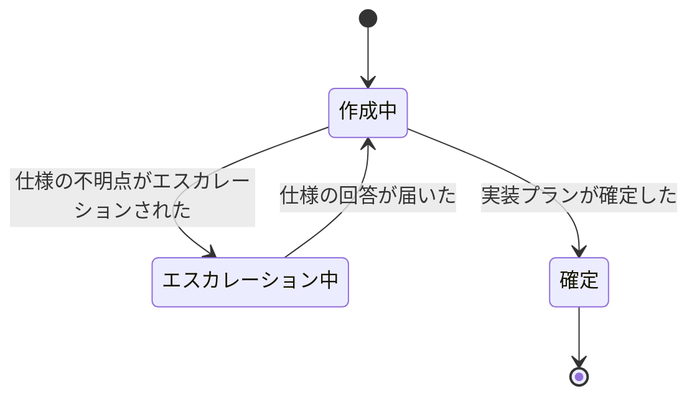
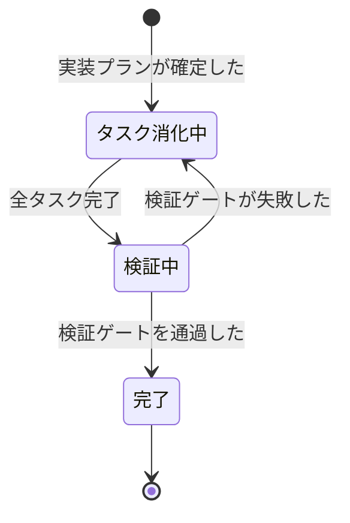
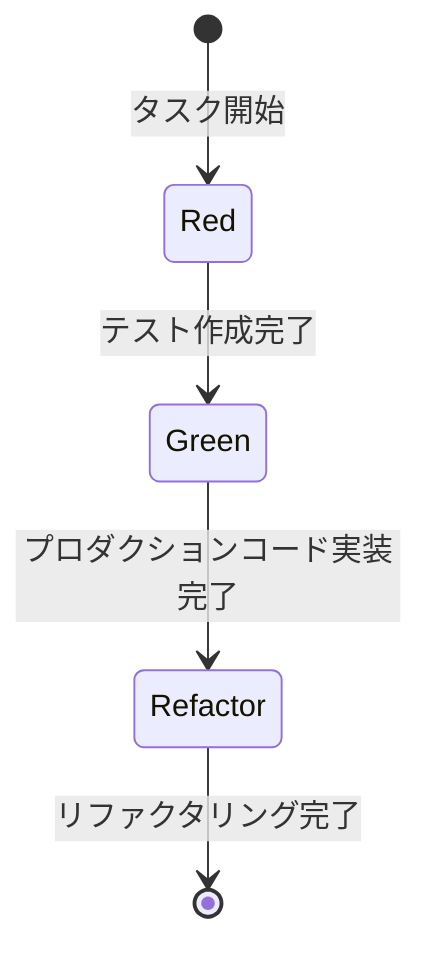
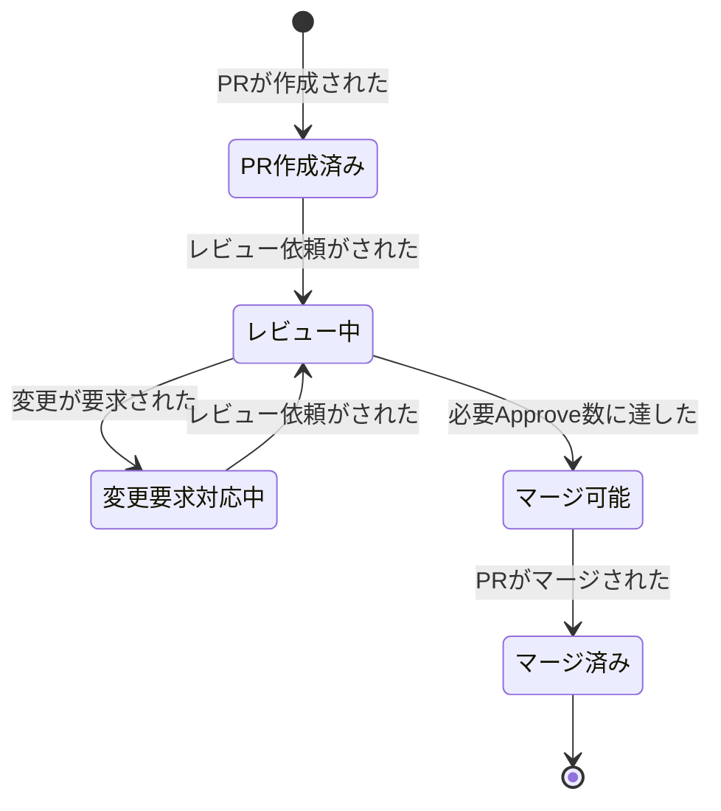

# 開発コンテキスト イベントストーミング

Big Picture（`docs/big-picture.md`）の開発コンテキストをDesign Levelで深掘りしたもの。

## スコープ

- 対象: 実装プラン作成開始からPRマージまで
- 入力: チケット（種別問わず同一フロー。ユーザーストーリー/バグ/タスクはメインボード上で合流済み）
- 出力: PRマージ（検証コンテキスト・リリースコンテキストへ）

## ドメインイベント

| # | イベント名（過去形） | 説明 | 所属集約 |
|---|---|---|---|
| 1 | 実装プランが確定した | エスカレーション・技術相談を経てプラン承認 | 実装プラン |
| 2 | 仕様の不明点がエスカレーションされた | プラン作成中の質問を上流（企画）に返送 | 実装プラン |
| 3 | 仕様の回答が届いた | エスカレーションからの復帰条件 | 実装プラン |
| 4 | 横断的な技術方針が決定された | 実装プラン確定の前提となるアーキテクチャ・設計方針の決定 | 実装プラン |
| 5 | 検証ゲートを通過した | 型チェック＋Lint＋テスト全パスの複合検証 | 実装 |
| 6 | 検証ゲートが失敗した | 型エラー・Lint違反・テスト失敗のいずれか | 実装 |
| 7 | PRが作成された | PRをGitHub上に作成 | PRレビュー |
| 8 | レビュー依頼がされた | 検証ゲート通過後、レビュアーにレビューを依頼 | PRレビュー |
| 9 | 変更が要求された | レビュアーによるRequest Changes。ブロッキング要素を含む | PRレビュー |
| 10 | レビューが承認された | 個別レビュアーによる承認 | PRレビュー |
| 11 | 必要Approve数に達した | レビュイーが定めた承認基準を満たした | PRレビュー |
| 12 | PRがマージされた | レビュー通過後にマージ | PRレビュー |

## コマンド

| # | コマンド名 | トリガーするイベント | 備考 |
|---|---|---|---|
| 1 | 実装プランを作成する | 実装プランが確定した | |
| 2 | 仕様の不明点をエスカレーションする | 仕様の不明点がエスカレーションされた | |
| 3 | 仕様の回答を返す | 仕様の回答が届いた | 外部コマンド（企画コンテキスト） |
| 4 | 横断的な技術方針を決定する | 横断的な技術方針が決定された | |
| 5 | 検証ゲートを実行する | 検証ゲートを通過した / 検証ゲートが失敗した | ローカル: 手動/git hook、CI: PR作成/更新時自動 |
| 6 | PRを作成する | PRが作成された | |
| 7 | レビュー依頼をする | レビュー依頼がされた | 前提条件: 検証ゲート通過 |
| 8 | 変更を要求する | 変更が要求された | |
| 9 | レビューを承認する | レビューが承認された | |
| 10 | PRをマージする | PRがマージされた | |

## アクター

| # | アクター名 | 種別 | 発行するコマンド |
|---|---|---|---|
| 1 | 開発者 | 人間 | 実装プランを作成する、仕様の不明点をエスカレーションする、検証ゲートを実行する、PRを作成する、レビュー依頼をする、PRをマージする |
| 2 | レビュアー | 人間 | 変更を要求する、レビューを承認する |
| 3 | 企画担当 | 人間（外部） | 仕様の回答を返す |
| 4 | テックリード / チーム | 人間 | 横断的な技術方針を決定する |
| 5 | CI | システム | 検証ゲートを実行する（PR作成/更新時） |

## 集約

> 状態遷移図の遷移ラベルには、ドメインイベント（イベント一覧に定義されたもの）とガード条件（状態遷移の前提条件）の両方を含む。

### 実装プラン

**責務**: 技術設計・タスク分解の管理

**含むコマンド**: 実装プランを作成する、仕様の不明点をエスカレーションする、横断的な技術方針を決定する

**含むイベント**: 実装プランが確定した、仕様の不明点がエスカレーションされた、仕様の回答が届いた、横断的な技術方針が決定された

**内部構造**: タスク（サブエンティティ）× N。タスクの定義・順序・依存関係を管理する

#### 状態遷移

| 状態 | 定義 | 遷移元 | 遷移先 |
|---|---|---|---|
| 作成中 | 技術設計・タスク分解を検討中 | 初期状態, エスカレーション中 | エスカレーション中, 確定 |
| エスカレーション中 | 仕様不明点を上流に問い合わせ、回答待ち | 作成中 | 作成中 |
| 確定 | 開発者が実装に入れると判断した状態 | 作成中 | 終了 |

- 「横断的な技術方針が決定された」は作成中の内部イベント（状態遷移なし）
- 確定の判断主体は常に開発者。作成主体（人間/エージェント）によらない
- 変更要求を受けた場合は常に新しいインスタンスを作成する（P2ポリシー）

### 実装

**責務**: TDDサイクルによるコード変更の管理

**含むコマンド**: 検証ゲートを実行する

**含むイベント**: 検証ゲートを通過した、検証ゲートが失敗した

#### 状態遷移

| 状態 | 定義 | 遷移元 | 遷移先 |
|---|---|---|---|
| タスク消化中 | TDDサイクル（Red→Green→Refactor）をタスク単位で繰り返している | 初期状態, 検証中 | 検証中 |
| 検証中 | 全タスク完了後、検証ゲート（型＋Lint＋テスト）を実行中 | タスク消化中 | 完了, タスク消化中 |
| 完了 | 検証通過。レビュー依頼に進める | 検証中 | 終了 |

#### タスクの内部遷移（集約レベルのドメインイベントではない）

タスクは実装集約のサブエンティティであり、TDDのRed-Green-Refactorサイクルに従って内部遷移する。これらはタスク消化中状態の内部工程であり、集約の状態遷移を引き起こさない。

| フェーズ | 定義 |
|---|---|
| Red | テストコードを先行作成する（設計行為） |
| Green | テストを通すためのプロダクションコードを実装する |
| Refactor | テストが通る状態を維持しつつコードを改善する |

### PRレビュー

**責務**: レビュー・マージのゲート管理

**含むコマンド**: PRを作成する、レビュー依頼をする、変更を要求する、レビューを承認する、PRをマージする

**含むイベント**: PRが作成された、レビュー依頼がされた、変更が要求された、レビューが承認された、必要Approve数に達した、PRがマージされた

#### 状態遷移

| 状態 | 定義 | 遷移元 | 遷移先 |
|---|---|---|---|
| PR作成済み | PRが作成され、検証ゲート通過後のレビュー依頼を待っている | 初期状態 | レビュー中 |
| レビュー中 | レビュアーが確認中。個別の承認（レビューが承認された）はこの状態内で蓄積 | PR作成済み, 変更要求対応中 | 変更要求対応中, マージ可能 |
| 変更要求対応中 | 変更要求を受けて新しい実装プラン→実装サイクルを実行中（P2ポリシー） | レビュー中 | レビュー中 |
| マージ可能 | 必要Approve数に到達。開発者がマージを実行できる | レビュー中 | マージ済み |
| マージ済み | マージ完了。検証コンテキスト・リリースコンテキストへ引き渡し | マージ可能 | 終了 |

- 「必要Approve数に達した」は派生イベント。個別の「レビューが承認された」が蓄積し、レビュイーが定めた承認基準を満たした時点で発生する（コマンドやポリシーによるトリガーではない）

## ポリシー

| # | ポリシー名 | トリガーイベント | 実行するコマンド |
|---|---|---|---|
| P1 | プラン再開 | 仕様の回答が届いた | 実装プランを作成する |
| P2 | 変更要求対応 | 変更が要求された | 実装プランを作成する（新規インスタンス） |

## ホットスポット

| # | ホットスポット | 関連する集約/イベント | 解消アクション |
|---|---|---|---|
| H1 | 「承認済み」ステータスがPR承認とQA確認待ちの二重責務を持っている | PRレビュー / メインボードの状態定義 | 開発/検証境界でのステータス分離を検討 |
| H2 | チケットステータスとの連携が未整備。開発イベントがチケットステータス遷移をトリガーするが連携方法が手動/暗黙的。上流チケット（インシデント/サポート）との情報連携も弱い | 全集約 / コンテキスト間連携 | イベント発行による連携方式を設計 |
| H3 | Pull型起票（開発者が自発的にインシデント/サポートからチケットを作る）のため対応漏れリスクがある | 運用コンテキスト側の課題 | スコープ外。運用コンテキストDLで検討 |
| H4 | ADR（Architecture Decision Records）のライフサイクル管理が未定義。横断的技術方針の蓄積・参照・廃止の仕組みがない | 実装プラン / 組織横断 | ADRの導入・運用ルールを定義 |
| H5 | 検証ゲートのローカル実行とCI実行の使い分けポリシーが未定義（git hook導入判断含む） | 実装 | 検証ゲート実行ポリシーを策定 |
| H6 | 必要Approve数の決定基準が暗黙的（レビュイーの個人判断） | PRレビュー | Approve数の決定ガイドラインを策定 |
| H7 | 実装プランのNo-op判定基準が未定義（差し戻し時、どこまでが「軽微」か） | 実装プラン | **解消済み**: 変更要求を受けた場合は常に新しい実装プランを作成する（P2ポリシー）。プランの粒度は開発者判断 |
| H8 | 差し戻し時の同一インスタンス巻き戻し vs 新規インスタンス作成の判断が未定義 | 全集約 | **解消済み**: 変更要求時は常に新規インスタンスを作成する（実装プラン・実装とも） |

### チケットステータス連携（H2補足）

開発コンテキストのイベントとチケットステータス遷移の対応:

| チケットステータス遷移 | トリガーとなる開発イベント | 連携方向 |
|---|---|---|
| 新規→進行中 | 実装プランが確定した | 開発→チケット管理 |
| 進行中→待ち | 仕様の不明点がエスカレーションされた | 開発→チケット管理 |
| 待ち→進行中 | 仕様の回答が届いた | チケット管理→開発 |
| 進行中→レビュー中 | レビュー依頼がされた | 開発→チケット管理 |
| レビュー中→承認済み | 必要Approve数に達した | 開発→チケット管理 |
| 承認済み→完了 | PRがマージされた（＋QA通過） | 開発→チケット管理 |

## 設計判断

本ドキュメント作成時に下した設計判断の記録。

- **テスト/型チェック/Linterのモデリング**: TDDのRed-Green-Refactorサイクル（テスト作成・実装・リファクタリング）はタスクの内部遷移として扱い、集約レベルのドメインイベントからは降格した。検証ゲート（品質ゲート）は集約の状態遷移を起こすイベントとして維持。検証ゲート内部の構成（型チェック・Lint・テスト）は個別イベントに分けない（失敗時のアクションが同質のため）
- **タスク内部遷移の明示化**: TDDのRed-Green-Refactorの3フェーズをタスクの内部遷移として定義した。旧「テストが作成された」「実装された」は集約の状態遷移を起こさず、同一タスク消化中状態の内部工程であるため、ドメインイベントとしては過剰だった
- **検証失敗時のポリシー廃止**: 検証ゲート失敗→タスク消化中への遷移は実装集約の状態遷移図で直接表現されており、独立したポリシーとして定義する必要がない。状態遷移図が権威ある定義
- **チケット種別による分岐（BPホットスポット #11, #14）**: 開発コンテキスト内では不要。全種別が同一メインボード・同一ステータス遷移を通る。バグ固有の原因調査やタスク固有の影響調査は「進行中」の内部工程であり、フロー分岐ではない
- **セルフ動作確認の統合**: ローカル実行とCI実行はチェック内容・失敗時アクションが同一。「検証ゲート」として統合し、実行コンテキストの違いはモデルでは区別しない
- **レビューイベントの構造**: レビュー提出は判定（Approve / Request Changes / Comment）と指摘（コメント群）で構成される。ドメインイベントは判定軸で分割し、「変更が要求された」（Request Changes）と「レビューが承認された」（Approve）の2つ。Comment判定は状態遷移を起こさないためイベント化しない。QA起因の再作業はPRマージ後に発生するため開発コンテキスト外
- **変更要求時のプラン再作成**: 変更要求を受けた場合は常に新しい実装プランを作成する。プランの粒度（No-opに近い軽微なものから大幅な見直しまで）は開発者が判断する
- **PR作成とレビュー依頼の分離**: PRの作成（GitHub上のPRオブジェクト作成）とレビュー依頼（レビュアーへの依頼）を別イベントとして扱う。レビュー依頼の前提条件として検証ゲート通過を要求する
- **実装プラン確定の判断主体**: 作成主体（人間/コーディングエージェント）によらず、開発者が「実装に入れる」と判断した時点で確定。外部の承認は不要
- **集約の不採用判断**: コミット（内部工程）、ADR（スコープ外）、チケット（外部責務）は独立集約としない
- **ブランチ作成の不採用**: ブランチ作成は開発環境のセットアップであり、ドメインの関心事ではない。状態遷移を起こさず、ポリシーのトリガーにもならないため、イベント・コマンドとしてモデリングしない
- **既存 `delivery-workflow/event-storming.md` からの取捨選択**: Discovery全般（企画スコープ）、AI固有イベント、セルフレビュー、成果物ライフサイクルは取り込まない。検証ゲートの定義、実装中のPlan不備発覚パターンは差し戻し対応の設計に反映

## 用語集（ユビキタス言語）

| 用語 | 定義 | 備考 |
|---|---|---|
| 実装プラン | チケットに対する技術設計＋タスク分解の文書 | |
| タスク | 実装プランのサブエンティティ。TDDサイクル1回分に対応する実装の最小単位 | |
| TDDサイクル | Red（テスト先行作成）→Green（プロダクションコード実装）→Refactor（コード改善）の開発サイクル | テスト作成は設計行為として扱う。タスクの内部遷移として定義 |
| リファクタリング | テストが通る状態を維持しつつ、コードの内部品質を改善する行為。TDDサイクルのRefactorフェーズに対応 | タスクの内部遷移。集約レベルのドメインイベントではない |
| 検証ゲート | 型チェック＋Lint＋テスト全パスの機械的な品質チェック。ローカル（手動/git hook）とCI（PR作成/更新時自動）の2つの実行コンテキストがある | TDDのテスト作成とは別の概念。レビュー依頼の前提条件 |
| エスカレーション | 仕様不明点を上流コンテキスト（企画）に問い合わせること。プラン作成を中断し回答を待つ | |
| 変更要求 | レビュアーがRequest Changesでブロッキング要素を含む修正を要求すること | 常に新しい実装プランの作成をトリガーする |
| 必要Approve数 | PRマージに必要なレビュアー承認の数。レビュイーが案件ごとに決定 | |
| レビュイー | PRの作成者。レビューを受ける側。必要Approve数の決定責任を持つ | |
| レビュアー | PRをレビューする人。チーム内レビューが必須 | |
| メインボード | スクラムチームのチケット管理ボード。全種別（ユーザーストーリー/バグ/タスク）が同一ボード上で管理される | |
| レビュー依頼 | 検証ゲート通過後、レビュアーにレビューを依頼する行為 | PR作成とは別のイベント |
