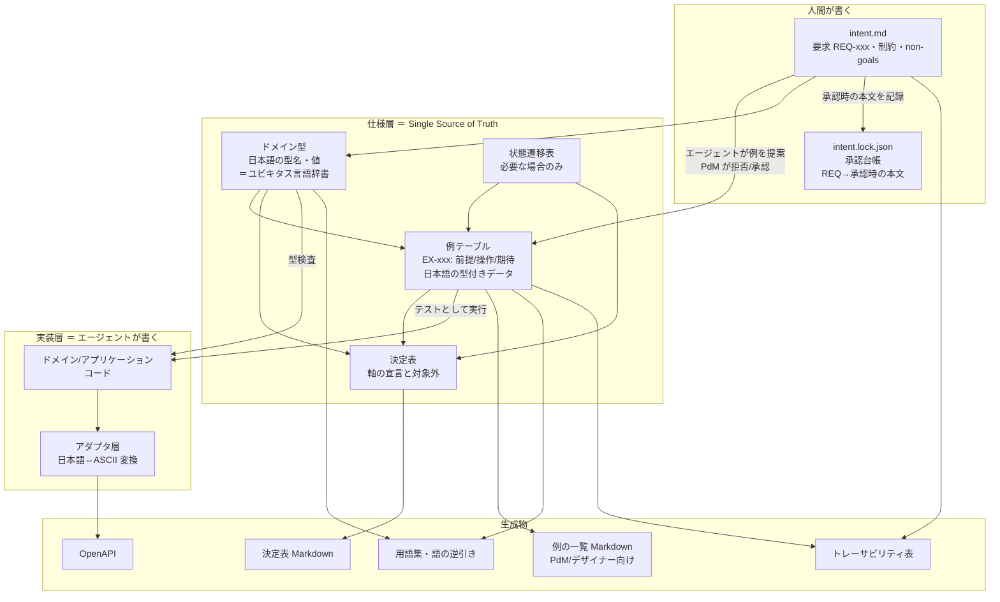
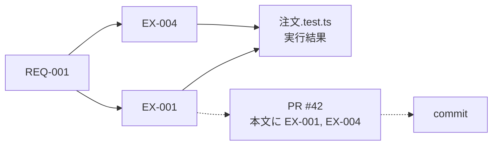
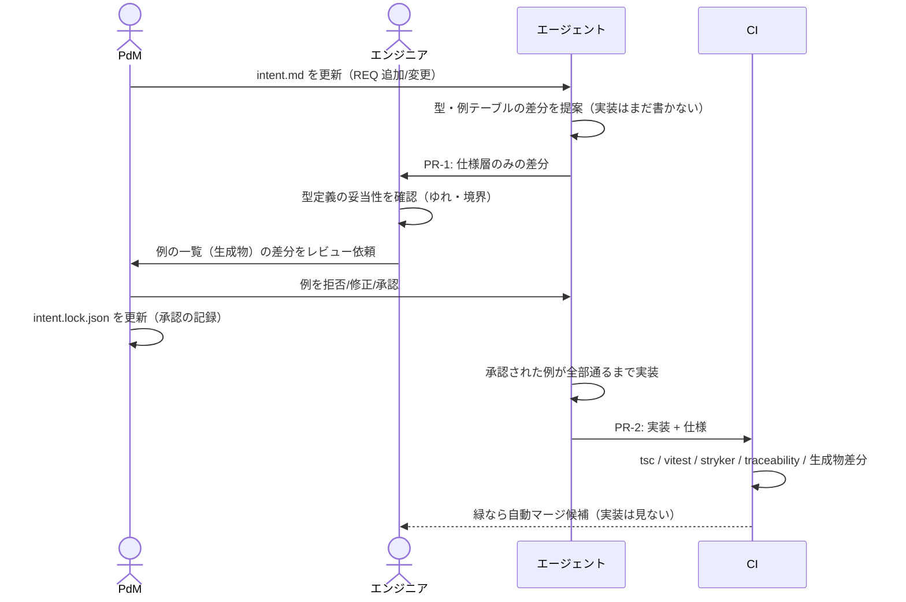

# Spec-as-Code 開発方式 設計書

コーディングエージェントを主戦力にし、人間が書く文書とレビュー工程を最小限に絞りながら、要求どおりのソフトウェアを継続的に作るための仕組み。業務用語と識別子を1対1にし、型そのものをユビキタス言語の辞書にする（識別子を日本語で書くのはその一実現。§14）。

- 版: 0.8（例1件の呼称を EX へ改め、統合例へ多重操作の `順次` を追加。版ごとの変更点は git 履歴が持つ）
- 対象スタック: TypeScript / Hono or NestJS / Vitest / GitHub Actions
- 想定読者: 導入・運用するエンジニア、要求を出す PdM、画面を設計するデザイナー
- 前提とするチーム構成: エンジニア1名、PdM・デザイナー複数名
- 関連: ADR-202609110017-01（開発方式の背骨を Spec-as-Code へ転換する決定。本方式を採る理由と本リポジトリ側の処遇はそちらが持つ）

---

## 1. 背景と課題

| 従来手法 | 問題 |
|---|---|
| 自然言語の要求定義書・画面仕様書・テスト仕様書 | 文書間の整合性を人手で保つコストが高い。自由度が高すぎて曖昧さが残る。人の目で全量チェックできない |
| 実装コードを仕様とみなす | 言語都合の制約と実装ノイズで、意図が読み取れない。英語の識別子と日本語の業務用語の対応を頭の中で保つ必要がある |
| 実装コードの行単位レビュー | エージェントが大量に生成するコードに人間のレビュー速度が追いつかない |

根本原因は「仕様の唯一の正（Single Source of Truth）が人間の目でしか検証できない形式で書かれている」こと。

## 2. 方針

1. **人間が自然言語で書くのは「意図・制約・境界」だけ**（1文書）。要求は観測可能な結果を1文で書き、手順・画面項目・データ形は書かない。
2. **振る舞いの仕様は「型」と「実行可能な例」で表現する**。整合性チェックはコンパイラと CI が行う。
3. **業務用語と識別子を1対1にし、人間が読む面を母国語にする**。辞書は型定義から導出し、用語集を別に保守しない。ドメインの型名・値・例を日本語で書くのはその一実現であって、方式の必須要件ではない（識別子の言語は §14）。
4. **例はエージェントに生成させ、人間（主に PdM）は拒否権だけ持つ**。人間がゼロから網羅的に書かない。
5. **人間のレビュー対象は仕様層のみ**。実装コードはレビューしない。代わりに機械的ゲート（型・テスト・ミューテーション）で担保する。
6. **手で保守する派生文書をゼロにする**。API 仕様・トレーサビリティ表・例の一覧はすべて生成物。
7. **トレーサビリティは ID で機械的に結ぶ**。要求→受け入れ例→テスト→変更履歴が自動で辿れ、欠落は CI で落とす。
8. **日本語はドメイン層まで。境界の外は ASCII**。DB・API・外部サービスとの変換はアダプタ層に閉じ込める。

## 3. 全体像



レビューと承認が発生するのは `intent.md` と仕様層の差分だけ。実装層は機械的ゲートを通れば人間は見ない。

## 4. リポジトリ構成

```
.
├── intent.md                      # 要求・制約・non-goals（人間が書く唯一の文書）
├── intent.lock.json               # 承認台帳。REQ→承認時の本文。生成物ではない（§6.11）
├── decisions/                     # ADR（仕様層で表現できない設計判断のみ）
├── src/
│   ├── domain/
│   │   └── 注文/
│   │       ├── 注文.型.ts          # ドメイン型（仕様）
│   │       ├── 注文.遷移.ts        # 状態遷移表（必要時のみ、仕様）
│   │       ├── 注文.例.ts          # 例テーブル（仕様）
│   │       ├── 注文.決定表.ts      # 決定表。軸の宣言と対象外宣言（仕様）
│   │       ├── 注文キャンセル.ts    # 実装（エージェント）
│   │       └── 注文.test.ts        # 例テーブルを回すだけの薄いテスト
│   ├── application/
│   │   └── 注文/
│   │       ├── 注文キャンセル.統合例.ts  # 統合例（実 DB・多重操作、仕様）
│   │       └── 注文キャンセル.ts        # ユースケース（トランザクション境界、エージェント）
│   └── adapter/
│       ├── db/order.repository.ts # 日本語ドメイン型 ⇔ DB 行（ASCII）
│       ├── db/order.例.ts         # 往復不変条件 INV-1xx
│       └── http/order.routes.ts   # 日本語ドメイン型 ⇔ JSON（ASCII）
├── spec-kit/                      # 仕組み側の共通基盤（初期投資）
│   ├── 例を定義.ts                 # 例テーブルの型（期待＝結果/事後/観測）とヘルパー
│   ├── 例を実行.ts                 # 例テーブル → Vitest 変換
│   ├── 不変条件を定義.ts           # 不変条件（INV）の型。対象・前件の枠を持つ
│   ├── render-examples.ts         # 例テーブル → Markdown（生成物）
│   ├── 決定表を定義.ts             # 決定表（軸は宣言）と空セル検出
│   ├── render-decision-table.ts   # 決定表 → Markdown（生成物）
│   ├── 辞書を出力.ts               # ドメイン型 → glossary.json・用語集・語の逆引き
│   ├── 統合例を定義.ts             # 実 DB の例（単一・順次・並行・順不同）
│   ├── manifest.ts                # 例テーブル → manifest.json
│   ├── traceability.ts            # manifest↔テスト結果↔PR の照合・表生成
│   └── check-intent.ts            # intent.md の構文検査と REQ 目録（intent.json）の出力
├── docs/generated/                # 生成物。手で編集しない
│   ├── manifest.json
│   ├── intent.json
│   ├── glossary.json
│   ├── 例一覧/注文.md
│   ├── 決定表/注文.md
│   ├── 用語集.md
│   ├── 語の逆引き.md
│   ├── トレーサビリティ.md
│   └── openapi.json
├── CLAUDE.md                      # エージェント向け規約
└── .claude/skills/                # spec-first 作業手順のスキル
```

ファイル名も日本語にしてよい。Git・Vitest・pnpm はいずれも UTF-8 ファイル名を扱える。Windows では `git config core.quotepath false` を推奨（表示上の問題のみ、動作には影響しない）。

`spec-kit/` と `docs/generated/` の中で日本語と ASCII が並ぶのは、どちらも読み手で割れているためである。`spec-kit/` は §14 が言語キットとして挙げるもの（例・不変条件・決定表・統合例の定義と実行、辞書の出力）を日本語とし、交換形式を介して働く検査器・生成器（manifest・intent 目録・トレーサビリティ・Markdown 生成）を ASCII とする。`docs/generated/` は人が読む Markdown を日本語、機械が読む交換形式（JSON）を ASCII とする。

## 5. 命名規約

| 対象 | 言語 | 理由 |
|---|---|---|
| ドメインの型名・フィールド名・リテラル値 | 日本語 | 業務用語と1対1。PdM が読める |
| 例テーブルのキー（前提・操作・期待・要求・表題） | 日本語 | 同上 |
| ID（REQ-/EX-/INV-/ADR-） | ASCII | grep・URL・PR 本文で扱うため |
| DB テーブル/カラム名、JSON キー、外部 API の列挙値 | ASCII | ツールチェーン互換。アダプタで変換 |
| インフラ・ライブラリ寄りのコード（ロガー、DI、HTTP） | 英語 | 業務用語ではない |
| spec-kit の公開 API（`例を定義` など） | 日本語 | 例テーブルと同じ画面に並ぶため |

この表は日本語識別子で運用する場合の規約である。識別子の言語そのものの選択は §14 が定める。

識別子の文字に関する制約:

- 使える: 漢字、ひらがな、カタカナ、長音「ー」、英数字、`_`
- 使えない: 「・」「：」「（）」「／」、全角スペース、全角英数字（`注文ＩＤ`）
- Unicode 正規化は NFC に固定し、lint で強制する。NFD（macOS のファイル名や貼り付けで混入する）は見た目が同じ別の識別子になり、原因不明のコンパイルエラーを生む。
- 表記ゆれ（「キャンセル済」「キャンセル済み」）は型が別物と判定する。ただし型検査が止めるのは**既存の語の誤用**であり、同じ意味の新語（「取消済み」型の新設）は止まらない。そのため `*.型.ts` を CODEOWNERS でエンジニア1名に固定し、ドメイン層で export が増える PR を CI が検出してエンジニアのレビュー必須にする。ゆれの発生源を1か所にし、機構で人間ゲートへ乗せる。

## 6. 成果物の定義と具体例

題材: EC の注文キャンセル。

### 6.1 intent.md（人間が書く）

書くのは **要求（REQ）**・**制約**・**やらないこと**・**判断基準** の4つ。振る舞いの手順や画面項目は書かない。

```markdown
# intent: 注文キャンセル

## 目的
ユーザーが出荷前の注文を自分で取り消せるようにし、CS への問い合わせを減らす。

## 要求
- REQ-001: ユーザーは出荷前の自分の注文をキャンセルできる。
- REQ-002: 出荷後の注文はユーザー自身ではキャンセルできない。
- REQ-003: キャンセルされた注文は、決済済みであれば全額返金される。
- REQ-004: 同じ注文を二度キャンセルしても、二度返金されない。

## 制約
- 返金は決済プロバイダの API 経由で行い、自前で残高管理しない。
- 返金 API の失敗時、注文状態は「キャンセル済み」にしない（整合性優先）。

## やらないこと（non-goals）
- 部分キャンセル（明細単位）は扱わない。
- 出荷後の返品フローはこの範囲外。

## 判断基準（曖昧なときの優先順位）
1. 二重返金を絶対に起こさない
2. ユーザー操作の即時性
```

`REQ-ID` は一度発番したら再利用しない。廃止時は `REQ-002 (deprecated: 理由)` と残す。他の REQ が引き継ぐ場合は `REQ-002 (deprecated: REQ-008 へ統合)` と書き、理由文に現れる `REQ-xxx` は実在を検証する（§7.3）。

REQ の状態は3つ。`(draft)` が意味するのは **PdM が要求として未確定**であること1つであり、例の整備状況とは無関係。`(draft)` を外す行為は PdM の確定宣言で、エージェントの進捗に依存しない。確定した時点で承認台帳（§6.11）にエントリが無いため CI は赤くなるが、これは故障ではなく「要求が確定したので例を用意する番」の表示である。

| 状態 | 表記 | 検査 |
|---|---|---|
| 提案中（未確定） | `REQ-005 (draft)` | 対象外 |
| 有効 | `REQ-005` | 承認台帳のエントリと EX / INV の紐づけが必須 |
| 廃止 | `REQ-005 (deprecated: 理由)` | 台帳にエントリを持たない。参照する EX / INV が残っていれば赤 |

節ごとの所有者を決める。「目的」「要求」「やらないこと」「判断基準」は PdM が書く。「制約」は技術的な内容を含むためエンジニアが書き、PdM が合意する。所有者以外が直すときは所有者の承認を取る。

### 6.2 ドメイン型（仕様 ＝ ユビキタス言語辞書）

「表現できない状態は起きない」を型で保証する。画面仕様書・データ仕様書・用語集の代替。

```ts
// src/domain/注文/注文.型.ts
import { z } from "zod";

// `値()` は zod スキーマをそのまま返しつつ呼び出し可能にする spec-kit のラッパ
// （`(v) => スキーマ.parse(v)` をスキーマに合成する）。例テーブルの中でブランド値を
// `注文ID("o1")` と書けるようにするためで、型の意味は変えない。
export const 注文ID = 値(z.string().brand<"注文ID">());
export type 注文ID = z.infer<typeof 注文ID>;

export const 金額 = 値(z.number().int().nonnegative().brand<"金額">());
export type 金額 = z.infer<typeof 金額>;

// 状態ごとに持てる情報が違うので判別共用体にする。
// 「出荷済みなのにキャンセル日時がある」といった状態は型レベルで作れない。
export const 注文状態 = z.discriminatedUnion("種別", [
  z.object({ 種別: z.literal("出荷前"), 支払額: 金額 }),
  z.object({ 種別: z.literal("出荷済み"), 支払額: 金額, 出荷日時: z.date() }),
  z.object({ 種別: z.literal("キャンセル済み"), 返金額: 金額, キャンセル日時: z.date() }),
]);
export type 注文状態 = z.infer<typeof 注文状態>;

export type 注文 = { ID: 注文ID; 所有者ID: string; 状態: 注文状態 };

export type キャンセル指示 = { 注文ID: 注文ID; 操作者ID: string };

export type キャンセル結果 =
  | { 成功: true; 注文: 注文; 返金額: 金額 }
  | { 成功: false; 理由: "本人ではない" | "出荷済み" | "キャンセル済み" | "返金失敗" };
```

この型定義を読めば、この機能に登場する語と取りうる値がすべて分かる。これが用語集を別に持たない理由。

**辞書は生成物として置く。** 「型が辞書になる」を PdM が読める形にするため、ドメイン層の型定義から辞書を生成し、交換形式 `docs/generated/glossary.json` と、そこから作る `用語集.md`・`語の逆引き.md` を置く。型定義を開かなければ語が引けない状態では、辞書が成果物として存在しないのと同じになる。

```json
{
  "terms": [
    { "id": "注文状態", "表示名": "注文状態", "種別": "型",
      "定義": "注文が取りうる状態。出荷とキャンセルの進行度を表す",
      "値": ["出荷前", "出荷済み", "キャンセル済み"],
      "所在": "src/domain/注文/注文.型.ts" },
    { "id": "キャンセル済み", "表示名": "キャンセル済み", "種別": "値",
      "定義": "返金が完了し、注文が取り消された状態",
      "所属": "注文状態", "所在": "src/domain/注文/注文.型.ts" }
  ]
}
```

- 対象は `src/domain/` 配下の型名・フィールド名・リテラル値。アダプタ層とインフラ寄りのコードは英語なので自然に外れる（§5）
- `id` と `表示名` を分けるのは、識別子の言語を契約から切り離すため（§14）。日本語識別子では両者が一致し、英語識別子では `表示名` に注釈から取った値が入る。読み手は常に `表示名` を使い、どちらの方式かを判別しない
- 検査器・生成器は `glossary.json` だけを読み、型定義を直接解析しない（manifest と同じ理由。§14）
- `語の逆引き.md` は語 → その語を使う EX / INV。定義文が動いたときの影響先をここから引く（§8）

**定義文は型名とリテラル値に必須**とし、フィールド名は任意とする。置き場は型定義の doc comment（`/** 返金が完了し、注文が取り消された状態 */`）で、辞書生成時に `定義` として抽出し、存在を lint で強制する。必須にするのは、§10 の規約「その REQ における意味が辞書の定義と一致するかを確認する」が、照合先の定義が無ければ成立しないため。書くのはエージェントなので人間の負担は増えない。識別子名と同一・または識別子名の部分文字列の定義文（`/** 注文状態 */`）は同語反復として lint で落とす。機械の射程はここまでで、定義文の正しさと陳腐化は担保できない（§12）。

**intent.md へ語彙の網羅的な lint は掛けない。** 方針1（人間が書くのは意図・制約・境界だけ）が壊れ、要求の入口が重くなる。代わりに辞書と REQ 本文の突き合わせを機械が行い、結果を判定根拠ごとに4種へ分ける。赤にするのは、規則で正解が決まる1種だけ。

| 出力 | 判定方法 | 扱い |
|---|---|---|
| 表記ゆれ（規則一致） | 正規化規則（NFC・長音・全角半角・送り仮名）でのみ辞書の語と異なる。「キャンセル済」vs「キャンセル済み」、「取消」vs「取り消し」 | **赤**（§7.3） |
| 表記ゆれ候補（距離） | 上の規則で説明できない近さ（編集距離）。「支払額」vs「支払上限額」 | 提示 |
| 辞書に無い業務語 | 自然言語からの名詞抽出は機械では精度が出ない。エージェントが読んで判断する | `intent-questions` へ回す。質問であって検査ではない |
| 本文と仕様の語の差 | REQ 本文に現れる辞書語の集合と、その REQ に紐づく EX が使っている語（manifest の `語`。§14）の集合を比較する | 提示 |

**表記ゆれを2行に割るのは判定根拠が違うため。** 規則一致の側は機械が正解を持っている（規則から導出される同一語であり、辞書に両方が別語として載っていれば候補から外せる）。是正は本文の表記を辞書へ合わせるだけで判断を要さないので、提示に置くと読み飛ばされて腐る。赤にする。距離の側は閾値次第で偽陽性が出る——日本語は分かち書きしないため切り出しの段でも誤りが混じり、「支払額」と「支払上限額」のような別概念が近距離に並ぶ。閾値の当否は実 intent に当てるまで測れないので、未測定の精度に依存した赤を置かず提示に留め、偽陽性率をパイロットで測って見直す（§11）。硬い lint を intent.md へ掛けないという上の方針は、この距離の側で守る。

4つ目は差の向きで疑いの種類が変わる。**本文にあるが仕様に無い語**は要求が言及した概念を例が扱っていない疑い、**仕様にあるが本文に無い語**は例が要求に無い概念を持ち込んだ疑い（スコープ逸脱）である。いずれも偽陽性が出る（本文は自然言語なので、語を使わずに概念へ言及できる）ため失敗条件には置かず、提示に留める。この突き合わせが作る「REQ 本文 → 辞書語」の写像は、要求が動いたときの影響候補の絞り込み（§8）がそのまま使う。

型が増えない誤り——既存の語を、辞書の定義と違う意味で使う——は機械では検知できない。型検査が止めるのはコード内での誤用であって、intent.md における語の意味のずれではない。ここは §10 の規約でエージェントの判断へ落とす。

### 6.3 例テーブル（仕様の本体）

前提／操作／期待を **型付きデータ**で書く。各例は `EX-ID` を持ち、どの `REQ` を満たすかを宣言する。エージェントが `intent.md` から生成し、PdM が承認する。

```ts
// src/domain/注文/注文.例.ts
import { 例を定義 } from "../../../spec-kit/例を定義";
import type { キャンセル指示, キャンセル結果, 注文 } from "./注文.型";

type 世界 = { 注文一覧: 注文[]; 返金API: "正常" | "失敗" };

export const 注文キャンセルの例 = 例を定義<世界, キャンセル指示, キャンセル結果>({
  "EX-001": {
    要求: ["REQ-001", "REQ-003"],
    表題: "出荷前・決済済みの注文を本人がキャンセルすると全額返金される",
    前提: { 注文一覧: [注文("o1", "u1", { 種別: "出荷前", 支払額: 金額(3000) })], 返金API: "正常" },
    操作: { 注文ID: 注文ID("o1"), 操作者ID: "u1" },
    期待: {
      結果: { 成功: true, 返金額: 金額(3000) },
      事後: { 注文一覧: [{ ID: 注文ID("o1"), 状態: { 種別: "キャンセル済み", 返金額: 金額(3000) } }] },
    },
  },
  "EX-002": {
    要求: ["REQ-002"],
    表題: "出荷後の注文はキャンセルできない",
    前提: { 注文一覧: [注文("o1", "u1", { 種別: "出荷済み", 支払額: 金額(3000), 出荷日時: 日時("2026-09-01") })], 返金API: "正常" },
    操作: { 注文ID: 注文ID("o1"), 操作者ID: "u1" },
    期待: { 結果: { 成功: false, 理由: "出荷済み" } },
  },
  "EX-003": {
    要求: ["REQ-004"],
    表題: "キャンセル済み注文を再度キャンセルしても返金されない",
    前提: { 注文一覧: [注文("o1", "u1", { 種別: "キャンセル済み", 返金額: 金額(3000), キャンセル日時: 日時("2026-09-02") })], 返金API: "正常" },
    操作: { 注文ID: 注文ID("o1"), 操作者ID: "u1" },
    期待: { 結果: { 成功: false, 理由: "キャンセル済み" } },
  },
  "EX-004": {
    要求: ["REQ-001"],
    表題: "他人の注文はキャンセルできない",
    前提: { 注文一覧: [注文("o1", "u1", { 種別: "出荷前", 支払額: 金額(3000) })], 返金API: "正常" },
    操作: { 注文ID: 注文ID("o1"), 操作者ID: "u2" },
    期待: { 結果: { 成功: false, 理由: "本人ではない" } },
  },
  "EX-005": {
    要求: ["REQ-003"],
    表題: "返金 API が失敗したら注文はキャンセル済みにならない",
    前提: { 注文一覧: [注文("o1", "u1", { 種別: "出荷前", 支払額: 金額(3000) })], 返金API: "失敗" },
    操作: { 注文ID: 注文ID("o1"), 操作者ID: "u1" },
    期待: {
      結果: { 成功: false, 理由: "返金失敗" },
      事後: { 注文一覧: [{ ID: 注文ID("o1"), 状態: { 種別: "出荷前" } }] },
    },
  },
});
```

`期待` の型は spec-kit の中核であり、次のとおり厳密に定める。

```ts
// spec-kit/例を定義.ts（抜粋）

// 不可分値（プリミティブ・ブランド型・Date）は分解せず素通しする。
// ブランド型は `string & BRAND<…>` というプリミティブと object の交差型であり、
// object 分岐を先に置くとブランド記号キーが optional 化して名義性が落ちる。
// Date も同様にメソッドが optional 化し、日付の期待値に任意のオブジェクトが通る。
type 部分<T> =
    T extends string | number | boolean | bigint | symbol | null | undefined ? T
  : T extends Date ? T
  : T extends readonly (infer U)[] ? readonly 部分<U>[]
  : T extends object ? { [K in keyof T]?: 部分<T[K]> }
  : T;

// 照合子。順序を規定できない結果（並行実行、§6.9）は `順不同` で包む。
// 記号キーで名義化する。素の配列と同型にすると、順序を規定する側（§6.9 の順次）と型で区別できない。
declare const 順不同記号: unique symbol;
type 順不同<T> = { readonly [順不同記号]: readonly T[] };
type 照合<T> = 部分<T> | 順不同<部分<T>>;

// 結果か事後の少なくとも一方を必須にする。第1引数は照合済みの結果の形であり、
// §6.9 が操作の形ごとに差し替える（単一は `照合<結果>`、順次は配列、並行は `順不同`）。
// `観測` は戻り値でも世界でもない観測値（返金の実行回数など）の枠で、既定は空。項名はドメイン語（§6.9）。
type 期待<結果照合, 世界, 観測 = Record<never, never>> =
  | { 結果: 結果照合; 事後?: 部分<世界>; 観測?: 部分<観測> }
  | { 結果?: 結果照合; 事後: 部分<世界>; 観測?: 部分<観測> };

// 例1件の形。`前提` と `操作` は部分一致にしない（初期状態と入力を省略すると実行できない）。
type 例<世界, 操作, 結果, 観測 = Record<never, never>> = {
  要求: string[];
  表題: string;
  前提: 世界;
  操作: 操作;
  期待: 期待<照合<結果>, 世界, 観測>;
};
```

- `結果` は操作の戻り値、`事後` は操作後の `世界` の状態、`観測` はそのどちらでもない副作用の観測値。0.2 では結果と事後が混在しており、`注文状態` のような結果型に無いフィールドを書いていたため型が通らなかった。分けたことで実行関数は `{ 結果, 事後, 観測 }` を返す契約になる（§6.7）。
- `期待` は**部分一致**で書く（全フィールドを書かせると実装ノイズが混入する）。配列は位置ごとに部分一致する。`前提` と `操作` は全項必須。
- `部分<T>` はリテラル共用体を保つので、PdM が `種別: "出荷まえ"` と書けばコンパイルエラーになる。これが用語のゆれを止める仕組み。緩い型（`Record<string, unknown>` など）で `期待` を受けると、この保証が丸ごと消える。
- ブランド型の値は**ビルダーで書く**（`注文ID("o1")`、`金額(3000)`）。素通しの分岐により生のリテラルは代入できない。記述は少し増えるが、`注文ID` と `操作者ID` の取り違えを型で止めるにはブランドを剥がせない。ビルダーは §6.2 の `値()` がスキーマに合成する。
- `注文()`, `日時()` は同ファイル内の小さなビルダー。

**不変条件（INV）は計算の内包を担う。** 例は有限の点であり、点と点の間は固定されない。実装が例に合わせて素朴であるほど変異点が少なく、ミューテーションも点の外を押さえない（§12）。INV は「例で列挙しきれないものの受け皿」ではなく、計算そのものを書き下す場所である。`fast-check` によるプロパティテストを `INV-xxx` として例テーブルと同じファイルに置く。

```ts
export const 注文キャンセルの不変条件 = 不変条件を定義({
  "INV-001": {
    要求: ["REQ-004"],
    表題: "任意の注文にキャンセルを何度実行しても返金総額は最初の支払額を超えない",
    対象: "注文キャンセル（返金額の算出）",
    前件: "注文一覧の各注文が同一の所有者を持ち、返金API は正常",
    arbitrary: 型から導出する(世界),   // zod スキーマから arbitrary を導出する
    // 検証述語（省略）
  },
});
```

- **完全な式を書いてよい。ただし実装から導出しない。** 返金額の算出のような計算は REQ から独立に書き下し、実装の関数を import して回さない。導出すると実装の写しになり何も固定しない。§6.8 の `対応を固定する`（期待値を実装の変換表から導出しない）と同じ規律であり、理由も同じ——例が届かず、ミューテーションが実装の持たない分岐を変異できない領域では、独立に書いた二重記帳が唯一の網になる。
- **二重記帳が検知する範囲。** 仕様側の式と実装は同じ REQ から生成される以上、独立ではない。検知するのは「REQ を正しく読んだが実装でミスした」場合であって、REQ の読み違えは検知しない（§12）。
- **arbitrary はドメイン型から導出する**（zod スキーマからの導出。`zod-fast-check` の `inputOf()` / `outputOf()` が判別共用体・ブランド型を扱う）。値域の正を型へ一本化し、型の変更が自動で伝播する形にするため。値域の絞り込みが要るということは型が緩いということであり、「上限はそれでよいのか」への答えは型を直すことになる。逆向きに、arbitrary 側へ値域を宣言する案は採らない。`Arbitrary` から値域を静的に取り出す公開 API が無く、宣言と実際の arbitrary の一致を機械が照合できないため、保証の射程という重い情報で陳腐化が起きる。
- **`前件` には型で表せない前提だけを書く**（「全経費が同一会計月」のような集約の不変条件）。保証の射程は型の全域を前件で絞った範囲までであり、範囲そのものの妥当性は PdM の判断対象になる（§8）。`対象` はどの計算を固定しているかを示す。

### 6.4 例の一覧（生成物、PdM・デザイナー向け）

TS の例テーブルから Markdown を生成し、`docs/generated/例一覧/注文.md` に置く。**読むためのもので、編集しない**。PdM のレビューは GitHub 上でこの生成物の差分を見る形でもよい。

射影規則を決めておく。決めないと、例を区別している項（`返金API: 正常 / 失敗` など）が生成物から黙って落ちても誰も気づかない。

- `前提`・`操作`・`期待` は**全項を描く**。値の省略・要約はしない。
- オブジェクトは `キー: 値` を型の宣言順に ` / ` で連結する。配列は `[…]` で囲み要素を ` / ` で区切る。
- 判別共用体は判別子を先頭に置き、残りのフィールドを宣言順に `, ` で続ける。判別子が `種別` のときはキー名を描かず値だけを置く（`状態: 出荷前, 支払額: 3000`）。それ以外の判別子は `キー: 値` の形で描く（`結果: 成功: true, 返金額: 3000`）。共用体の内側だけ区切りを変えるのは、`/` で統一すると入れ子の境界が消えて `状態` がどこで終わるか読めなくなるため。
- `Date` は UTC の `YYYY-MM-DD HH:mm:ss`。TZ の固定は**生成コマンド自身が行う**（`"generate": "TZ=UTC tsx …"`）。CI のジョブ環境だけで指定すると、ローカル（JST）で生成してコミットした表が CI の再生成結果と食い違い、生成物差分の条件（§7.3）が落ちる。

**行の折り方は EX 1件＝1ブロック。** 1行＝1 EX の表は差分に弱い。実ドメインの規模では `前提` 1件が 500〜1000字になり、GitHub の diff が行全体を赤緑で出すため**どの項が変わったかが読めない**。それでは §8 の承認ゲート（PdM が例の差分を見る）が成立しない。射影規則の本体は上のまま保ち、折り方だけを変える。

- EX 1件を見出し（`### EX-001`）と入れ子リストにする
- `要求`・`表題`・`セル` は1行
- `前提`・`期待` は項を見出し行にし、**その直下のオブジェクトのキーと配列の要素を1行ずつ**置く。入れ子はリストのインデントで表し、それより内側は上の連結規則（`[…]` と ` / `）で1行に描く。`操作` のように1行へ収まる項は連結したままでよい
- `期待` の `結果`・`事後`・`観測` は別の行へ割る

ファイルの先頭に `ID / 要求 / 表題` の3列の索引表を置く。俯瞰と、決定表・traceability からのリンク先を索引が担い、本体のブロックが詳細を担う。

```markdown
## 注文キャンセル

| ID | 要求 | 表題 |
|---|---|---|
| [EX-001](#ex-001) | REQ-001, REQ-003 | 出荷前・決済済みの注文を本人がキャンセルすると全額返金される |
| [EX-002](#ex-002) | REQ-002 | 出荷後の注文はキャンセルできない |

### EX-001

- 要求: REQ-001, REQ-003
- 表題: 出荷前・決済済みの注文を本人がキャンセルすると全額返金される
- セル: 出荷前 × キャンセル × 本人
- 前提:
  - 注文一覧:
    - ID: o1 / 所有者ID: u1 / 状態: 出荷前, 支払額: 3000
  - 返金API: 正常
- 操作: 注文ID: o1 / 操作者ID: u1
- 期待:
  - 結果: 成功: true, 返金額: 3000
  - 事後:
    - 注文一覧:
      - ID: o1 / 状態: キャンセル済み, 返金額: 3000
```

1件が 20〜30行になり、1機能あたり 60 EX で 1500〜1800行に達するが、差分は変わった行だけに出る。この一覧は通読物ではなく引くもので、俯瞰は索引表と決定表（§6.10）が担う（§7.3）。

**INV は別の項で描く。** 上の射影規則（`前提`／`操作`／`期待` の全項描画）は INV に当たらない。同じファイルへ INV 用の項で1ブロックを置き、**述語と arbitrary は描かない**。PdM が読めない内容が差分へ毎回混じり、仕様の正が TS と生成物の2か所になるため。

```markdown
### INV-001

- 要求: REQ-004
- 表題: 任意の注文にキャンセルを何度実行しても返金総額は最初の支払額を超えない
- 対象: 注文キャンセル（返金額の算出）
- 前件: 注文一覧の各注文が同一の所有者を持ち、返金API は正常
```

### 6.5 状態遷移表（必要な場合のみ）

状態遷移が主題のドメインでは、遷移表をデータとして1か所に置き、テストと実装の両方が参照する。これ以上の独自 DSL は作らない。

```ts
// src/domain/注文/注文.遷移.ts
export const 注文の遷移 = {
  出荷前:       { キャンセル: "キャンセル済み", 出荷: "出荷済み" },
  出荷済み:     {},
  キャンセル済み: {},
} as const satisfies Record<注文状態["種別"], Partial<Record<string, 注文状態["種別"]>>>;
```

`satisfies` により、状態を追加したのに遷移表を更新し忘れると型エラーになる。

### 6.6 画面状態の一覧（デザイナー向け、任意）

UI の見た目は本方式の対象外だが、「どの状態でどの操作が可能か」は例テーブルと同じ形式で持てる。デザイナーはこれを見てプロトタイプを作り、見た目の判断はプロトタイプで行う。

```ts
export const 注文詳細画面の表示 = 画面状態を定義<注文状態["種別"]>({
  出荷前:       { 表示する操作: ["キャンセル"], 補足: "キャンセル可能である旨を表示" },
  出荷済み:     { 表示する操作: [], 補足: "出荷済みのためキャンセル不可、返品案内へのリンク" },
  キャンセル済み: { 表示する操作: [], 補足: "返金額と返金日時を表示" },
});
```

### 6.7 テスト（薄いアダプタ）

```ts
// src/domain/注文/注文.test.ts
import { 例を実行, 不変条件を実行 } from "../../../spec-kit/例を実行";
import { 注文キャンセルの例, 注文キャンセルの不変条件 } from "./注文.例";
import { 注文をキャンセルする } from "./注文キャンセル";
import { 世界を組み立てる } from "./注文.世界";

例を実行(注文キャンセルの例, (世界, 指示) => {
  const 環境 = 世界を組み立てる(世界);
  const 結果 = 注文をキャンセルする(環境)(指示);
  return { 結果, 事後: 環境.現在の世界(), 観測: 環境.観測() };
});
不変条件を実行(注文キャンセルの不変条件, /* ... */);
```

実行関数は `{ 結果, 事後, 観測 }` を返す。`例を実行` は `期待.結果` を `結果` と、`期待.事後` を `事後` と、`期待.観測` を `観測` と、それぞれ部分一致で照合する。ドメイン層の例は `観測` を持たないことが多く、その場合は空で返す。

この薄いテストを書き忘れると例テーブルが一度も実行されないため、manifest の EX / INV が JUnit に testcase を持ちかつ pass であることを CI の失敗条件に置く（§7.3）。`it.skip` や suite のロード失敗も同じ条件で落ちる。

### 6.8 実装とアダプタ（エージェントが書く）

`注文キャンセル.ts` はエージェントが書き、人間はレビューしない。制約は「型が通る・例が全部通る・ミューテーション閾値を超える」。

境界の変換はアダプタ層に閉じ込める。ここで日本語が漏れると OpenAPI 生成や ORM で問題になるため、`src/adapter/` 配下では日本語の JSON キー・カラム名を lint で禁止する。

```ts
// src/adapter/db/order.repository.ts（抜粋）
const 状態のDB表現: Record<注文状態["種別"], "placed" | "shipped" | "cancelled"> = {
  出荷前: "placed",
  出荷済み: "shipped",
  キャンセル済み: "cancelled",
};
```

`Record<注文状態["種別"], ...>` により、状態を追加すると変換表の未定義が型エラーになる。ただし網羅性検査が捕まえるのは**漏れ**であり、`出荷前: "shipped"` のような**誤変換**は捕まえない。

誤変換は往復プロパティテスト（§6.9 (b)）でも捕まらない。前向きの写像と逆写像が同じ表から導出される限り、対応が全単射でありさえすれば往復は恒等になり、`出荷前: "shipped"` / `出荷済み: "placed"` と入れ替えた実装でも緑になる。DB 値は SQL・他システム・分析から見える契約なので、対応を1件ずつ独立に固定する。

```ts
// src/adapter/db/order.例.ts（抜粋）
// 期待値を実装の 状態のDB表現 から導出しない（import して回さない）。
export const 状態のDB表現の対応 = 対応を固定する(状態のDB表現, {
  出荷前: "placed",
  出荷済み: "shipped",
  キャンセル済み: "cancelled",
});
```

アダプタ層はミューテーションの対象外（§9）なので、この対応表の固定が誤変換に対する唯一の網になる。往復不変条件が担うのは、表に無い値の混入と往復での情報欠落である。

### 6.9 ユースケース層と多重操作の例（統合例テーブル）

ドメインの例テーブルは単一スレッド・インメモリの `世界` で回る。一方、判断基準の第1位「二重返金を絶対に起こさない」が実際に破られるのは、同時リクエスト、返金 API 呼び出しと状態更新の原子性、冪等性キーの層であり、ドメインの例では表現できない。この層を「機械のみ」ゲートかつ例テーブルの射程外にしたままでは、最重要要求が誰にも検証されない。そのため次の3つを課す。

**(a) ユースケース層に統合例テーブルを持つ。** トランザクション境界を含む層（アプリケーションサービス）に対し、ドメインと同じ形式の例を、実 DB（testcontainers 等）と返金 API のスタブで回す。`前提` は DB の初期状態、`操作` は単一・`順次`・`並行` の3つを取る。

```ts
// src/application/注文/注文キャンセル.統合例.ts
type 観測 = { 返金実行回数: number };

export const 注文キャンセルの統合例 = 統合例を定義<DB初期状態, キャンセル指示, キャンセル結果, 観測>({
  "EX-101": {
    要求: ["REQ-004"],
    表題: "同じ注文への同時キャンセルは返金を1回しか実行しない",
    前提: { orders: [{ id: "o1", owner: "u1", status: "placed", paid: 3000 }] },
    操作: 並行([{ 注文ID: 注文ID("o1"), 操作者ID: "u1" }, { 注文ID: 注文ID("o1"), 操作者ID: "u1" }]),
    期待: {
      結果: 順不同([{ 成功: true }, { 成功: false, 理由: "キャンセル済み" }]),
      事後: { orders: [{ id: "o1", status: "cancelled" }] },
      観測: { 返金実行回数: 1 },
    },
  },
  "EX-102": {
    要求: ["REQ-004"],
    表題: "続けて2回キャンセルしても返金は1回しか実行されない",
    前提: { orders: [{ id: "o1", owner: "u1", status: "placed", paid: 3000 }] },
    操作: 順次([{ 注文ID: 注文ID("o1"), 操作者ID: "u1" }, { 注文ID: 注文ID("o1"), 操作者ID: "u1" }]),
    期待: {
      結果: [{ 成功: true, 返金額: 金額(3000) }, { 成功: false, 理由: "キャンセル済み" }],
      事後: { orders: [{ id: "o1", status: "cancelled" }] },
      観測: { 返金実行回数: 1 },
    },
  },
});
```

`操作` の形が `結果` の形を決める。操作の形ごとに枝を分け、枝が照合子を決める。

```ts
// spec-kit/統合例を定義.ts（抜粋）
type 順次<操作> = { 種別: "順次"; 操作列: readonly 操作[] };
type 並行<操作> = { 種別: "並行"; 操作列: readonly 操作[] };

type 共通<世界> = { 要求: string[]; 表題: string; 前提: 世界 };

type 統合例<世界, 操作, 結果, 観測 = Record<never, never>> =
  | (共通<世界> & { 操作: 操作;       期待: 期待<照合<結果>, 世界, 観測> })            // 単一。§6.3 と同じ
  | (共通<世界> & { 操作: 順次<操作>; 期待: 期待<readonly 部分<結果>[], 世界, 観測> })  // 各段を順序どおり
  | (共通<世界> & { 操作: 並行<操作>; 期待: 期待<順不同<部分<結果>>, 世界, 観測> });    // 順序を規定しない
```

`順次` では各段の結果を順序どおり全件書く。特定の段の結果を問わないときは、その段を `{}` と書く（`期待` は部分一致なので空は常に通る）。`事後` と `観測` は連なり全体に対して1つ。枝の取り違え（順次の枝に `順不同` を書く、単一の枝に配列を書く）とリテラルのゆれは、いずれも `tsc --strict` で赤になることを最小再現で確認した。

**段数と結果の件数の一致は型では止まらない。** `操作列` が要素数を型に持たないため、2段の `順次` に3件の結果を書いても通る（同じ最小再現で確認）。要素数をタプルで持たせる案は、呼び出し側に `const` 型パラメータを要求し、`期待` の枝をタプル長へ写す条件型を要する。記述の負担と型の複雑さに対して得るものが件数の取り違え1件なので採らない。代わりに **`統合例を実行` が照合の前に件数を検証し、合わなければそのテストを落とす**。型が止めるのは形（単一か配列か `順不同` か）までで、件数は実行時に止める。

**`順次` の各段は別のリクエストとして回す。** 段ごとにトランザクション境界を跨ぎ、同一境界内で複数操作を連ねる形は表さない。逐次の再入（2回目のリクエストが1回目の確定後に届く）を見るための形であり、境界の内側の話は (c) の人間レビューが受け持つ。

**`順次` はドメインの例テーブルには置かない。** ドメイン層の `前提` はドメイン型で書くため、判別共用体が「キャンセル済み ⇒ 返金額とキャンセル日時を持つ」を強制する。中間状態を手で書いてもフィールドの共存の誤りは通らない。統合例の `前提` は DB 表現でありフラットなので、状態列と付随列の対応すら型が縛らない。`status: "cancelled"` かつ `refunded_amount` の無い行——本番では生じない行——を前提に置いた例が書け、実装が「`status='cancelled'` かつ `refunded_amount IS NULL` は返金未完了と見て再返金する」設計なら、その例は緑のまま実装の真の振る舞いを見ない。`順次` は中間の行を実装に書かせ、存在し得る行しか前提にならないようにする。同じ理由で、逐次の再入（続けて2回）と同時の競合（同時に2回）は対で置く。

ただし**型が縛るのはフィールドの共存までで、値の組み合わせの到達可能性は縛らない**。`注文状態` の `キャンセル済み` 枝は `支払額` を持たないため（§6.2）、ドメイン層でも「支払額と無関係な返金額を持つキャンセル済み注文」を `前提` に書ける。そこは INV（返金総額は支払額を超えない）が押さえる領域であって `順次` の射程ではない（§12）。

**`順次` は到達手順の宣言であってフロー記述ではない。** 書けるのは1本の直線で、分岐・選択・ループを持たない。条件が分かれるなら別の EX になる（§13）。`並行` の各枝を `順次` にする入れ子も扱わない。統合例は代表的な競合パターンの列挙であり（§12）、入れ子を許しても網羅は得られない一方、形式と駆動系が複雑になる。

**`観測` の項名は辞書に載るドメイン語で書く。** 実装手段の語（API・HTTP・キュー・テーブル名）を項名に使わない。`観測` は戻り値でも DB の状態でもない値の枠だが、PdM が承認する面に現れる以上、語彙はドメイン側に属する。返金プロバイダの呼び出しを「返金実行」として数えるのはスタブ側の責務であり、仕様の語ではない。`事後` に書くと「`前提` は DB の初期状態」という定義が破れる。

統合例は `EX-1xx` の番号帯を使い、トレーサビリティ上はドメインの EX と同じ扱い（REQ への紐づけ必須、テスト名は `EX-101: 表題`）。ただし**統合例は決定表のセルを埋めない**（§6.10）。統合例の `前提` と `事後` は DB 表現（ASCII）で書く。ここは境界の外側なので日本語のキー名を使わない。この規則は `src/adapter/` 配下と同じ lint で `**/*.統合例.ts` の `前提`・`事後` の直下キーにも掛ける（§9）。`操作` はドメインの型、`観測` は境界の外の表現ではないため、どちらも日本語のままでよい。

**(b) アダプタの変換は往復プロパティテストで検証する。** `ドメイン → DB 行 → ドメイン` と `ドメイン → JSON → ドメイン` が恒等であることを fast-check で `INV-1xx` として置く。往復が捕まえるのは表に無い値の混入と往復での情報欠落であり、ラベルの入れ替え（全単射のまま対応を取り違える誤り）は捕まえない。そちらは §6.8 の対応表の固定が担う。

**(c) トランザクション境界・ロック・冪等性キーに触れる差分は人間レビューに回す。** §8 の例外リストに含める。機械ゲートが (a)(b) で届く範囲を超えた部分の後ろ盾であり、常設ではなく差分が該当したときだけ発動する。

### 6.10 条件の決定表（例の過不足を機械で見せる）

例の一覧を眺めて「足りない例」を見つけるのは人間には難しい。不在は目に見えない。そこで軸を宣言し、例を行へ写し、空を CI で落とす。JIS X 0125:1986 の決定表と同じ構造であり、判定の入力次元を表の軸に取る。

軸は**決定表側で明示宣言する**。例テーブルに現れた値から軸を導出すると、例が1件も無い操作は列が生えず、値の組み合わせの不在しか見えない（「出荷の例が1件も無い」が検出できない）。

- **軸の値域の出どころは2種**。型・遷移表・判別関数から取る（状態・操作・区分）か、列挙で宣言する（`締切内 / 締切超過` のように計算が分岐する次元）か
- **列挙で宣言する軸は同値類で立ててよい**。振る舞いが同じ値をまとめ、EX は各類の代表値で書く。支払方法の3択のうち「返金が即時か日数を要するか」だけが分岐するなら、軸は `返金方式: 即時 / 日数を要する` の2値であって支払方法の3値ではない。生の値域を軸に取ると同じ振る舞いのセルが乗算で増え、EX を類の数ではなく値の数だけ書かされる。**型・遷移表から導出する軸（状態・操作）では同値類を宣言しない**——導出でなくなり、状態の追加が `satisfies` で赤くなる連動（§6.5）が外れる。類の分け方の誤り（同じ類の別の値が違う振る舞いをする）は機械では検知しない（§12）
- **決定表に渡すのはドメインの例テーブルと不変条件だけで、統合例（`EX-1xx`）はセルを埋めない**（§6.9）。`判定` はドメイン形の `前提`・`操作` を読むため、DB 表現の `前提` を持つ統合例は軸値へ写せない。多重操作ではさらに、中間状態が `前提` に無く `操作` も複数あるため、その EX が覆う判定を軸値で表せない（第1段から算出すると、単一操作での振る舞いが未検証のままセルが埋まって見える）
- **1 intent に複数持てる**。計算が分岐する入力次元は、その REQ 局所の決定表として宣言する。全 REQ 共通の軸へ局所の次元を足さない。乗算を REQ 内に留めるため
- **セルに置けるのは EX / INV / `対象外: 理由` の3値**。INV を置くことは「この分岐は点ではなく全称的に担保する」の宣言（§6.3）。そのため決定表の定義には例テーブルと不変条件の両方を渡し、同じ `判定` で軸値へ写す。manifest の INV エントリも `cell` を持つ（§14）
- 状態×操作×区分の決定表は「既定の軸で立てた決定表」であり、状態遷移が主題のドメインでは最初に立つ

```ts
// src/domain/注文/注文.決定表.ts
export const 注文キャンセルの決定表 = 決定表を定義({ 例: 注文キャンセルの例, 不変条件: 注文キャンセルの不変条件 }, {
  行: 注文状態,        // 判別共用体。`種別` のリテラルを軸にする
  列: 注文の遷移,      // 遷移表。値側のキー（操作）の和集合を軸にする
  区分: {
    名: "操作者",
    値: ["本人", "他人"] as const,
    判定: (例) =>
      例.前提.注文一覧.find((注) => 注.ID === 例.操作.注文ID)?.所有者ID === 例.操作.操作者ID
        ? "本人"
        : "他人",
  },
  対象外: {
    "*×出荷×*": "出荷は事業者側の操作であり、本 intent の対象は利用者の操作に限る",
    "出荷済み×キャンセル×他人": "本人でない時点で拒否されるため出荷状態は無関係",
    "キャンセル済み×キャンセル×他人": "同上",
  },
});
```

区分の判定は題材固有の規則（誰が所有者か）なので、決定表の定義側に置く。`*` は行・列・区分のいずれの位置にも書ける。操作1つを丸ごと範囲外と宣言するときに、セルを1件ずつ書かせない。

REQ 局所の決定表は軸を列挙で宣言する。

```ts
// src/domain/経費申請/経費申請.決定表.ts
export const 提出可否の決定表 = 決定表を定義({ 例: 経費申請の例 }, {
  要求: "REQ-010",
  軸: { 締切: ["締切内", "締切超過"], 経費件数: ["0件", "1件以上"], 会計月: ["同一", "混在"] },
  判定: (例) => ({ 締切: …, 経費件数: …, 会計月: … }),
  対象外: { "*×0件×混在": "経費0件では会計月の混在が起こらない" },
});
```

**決定表が扱うのは分岐の次元であって計算式ではない。** 「クーポン有／無」は軸になるが `返金額 = 支払額 − クーポン` は軸にならない。式の側は INV（§6.3）が担う。

**検査は全展開、描画は畳み込み。** `render-decision-table` が Markdown を生成し `docs/generated/決定表/注文.md` に置く。実ドメインの規模では全セルを描くと読めない（7状態 × 12操作 × 区分で 168〜336 セル、Markdown の列数 24〜48）。描画側だけを畳む。

- `*` を含む `対象外` 宣言は、セルへ展開せず**宣言と理由の一覧**として表の前に置く
- 表に描くのは、ワイルドカード宣言で覆われないセルだけ。行・列も覆われたものは落とす
- 空セル検出（§7.3）は機械側で全展開して行う。畳み込みは描画の規則であり、**検査の強度は変わらない**
- 描画形式は2種。軸が2本と区分なら**マトリクス**（行×列、区分は列の内訳）、軸が3本以上なら**ルール列**（1行＝1ルール、列＝各軸の値とセル）で描く。どちらを選ぶかは射影の問題であって機構の分裂ではない。読み元はどちらも同じ全展開

```markdown
対象外（宣言）:
- `*×出荷×*`: 出荷は事業者側の操作であり、本 intent の対象は利用者の操作に限る

| 状態 ＼ 操作 | キャンセル（本人） | キャンセル（他人） |
|---|---|---|
| 出荷前 | EX-001, EX-005 | EX-004 |
| 出荷済み | EX-002 | 対象外 |
| キャンセル済み | EX-003, INV-001 | 対象外 |
```

軸が3本以上の REQ 局所の決定表はルール列で描く。

```markdown
| 締切 | 経費件数 | 会計月 | セル |
|---|---|---|---|
| 締切内 | 1件以上 | 同一 | EX-020 |
| 締切内 | 1件以上 | 混在 | EX-021 |
| 締切超過 | 1件以上 | 同一 | EX-022 |
```

`前提` 由来の次元（`返金API: "正常" | "失敗"`）を既定の軸へ足さない。足すとセルが乗算で増え、「PdM の判断対象が有限の表に縮む」という利点が消える。EX-001 と EX-005 は同一セルに並び、他状態での返金失敗の不在はこの表に現れない。計算が分岐する次元は既定の軸ではなく REQ 局所の決定表で扱い、そこにも現れない次元は機械の射程外（§12）。

空セルが残っていれば CI が失敗する（§7.3）。PdM のレビューは「一覧に漏れがないか」ではなく「各セルの期待値と `対象外` の理由が正しいか」になり、判断の対象が有限の表に縮む。

### 6.11 承認台帳（`intent.lock.json`）

要求が**追加される**ときの検査は §7.3 が持つ。しかし要求が**動く**とき・**消える**ときには機械が何も言わない。REQ の本文は intent 目録に `text` として載っているが、ID の集合しか見ない検査は中身の版を見ないため、旧い期待のままの EX が緑で通り続ける。

`intent.md` の隣に承認台帳を置き、**active な各 REQ について「どの本文に対して例が承認されたか」を記録する**。

```json
{
  "REQ-001": { "承認時の本文": "ユーザーは出荷前の自分の注文をキャンセルできる。" },
  "REQ-003": { "承認時の本文": "キャンセルされた注文は、決済済みであれば全額返金される。" }
}
```

- 記録するのは**承認時点の本文そのもの**。ハッシュにしない。ハッシュでは「変わった」ことしか言えず、何が変わったかを機械が示せない（§8 の提示物）。旧本文を git 履歴から取る案も採らない。比較対象がブランチに依存し、検査がリポジトリの状態だけから決まらなくなる
- 比較は連続空白を圧縮した文字列の一致で行う。それ以上の正規化（句読点の除去・表記の正規化）はしない。意味が変わった変更を見逃す方向へ働くため
- **生成物ではない。** `docs/generated/` へ置かず追跡下に置く。中身は機械が書けるが、更新するという行為そのものが人間の承認である
- `draft` と `deprecated` の REQ はエントリを持たない
- 台帳は「承認時点の記録」であって要求の正ではない。正は常に `intent.md`。両者が食い違っている状態こそが検知したいもの
- **粒度は REQ 単位**。EX 単位に刻まない。刻むと「この EX は影響を受けない」という宣言が永続化し、次に同じ REQ が動いたときにその宣言が生き残って、影響を受けるようになった EX を見落とす経路になる。影響分類は毎回作り直し、承認は REQ 単位の1アクションに保つ（§8）

機械は「意味が変わった変更」と「誤字修正」を区別しない。区別を機械に求めず、**一律に赤くして人間に分類させる**。誤字修正なら再承認は `承認時の本文` の更新だけで済み、意味が変わったなら例の見直しへ進む（§8）。

台帳は手で編集できる。エージェントが人間の承認なしに更新すれば検知機構が丸ごと無効になる。この前提は機械では担保できず、規約（§10）と承認ゲート（§8）で支える。粒度に起因する運用の重さも、台帳の形ではなく §8 の提示物で吸収する。それでも重いとパイロットで実測できた場合、次に疑うのは台帳の粒度ではなく **REQ の粒度**である。EX が10件を超える REQ は要求として粗すぎる兆候であり、REQ の分割で解く。

## 7. トレーサビリティ設計

### 7.1 ID 体系

| ID | 意味 | 所在 | 発番者 |
|---|---|---|---|
| `REQ-xxx` | 要求 | `intent.md` | PdM |
| `EX-xxx`（001〜099） | 受け入れ例（1例＝1テストケース、ドメイン層） | `*.例.ts` | エージェント提案→PdM 承認 |
| `EX-1xx` | 統合例（ユースケース層、実 DB。単一・順次・並行） | `*.統合例.ts` | エージェント提案→PdM 承認 |
| `INV-xxx` | 不変条件（プロパティテスト） | `*.例.ts` | エージェント提案→PdM 承認 |
| `INV-1xx` | アダプタの往復不変条件 | `src/adapter/**/*.例.ts` | エージェント提案→エンジニア承認 |
| `ADR-xxx` | 仕様層で表せない設計判断 | `decisions/` | エンジニア |

承認者は成果物の種類ではなく `要求` の有無で決まる。REQ に紐づくものは PdM、紐づかないものはエンジニア（§8）。manifest の `requirements` が空か否かで機械が判定でき、成果物の種類が増えても表を伸ばさずに済む。

### 7.2 結び方



- **REQ → EX/INV**: 例テーブルの `要求` フィールド。
- **EX → テスト結果**: `例を実行` がテスト名を `EX-001: <表題>` にするので、Vitest のレポートがそのまま EX 単位の結果になる。
- **EX → 変更履歴**: PR テンプレートに「関連 EX/REQ」欄を必須化し、CI で本文中の ID 存在を検証する。仕様に触れない PR（リファクタ・依存更新・CI 修正）は `関連: なし (chore: 理由)` と書く。逃げ道を明示しないと、形だけの ID を書く運用に堕ちる。**実装コード内には ID を書かない**（ノイズになり、リファクタで腐る）。
- **仕様層で表せない判断 → ADR**: `decisions/` に残し、`REQ` を参照する。

### 7.3 機械的検証（`spec-kit/traceability.ts`）

CI で毎回実行し、以下を**失敗条件**にする。リリース可能とは、要求の追加・変更・廃止のいずれであっても**6層すべてが緑**であること。判定の主体は層4がテスト実行、層5がミューテーション、層6が再生成の差分で、残りは本節の検査器が持つ。層2・3 の赤は機械が検知するが、是正には人間の承認が要る（承認台帳の更新・`対象外` の宣言）。層4・5・6 の是正に人間は関与しない。

| 層 | チェック | 落とす理由 |
|---|---|---|
| 1. 意図の整合 | `intent.md` が構文として解釈できない（`check-intent.ts`） | 目録が作れず、以降の層が判定不能になる |
| 1. 意図の整合 | `intent.md` の REQ-ID が重複 | ID の一意性が崩れると追跡不能 |
| 1. 意図の整合 | `deprecated` の理由文が参照する `REQ-xxx` が実在しない | 後継へのダングリング参照 |
| 2. 意図と仕様の同期 | active な REQ の集合と承認台帳（§6.11）のキー集合が一致しない | 要求が確定した／廃止されたのに仕様が追随していない |
| 2. 意図と仕様の同期 | 承認台帳の `承認時の本文` が現在の本文と一致しない | 要求の本文が動いたのに例が承認し直されていない |
| 2. 意図と仕様の同期 | `deprecated` な REQ を参照する EX / INV がある | 要求から消えた振る舞いが仕様に残っている |
| 2. 意図と仕様の同期 | `draft` でも `deprecated` でもない REQ に EX も INV も紐づかない | 要求が検証されていない |
| 2. 意図と仕様の同期 | 例テーブルが存在しない REQ を参照 | 仕様のダングリング参照 |
| 2. 意図と仕様の同期 | EX / INV の `要求` が空 | 由来不明の例＝スコープ外の振る舞いを勝手に作った可能性 |
| 2. 意図と仕様の同期 | `intent.md` の本文に、正規化規則でのみ辞書の語と異なる表記がある（§6.2） | 辞書と本文の語の対応が崩れ、以降の突き合わせと影響候補の絞り込み（§8）が効かなくなる |
| 3. 仕様の網羅 | 決定表（§6.10）に EX も INV も `対象外` も無いセルがある | 例の不足が可視化されないまま通る |
| 4. 仕様と実装の同期 | `tsc --noEmit` が通らない（§9） | 実装が型のレベルで仕様を満たしていない |
| 4. 仕様と実装の同期 | manifest の EX / INV に対応する testcase が JUnit に無い、または pass でない | 例が実行されていない（薄いテストの書き忘れ、`it.skip`、suite のロード失敗） |
| 5. 仕様の実効性 | ミューテーション閾値を下回る（§9） | 例が実装の変更を検知できない、または実装に要求されていない分岐が残っている |
| 6. 派生物の同期 | `docs/generated/` を再生成して差分がある | 生成物が古い |
| — | PR 本文に EX/REQ の参照も `chore` 宣言もない、または存在しない ID | 変更理由の追跡不能 |
| — | `src/domain/` で export が増えた PR にエンジニアの承認がない | 同義の新語は型検査で止まらない（§5） |

層2の1件目・2件目が、v0.6 に無かった「要求が動いたこと」の検知にあたる。ID の集合ではなく本文を突き合わせるため、REQ の書き換えと廃止が無検出で通らない。「`draft` でも `deprecated` でもない REQ に EX も INV も紐づかない」は台帳のキー一致と重なる（台帳にエントリがあることは例が承認されたことを意味する）が、両者は独立に落とせるので条件としては残す。

検査器は TS の例テーブルも `intent.md` も直接読まず、それぞれが出力する manifest と intent 目録（§14）を読む。言語キットを差し替えても検査器を書き直さないため。REQ の目録（ID・状態・所在）は `check-intent.ts` が `docs/generated/intent.json` として出力し、`traceability.ts` が `--intent` で受け取る。辞書との突き合わせは `glossary.json` を併せて読む。承認台帳だけは例外で、`intent.lock.json` を `--lock` でそのまま読む。台帳は生成物ではなく人間の承認そのものであり、交換形式を挟む対象ではない。層2の条件群は intent 目録・承認台帳・manifest の突き合わせでしか判定できず、どれか1つだけを読む検査器では「active な REQ を足して EX を書かない PR」「存在しない REQ を `要求` に書いた PR」「REQ の本文だけを書き換えた PR」が素通りする。

出力として `docs/generated/トレーサビリティ.md` を生成しコミットする。生成物はコミットするため並行 PR で競合するが、競合は再生成で解消し、手で直さない（マージ前に `pnpm generate` を走らせるジョブを置く）。

```markdown
| REQ | 状態 | EX / INV |
|---|---|---|
| REQ-001 | active | EX-001, EX-004 |
| REQ-002 | active | EX-002 |
| REQ-003 | active | EX-001, EX-005 |
| REQ-004 | active | EX-003, INV-001 |
```

**コミットする生成物にテスト結果を入れない。** 実行結果はリポジトリの入力から一意に決まらないため、`git diff --exit-code docs/generated/` が「生成物が古い」と「テストが落ちた」を区別できなくなる。統合例（testcontainers・並行）が1件不安定に落ちただけで生成物差分の条件が発火し、是正が「`fail` と書いた表をコミットする」ことになる。EX ↔ JUnit の突き合わせは CI の中で判定し、結果は非コミットの出力（`reports/` 配下。`.gitignore` に入れる）と job summary へ出す。同じ理由で、生成物に現れる日時は UTC 固定で描画する（§6.4・§9）。

PdM・ステークホルダーに共有するのは `intent.md`・例の一覧・この表の3つ。ただし例の一覧は**通読するものではなく引くもの**である（1機能で 1500〜1800行になる。§6.4）。俯瞰は決定表（§6.10）と例一覧先頭の索引表が担い、そこから EX のブロックへ辿る。生成物どうしは相対リンクで結び、`intent.md` の REQ ↔ traceability ↔ 例一覧の索引 ↔ 決定表のセル ↔ 用語集 ↔ 語の逆引き が GitHub 内で往復できる状態にする。

### 7.4 逆方向（実装からの遡り）

「このコードは何のためにあるか」は、そのコードを変更したときにミューテーションで落ちる EX を見れば分かる。ID をコードに埋めるより、Stryker のレポート（どのミュータントをどのテストが殺したか）を逆引きの手段にする。

## 8. ワークフロー



要点:

- **仕様 PR と実装 PR を分ける**（または同一 PR でも仕様コミットを先頭にする）。人間の注意を仕様差分に集中させる。
- PdM が例を「拒否」するとき、理由を `intent.md` の判断基準や制約に書き戻す。これが自然言語文書を育てる唯一の経路。
- エージェントが例を作れない・迷う箇所が出たら、それは `intent.md` が曖昧な箇所。エージェントに質問リストを出させ、PdM が `intent.md` を直す。
- PdM は TS の例テーブルを直接読んでもよいし、生成された Markdown を読んでもよい。どちらでレビューしても正は TS。

### 要求が動くとき・消えるとき

要求の追加・変更・廃止は、承認台帳（§6.11）を通じて同じゲートへ合流する。以下は**状態の遷移**であり、どの単位の PR・ブランチでまとめて進めるかとは独立。

**追加。** `REQ-005 (draft)` を書く段は緑（検査対象外）。`(draft)` を外すと台帳にエントリが無いので赤。エージェントが型・例を提案し、決定表に新しい行／列／セルが空く。PdM が各セルの期待値と `対象外` の理由を承認して台帳へ REQ-005 を追加し、実装が追随して緑になる。確定宣言と承認を同じ PR で行ってもよい。順序に意味があるのは「PdM の確定宣言が先にあり、例はそれに追随する」という**向き**であって、時間差ではない。型が新しい語（新しい状態・理由リテラル）を持ち込む場合は §5 の CODEOWNERS ＋ export 増加検知が発火し、エンジニアのレビューが挟まる。

**変更。** REQ の本文を書き換えると、台帳の記録と一致せず赤になる。エージェントが本文差分と EX ごとの影響分類を提示し、人間が変更の種別を判定する。

| 変更の種別 | 例 | 帰結 |
|---|---|---|
| 意味を変えない | 誤字、言い回し、句読点 | 台帳の `承認時の本文` を更新して終わり |
| 条件が動く | 「出荷後はキャンセル不可」→「出荷後24時間以内は可」 | 既存 EX の期待値が変わり、新しい境界の EX が要る |
| 対象が広がる／狭まる | 「自分の注文」→「自分または同一組織の注文」 | 決定表の区分軸が変わる可能性がある |
| 要求の分割 | REQ-002 を REQ-002 と REQ-009 に分ける | 例の見直し ＋ REQ-009 の追加 |

REQ を変えずに例だけを増やす場合（ミューテーション由来の追加）は台帳に触れない。台帳が持つのは REQ 本文だけで、EX の集合を含まないため。

**廃止。** `(deprecated: 理由)` に変えると台帳にキーが余って赤。台帳のエントリを削除すると、その REQ を参照する EX / INV が残っているので赤。EX を削除すると決定表のセルが空いて赤。セルを `対象外: 理由` にする（または行／列そのものが消える）と、今度はミューテーション閾値が割れる。**EX を消せば、実装の該当分岐を壊しても誰も落ちなくなる**ためで、要求の削除が実装の掃除を機械に駆動させる。閾値割れの原因が「例が薄い」のか「実装に要求されていない分岐が残っている」のかは、Stryker のレポート（§7.4）で判別する。統合・置換（REQ-002 を廃止し REQ-008 が引き継ぐ）は別で、`(deprecated: REQ-008 へ統合)` と書いて EX の `要求` を REQ-008 へ付け替える。実装は残り、決定表とミューテーションの段は発生しない。

**再承認で人間が見るもの。** 人間の作業は、紐づく EX 全件の読み直しではない。エージェントが出した影響分類に対して拒否権を行使することである。全件読解を前提に置くと方針4 が崩れ、REQ 1件あたりの EX が増えるほど運用が破綻する。台帳が承認時点の本文を持つため、赤くなった時点で次を揃えられる。いずれもリポジトリの状態だけから計算でき、履歴やブランチに依存しない。

| # | 提示物 | 作る主体 | 精度 |
|---|---|---|---|
| 1 | 本文の差分（`承認時の本文` vs 現在の本文） | 機械 | 厳密 |
| 2 | 影響候補のセル。本文に現れる辞書の語の増減から、決定表のどの行／列／区分に効くかを絞る（§6.2） | 機械 | 絞り込みであって網羅ではない |
| 3 | EX ごとの影響分類（影響あり／なし ＋ 根拠） | エージェント | 提示であって記録ではない |
| 4 | 例の差分。見直しの結果として生成物に出る差分 | 機械 | 厳密 |
| 5 | 定義文が変わった語と、その語を使う EX の一覧（`語の逆引き.md`） | 機械 | 厳密 |

人間が判断するのは3と4。「影響なし」と分類された EX の根拠が薄ければ差し戻す。「意味を変えない修正」であれば1を見た時点で終わり、2〜4 は空になる。**3 が機械の赤を消さないことが要点。** 分類を台帳へ記録すると「この EX は影響を受けない」という宣言が次回以降も効いてしまい、REQ が再び動いたときの見落としの経路になる。分類は毎回作り直す。2 が絞り込み止まりであることも明示しておく——自然言語の変更がどのセルに効くかを機械が網羅的に決めることはできない。2 は3を作るエージェントの入力であって、3 の代わりではない。

### 承認ゲートの置き方

**承認者は成果物の種類ではなく `要求` の有無で決める。** REQ に紐づく成果物は PdM、紐づかないものはエンジニア。要求の内容に関する判断をエンジニアの承認で止めようとしても止まらず、エスカレーションされて戻るだけで承認の段が1つ増える。基準が機械判定できる（manifest の `requirements` が空か否か）ため、成果物の種類が増えても表を伸ばさずに済む。

| 対象 | 誰が見るか | 判断基準 |
|---|---|---|
| `intent.md` | PdM（必須。「制約」はエンジニアが書き PdM が合意） | 要求として正しいか |
| `intent.lock.json` の差分 | PdM（必須） | 「影響なし」と分類された EX の根拠が妥当か。例の見直しが要るなら見直されているか |
| ドメイン型 | エンジニア（必須） | 業務用語と一致しているか。ゆれ・境界漏れがないか |
| 決定表（§6.10） | PdM（必須） | 各セルの期待値と `対象外` の理由が正しいか |
| `EX-xxx`・`EX-1xx`（統合例） | PdM（必須） | 期待値が要求と一致するか。統合例も、多重操作という文脈であれ表題の水準は要求そのもの |
| `INV-xxx` | PdM（必須） | 表題・`対象`・`前件` が要求と一致するか。前件で絞った範囲が妥当か |
| `INV-1xx`（アダプタ往復不変条件） | エンジニア（必須） | 変換の恒等性。REQ に紐づかない技術的整合 |
| ミューテーション由来の追加例 | エンジニア | 既存 REQ の範囲内で場合分けを足しただけか（下記） |
| 画面状態の一覧 | デザイナー | 画面設計と矛盾しないか |
| 実装コード | 機械のみ | 型・例・ミューテーション閾値・lint |
| ADR | エンジニア（必須） | 判断の妥当性 |
| 生成物 | 機械のみ | 再生成して差分がないこと |

PdM の負荷は2段構えで抑える。PdM が見るのは表題・`前件`・期待値の水準（EX と同じ粒度）であり、述語・arbitrary・多重操作の実装はエンジニアが見る。量ではなく、意図に関する判断かどうかで分ける。

**ミューテーション不合格時のループ。** 例が薄いとミュータントが生き残る。是正は例の追加だが、毎回 PdM 承認を要すると PdM がボトルネックになる。承認の粒度を次で分ける。

- 既存の REQ・状態・理由リテラルの範囲内で場合分けを増やすだけの例 → エンジニア承認で通す
- 新しい REQ、新しい状態、新しい理由リテラル、決定表の `対象外` の変更を伴う例 → PdM 承認

型が変わらない追加は「意図の拡張」ではなく「検証の密度」の話であり、PdM の判断対象ではない。

**実装差分も人間が見る例外。** 不可逆性・影響範囲が大きい変更に限り、実装差分もエンジニアが見る。対象は次の4つで、基準は `CLAUDE.md` に明記する。

1. DB マイグレーション
2. 外部 API 契約の変更
3. 権限モデル
4. トランザクション境界・ロック・冪等性キーに触れる差分（§6.9 (c)）

## 9. CI ゲート

```yaml
# .github/workflows/gate.yml（抜粋）
jobs:
  gate:
    env:
      TZ: UTC                                          # ジョブ全体の保険。生成コマンド自身も TZ を固定する（§6.4）
      PR_BODY: ${{ github.event.pull_request.body }}   # run: に直接展開しない（スクリプトインジェクション）
    steps:
      - run: pnpm tsc --noEmit
      - run: pnpm eslint .                      # adapter 配下と *.統合例.ts の 前提/事後 の日本語キー禁止、識別子の NFC 強制・全角英数禁止を含む
      - run: pnpm vitest run --reporter=junit --outputFile=reports/junit.xml   # 統合例は testcontainers で同一ジョブ内
      - run: pnpm stryker run --incremental      # mutate は src/domain と src/application に限定。閾値: break < 80（初期値、運用で調整）
      - run: pnpm tsx spec-kit/check-intent.ts   # intent.md の構文検査と docs/generated/intent.json の出力
      - run: pnpm generate                       # manifest・辞書・例一覧・決定表・traceability・openapi
      - run: pnpm tsx spec-kit/traceability.ts --intent docs/generated/intent.json --lock intent.lock.json --manifest docs/generated/manifest.json --junit reports/junit.xml --pr "$PR_BODY"
      - run: git diff --exit-code docs/generated/
```

ミューテーションテストは必須。エージェントは「通るだけのテスト」を書き得るため、例テーブルが実装の変更を実際に検知できることを機械で確認する。Stryker はフル実行で数十分かかるため `--incremental` を既定にし、対象を例テーブルを持つ層（`src/domain`、`src/application`）に限定する。アダプタ層は往復不変条件（§6.9 (b)）で担保し、ミューテーションの対象にしない。

## 10. エージェント設定の要点（`CLAUDE.md` / skills）

`CLAUDE.md` に最低限以下を書く。

1. 変更は必ず `intent.md` → `*.型.ts` / `*.例.ts` → 実装 の順。仕様ファイルに触れずに実装を変えてはならない。
2. `intent.md` を変えてよいのは人間だけ。エージェントは質問リストを出す。
3. ドメイン層（`src/domain/`）の型名・フィールド名・リテラル値は日本語。型名とリテラル値には定義文（doc comment）を書く。既存の語と同じ意味の新語を作らない（まず既存の型を検索する）。
4. REQ から例を起こすとき、本文に現れる業務語を辞書（`glossary.json`）と突き合わせる。辞書に無い語があれば、新しい概念か既存語の言い換えかを判断せず質問する。**辞書にある語がそのまま使われている場合も、その REQ における意味が辞書の定義と一致するかを確認する**。既存の型を再利用する判断は、新しい型を起こす判断と同じ重さを持つ。
5. `src/adapter/` の外に ASCII の業務用語を、`src/adapter/` の内に日本語の JSON キー／カラム名を書かない。統合例（`*.統合例.ts`）の `前提`・`事後` は DB 表現なので同じ扱い。
6. 例テーブルには必ず `要求` を書く。対応する REQ がなければ実装せず、質問する。REQ が `(draft)` なら例を提案してよいが、実装は `(draft)` が外れてから。
7. `docs/generated/` は編集せず、生成コマンドを実行する。競合も再生成で解消する。
8. 以下は実装差分も人間レビューに回す: マイグレーション、外部契約、権限、トランザクション境界・ロック・冪等性キー。
9. ミューテーションで生き残ったミュータントを殺すための例は、既存の REQ・状態・理由リテラルの範囲内で足す。新しい状態や理由が要ると判断したら、例を書かずに質問する。
10. `intent.lock.json` を人間の指示なく更新しない。REQ の本文が変わって赤くなったときは、台帳を更新せず、§8 の提示物（本文差分・影響候補・EX ごとの影響分類）を揃えたうえで、変更が意味を変えるかどうかの判定を人間へ問う。
11. 要求が言及する入力次元（金額の境界・期限・件数など）が決定表の軸に無いと気づいたら、例を足す前に軸の宣言を提案する。軸の宣言漏れは機械が検知できない（§12）。

skills として切り出す単位:

- `spec-propose`: intent の差分から型・例の差分を提案する手順（既存用語の検索を含む）
- `impl-to-green`: 例が全部通るまで実装し、Stryker 閾値を確認する手順
- `intent-questions`: 曖昧箇所を質問リストにまとめる手順

## 11. 導入ステップ

| 週 | 作業 | 成果 |
|---|---|---|
| 0 | §6.2・§6.3・§6.9 のコードを最小構成で写し、`tsc --noEmit` に通す（`部分<T>` のブランド型・`Date` の扱い、`期待` の照合子と観測、統合例の順次・並行・順不同） | 型が実装に落ちることの確認 |
| 1 | `spec-kit/` の `例を定義`（`期待` の型を含む）/ `例を実行` / `不変条件を定義` / `render-examples` / `決定表を定義` / `render-decision-table` / 辞書の出力 / manifest・intent 目録の出力 / 承認台帳の照合を含む `traceability.ts` を実装。CI ゲート構築 | 空の仕組みが動く |
| 1〜2 | `統合例を定義`（testcontainers、`順次`・`並行`・`順不同`）とアダプタ往復不変条件の雛形 | 多重操作の例が回る |
| 1 | `CLAUDE.md`・skills 3本・adapter 向け lint ルール | エージェントが規約に従う |
| 2 | 既存機能1つを題材にパイロット。Stryker 閾値を実測で決める。PdM に例の一覧と TS 例テーブルの両方を見せ、どちらでレビューするか決める。畳み込み後のセル数・EX 件数・1ブロックの行数・REQ あたりの決定表の件数と軸数・表記ゆれ判定（距離）の偽陽性率を測る | 運用感の確認 |
| 3 | PdM・デザイナーに `intent.md` の書き方と画面状態一覧の位置づけを共有 | 要求の入口が固まる |
| 以降 | 新規機能はすべてこの方式。既存機能は触るときに移行 | — |

## 12. 限界と非対象

- **UI の使い心地**は型でも例でも表現できない。画面状態の一覧は「何が出るか」までで、「どう見えるか」はプロトタイプで判断する。
- **ドメインロジックが薄いアプリ**では、仕組みの初期投資が回収しにくい。
- **性能・運用要件**は例テーブルの対象外。`intent.md` の制約に書き、別の計測で担保する。
- **日本語識別子の副作用**: IME 入力の遅さ（主にエージェントが書くので影響は小さい）、一部の外部ツールでの表示崩れ、表記ゆれ管理の責任がドメイン型の編集者に集中すること。
- **日本語識別子が成立しない言語がある**: Go はエクスポートに先頭大文字を要求し、日本語には大小文字がないため成立しない。Ruby は定数・クラス名に使えない。日本語識別子は本方式の核ではなくオプション（§14）。
- **英語識別子では保証が1段弱い**（§14）。日本語識別子では表記ゆれが型エラーになるが、注釈併記では注釈の一致検査（lint）に置き換わり、識別子と注釈が1対1であることを別途検査する必要が生じる。さらに識別子を変えずに注釈だけを書き換えると辞書が黙って変わる。後者は機械では止まらない。
- **並行性は統合例の範囲でしか検証できない**: 統合例（§6.9）は代表的な競合パターンを列挙するものであり、あらゆるインターリーブを網羅しない。トランザクション境界の差分に人間レビューを残すのはそのため。
- **統合例の網羅は機械が見せない**（§6.9・§6.10）。統合例は決定表のセルを埋めないため、連なりの不足も競合パターンの不足も空セル検出に現れない。単一操作の判定はドメインの決定表が見せるが、どの連なり・どの競合を例に取るかは PdM とエンジニアの判断に残る。`並行` の各枝を `順次` にする入れ子は形式として持たない。
- **軸を同値類で宣言したとき、類の分け方の誤りは検知しない**（§6.10）。軸の宣言漏れが検知できないのと同じ理由であり、残余は規約（§10）と PdM の承認へ回る。
- **手書きの `前提` が到達不能な値の組を持つことは検知しない**（§6.9）。統合例は `順次` で中間状態を実装に書かせられるが、ドメインの例テーブルは `前提` を手書きするため、本番では生じない組に対する期待を承認してしまう経路が残る。押さえるのは INV であって型ではない。
- **決定表が見せる不在は、宣言された軸の中に限る**（§6.10）。軸の宣言漏れは機械では検知できない。自然言語から入力次元を抽出する精度は名詞抽出より低く、同じ理由で失敗条件に置けない。残余は規約（§10）と PdM の承認へ回る。
- **実装が持たない分岐の不在は、例・INV・ミューテーションのいずれも検知しない**。ミューテーションの変異は既存 AST ノードの置換・除去であり、実装に無い分岐は変異の対象にならない。実装が例に合わせて素朴であるほど変異点が少なく、かえって緑になりやすい。決定表の軸として宣言されて初めて検知に乗る。
- **INV が式を持っても、REQ の読み違えは検知しない**（§6.3）。保証の射程も型の全域を `前件` で絞った範囲までであり、範囲そのものの妥当性は PdM の判断対象。
- **辞書は型検査ほどの強度を持たない**（§6.2）。定義文を書き換えても何も赤くならないため、陳腐化は提示（`語の逆引き.md`）に留まる。既存の語を辞書の定義と違う意味で使う誤りは、型が1行も変わらないため無検出。
- **絞り込みの面を持たない**（§6.4・§6.10）。読む面は `docs/generated/` の Markdown 群で、対話的な絞り込みは提供しない。量は面の対話性ではなく射影規則（ブロック形式・畳み込み）で落とす。畳んだ決定表が読めない・索引から目的の EX へ到達できないと観測された場合、次に疑うのは面の形式ではなく **intent の粒度**である。1つの `intent.md` に状態と操作を全部載せていることが表の大きさの原因であり、intent を分ければ決定表も分かれる。粒度で解けないと確認できて初めて、絞り込みの面を足すかを判断する。
- 例テーブルを PdM が承認する工程は残る。省ける工程は「文書を書く」「実装を読む」の2つであって、「意図を確認する」ではない。

## 13. 用語

| 用語 | 意味 |
|---|---|
| 仕様層 | `intent.md` と、ドメイン型・例テーブル・状態遷移表・画面状態一覧の総称。Single Source of Truth |
| ユビキタス言語 | 業務側と開発側が共有する用語。本方式ではドメイン型の定義そのもの |
| 例テーブル | 前提／操作／期待を型付きデータで並べたもの。1件＝1 EX。例テーブルが容器、EX が要素という包含関係であり、EX は例テーブルの要約でも抽象でもない |
| 例（EX） | 要求に対する外延の1点。`前提`・`操作`・`期待` の3つ組を持つ。受入条件（acceptance criteria）ではなく**受入例**であり、点と点の間を埋める内包は INV が担う（§6.3）。主フロー・代替フローという分岐構造を持たないため**ユースケース記述ではない**。`順次` で書ける連なりも1本の直線であって、条件が分かれるなら別の EX になる |
| アダプタ層 | 日本語ドメイン型と外部表現（DB・JSON・外部 API）を相互変換する層。日本語が外に漏れない境界 |
| 生成物 | 仕様層または実装から機械生成する文書。手で編集しない |
| ミューテーションスコア | 実装をわざと壊したときにテストが検知した割合。例テーブルの実効性の指標 |
| 統合例 | ユースケース層に対し実 DB で回す例。操作は単一・`順次`・`並行` の3形。EX-1xx。ドメインの例で表せない原子性・冪等性・逐次の再入を担う |
| 決定表 | 軸を宣言し、例を行へ写し、空を CI で落とす表。軸は例テーブルから導出せず決定表側で宣言する。各セルに EX / INV / `対象外` のいずれかを要求し、例の不足を機械で可視化する。1 intent に複数持てる |
| 不変条件（INV） | 点である例の間を全称的に固定する仕様。ドメイン型から導出した arbitrary と、型で表せない前提の宣言（`前件`）を持つ。計算の内包を担う |
| 承認台帳 | active な REQ ごとに承認時点の本文を記録するファイル（`intent.lock.json`）。生成物ではなく、更新という行為そのものが人間の承認 |
| 辞書 | ドメイン型から生成する語の一覧（`glossary.json` と `用語集.md`・`語の逆引き.md`）。語・定義・値・所属・所在を持つ。検査器と生成器は辞書をこれだけから読む |
| manifest | 例テーブルが出力する機械可読の一覧（EX/INV → REQ、表題、所在）。検査器と生成物はこれだけを読む |
| intent 目録 | `intent.md` が出力する機械可読の REQ 一覧（ID・状態・所在）。REQ 側の判定は検査器がこれだけを読む |

## 14. プラグイン化に向けた制約

本方式を特定プロダクトから切り出して配布する際、言語に依存する部分としない部分を最初から分けておく。プロダクトで TS 一体構成のまま運用し、`期待` の型・並行性・決定表の設計が固まってから抽出する。先に一般化すると核の設計が多言語の抽象化に引きずられて決まらない。

一体構成で運用する間も、`spec-kit/` からプロダクトの `src/` を import しない（依存は `src/` → `spec-kit/` の一方向）。これを守れば抽出は `spec-kit/` を切り出す作業で済み、先回りの一般化を要しない。最初の言語キットは TypeScript で起こす。§6 の型を `tsc --noEmit` で実証済みであり、最短で動くため。

| 層 | 中身 | 置き場 |
|---|---|---|
| 方式 | intent.md の文法、承認台帳の形式、ID 体系、承認ゲート表、ワークフロー、CI ゲートの構成、skills 3本、CLAUDE.md 断片 | プラグイン |
| 交換形式（契約） | manifest の schema、intent 目録の schema、辞書（`glossary.json`）の schema、テスト名の規約（`EX-001: 表題`）、JUnit 形式のテスト結果 | プラグインが定義、言語キットが準拠 |
| 言語キット | `例を定義` `例を実行` `不変条件を定義` `決定表を定義` `統合例を定義` `辞書を出力`、ビルダー、lint ルール、ミューテーション設定 | 言語ごとに別配布（npm / PyPI 等） |

`render-examples`・`render-decision-table` は言語キットに置かない。manifest が射影済みの文字列（下記 `表示`）を持つため、この2つは manifest と `glossary.json` だけを読む言語非依存の生成器になる。配布先は `traceability.ts`・`check-intent.ts` と同じ論点であり、ここでは決めない。

**manifest。** 例テーブルから `docs/generated/manifest.json` を出力し、トレーサビリティ検査・例一覧・決定表はこれだけを読む。TS の例テーブルを直接読む検査器・生成器を書かない。

```json
{
  "examples": [
    { "id": "EX-001", "kind": "EX", "requirements": ["REQ-001", "REQ-003"],
      "title": "出荷前・決済済みの注文を本人がキャンセルすると全額返金される",
      "file": "src/domain/注文/注文.例.ts",
      "cell": { "決定表": "既定", "状態": "出荷前", "操作": "キャンセル", "操作者": "本人" },
      "表示": { "前提": "…", "操作": "…", "期待": { "結果": "…", "事後": "…" } },
      "語": ["注文状態", "出荷前", "金額", "キャンセル済み"] },
    { "id": "INV-001", "kind": "INV", "requirements": ["REQ-004"],
      "title": "任意の注文にキャンセルを何度実行しても返金総額は最初の支払額を超えない",
      "file": "src/domain/注文/注文.例.ts",
      "cell": { "決定表": "既定", "状態": "キャンセル済み", "操作": "キャンセル", "操作者": "本人" },
      "対象": "注文キャンセル（返金額の算出）",
      "前件": "注文一覧の各注文が同一の所有者を持ち、返金API は正常",
      "語": ["注文", "金額"] }
  ],
  "tables": [
    { "id": "既定", "axes": {...}, "declared": [...], "excluded": [{ "cell": {...}, "reason": "..." }] }
  ]
}
```

- **`表示`** は §6.4 の射影規則で描いた文字列。射影は値の構造を知る言語キットが行い、`表示名` で解決済みの文字列を載せる。構造化した値を載せて読み手に射影させる案は採らない。交換形式がキーの宣言順・判別子・日時書式・ブランドの剥がし方まで定義することになり、核の設計が多言語の抽象化に引きずられる
- **`語`** はその例が使う辞書語の ID 集合。REQ 本文との突き合わせ（§6.2）と、要求が動いたときの影響候補の絞り込み（§8）が要求する
- **`tables`** は決定表ごとのエントリ。1 intent に複数の決定表を持てるため（§6.10）、`cell` は所属する決定表の id を持つ
- **`cell` は統合例（`EX-1xx`）のエントリでは持たない**。決定表はドメインの例テーブルと不変条件から立ち、`判定` がドメイン形の `前提`・`操作` を読むため、DB 表現の `前提` を持つ統合例は軸値へ写せない（§6.10）。検査器は `cell` の有無で空セル検出の対象を分ける
- **`excluded` は宣言のまま**（`*` を含む形で）持つ。展開は読み手が行い、描画（畳み込み）と検査（全展開）が同じ宣言から分かれる
- **id で持つのは検査器が読む項**（`cell`・`requirements`・`語`）、**表示名で持つのは表示専用の項**（`表示`・`title`）。`cell` を id に保つのは、決定表の空セル検出が `cell` を読むため。manifest と `glossary.json` の両方が表示名を持つと正が2か所になるが、`表示` は検査器が読まず、両者は同一の generate 実行で作られるためずれた状態はコミットできない（§7.3 の生成物差分）

**intent 目録。** `intent.md` から `docs/generated/intent.json` を出力する。REQ の判定（一意性・状態・ダングリング参照）は検査器がこれだけを読み、`intent.md` を直接構文解析しない。manifest と同じ理由で、`intent.md` の書式を変えても検査器を書き直さないため。

```json
{
  "requirements": [
    { "id": "REQ-001", "state": "active", "text": "ユーザーは出荷前の自分の注文をキャンセルできる。", "line": 7 }
  ]
}
```

**辞書。** ドメイン層の型定義から `docs/generated/glossary.json` を出力する（§6.2）。検査器・生成器は辞書をこれだけから読み、型定義を直接解析しない。manifest・intent 目録と同じ理由で、型定義の書式や言語を変えても読み手を書き直さないため。

**識別子の言語。** 核は2つある。「業務用語と識別子が1対1で、辞書がコードから導出されること」と「人間が読む面が母国語であること」。日本語識別子はその一実現にすぎない。

**交換形式に「どちらの方式か」を示すフィールドを置かない。** `glossary.json` は常に `id` と `表示名` を持ち、日本語識別子では両者が一致し、英語識別子では `表示名` に注釈から取った値が入る。読み手（検査器・生成器）は常に `表示名` を表示し、方式による分岐を一切持たない。`表示名` の枠を後から足すと既存の生成物・検査器を壊す破壊的変更になる一方、枠を持つコストは「常に `id` と同じ値が入る」だけでほぼゼロである。方式を契約へ書けば、検査器・生成器・lint が方式で分岐するコードを持つことになり、その分岐は該当する言語キットが実在するまで一度も実行されない未検証コードとして残る。

言語キットが取りうる実装は次の2つ。これは契約の定義ではなく、実装の説明である。

| | 識別子 | 辞書の導出元 | 成立する言語 |
|---|---|---|---|
| 日本語識別子 | 日本語 | 型定義そのもの | TypeScript、Kotlin、Java 17+、Rust、Python、C#、Swift |
| 注釈併記 | 英語 | lint で必須化した日本語注釈（doc comment / annotation） | Go、Ruby ほか全言語 |

注釈併記でも生成物は注釈側を表示し、PdM が読むのは母国語のまま。保証の差は §12。**同一プロジェクトで両方を混在させない**（辞書の導出元が2つになる）。lint で検査する。

**母国語で読める面は3層で成立する。** どの層の文字列がどこから来るかを分けておかないと、識別子を英語にした瞬間に生成物の見出しもセルも英語になる。

| 層 | 例 | 出どころ | 母国語化の担い手 |
|---|---|---|---|
| 1. キットの語彙 | 例一覧の見出し（ID / 要求 / 表題 / 前提 / 操作 / 期待）、決定表の軸ラベル | 言語キットの公開 API | キットが持つラベル表（ロケールリソース）。交換形式ではない |
| 2. ドメインの語 | `注文一覧`、`状態`、`出荷前` | ドメインの型定義 | `glossary.json` の `表示名` |
| 3. 自然言語 | EX の `表題`、REQ の本文、`対象外` の理由 | 人間・エージェントが書いた文 | そのまま。常に母国語 |

**ロケールはプロジェクトにつき1つ。** 多言語の辞書を持たない。ユビキタス言語は定義上1つであり、2言語を並べた時点で言語間の対応表が生まれ、それを人間が保守することになる（方針3 が崩れる）。翻訳が要るのは境界の外（外部向けドキュメント・UI 文言）であって、仕様層の内側ではない。設定としてロケールを持つこと自体は妨げない（`ja` を既定とし、英語で運用するチームは `en` を選ぶ）。禁じるのは1プロジェクト内での併存。

