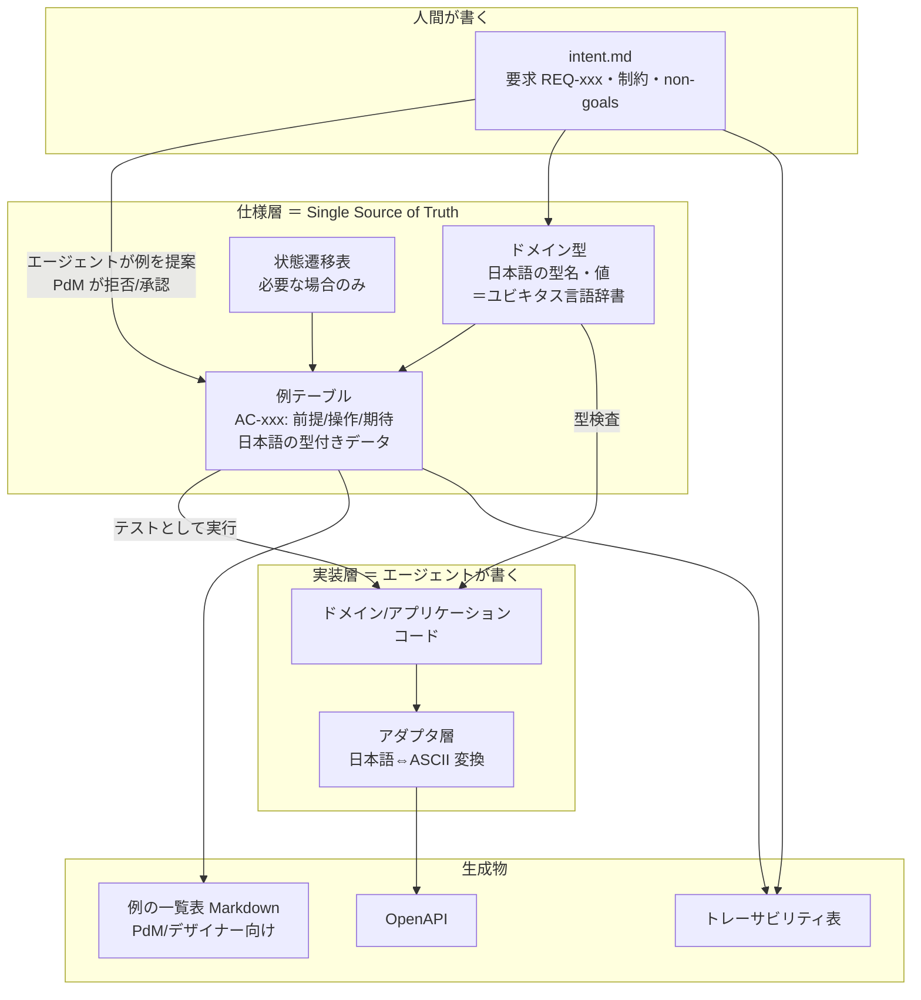
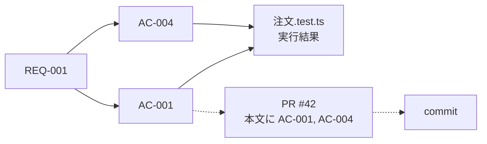
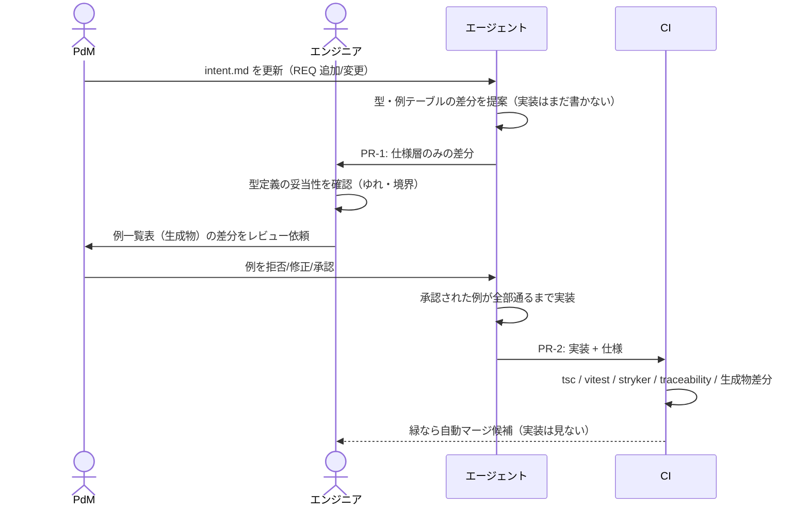

# Spec-as-Code 開発方式 設計書

コーディングエージェントを主戦力にし、人間が書く文書とレビュー工程を最小限に絞りながら、要求どおりのソフトウェアを継続的に作るための仕組み。ドメインの型と値を日本語で表現し、型そのものをユビキタス言語の辞書にする。

- 版: 0.3（0.2 の評価指摘を反映。変更点は末尾「改訂履歴」）
- 対象スタック: TypeScript / Hono or NestJS / Vitest / GitHub Actions
- 想定読者: 導入・運用するエンジニア、要求を出す PdM、画面を設計するデザイナー
- 前提とするチーム構成: エンジニア1名、PdM・デザイナー複数名
- 関連: ADR-202609110017-01（開発方式の背骨を Spec-as-Code へ転換する決定。本方式を採る理由と本リポジトリ側の処遇はそちらが持つ）

---

## 1. 背景と課題

| 従来手法 | 問題 |
|---|---|
| 自然言語の要求定義書・画面仕様書・テスト仕様書 | 文書間の整合性を人手で保つコストが高い。自由度が高すぎて曖昧さが残る。人の目で全量チェックできない |
| 実装コードを仕様とみなす | 言語都合の制約と実装ノイズで、意図が読み取れない。英語の識別子と日本語の業務用語の対応を頭の中で保つ必要がある |
| 実装コードの行単位レビュー | エージェントが大量に生成するコードに人間のレビュー速度が追いつかない |

根本原因は「仕様の唯一の正（Single Source of Truth）が人間の目でしか検証できない形式で書かれている」こと。

## 2. 方針

1. **人間が自然言語で書くのは「意図・制約・境界」だけ**（1文書）。要求は観測可能な結果を1文で書き、手順・画面項目・データ形は書かない。
2. **振る舞いの仕様は「型」と「実行可能な例」で表現する**。整合性チェックはコンパイラと CI が行う。
3. **ドメインの型名・値・例はすべて日本語で書く**。型定義がそのままユビキタス言語の辞書になり、用語集を別に保守しない。
4. **例はエージェントに生成させ、人間（主に PdM）は拒否権だけ持つ**。人間がゼロから網羅的に書かない。
5. **人間のレビュー対象は仕様層のみ**。実装コードはレビューしない。代わりに機械的ゲート（型・テスト・ミューテーション）で担保する。
6. **手で保守する派生文書をゼロにする**。API 仕様・トレーサビリティ表・例の一覧表はすべて生成物。
7. **トレーサビリティは ID で機械的に結ぶ**。要求→受け入れ例→テスト→変更履歴が自動で辿れ、欠落は CI で落とす。
8. **日本語はドメイン層まで。境界の外は ASCII**。DB・API・外部サービスとの変換はアダプタ層に閉じ込める。

## 3. 全体像



レビューと承認が発生するのは `intent.md` と仕様層の差分だけ。実装層は機械的ゲートを通れば人間は見ない。

## 4. リポジトリ構成

```
.
├── intent.md                      # 要求・制約・non-goals（人間が書く唯一の文書）
├── decisions/                     # ADR（仕様層で表現できない設計判断のみ）
├── src/
│   ├── domain/
│   │   └── 注文/
│   │       ├── 注文.型.ts          # ドメイン型（仕様）
│   │       ├── 注文.遷移.ts        # 状態遷移表（必要時のみ、仕様）
│   │       ├── 注文.例.ts          # 例テーブル（仕様）
│   │       ├── 注文.格子.ts        # 状態×操作の格子と対象外宣言（仕様）
│   │       ├── 注文キャンセル.ts    # 実装（エージェント）
│   │       └── 注文.test.ts        # 例テーブルを回すだけの薄いテスト
│   ├── application/
│   │   └── 注文/
│   │       ├── 注文キャンセル.統合例.ts  # 統合例（実 DB・並行実行、仕様）
│   │       └── 注文キャンセル.ts        # ユースケース（トランザクション境界、エージェント）
│   └── adapter/
│       ├── db/order.repository.ts # 日本語ドメイン型 ⇔ DB 行（ASCII）
│       ├── db/order.例.ts         # 往復不変条件 INV-1xx
│       └── http/order.routes.ts   # 日本語ドメイン型 ⇔ JSON（ASCII）
├── spec-kit/                      # 仕組み側の共通基盤（初期投資）
│   ├── 例を定義.ts                 # 例テーブルの型（期待＝結果/事後）とヘルパー
│   ├── 例を実行.ts                 # 例テーブル → Vitest 変換
│   ├── 例を表にする.ts             # 例テーブル → Markdown 表（生成物）
│   ├── 格子を定義.ts               # 状態×操作の格子と空セル検出
│   ├── 統合例を定義.ts             # 実 DB・並行実行の例（並行・順不同）
│   ├── manifest.ts                # 例テーブル → manifest.json
│   ├── traceability.ts            # manifest↔テスト結果↔PR の照合・表生成
│   └── check-intent.ts            # intent.md の構文検査
├── docs/generated/                # 生成物。手で編集しない
│   ├── manifest.json
│   ├── 例一覧/注文.md
│   ├── 格子/注文.md
│   ├── traceability.md
│   └── openapi.json
├── CLAUDE.md                      # エージェント向け規約
└── .claude/skills/                # spec-first 作業手順のスキル
```

ファイル名も日本語にしてよい。Git・Vitest・pnpm はいずれも UTF-8 ファイル名を扱える。Windows では `git config core.quotepath false` を推奨（表示上の問題のみ、動作には影響しない）。

## 5. 命名規約

| 対象 | 言語 | 理由 |
|---|---|---|
| ドメインの型名・フィールド名・リテラル値 | 日本語 | 業務用語と1対1。PdM が読める |
| 例テーブルのキー（前提・操作・期待・要求・表題） | 日本語 | 同上 |
| ID（REQ-/AC-/INV-/ADR-） | ASCII | grep・URL・PR 本文で扱うため |
| DB テーブル/カラム名、JSON キー、外部 API の列挙値 | ASCII | ツールチェーン互換。アダプタで変換 |
| インフラ・ライブラリ寄りのコード（ロガー、DI、HTTP） | 英語 | 業務用語ではない |
| spec-kit の公開 API（`例を定義` など） | 日本語 | 例テーブルと同じ画面に並ぶため |

識別子の文字に関する制約:

- 使える: 漢字、ひらがな、カタカナ、長音「ー」、英数字、`_`
- 使えない: 「・」「：」「（）」「／」、全角スペース、全角英数字（`注文ＩＤ`）
- Unicode 正規化は NFC に固定し、lint で強制する。NFD（macOS のファイル名や貼り付けで混入する）は見た目が同じ別の識別子になり、原因不明のコンパイルエラーを生む。
- 表記ゆれ（「キャンセル済」「キャンセル済み」）は型が別物と判定する。ただし型検査が止めるのは**既存の語の誤用**であり、同じ意味の新語（「取消済み」型の新設）は止まらない。そのため `*.型.ts` を CODEOWNERS でエンジニア1名に固定し、ドメイン層で export が増える PR を CI が検出してエンジニアのレビュー必須にする。ゆれの発生源を1か所にし、機構で人間ゲートへ乗せる。

## 6. 成果物の定義と具体例

題材: EC の注文キャンセル。

### 6.1 intent.md（人間が書く）

書くのは **要求（REQ）**・**制約**・**やらないこと**・**判断基準** の4つ。振る舞いの手順や画面項目は書かない。

```markdown
# intent: 注文キャンセル

## 目的
ユーザーが出荷前の注文を自分で取り消せるようにし、CS への問い合わせを減らす。

## 要求
- REQ-001: ユーザーは出荷前の自分の注文をキャンセルできる。
- REQ-002: 出荷後の注文はユーザー自身ではキャンセルできない。
- REQ-003: キャンセルされた注文は、決済済みであれば全額返金される。
- REQ-004: 同じ注文を二度キャンセルしても、二度返金されない。

## 制約
- 返金は決済プロバイダの API 経由で行い、自前で残高管理しない。
- 返金 API の失敗時、注文状態は「キャンセル済み」にしない（整合性優先）。

## やらないこと（non-goals）
- 部分キャンセル（明細単位）は扱わない。
- 出荷後の返品フローはこの範囲外。

## 判断基準（曖昧なときの優先順位）
1. 二重返金を絶対に起こさない
2. ユーザー操作の即時性
```

`REQ-ID` は一度発番したら再利用しない。廃止時は `REQ-002 (deprecated: 理由)` と残す。

REQ の状態は3つ。`(draft)` は例テーブルがまだ無い状態で、トレーサビリティ検査の「AC が紐づかない」失敗条件から除外する。PdM が intent.md を先に変えても CI が赤にならないのはこのため。例が承認された PR で `(draft)` を外す。

| 状態 | 表記 | AC/INV の紐づけ |
|---|---|---|
| 提案中 | `REQ-005 (draft)` | 不要 |
| 有効 | `REQ-005` | 必須 |
| 廃止 | `REQ-005 (deprecated: 理由)` | 不要 |

節ごとの所有者を決める。「目的」「要求」「やらないこと」「判断基準」は PdM が書く。「制約」は技術的な内容を含むためエンジニアが書き、PdM が合意する。所有者以外が直すときは所有者の承認を取る。

### 6.2 ドメイン型（仕様 ＝ ユビキタス言語辞書）

「表現できない状態は起きない」を型で保証する。画面仕様書・データ仕様書・用語集の代替。

```ts
// src/domain/注文/注文.型.ts
import { z } from "zod";

export const 注文ID = z.string().brand<"注文ID">();
export type 注文ID = z.infer<typeof 注文ID>;

export const 金額 = z.number().int().nonnegative().brand<"金額">();
export type 金額 = z.infer<typeof 金額>;

// 状態ごとに持てる情報が違うので判別共用体にする。
// 「出荷済みなのにキャンセル日時がある」といった状態は型レベルで作れない。
export const 注文状態 = z.discriminatedUnion("種別", [
  z.object({ 種別: z.literal("出荷前"), 支払額: 金額 }),
  z.object({ 種別: z.literal("出荷済み"), 支払額: 金額, 出荷日時: z.date() }),
  z.object({ 種別: z.literal("キャンセル済み"), 返金額: 金額, キャンセル日時: z.date() }),
]);
export type 注文状態 = z.infer<typeof 注文状態>;

export type 注文 = { ID: 注文ID; 所有者ID: string; 状態: 注文状態 };

export type キャンセル指示 = { 注文ID: 注文ID; 操作者ID: string };

export type キャンセル結果 =
  | { 成功: true; 注文: 注文; 返金額: 金額 }
  | { 成功: false; 理由: "本人ではない" | "出荷済み" | "キャンセル済み" | "返金失敗" };
```

この型定義を読めば、この機能に登場する語と取りうる値がすべて分かる。これが用語集を別に持たない理由。

### 6.3 例テーブル（仕様の本体）

前提／操作／期待を **型付きデータ**で書く。各例は `AC-ID` を持ち、どの `REQ` を満たすかを宣言する。エージェントが `intent.md` から生成し、PdM が承認する。

```ts
// src/domain/注文/注文.例.ts
import { 例を定義 } from "../../../spec-kit/例を定義";
import type { キャンセル指示, キャンセル結果, 注文 } from "./注文.型";

type 世界 = { 注文一覧: 注文[]; 返金API: "正常" | "失敗" };

export const 注文キャンセルの例 = 例を定義<世界, キャンセル指示, キャンセル結果>({
  "AC-001": {
    要求: ["REQ-001", "REQ-003"],
    表題: "出荷前・決済済みの注文を本人がキャンセルすると全額返金される",
    前提: { 注文一覧: [注文("o1", "u1", { 種別: "出荷前", 支払額: 3000 })], 返金API: "正常" },
    操作: { 注文ID: "o1", 操作者ID: "u1" },
    期待: {
      結果: { 成功: true, 返金額: 3000 },
      事後: { 注文一覧: [{ ID: "o1", 状態: { 種別: "キャンセル済み", 返金額: 3000 } }] },
    },
  },
  "AC-002": {
    要求: ["REQ-002"],
    表題: "出荷後の注文はキャンセルできない",
    前提: { 注文一覧: [注文("o1", "u1", { 種別: "出荷済み", 支払額: 3000, 出荷日時: 日時("2026-09-01") })], 返金API: "正常" },
    操作: { 注文ID: "o1", 操作者ID: "u1" },
    期待: { 結果: { 成功: false, 理由: "出荷済み" } },
  },
  "AC-003": {
    要求: ["REQ-004"],
    表題: "キャンセル済み注文を再度キャンセルしても返金されない",
    前提: { 注文一覧: [注文("o1", "u1", { 種別: "キャンセル済み", 返金額: 3000, キャンセル日時: 日時("2026-09-02") })], 返金API: "正常" },
    操作: { 注文ID: "o1", 操作者ID: "u1" },
    期待: { 結果: { 成功: false, 理由: "キャンセル済み" } },
  },
  "AC-004": {
    要求: ["REQ-001"],
    表題: "他人の注文はキャンセルできない",
    前提: { 注文一覧: [注文("o1", "u1", { 種別: "出荷前", 支払額: 3000 })], 返金API: "正常" },
    操作: { 注文ID: "o1", 操作者ID: "u2" },
    期待: { 結果: { 成功: false, 理由: "本人ではない" } },
  },
  "AC-005": {
    要求: ["REQ-003"],
    表題: "返金 API が失敗したら注文はキャンセル済みにならない",
    前提: { 注文一覧: [注文("o1", "u1", { 種別: "出荷前", 支払額: 3000 })], 返金API: "失敗" },
    操作: { 注文ID: "o1", 操作者ID: "u1" },
    期待: {
      結果: { 成功: false, 理由: "返金失敗" },
      事後: { 注文一覧: [{ ID: "o1", 状態: { 種別: "出荷前" } }] },
    },
  },
});
```

`期待` の型は spec-kit の中核であり、次のとおり厳密に定める。

```ts
// spec-kit/例を定義.ts（抜粋）
type 部分<T> = T extends readonly (infer U)[] ? readonly 部分<U>[]
             : T extends object ? { [K in keyof T]?: 部分<T[K]> }
             : T;

// 結果か事後の少なくとも一方を必須にする
type 期待<結果, 世界> =
  | { 結果: 部分<結果>; 事後?: 部分<世界> }
  | { 結果?: 部分<結果>; 事後: 部分<世界> };
```

- `結果` は操作の戻り値、`事後` は操作後の `世界` の状態。0.2 では両者が混在しており、`注文状態` のような結果型に無いフィールドを書いていたため型が通らなかった。分けたことで実行関数は `{ 結果, 事後 }` を返す契約になる（§6.7）。
- どちらも**部分一致**で書く（全フィールドを書かせると実装ノイズが混入する）。配列は位置ごとに部分一致する。
- `部分<T>` はリテラル共用体を保つので、PdM が `種別: "出荷まえ"` と書けばコンパイルエラーになる。これが用語のゆれを止める仕組み。緩い型（`Record<string, unknown>` など）で `期待` を受けると、この保証が丸ごと消える。
- `注文()`, `日時()` は同ファイル内の小さなビルダー。

不変条件（「どんな入力でも二重返金しない」など）は例で列挙しきれないので、`fast-check` によるプロパティテストを `INV-xxx` として同じファイルに置く。

```ts
export const 注文キャンセルの不変条件 = 不変条件を定義({
  "INV-001": {
    要求: ["REQ-004"],
    表題: "任意の注文にキャンセルを何度実行しても返金総額は最初の支払額を超えない",
    // arbitrary と検証述語（省略）
  },
});
```

### 6.4 例の一覧表（生成物、PdM・デザイナー向け）

TS の例テーブルから Markdown 表を生成し、`docs/generated/例一覧/注文.md` に置く。**読むためのもので、編集しない**。PdM のレビューは GitHub 上でこの生成物の差分を見る形でもよい。

```markdown
## 注文キャンセル

| ID | 要求 | 表題 | 前提 | 操作 | 期待 |
|---|---|---|---|---|---|
| AC-001 | REQ-001, REQ-003 | 出荷前・決済済みの注文を本人がキャンセルすると全額返金される | 注文o1: 出荷前, 支払額3000 / 返金API: 正常 | u1 が o1 をキャンセル | 成功, 返金額3000, キャンセル済み |
| AC-002 | REQ-002 | 出荷後の注文はキャンセルできない | 注文o1: 出荷済み / 返金API: 正常 | u1 が o1 をキャンセル | 失敗: 出荷済み |
```

### 6.5 状態遷移表（必要な場合のみ）

状態遷移が主題のドメインでは、遷移表をデータとして1か所に置き、テストと実装の両方が参照する。これ以上の独自 DSL は作らない。

```ts
// src/domain/注文/注文.遷移.ts
export const 注文の遷移 = {
  出荷前:       { キャンセル: "キャンセル済み", 出荷: "出荷済み" },
  出荷済み:     {},
  キャンセル済み: {},
} as const satisfies Record<注文状態["種別"], Partial<Record<string, 注文状態["種別"]>>>;
```

`satisfies` により、状態を追加したのに遷移表を更新し忘れると型エラーになる。

### 6.6 画面状態の一覧（デザイナー向け、任意）

UI の見た目は本方式の対象外だが、「どの状態でどの操作が可能か」は例テーブルと同じ形式で持てる。デザイナーはこれを見てプロトタイプを作り、見た目の判断はプロトタイプで行う。

```ts
export const 注文詳細画面の表示 = 画面状態を定義<注文状態["種別"]>({
  出荷前:       { 表示する操作: ["キャンセル"], 補足: "キャンセル可能である旨を表示" },
  出荷済み:     { 表示する操作: [], 補足: "出荷済みのためキャンセル不可、返品案内へのリンク" },
  キャンセル済み: { 表示する操作: [], 補足: "返金額と返金日時を表示" },
});
```

### 6.7 テスト（薄いアダプタ）

```ts
// src/domain/注文/注文.test.ts
import { 例を実行, 不変条件を実行 } from "../../../spec-kit/例を実行";
import { 注文キャンセルの例, 注文キャンセルの不変条件 } from "./注文.例";
import { 注文をキャンセルする } from "./注文キャンセル";
import { 世界を組み立てる } from "./注文.世界";

例を実行(注文キャンセルの例, (世界, 指示) => {
  const 環境 = 世界を組み立てる(世界);
  const 結果 = 注文をキャンセルする(環境)(指示);
  return { 結果, 事後: 環境.現在の世界() };
});
不変条件を実行(注文キャンセルの不変条件, /* ... */);
```

実行関数は `{ 結果, 事後 }` を返す。`例を実行` は `期待.結果` を `結果` と、`期待.事後` を `事後` と、それぞれ部分一致で照合する。

### 6.8 実装とアダプタ（エージェントが書く）

`注文キャンセル.ts` はエージェントが書き、人間はレビューしない。制約は「型が通る・例が全部通る・ミューテーション閾値を超える」。

境界の変換はアダプタ層に閉じ込める。ここで日本語が漏れると OpenAPI 生成や ORM で問題になるため、`src/adapter/` 配下では日本語の JSON キー・カラム名を lint で禁止する。

```ts
// src/adapter/db/order.repository.ts（抜粋）
const 状態のDB表現: Record<注文状態["種別"], "placed" | "shipped" | "cancelled"> = {
  出荷前: "placed",
  出荷済み: "shipped",
  キャンセル済み: "cancelled",
};
```

`Record<注文状態["種別"], ...>` により、状態を追加すると変換表の未定義が型エラーになる。ただし網羅性検査が捕まえるのは**漏れ**であり、`出荷前: "shipped"` のような**誤変換**は捕まえない。誤変換は §6.9 の往復プロパティテストで捕まえる。

### 6.9 ユースケース層と並行性の例（統合例テーブル）

ドメインの例テーブルは単一スレッド・インメモリの `世界` で回る。一方、判断基準の第1位「二重返金を絶対に起こさない」が実際に破られるのは、同時リクエスト、返金 API 呼び出しと状態更新の原子性、冪等性キーの層であり、ドメインの例では表現できない。この層を「機械のみ」ゲートかつ例テーブルの射程外にしたままでは、最重要要求が誰にも検証されない。そのため次の3つを課す。

**(a) ユースケース層に統合例テーブルを持つ。** トランザクション境界を含む層（アプリケーションサービス）に対し、ドメインと同じ形式の例を、実 DB（testcontainers 等）と返金 API のスタブで回す。`前提` は DB の初期状態、`操作` は同時実行を許す。

```ts
// src/application/注文/注文キャンセル.統合例.ts
export const 注文キャンセルの統合例 = 統合例を定義<DB初期状態, キャンセル指示, キャンセル結果>({
  "AC-101": {
    要求: ["REQ-004"],
    表題: "同じ注文への同時キャンセルは返金 API を1回しか呼ばない",
    前提: { 注文: [{ id: "o1", owner: "u1", status: "placed", paid: 3000 }] },
    操作: 並行([{ 注文ID: "o1", 操作者ID: "u1" }, { 注文ID: "o1", 操作者ID: "u1" }]),
    期待: {
      結果: 順不同([{ 成功: true }, { 成功: false, 理由: "キャンセル済み" }]),
      事後: { 注文: [{ id: "o1", status: "cancelled" }], 返金API呼び出し回数: 1 },
    },
  },
});
```

統合例は `AC-1xx` の番号帯を使い、トレーサビリティ上はドメインの AC と同じ扱い（REQ への紐づけ必須、テスト名は `AC-101: 表題`）。統合例の `前提` と `事後` は DB 表現（ASCII）で書く。ここは境界の外側なので日本語のキー名を使わない。

**(b) アダプタの変換は往復プロパティテストで検証する。** `ドメイン → DB 行 → ドメイン` と `ドメイン → JSON → ドメイン` が恒等であることを fast-check で `INV-1xx` として置く。網羅性検査が捕まえない誤変換をここで捕まえる。

**(c) トランザクション境界・ロック・冪等性キーに触れる差分は人間レビューに回す。** §8 の例外リストに含める。機械ゲートが (a)(b) で届く範囲を超えた部分の後ろ盾であり、常設ではなく差分が該当したときだけ発動する。

### 6.10 状態×操作の格子（例の過不足を機械で見せる）

例の一覧表を眺めて「足りない例」を見つけるのは人間には難しい。不在は目に見えない。そこで型が既に持っている情報から格子を機械生成し、空セルを CI で落とす。

- 行: `注文状態["種別"]`（判別共用体から取る）
- 列: 操作 × 操作者区分（遷移表のキーと、例テーブルの `操作` に現れる区分。本題材では「キャンセル」×「本人 / 他人」）
- セル: 該当する AC の ID、または `対象外: 理由` の宣言

```ts
// src/domain/注文/注文.格子.ts
export const 注文キャンセルの格子 = 格子を定義(注文キャンセルの例, {
  対象外: {
    "出荷済み×キャンセル×他人": "本人でない時点で拒否されるため出荷状態は無関係",
    "キャンセル済み×キャンセル×他人": "同上",
  },
});
```

`例を格子にする` が Markdown を生成し、`docs/generated/格子/注文.md` に置く。

| 状態 ＼ 操作 | キャンセル（本人） | キャンセル（他人） |
|---|---|---|
| 出荷前 | AC-001, AC-005 | AC-004 |
| 出荷済み | AC-002 | 対象外 |
| キャンセル済み | AC-003 | 対象外 |

空セルが残っていれば CI が失敗する（§7.3）。PdM のレビューは「一覧に漏れがないか」ではなく「各セルの期待値と対象外の理由が正しいか」になり、判断の対象が有限の格子に縮む。

## 7. トレーサビリティ設計

### 7.1 ID 体系

| ID | 意味 | 所在 | 発番者 |
|---|---|---|---|
| `REQ-xxx` | 要求 | `intent.md` | PdM |
| `AC-xxx`（001〜099） | 受け入れ例（1例＝1テストケース、ドメイン層） | `*.例.ts` | エージェント提案→PdM 承認 |
| `AC-1xx` | 統合例（ユースケース層、実 DB・並行実行） | `*.統合例.ts` | エージェント提案→エンジニア承認 |
| `INV-xxx` | 不変条件（プロパティテスト） | `*.例.ts` | エージェント提案→エンジニア承認 |
| `INV-1xx` | アダプタの往復不変条件 | `src/adapter/**/*.例.ts` | エージェント提案→エンジニア承認 |
| `ADR-xxx` | 仕様層で表せない設計判断 | `decisions/` | エンジニア |

### 7.2 結び方



- **REQ → AC/INV**: 例テーブルの `要求` フィールド。
- **AC → テスト結果**: `例を実行` がテスト名を `AC-001: <表題>` にするので、Vitest のレポートがそのまま AC 単位の結果になる。
- **AC → 変更履歴**: PR テンプレートに「関連 AC/REQ」欄を必須化し、CI で本文中の ID 存在を検証する。仕様に触れない PR（リファクタ・依存更新・CI 修正）は `関連: なし (chore: 理由)` と書く。逃げ道を明示しないと、形だけの ID を書く運用に堕ちる。**実装コード内には ID を書かない**（ノイズになり、リファクタで腐る）。
- **仕様層で表せない判断 → ADR**: `decisions/` に残し、`REQ` を参照する。

### 7.3 機械的検証（`spec-kit/traceability.ts`）

CI で毎回実行し、以下を**失敗条件**にする。

| チェック | 落とす理由 |
|---|---|
| `intent.md` の REQ-ID が重複 | ID の一意性が崩れると追跡不能 |
| `draft` でも `deprecated` でもない REQ に AC も INV も紐づかない | 要求が検証されていない |
| 例テーブルが存在しない REQ を参照 | 仕様のダングリング参照 |
| AC の `要求` が空 | 由来不明の例＝スコープ外の振る舞いを勝手に作った可能性 |
| 格子（§6.10）に AC も `対象外` も無いセルがある | 例の不足が可視化されないまま通る |
| PR 本文に AC/REQ の参照も `chore` 宣言もない、または存在しない ID | 変更理由の追跡不能 |
| `src/domain/` で export が増えた PR にエンジニアの承認がない | 同義の新語は型検査で止まらない（§5） |
| `docs/generated/` を再生成して差分がある | 生成物が古い |

検査器は TS の例テーブルを直接読まず、例テーブルが出力する manifest（§14）を読む。言語キットを差し替えても検査器を書き直さないため。

出力として `docs/generated/traceability.md` を生成しコミットする。生成物はコミットするため並行 PR で競合するが、競合は再生成で解消し、手で直さない（マージ前に `pnpm generate` を走らせるジョブを置く）。

```markdown
| REQ | 状態 | AC / INV | 最終テスト結果 |
|---|---|---|---|
| REQ-001 | active | AC-001, AC-004 | pass |
| REQ-002 | active | AC-002 | pass |
| REQ-003 | active | AC-001, AC-005 | pass |
| REQ-004 | active | AC-003, INV-001 | pass |
```

PdM・ステークホルダーに共有するのは `intent.md`・例一覧表・この表の3つ。

### 7.4 逆方向（実装からの遡り）

「このコードは何のためにあるか」は、そのコードを変更したときにミューテーションで落ちる AC を見れば分かる。ID をコードに埋めるより、Stryker のレポート（どのミュータントをどのテストが殺したか）を逆引きの手段にする。

## 8. ワークフロー



要点:

- **仕様 PR と実装 PR を分ける**（または同一 PR でも仕様コミットを先頭にする）。人間の注意を仕様差分に集中させる。
- PdM が例を「拒否」するとき、理由を `intent.md` の判断基準や制約に書き戻す。これが自然言語文書を育てる唯一の経路。
- エージェントが例を作れない・迷う箇所が出たら、それは `intent.md` が曖昧な箇所。エージェントに質問リストを出させ、PdM が `intent.md` を直す。
- PdM は TS の例テーブルを直接読んでもよいし、生成された Markdown 表を読んでもよい。どちらでレビューしても正は TS。

### 承認ゲートの置き方

| 対象 | 誰が見るか | 判断基準 |
|---|---|---|
| `intent.md` | PdM（必須。「制約」はエンジニアが書き PdM が合意） | 要求として正しいか |
| ドメイン型 | エンジニア（必須） | 業務用語と一致しているか。ゆれ・境界漏れがないか |
| 例テーブルの格子（§6.10） | PdM（必須） | 各セルの期待値と `対象外` の理由が正しいか |
| ミューテーション由来の追加例 | エンジニア | 既存 REQ の範囲内で場合分けを足しただけか（下記） |
| 統合例・アダプタ往復不変条件 | エンジニア（必須） | 並行性・原子性の期待が制約と一致するか |
| 画面状態の一覧 | デザイナー | 画面設計と矛盾しないか |
| 実装コード | 機械のみ | 型・例・ミューテーション閾値・lint |
| ADR | エンジニア（必須） | 判断の妥当性 |
| 生成物 | 機械のみ | 再生成して差分がないこと |

**ミューテーション不合格時のループ。** 例が薄いとミュータントが生き残る。是正は例の追加だが、毎回 PdM 承認を要すると PdM がボトルネックになる。承認の粒度を次で分ける。

- 既存の REQ・状態・理由リテラルの範囲内で場合分けを増やすだけの例 → エンジニア承認で通す
- 新しい REQ、新しい状態、新しい理由リテラル、格子の `対象外` の変更を伴う例 → PdM 承認

型が変わらない追加は「意図の拡張」ではなく「検証の密度」の話であり、PdM の判断対象ではない。

**実装差分も人間が見る例外。** 不可逆性・影響範囲が大きい変更に限り、実装差分もエンジニアが見る。対象は次の4つで、基準は `CLAUDE.md` に明記する。

1. DB マイグレーション
2. 外部 API 契約の変更
3. 権限モデル
4. トランザクション境界・ロック・冪等性キーに触れる差分（§6.9 (c)）

## 9. CI ゲート

```yaml
# .github/workflows/gate.yml（抜粋）
jobs:
  gate:
    env:
      PR_BODY: ${{ github.event.pull_request.body }}   # run: に直接展開しない（スクリプトインジェクション）
    steps:
      - run: pnpm tsc --noEmit
      - run: pnpm eslint .                      # adapter 配下の日本語キー禁止、識別子の NFC 強制・全角英数禁止を含む
      - run: pnpm vitest run --reporter=junit --outputFile=reports/junit.xml   # 統合例は testcontainers で同一ジョブ内
      - run: pnpm stryker run --incremental      # mutate は src/domain と src/application に限定。閾値: break < 80（初期値、運用で調整）
      - run: pnpm tsx spec-kit/check-intent.ts
      - run: pnpm generate                       # manifest・例一覧・格子・traceability・openapi
      - run: pnpm tsx spec-kit/traceability.ts --manifest docs/generated/manifest.json --junit reports/junit.xml --pr "$PR_BODY"
      - run: git diff --exit-code docs/generated/
```

ミューテーションテストは必須。エージェントは「通るだけのテスト」を書き得るため、例テーブルが実装の変更を実際に検知できることを機械で確認する。Stryker はフル実行で数十分かかるため `--incremental` を既定にし、対象を例テーブルを持つ層（`src/domain`、`src/application`）に限定する。アダプタ層は往復不変条件（§6.9 (b)）で担保し、ミューテーションの対象にしない。

## 10. エージェント設定の要点（`CLAUDE.md` / skills）

`CLAUDE.md` に最低限以下を書く。

1. 変更は必ず `intent.md` → `*.型.ts` / `*.例.ts` → 実装 の順。仕様ファイルに触れずに実装を変えてはならない。
2. `intent.md` を変えてよいのは人間だけ。エージェントは質問リストを出す。
3. ドメイン層（`src/domain/`）の型名・フィールド名・リテラル値は日本語。既存の語と同じ意味の新語を作らない（まず既存の型を検索する）。
4. `src/adapter/` の外に ASCII の業務用語を、`src/adapter/` の内に日本語の JSON キー／カラム名を書かない。
5. 例テーブルには必ず `要求` を書く。対応する REQ がなければ実装せず、質問する。REQ が `(draft)` なら例を提案してよいが、実装は `(draft)` が外れてから。
6. `docs/generated/` は編集せず、生成コマンドを実行する。競合も再生成で解消する。
7. 以下は実装差分も人間レビューに回す: マイグレーション、外部契約、権限、トランザクション境界・ロック・冪等性キー。
8. ミューテーションで生き残ったミュータントを殺すための例は、既存の REQ・状態・理由リテラルの範囲内で足す。新しい状態や理由が要ると判断したら、例を書かずに質問する。

skills として切り出す単位:

- `spec-propose`: intent の差分から型・例の差分を提案する手順（既存用語の検索を含む）
- `impl-to-green`: 例が全部通るまで実装し、Stryker 閾値を確認する手順
- `intent-questions`: 曖昧箇所を質問リストにまとめる手順

## 11. 導入ステップ

| 週 | 作業 | 成果 |
|---|---|---|
| 1 | `spec-kit/` の `例を定義`（`期待` の型を含む）/ `例を実行` / `例を表にする` / `格子を定義` / manifest 出力 / `traceability.ts` を実装。CI ゲート構築 | 空の仕組みが動く |
| 1〜2 | `統合例を定義`（testcontainers、`並行`・`順不同`）とアダプタ往復不変条件の雛形 | 並行性の例が回る |
| 1 | `CLAUDE.md`・skills 3本・adapter 向け lint ルール | エージェントが規約に従う |
| 2 | 既存機能1つを題材にパイロット。Stryker 閾値を実測で決める。PdM に例一覧表と TS 例テーブルの両方を見せ、どちらでレビューするか決める | 運用感の確認 |
| 3 | PdM・デザイナーに `intent.md` の書き方と画面状態一覧の位置づけを共有 | 要求の入口が固まる |
| 以降 | 新規機能はすべてこの方式。既存機能は触るときに移行 | — |

## 12. 限界と非対象

- **UI の使い心地**は型でも例でも表現できない。画面状態の一覧は「何が出るか」までで、「どう見えるか」はプロトタイプで判断する。
- **ドメインロジックが薄いアプリ**では、仕組みの初期投資が回収しにくい。
- **性能・運用要件**は例テーブルの対象外。`intent.md` の制約に書き、別の計測で担保する。
- **日本語識別子の副作用**: IME 入力の遅さ（主にエージェントが書くので影響は小さい）、一部の外部ツールでの表示崩れ、表記ゆれ管理の責任がドメイン型の編集者に集中すること。
- **日本語識別子が成立しない言語がある**: Go はエクスポートに先頭大文字を要求し、日本語には大小文字がないため成立しない。Ruby は定数・クラス名に使えない。日本語識別子は本方式の核ではなくオプション（§14）。
- **並行性は統合例の範囲でしか検証できない**: 統合例（§6.9）は代表的な競合パターンを列挙するものであり、あらゆるインターリーブを網羅しない。トランザクション境界の差分に人間レビューを残すのはそのため。
- 例テーブルを PdM が承認する工程は残る。省ける工程は「文書を書く」「実装を読む」の2つであって、「意図を確認する」ではない。

## 13. 用語

| 用語 | 意味 |
|---|---|
| 仕様層 | `intent.md` と、ドメイン型・例テーブル・状態遷移表・画面状態一覧の総称。Single Source of Truth |
| ユビキタス言語 | 業務側と開発側が共有する用語。本方式ではドメイン型の定義そのもの |
| 例テーブル | 前提／操作／期待を型付きデータで並べたもの。1件＝1 AC |
| アダプタ層 | 日本語ドメイン型と外部表現（DB・JSON・外部 API）を相互変換する層。日本語が外に漏れない境界 |
| 生成物 | 仕様層または実装から機械生成する文書。手で編集しない |
| ミューテーションスコア | 実装をわざと壊したときにテストが検知した割合。例テーブルの実効性の指標 |
| 統合例 | ユースケース層に対し実 DB と並行実行で回す例。AC-1xx。ドメインの例で表せない原子性・冪等性を担う |
| 格子 | 状態×操作×操作者区分の表。各セルに AC か `対象外` を要求し、例の不足を機械で可視化する |
| manifest | 例テーブルが出力する機械可読の一覧（AC/INV → REQ、表題、所在）。検査器と生成物はこれだけを読む |

## 14. プラグイン化に向けた制約

本方式を特定プロダクトから切り出して配布する際、言語に依存する部分としない部分を最初から分けておく。プロダクトで TS 一体構成のまま運用し、`期待` の型・並行性・格子の設計が固まってから抽出する。先に一般化すると核の設計が多言語の抽象化に引きずられて決まらない。

| 層 | 中身 | 置き場 |
|---|---|---|
| 方式 | intent.md の文法、ID 体系、承認ゲート表、ワークフロー、CI ゲートの構成、skills 3本、CLAUDE.md 断片 | プラグイン |
| 交換形式（契約） | manifest の schema、テスト名の規約（`AC-001: 表題`）、JUnit 形式のテスト結果 | プラグインが定義、言語キットが準拠 |
| 言語キット | `例を定義` `例を実行` `例を表にする` `格子を定義` `統合例を定義`、ビルダー、lint ルール、ミューテーション設定 | 言語ごとに別配布（npm / PyPI 等） |

**manifest。** 例テーブルから `docs/generated/manifest.json` を出力し、トレーサビリティ検査・例一覧・格子はこれだけを読む。TS の例テーブルを直接読む検査器を書かない。

```json
{
  "examples": [
    { "id": "AC-001", "kind": "AC", "requirements": ["REQ-001", "REQ-003"],
      "title": "出荷前・決済済みの注文を本人がキャンセルすると全額返金される",
      "file": "src/domain/注文/注文.例.ts",
      "cell": { "状態": "出荷前", "操作": "キャンセル", "操作者": "本人" } }
  ],
  "cells": { "declared": [...], "excluded": [{ "cell": {...}, "reason": "..." }] }
}
```

**識別子のモード。** 核は「業務用語と識別子が1対1で、辞書がコードから導出される」ことであり、日本語識別子はその一実現。言語キットは次のどちらを実装するかを宣言する。

| モード | 識別子 | 辞書の導出元 | 成立する言語 |
|---|---|---|---|
| 日本語識別子 | 日本語 | 型定義そのもの | TypeScript、Kotlin、Java 17+、Rust、Python、C#、Swift |
| 注釈併記 | 英語 | lint で必須化した日本語注釈（doc comment / annotation） | Go、Ruby ほか全言語 |

注釈併記モードでは生成表が注釈側を表示し、PdM が読むのは日本語のまま。型検査によるゆれの検出は識別子ではなく注釈の一致検査（lint）に置き換わるため、保証は1段弱い。

## 改訂履歴

- 0.3（2026-09-10）: 評価指摘を反映。`期待` を `結果`/`事後` に分離し型を定義（§6.3, §6.7）。統合例・往復不変条件・並行性の人間レビュー例外を追加（§6.9, §7.1, §8）。格子による過不足の可視化（§6.10, §7.3）。REQ の draft 状態と節の所有者（§6.1）。chore PR の逃げ道、ミューテーション由来の例の承認粒度、生成物の競合規則（§7.2, §7.3, §8）。NFC 強制・全角英数禁止・CODEOWNERS（§5）。`$PR_BODY` の env 経由、Stryker の範囲と incremental（§9）。プラグイン化の3層と manifest、識別子モード（§14）。
- 0.2: 初版（提案）。
