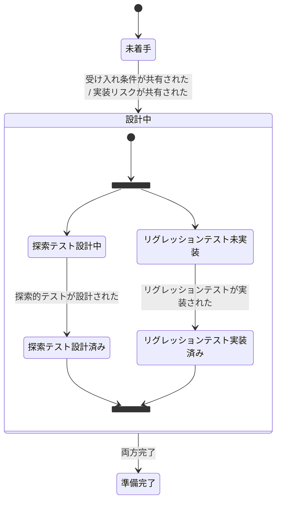
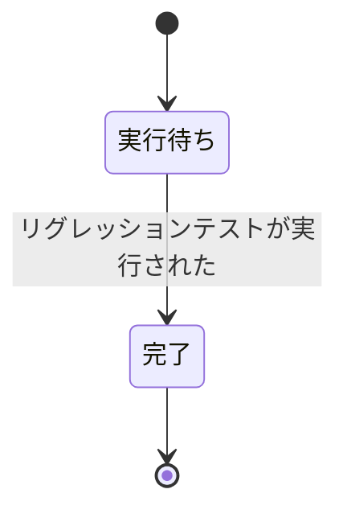
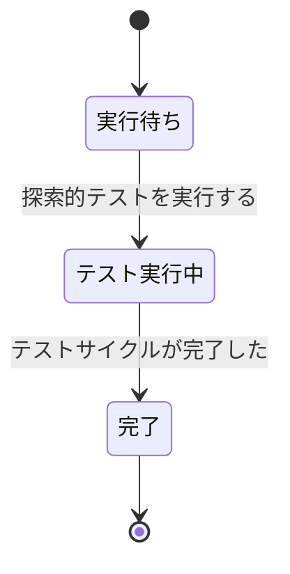

# 検証 イベントストーミング

Big Picture（`docs/big-picture.md`）の「検証・リリース」コンテキストからリリース責務を分離し、QA活動に特化してDesign Levelで深掘りしたもの。

## スコープ

- 対象: テスト設計・テスト実行・不具合起票
- 対象外: リリース（デプロイ・稼働確認・ロールバック）は別途整理

## ドメインイベント

| # | イベント名（過去形） | 説明 | 所属集約 |
|---|---|---|---|
| 1 | 受け入れ条件が共有された | 開発チケットの受け入れ条件がQA側に渡った | テスト計画 |
| 2 | 実装リスクが共有された | 開発者から実装上のリスク箇所が伝えられた | テスト計画 |
| 3 | 探索的テストが設計された | 受け入れ条件やリスク箇所をもとにテスト観点を設計 | テスト計画 |
| 4 | QA環境にデプロイされた | ビルド済み成果物がQA環境に反映された（外部トリガー） | リグレッションテスト実行 |
| 5 | リグレッションテストが実装された | E2Eテストコードが作成された | テスト計画 |
| 6 | リグレッションテストが実行された | E2Eテストが走った | リグレッションテスト実行 |
| 7 | 探索的テストが実行された | QA担当が手動で探索的テストを実施 | 探索的テスト実行 |
| 8 | 不具合が発見された | テスト実行中に問題が検出された | 探索的テスト実行 |
| 9 | バグチケットが作成された | 不具合をチケット化し開発チケットに関連付け | 探索的テスト実行 |
| 10 | バグが未再現と確認された | 修正後の再テストで不具合が再現しないことを確認 | 探索的テスト実行 |
| 11 | テストサイクルが完了した | テスト活動が全て終了し、結果が確定した | 探索的テスト実行 |

### Big Pictureから除外したイベント

| イベント名 | 理由 |
|---|---|
| リリース基準が判定された | トリアージ機構の所在が不明確。検証コンテキスト内の集約ではなく、外部のトリアージ機構との連携として扱う（ホットスポット #2（BP #16）, #3（BP #17）） |

## コマンド

| # | コマンド名 | トリガーするイベント | 前提条件 |
|---|---|---|---|
| 1 | 受け入れ条件を共有する | 受け入れ条件が共有された | |
| 2 | 実装リスクを共有する | 実装リスクが共有された | |
| 3 | 探索的テストを設計する | 探索的テストが設計された | |
| 4 | QA環境にデプロイする | QA環境にデプロイされた | |
| 5 | リグレッションテストを実装する | リグレッションテストが実装された | |
| 6 | リグレッションテストを実行する | リグレッションテストが実行された | |
| 7 | 探索的テストを実行する | 探索的テストが実行された | テスト計画が準備完了 かつ QA環境にデプロイ済み |
| 8 | 不具合を報告する | 不具合が発見された | |
| 9 | バグチケットを作成する | バグチケットが作成された | |
| 10 | バグの再テストを実施する | バグが未再現と確認された | |
| 11 | テストサイクルを完了する | テストサイクルが完了した | |

## アクター

| # | アクター名 | 種別 | 発行するコマンド |
|---|---|---|---|
| 1 | 開発者 | 人間（外部） | 受け入れ条件を共有する、実装リスクを共有する |
| 2 | QA担当者 | 人間 | 探索的テストを設計する、リグレッションテストを実装する、探索的テストを実行する、不具合を報告する、バグチケットを作成する、バグの再テストを実施する、テストサイクルを完了する |
| 3 | PdM | 人間（外部・企画） | （リリース基準判定 — 除外済み、ホットスポット #3（BP #17）参照） |
| 4 | CI/CD | 外部システム | QA環境にデプロイする |
| 5 | リグレッション自動実行ポリシー | ポリシー | リグレッションテストを実行する（QA環境にデプロイされた時に自動実行） |

## 集約

### テスト計画

**責務**: テスト観点の設計とテストコードの実装管理

**含むコマンド**: 探索的テストを設計する、リグレッションテストを実装する

**含むイベント**: 受け入れ条件が共有された、実装リスクが共有された、探索的テストが設計された、リグレッションテストが実装された

#### 状態遷移

| 状態 | 定義 |
|---|---|
| 未着手 | テスト設計の入力がまだ届いていない |
| 設計中 | 探索テスト設計とリグレッションテスト実装が独立・順不同で進行中 |
| 準備完了 | 両方が揃い、テスト実行可能な状態 |

### リグレッションテスト実行

**責務**: E2Eテストの自動実行と結果記録

**含むコマンド**: リグレッションテストを実行する

**含むイベント**: QA環境にデプロイされた、リグレッションテストが実行された

#### 状態遷移

| 状態 | 定義 |
|---|---|
| 実行待ち | QA環境へのデプロイを待っている |
| 完了 | テストが実行され、結果（Pass/Fail）が記録された |

- ポリシー駆動で自動実行される。結果の解釈・対処（失敗時の原因調査・不具合起票等）はQA担当者の判断であり、探索的テスト実行側で扱う

### 探索的テスト実行

**責務**: 手動テストの実施・不具合ハンドリング・サイクル完了

**含むコマンド**: 探索的テストを実行する、不具合を報告する、バグチケットを作成する、バグの再テストを実施する、テストサイクルを完了する

**含むイベント**: 探索的テストが実行された、不具合が発見された、バグチケットが作成された、バグが未再現と確認された、テストサイクルが完了した

#### 状態遷移

| 状態 | 定義 |
|---|---|
| 実行待ち | テスト計画が準備完了かつQA環境デプロイ済みの状態を待っている |
| テスト実行中 | 探索的テストを実施している。不具合発見時のバグチケット作成、リグレッションテスト結果の確認を含む |
| 完了 | テストサイクルが完了し、結果が確定した |

再テストが必要な場合は、バグ修正版のデプロイ後に新しい探索的テスト実行インスタンスが作成される。

## ポリシー

| ポリシー | トリガー | 実行するコマンド | ガード条件 |
|---|---|---|---|
| リグレッション自動実行ポリシー | QA環境にデプロイされた | リグレッションテストを実行する | リグレッションテスト実装済みの場合のみ |

## ホットスポット

| # | ホットスポット | 関連する集約/イベント | 解消アクション |
|---|---|---|---|
| 1 | 検証とリリースのコンテキスト分割（BP #15） | 全体 | Big Pictureを更新し、リリース側の所属（開発に統合 or 独立コンテキスト）を決定する |
| 2 | トリアージ機構の所在が不明（BP #16） | バグチケットが作成された | バグの「リリースブロッカー判定」を誰が・どこで・誰に回答するかを定義する。企画側・対応コンテキスト・独立機構のいずれか |
| 3 | PdMの責務の帰属（BP #17） | リリース基準判定（除外済み） | PdMがリリース可否を判断する行為が企画コンテキストの責務か、別の責務かを明確にする |
| 4 | リグレッションテストの実装者 | テスト計画 / リグレッションテストが実装された | 現状QA担当者のみ。開発者との分担のあるべき姿は未検討 |
| 5 | シフトレフトによるQA責務の拡張余地 | テスト計画 | 仕様レビューへのQA参加、テスタビリティの早期フィードバック等、上流工程へのQA関与を検討する余地がある |
| 6 | デプロイ失敗時の責務分界 | QA環境にデプロイされた | アプリ起因なら開発、インフラ起因なら別チーム。切り分け基準と対応フローが未定義 |

## 設計判断

本ドキュメント作成時に下した設計判断の記録。

- **テスト実行集約の分離**: テスト実行を「リグレッションテスト実行」と「探索的テスト実行」の2集約に分離した。リグレッションテストはポリシー駆動の自動実行であり状態管理がほぼ不要（実行待ち→完了）。探索的テストは人間の判断・不具合ハンドリングを伴い、状態遷移の主たる複雑さを担う。性質の異なるライフサイクルを1集約に押し込むと、ガード条件や完了定義が曖昧になるため分離した
- **テスト計画集約の不分離**: 探索テスト設計とリグレッションテスト実装は入力（受け入れ条件・実装リスク）が同一、実行主体（QA担当者）も同一で、「テスト準備」という同質の責務を持つ。「両方揃ったら準備完了」という調整ロジックの所在としてテスト計画集約が機能しており、分離すると調整が宙に浮くため1集約とした
- **不具合発見・バグチケット作成の内部工程化**: 不具合が発見された・バグチケットが作成されたは、探索的テスト実行の「テスト実行中」状態の内部工程として扱う。これらはテスト活動の性質を変えず（テスト実行中のまま）、集約の状態遷移を起こさない。開発コンテキストにおけるTDDサイクルの内部遷移化と同じ判断基準
- **再テストの新規インスタンス化**: バグ修正後の再テストは新しい探索的テスト実行インスタンスとして扱う。修正版のデプロイを起点とする新しいテストサイクルであり、元のインスタンスの状態を巻き戻すのではない。開発コンテキストにおける変更要求時の新規実装プラン作成と同じ考え方
- **リグレッションテスト失敗時の扱い**: リグレッションテスト実行の結果（Pass/Fail）は記録されるが、失敗時の原因調査・不具合起票はQA担当者の判断行為であり、探索的テスト実行側で扱う。リグレッションテスト実行集約はあくまで自動実行と結果記録に責務を限定する
- **リリース基準判定の除外**: リリース基準判定はトリアージ機構の所在が不明確なため、検証コンテキスト内のイベントとしてモデリングせず、外部連携としてホットスポット化した。検証コンテキストの責務は「テストしてサイクルを完了する」までであり、リリース可否の判断は別の責務

## 用語集（ユビキタス言語）

| 用語 | 定義 | 備考 |
|---|---|---|
| 探索的テスト | QA担当者が手動で実施するテスト。受け入れ条件やリスク箇所をもとに設計される | Big Pictureでの「テスト（検証・リリース）」に相当 |
| リグレッションテスト | E2Eテストとして実装・自動実行されるテスト。既存機能の退行を検出する | QA担当者が実装、CI/CDで自動実行 |
| テスト計画 | 探索的テストの設計とリグレッションテストの実装を含む、テスト準備活動の総称 | デプロイ前から着手可能 |
| 探索的テスト実行 | QA担当者による手動テストの実施・不具合ハンドリング・サイクル完了までの一連の活動 | リグレッションテスト結果の確認も含む。再テスト時は新しいサイクル |
| リグレッションテスト実行 | E2Eテストの自動実行と結果記録 | ポリシー駆動。結果の解釈はQA担当者の判断 |
| 受け入れ条件 | 開発チケットに定義された、機能が満たすべき条件 | 開発側から共有される |
| 実装リスク | 開発者が認識している、バグが発生しやすい箇所の情報 | 探索的テスト設計の入力となる |
| バグチケット | テスト実行中に発見された不具合を記録するチケット。開発チケットに関連付けられる | QA側で起票し、対応コンテキスト（Big Picture #21）のトリアージ対象となる。リリースブロッカー判定は外部のトリアージ機構で実施（ホットスポット #2） |
| リリース基準 | 特定バージョンがリリース可能かどうかの判定基準 | 判定者・判定プロセスの所在は未確定（ホットスポット #3） |
