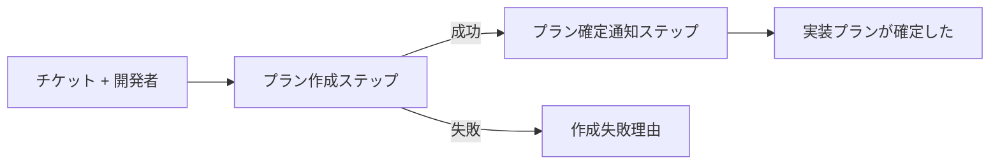

# 関数型ドメインモデル 記法ガイド

イベントストーミング Design Level で明らかになったドメインを、型定義と関数シグネチャで形式化するための記法・テンプレート・規約を定義する。

## 目的・スコープ

- **目的**: Design Level の状態遷移・コマンド・イベントを、疑似コードの型定義として形式化する。暗黙の不変条件・事前条件を型レベルで露出させ、DL の健全性を検証する
- **スコープ**: 疑似コードによる型定義まで。実装コード・特定フレームワーク固有の記法は扱わない
- **位置付け**: イベントストーミング Big Picture → Design Level → **関数型ドメインモデル** の順に深掘りするフェーズ。本ドキュメントは第3フェーズの記法を定める
- **参考**: Scott Wlaschin『Domain Modeling Made Functional』

## 記法の読み方（非エンジニア向け凡例）

本ドキュメント群では F# 風の型表記を用いる。プログラミング未経験者向けに各構文の読み方を示す。

### 基本構文

| 構文 | 読み方 | 例 |
|---|---|---|
| `type X = ...` | 「X という型を次のように定義する」 | `type チケットID = ...` |
| `A \| B \| C` | 「A または B または C のいずれか」 | `type 状態 = 作成中 \| 確定` |
| `A of B` | 「A は B という値を持つ」 | `作成中 of 作成中プラン` |
| `{ 名前: 型; 名前: 型 }` | 「これらの項目を束ねたデータ」（レコード型） | `{ ID: チケットID; 件名: string }` |
| `A -> B` | 「A を受け取って B を返す関数」 | `チケットID -> 実装プラン` |
| `A -> B -> C` | 「A と B を受け取って C を返す関数」 | `チケット -> 開発者 -> 実装プラン` |
| `Result<成功, 失敗>` | 「成功した場合の型または失敗した場合の型」 | `Result<確定プラン, エスカレーション>` |
| `List<A>` | 「A の複数個」 | `List<タスク>` |
| `Option<A>` | 「A があるか、ない」 | `Option<レビュー承認>` |

### 型の種別は「名前」で判別する

本ガイドでは **データ型・イベント・関数（コマンド）を全て `type` キーワードで定義する**。種別の判別は型名の形に込める。

| 名前の形 | 種別 | 例 |
|---|---|---|
| 名詞 | データ型 | `type 実装プラン = ...`, `type 作成中プラン = { ... }` |
| 過去形「〜した」「〜された」 | イベント（データの一種） | `type 実装プランが確定した = { ... }` |
| 動詞「〜する」 | 関数（コマンド・ワークフロー・ポリシー） | `type 実装プランを作成する = チケット -> ...` |

右辺の形も併せて読むと確実:

- 右辺が `{ ... }` または `\| ... \| ...` → データ型
- 右辺に `->` を含む → 関数

### 概観レベル（AND / OR 表記）

詳細な型定義に入る前に、全体構造を自然言語に近い表記で示してよい。

```fsharp
実装プラン = 作成中 OR エスカレーション中 OR 確定
作成中プラン = プランID AND チケットID AND タスクのリスト
```

| 構文 | 読み方 |
|---|---|
| `A AND B` | 「A と B の両方を持つ」 |
| `A OR B` | 「A か B のどちらか」 |

詳細定義は本体の `type` 記法で行い、AND/OR は概観を素早く伝えるための補助表記とする。

### 読み方の例

```fsharp
type 実装プランを作成する =
  チケット -> 開発者 -> Result<確定プラン, エスカレーション>
```

→ 「実装プランを作成する」は名前が動詞かつ右辺に `->` を含むため関数。「チケット」と「開発者」を受け取って、「確定プラン」（成功時）または「エスカレーション」（失敗時）を返す。

## 型テンプレート

各ドメインモデル文書で定義する型カテゴリと雛形を示す。

### 1. 値オブジェクト（Value Object）

ID・単純な属性を型で区別するための記法。

```fsharp
// 単純なID型（他の文字列と混同できないようにする）
type チケットID = チケットID of string
type プランID = プランID of string

// 制約を持つ値: 型と生成関数をセットで定義する
type 必要Approve数 = 必要Approve数 of int

// 生成関数の失敗理由
type 必要Approve数を作る失敗 = ゼロ以下

// 生成関数のシグネチャ（1以上の整数のみ成功）
type 必要Approve数を作る = int -> Result<必要Approve数, 必要Approve数を作る失敗>
```

**使いどころ:**
- ドメイン上意味のあるID・識別子
- 値の範囲・形式に制約があるもの（例: Email、日時、数量）

**制約付き値の扱い:**
- 型そのものに制約を埋め込むのではなく、「型 + 生成関数のシグネチャ + 失敗理由の型」の3点セットで表現する
- 生成関数を必ず通す前提で他の型から参照されるため、不正な値が入り込まない
- 失敗理由は判別共用体で表現する。単一ケースでも名前が付くことで、将来ケースを増やした際の拡張が容易になり、コマンドの失敗理由（後述）と記法が統一される

### 2. 状態の型（判別共用体）

集約の状態を判別共用体で表現し、無効状態を型レベルで排除する。

```fsharp
// 各状態が持つデータ
type 作成中プラン = {
  ID: プランID
  チケットID: チケットID
  タスク: List<タスク>
}

type エスカレーション中プラン = {
  ID: プランID
  チケットID: チケットID
  質問内容: string
}

type 確定プラン = {
  ID: プランID
  チケットID: チケットID
  タスク: List<タスク>
  確定日時: 日時
}

// 3つの状態のいずれかを持つ型として実装プランを定義
type 実装プラン =
  | 作成中 of 作成中プラン
  | エスカレーション中 of エスカレーション中プラン
  | 確定 of 確定プラン
```

**ポイント:**
- 状態ごとに必要な属性が異なる場合、状態を型で分けることで「エスカレーション中のプランに確定日時がある」といった無効状態が表現できなくなる

### 3. コマンドの型

コマンドは入力を受け取り、成功時はイベントを、失敗時は失敗理由を返す関数として表現する。

```fsharp
// 失敗理由を先に定義
type 作成失敗理由 =
  | 仕様不明点あり of 質問内容: string
  | 技術方針未決 of 相談事項: string

// コマンドの関数シグネチャ
type 実装プランを作成する =
  チケット -> 開発者 -> Result<実装プランが確定した, 作成失敗理由>
```

**記述ルール:**
- コマンド名は動詞句（`〜する`）
- 戻り値は `Result<成功イベント, 失敗理由>`
- 失敗理由は判別共用体で列挙し、曖昧な `string` エラーを避ける

### 4. イベントの型

イベントはレコード型で表現する。過去の事実であり、後から変更されない。

```fsharp
type 実装プランが確定した = {
  プランID: プランID
  チケットID: チケットID
  確定者: 開発者ID
  確定日時: 日時
}
```

**記述ルール:**
- イベント名は過去形（`〜した` `〜された`）
- 発生時刻を含める
- 原因となったアクター・対象を識別できる属性を持つ

### 5. ポリシーの型

ポリシーはイベントをトリガーにコマンドを発行する。関数として表現する。

```fsharp
// 例: 仕様の回答が届いたら実装プラン作成を再開する
type プラン再開ポリシー =
  仕様の回答が届いた -> 実装プランを作成する
```

### 6. 集約の型

集約は状態型と状態遷移関数（コマンド）の集合で表現する。コメントで集約の区切りを示す。

```fsharp
// === 実装プラン集約 ===

// 状態型: 上で定義した「実装プラン」

// 状態遷移関数
type エスカレーションする =
  作成中プラン -> 質問内容: string -> エスカレーション中プラン

type 回答を受け取る =
  エスカレーション中プラン -> 回答内容: string -> 作成中プラン

type 確定する =
  作成中プラン -> 開発者 -> Result<確定プラン, 確定失敗理由>
```

### 7. ワークフローの型

ユースケース全体を **1本の関数型（入力 → 最終出力）** として表現する。合成の詳細は個別のステップ型と Mermaid flowchart で示す。

**記述の原則:**
- 各ステップは独立した関数型として定義する
- ワークフロー全体は「入力 → 最終出力」のシグネチャ1本にまとめる
- 複数ステップの流れを示したい場合は Mermaid flowchart を併用する（`->` は関数の引数列であって変換パイプラインではないため、1つの型シグネチャで合成を表現しない）

```fsharp
// 各ステップを独立した関数型として定義
type プラン作成ステップ =
  チケット -> 開発者 -> Result<確定プラン, 作成失敗理由>

type プラン確定通知ステップ =
  確定プラン -> 実装プランが確定した

// ワークフロー全体: 入力から最終出力までの1本のシグネチャ
type チケットから実装に入るまで =
  チケット -> 開発者 -> Result<実装プランが確定した, 作成失敗理由>
```

ステップの合成順は Mermaid flowchart で可視化する:



## 不変条件・事前条件の表現

不変条件を「型で表せるもの」と「型では表せないもの」に分けて扱う。

### 型で表せるもの

- **値の制約**: Smart Constructor で生成時に検査（例: `必要Approve数 >= 1`）
- **状態遷移の制約**: 判別共用体で無効な状態組合せを排除（例: エスカレーション中プランには確定日時が存在しない）
- **必須項目**: レコード型で必須属性として定義

### 型では表せないもの

- **外部リソースに依存する事前条件**: 関数の入力に前提状態を要求し、`Result` で失敗を返す
- **ドメインルール**: 関数内の条件判定として記述

```fsharp
// 例: チケットを担当に設定する
// 「未アサインであること」「クローズされていないこと」はDB等の外部状態に依存
type チケットを担当する =
  チケット -> 開発者 -> 現在のアサイン状況 -> Result<担当が決まった, アサイン失敗>

type アサイン失敗 =
  | 既に他の開発者が担当中
  | チケットがクローズ済み
```

現在のアサイン状況は外部リソース（DB等）から取得する値であり、Smart Constructor で型に埋め込めない。関数の入力として受け取り、条件判定の結果を `Result` で返す。

## コンテキスト境界の扱い

本コンテキスト外のイベント・コマンドは「外部イベント」「外部コマンド」として別セクションに明示する。

```fsharp
// 他コンテキスト（バックログ管理）の外部イベント
type 外部_バグチケットが作成された = {
  チケットID: チケットID
  起票元コンテキスト: string
  発見日時: 日時
}

// 他コンテキストへの依頼（外部コマンド）
type 外部_バグチケット作成を依頼する =
  不具合報告 -> 外部_バグチケットが作成された
```

**ルール:**
- 外部型は `外部_` プレフィックスで明示
- 依頼の到達後の結果は本コンテキストでは観測事実として扱う（処理責任は持たない）

## 命名規約

命名規則が型の種別を示す（凡例「型の種別は『名前』で判別する」参照）。命名から種別が読み取れない場合は命名を見直す。

- **基本は日本語型名**: Design Level 文書と用語を揃える。ユビキタス言語を尊重する
- **構文キーワードは英語**: `type`, `of`, `Result`, `List`, `Option` のみ使用。`module` `let` `private` `and` は使わない
- **データ型・値オブジェクトは名詞句**: `実装プラン`, `作成中プラン`, `チケットID`
- **イベントは過去形**: `実装プランが確定した`, `PRがマージされた`
- **関数（コマンド・ワークフロー）は動詞句「〜する」**: `実装プランを作成する`, `レビュー依頼をする`
- **ポリシーは「〜ポリシー」接尾辞**: `プラン再開ポリシー`
- **外部要素のプレフィックス**: 外部コンテキスト由来は `外部_` を付与

## 成果物構成（各DL向けテンプレート）

ドメインモデル文書は `docs/{domain}/domain-model.md` に配置する。**集約単位で型定義をまとめる**のが基本方針。1つの集約のライフサイクルを追うとき、その集約のセクション内で完結して読めることを重視する。

### 文書構造

```
1. スコープ
2. 概観（AND / OR 表記）
3. 共通値オブジェクト
4. 集約 A
   - 責務
   - 固有値オブジェクト
   - 入力イベント（他集約から）
   - 発火するイベント
   - 状態型
   - コマンド
   - 状態遷移関数
   - ポリシー
   - 型で表せなかった不変条件
5. 集約 B
   （同じ構造）
...
N. ワークフロー
N+1. コンテキスト境界
N+2. DL文書との対応表
N+3. モデル化で露出した論点
```

### 各セクションの役割

| セクション | 内容 |
|---|---|
| **スコープ** | 対象コンテキスト、対応するDL文書へのリンク、含む集約の一覧 |
| **概観** | AND / OR 表記で全体構造を一望（詳細定義の前の早見） |
| **共通値オブジェクト** | 複数集約で参照される型のみ（`日時`, `チケットID`, `開発者` 等）。集約固有の型は各集約のサブセクションに置く |
| **集約 X の節** | その集約のライフサイクルを完結して読めるように、固有型・イベント・コマンド・状態遷移を全て含める |
| **ワークフロー** | 集約横断のユースケース（関数合成） |
| **コンテキスト境界** | 他コンテキスト由来の外部イベント、他コンテキストへの外部コマンド |
| **DL文書との対応表** | DL のイベント・コマンド・集約と型の対応 |
| **モデル化で露出した論点** | 型定義を試みて見つかった DL の不備・不明点 |

### イベント配置のルール

イベントは集約間の接続点だが、定義は**発火元集約のセクションに1箇所のみ置く**。

- **発火元集約**: `発火するイベント` サブセクションで型を定義
- **受け手集約**: `入力イベント（他集約から）` サブセクションで名前と参照先のみ記載（再定義しない）

これにより、各集約のセクションを読めば「何を受け取って、何を発火するか」が手元で揃う。

### 共通値オブジェクトの判定基準

**原則**: 2つ以上の集約で参照される型のみを「共通」に置く。

| 例 | 置き場所 |
|---|---|
| `日時` | 共通（ほぼ全イベントで使用） |
| `チケットID` | 共通（複数集約で使用） |
| `開発者` | 共通（複数集約のアクター） |
| `プランID` | 実装プラン集約固有 |
| `PRID` | PRレビュー集約固有 |
| `必要Approve数` | PRレビュー集約固有 |

判断に迷う場合は**その集約固有に置き、必要に応じて後から共通に昇格**する（重複記述を避けたいため、共通化は後からでも容易）。

### ポリシーの配置

ポリシーは「イベント受信 → コマンド発行」の橋渡し。**コマンドを発行する側の集約（= 受け手集約）のセクション**に配置する。

例: `変更要求対応ポリシー`（変更が要求された → 実装プランを作成する）は実装プラン集約のポリシー。

## Mermaid図との併用方針

- 状態遷移図は DL 文書（`event-storming.md`）から引用し、ドメインモデル文書では再掲しない
- ドメインモデル文書は「型定義」に集中し、視覚的表現は DL 側に委ねる
- ただし、ワークフローの流れを示す場合など、必要に応じて Mermaid の flowchart を追加してよい

## 参考文献

- Scott Wlaschin, *Domain Modeling Made Functional*, Pragmatic Bookshelf, 2018
  - F# による関数型ドメインモデリングの体系的解説
  - Railway Oriented Programming（`Result` の連鎖）、Smart Constructor、判別共用体による状態排除の原典
