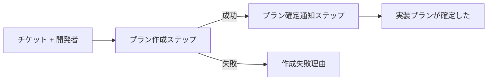

# 関数型ドメインモデル 記法ガイド

イベントストーミング Design Level で明らかになったドメインを、実装言語に依存しない擬似コード記法で形式化するための規約・テンプレートを定める。プロダクトチーム全体（エンジニア・非エンジニア問わず）でドメインモデルを読み書きし、合意形成の土台とすることを狙う。

## 目的・スコープ

- **目的**: Design Level の状態遷移・コマンド・イベントを、実装言語に依存しない擬似コードで形式化する。プロダクトマネージャー・デザイナー・ビジネスサイドを含む全員が読み書きできる記法にする
- **スコープ**: 擬似コードによる型・関数の定義まで。実装コード・特定言語の型システム（F#, TypeScript, Kotlin 等）は扱わない
- **位置付け**: イベントストーミング Big Picture → Design Level → **関数型ドメインモデル** の順に深掘りするフェーズ。本ドキュメントは第3フェーズの記法を定める
- **ベース**: Scott Wlaschin『Domain Modeling Made Functional』序盤で用いられる AND / OR 表記を採用。F# 構文には踏み込まない

## 記法の基本原則

1. **英単語キーワードは最小限**: `AND` `OR` `入力` `出力` のみ使用。`type` `of` `let` 等のプログラミングキーワードは使わない
2. **日本語の語彙を優先**: ドメインの用語（ユビキタス言語）をそのまま型名に用いる
3. **記号は控えめ**: `→` `|` `:` 程度。`->` `=>` `<>` `{}` 等は使わない
4. **階層は字下げ**: 構造をインデントで示す
5. **実装詳細は書かない**: カリー化・モナド・ジェネリクス等の言語固有の概念は持ち込まない

## 記法の読み方

### 基本記号

| 記号 | 読み方 | 例 |
|---|---|---|
| `A = B` | 型の定義。「A は B として定める」 | `プランID = 文字列`, `実装プラン = 作成中 OR 確定` |
| `A AND B` | 「A と B の両方を持つ」 | `プランID AND チケットID` |
| `A OR B` | 「A か B のどちらか」 | `作成中 OR エスカレーション中 OR 確定` |
| `A: B` | フィールドの型注釈。「A は B の型を持つ」 | `確定者: 開発者ID`, `質問内容: 文字列` |
| `A (説明)` | 自然言語による説明・内容注記 | `仕様不明点あり (質問内容を持つ)` |
| `入力: X` | 「X を受け取る」 | `入力: チケット AND 開発者` |
| `出力: X` | 「X を返す」 | `出力: 実装プランが確定した` |

### 数量の表現

| 表現 | 意味 |
|---|---|
| `X の一覧` | X を 0 個以上持つ |
| `X の一覧（1個以上）` | X を 1 個以上持つ |
| `X を持つ場合がある` | X があるかないか（省略可） |

### 型の種別は「名前の形」で判別する

本ガイドでは型の種別を名前の形で示す。記号ではなく命名規則で区別する。

| 名前の形 | 種別 | 例 |
|---|---|---|
| 名詞 | データ型・値 | `実装プラン`, `作成中プラン`, `プランID` |
| 過去形「〜した」「〜された」 | イベント | `実装プランが確定した` |
| 動詞「〜する」 | コマンド・関数 | `実装プランを作成する` |
| 「〜ポリシー」接尾辞 | ポリシー | `プラン再開ポリシー` |

命名から種別が読み取れない場合は命名を見直す。

### 読み方の例

```
実装プランを作成する:
    入力: チケット AND 開発者
    出力（成功時）: 実装プランが確定した
    出力（失敗時）: 作成失敗理由
```

→ 「実装プランを作成する」は名前が動詞なので **コマンド**。「チケット」と「開発者」を受け取って、成功した場合は「実装プランが確定した」というイベント、失敗した場合は「作成失敗理由」を返す。

## 失敗の扱い

コマンド・ワークフローの失敗は、出力を「成功時」と「失敗時」に分け、失敗理由を判別共用体（OR）で列挙する。失敗ケースをドメイン語彙として明示し、プロダクトチーム全体で業務フロー（エスカレーション、リトライ、代替案）を合意する対象とする。

```
実装プランを作成する:
    入力: チケット AND 開発者
    出力（成功時）: 実装プランが確定した
    出力（失敗時）: 作成失敗理由

作成失敗理由 =
    仕様不明点あり (質問内容を持つ)
    OR 技術方針未決 (相談事項を持つ)
```

**記述ルール**:
- 失敗理由は OR で列挙する（曖昧な文字列エラーを避ける）
- ドメイン語彙として意味のある失敗のみを列挙する。内部エラー（DB接続失敗等）は実装側の関心として分離する
- 失敗扱いの思想は Wlaschin 本の Railway Oriented Programming と整合

### 複数ドメイン変化の扱い

1コマンドで複数のドメイン変化が起きる場合、成功時に複数のイベントを AND で列挙する。

```
注文を確定する:
    入力: 注文
    出力（成功時）: 注文が確定した AND 在庫が引当てられた
    出力（失敗時）: 在庫不足 OR 与信不足
```

## 型テンプレート

各ドメインモデル文書で定義する型カテゴリと雛形を示す。

### 1. 値

ID や単純な値の型を定める。

```
プランID = 文字列
チケットID = 文字列
開発者ID = 文字列
日時 = 日時
```

**制約を持つ値**: 型と生成ルール・失敗理由をセットで書く。

```
必要Approve数 = 1以上の整数

必要Approve数を作る:
    入力: 整数
    出力（成功時）: 必要Approve数
    出力（失敗時）: 必要Approve数の作成失敗

必要Approve数の作成失敗 =
    ゼロ以下
```

**使いどころ**:
- ドメイン上意味のある ID・識別子
- 値の範囲・形式に制約があるもの（Email、日時、数量等）

**ポイント**:
- 制約は「生成ルール」の失敗理由として記述する
- 他の場所で値を使うときは「必ず生成ルールを通した値である」前提で扱う

### 2. 状態

集約の状態を OR で表現し、無効な状態組合せを排除する。

```
実装プラン =
    作成中
    OR エスカレーション中
    OR 確定

作成中プラン =
    ID: プランID
    AND チケットID
    AND タスクの一覧

エスカレーション中プラン =
    ID: プランID
    AND チケットID
    AND 質問内容: 文字列

確定プラン =
    ID: プランID
    AND チケットID
    AND タスクの一覧
    AND 確定日時
```

**ポイント**:
- 状態ごとに必要な属性が異なる場合、状態を分けて定義することで「エスカレーション中なのに確定日時がある」といった無効状態を排除できる
- 各状態型は独立したレコード（AND の束ね）として書く

### 3. コマンド

コマンドは入力を受け取り、成功時はイベントを、失敗時は失敗理由を返す。

```
実装プランを作成する:
    入力: チケット AND 開発者
    出力（成功時）: 実装プランが確定した
    出力（失敗時）: 作成失敗理由

作成失敗理由 =
    仕様不明点あり (質問内容を持つ)
    OR 技術方針未決 (相談事項を持つ)
```

**記述ルール**:
- コマンド名は動詞句（`〜する`）
- 失敗理由は OR で列挙する（曖昧な文字列エラーを避ける）
- 失敗理由が値を持つ場合は `(質問内容を持つ)` のように括弧内に自然言語で内容を注記する

### 4. イベント

イベントは AND の束ねで表現する。過去の事実であり、後から変更されない。

```
実装プランが確定した =
    プランID
    AND チケットID
    AND 確定者: 開発者ID
    AND 確定日時
```

**記述ルール**:
- イベント名は過去形（`〜した` `〜された`）
- 発生時刻を含める
- 原因となったアクター・対象を識別できる属性を持つ

### 5. ポリシー

ポリシーは「イベントの受信をきっかけにコマンドを発行する」橋渡しを表す。

```
プラン再開ポリシー:
    きっかけ: 仕様の回答が届いた
    実行するコマンド: 実装プランを作成する
```

**記述ルール**:
- ポリシー名は「〜ポリシー」接尾辞
- `きっかけ` にイベント名、`実行するコマンド` にコマンド名を書く
- ポリシーは実行するコマンドが属する集約（受け手集約）のセクションに配置する

### 6. 集約

集約は状態型と、その状態を遷移させる関数（コマンド・状態遷移）の束ねで表現する。

```
=== 実装プラン集約 ===

状態型: 実装プラン（上で定義）

状態遷移:

  エスカレーションする:
      入力: 作成中プラン AND 質問内容: 文字列
      出力: エスカレーション中プラン

  回答を受け取る:
      入力: エスカレーション中プラン AND 回答内容: 文字列
      出力: 作成中プラン

  確定する:
      入力: 作成中プラン AND 開発者
      出力（成功時）: 確定プラン
      出力（失敗時）: 確定失敗理由

確定失敗理由 =
    Approve数不足
    OR 必須タスク未完了
```

**ポイント**:
- 状態遷移は「ある状態 → 別の状態」の関数として表現する
- 成功・失敗の記述は失敗の扱い（前節）の選択に従う
- 状態遷移関数のうち外部に公開するものは「コマンド」、集約内部のものはそのまま「状態遷移」として扱う

### 7. ワークフロー

ワークフローは **外部（他コンテキスト・UI・スケジューラ等）に公開するユースケースの契約**を表す。集約内部で完結するコマンドには書かなくてよい。

```
チケットから実装に入るまで:
    入力: チケット AND 開発者
    出力（成功時）: 実装プランが確定した
    出力（失敗時）: 作成失敗理由

    ステップ:
        1. プラン作成ステップ（実装プラン集約）
        2. プラン確定通知ステップ（通知集約）
```

**記述ルール**:
- ワークフロー名は状況を表す句（動詞句 or 名詞句いずれでも可）。契約の名前として分かりやすさを優先
- `入力` `出力` はワークフロー全体の型シグネチャを示す
- `ステップ` は内部の順序付き処理を列挙。詳細な合成順は Mermaid flowchart を併用する
- ワークフロー = 外部契約。1集約内で完結し外部に出ないユースケースはコマンド + 状態遷移で十分

ステップの合成順を図示する場合:



## 不変条件・事前条件の表現

不変条件を「型で表せるもの」と「型では表せないもの」に分けて扱う。

### 型で表せるもの

- **値の制約**: 生成ルールで検査（例: `必要Approve数 >= 1`）
- **状態遷移の制約**: OR で無効な状態組合せを排除（例: エスカレーション中プランには確定日時が存在しない）
- **必須項目**: AND で必須属性として定義

### 型では表せないもの

- **外部リソースに依存する事前条件**: 関数の入力に前提状態を受け取り、失敗理由として返す
- **ドメインルール**: 関数内の条件判定として記述

```
チケットを担当する:
    入力: チケット AND 開発者 AND 現在のアサイン状況
    出力（成功時）: 担当が決まった
    出力（失敗時）: アサイン失敗

アサイン失敗 =
    既に他の開発者が担当中
    OR チケットがクローズ済み
```

現在のアサイン状況は外部リソース（DB 等）から取得する値であり、生成ルールで型に埋め込めない。関数の入力として受け取り、条件判定の結果を失敗理由で返す。

## コンテキスト境界の扱い

本コンテキスト外のイベント・コマンドは「外部イベント」「外部コマンド」として明示する。

```
外部_バグチケットが作成された =
    チケットID
    AND 起票元コンテキスト: 文字列
    AND 発見日時

外部_バグチケット作成を依頼する:
    入力: 不具合報告
    出力: 外部_バグチケットが作成された (依頼到達後に他コンテキストから受信する)
```

**ルール**:
- 外部型は `外部_` プレフィックスで明示
- 外部コマンドの「出力」は、依頼を送った後に他コンテキストから届くイベントを指す。同期的に返るのではなく、後から観測される事実として扱う
- 処理責任は他コンテキスト。本コンテキストは依頼の送出と結果の受信のみを扱う

## 命名規約

命名規則が型の種別を示す（記法の読み方「型の種別は名前の形で判別する」参照）。

- **基本は日本語型名**: Design Level 文書と用語を揃える。ユビキタス言語を尊重する
- **英単語は最小限**: `AND` `OR` `入力` `出力` のみ使用
- **データ型・値は名詞句**: `実装プラン`, `作成中プラン`, `チケットID`
- **イベントは過去形**: `実装プランが確定した`, `PRがマージされた`
- **コマンド・関数は動詞句「〜する」**: `実装プランを作成する`, `レビュー依頼をする`
- **ポリシーは「〜ポリシー」接尾辞**: `プラン再開ポリシー`
- **外部要素のプレフィックス**: 外部コンテキスト由来は `外部_` を付与

## 成果物構成（各DL向けテンプレート）

ドメインモデル文書は `docs/{domain}/domain-model.md` に配置する。**集約単位で型定義をまとめる**のが基本方針。1つの集約のライフサイクルを追うとき、その集約のセクション内で完結して読めることを重視する。

### 文書構造

```
1. スコープ
2. 概観
3. 共通値
4. 集約 A
   - 責務
   - 固有値
   - 入力イベント（他集約から）
   - 発火するイベント
   - 状態型
   - コマンド
   - 状態遷移
   - ポリシー
   - 型で表せなかった不変条件
5. 集約 B
   （同じ構造）
...
N. ワークフロー
N+1. コンテキスト境界
N+2. DL文書との対応表
N+3. モデル化で露出した論点
```

### 各セクションの役割

| セクション | 内容 |
|---|---|
| **スコープ** | 対象コンテキスト、対応するDL文書へのリンク、含む集約の一覧 |
| **概観** | 集約・主要コマンド・イベントを一望する早見 |
| **共通値** | 複数集約で参照される値のみ（`日時`, `チケットID`, `開発者` 等） |
| **集約 X の節** | その集約のライフサイクルを完結して読めるように、固有型・イベント・コマンド・状態遷移を全て含める |
| **ワークフロー** | 外部契約として公開するユースケース（集約横断のみ書く、内部完結のものは不要） |
| **コンテキスト境界** | 他コンテキスト由来の外部イベント、他コンテキストへの外部コマンド |
| **DL文書との対応表** | DL のイベント・コマンド・集約と型の対応 |
| **モデル化で露出した論点** | 型定義を試みて見つかった DL の不備・不明点 |

### イベント配置のルール

イベントは集約間の接続点だが、定義は **発火元集約のセクションに1箇所のみ置く**。

- **発火元集約**: `発火するイベント` サブセクションで型を定義
- **受け手集約**: `入力イベント（他集約から）` サブセクションで名前と参照先のみ記載（再定義しない）

これにより、各集約のセクションを読めば「何を受け取って、何を発火するか」が手元で揃う。

### 共通値の判定基準

**原則**: 2つ以上の集約で参照される型のみを「共通」に置く。

| 例 | 置き場所 |
|---|---|
| `日時` | 共通（ほぼ全イベントで使用） |
| `チケットID` | 共通（複数集約で使用） |
| `開発者` | 共通（複数集約のアクター） |
| `プランID` | 実装プラン集約固有 |
| `PRID` | PRレビュー集約固有 |
| `必要Approve数` | PRレビュー集約固有 |

判断に迷う場合は **その集約固有に置き、必要に応じて後から共通に昇格** する（重複記述を避けたいため、共通化は後からでも容易）。

### ポリシーの配置

ポリシーは「イベント受信 → コマンド発行」の橋渡し。**コマンドを発行する側の集約（= 受け手集約）のセクション** に配置する。

例: `変更要求対応ポリシー`（変更が要求された → 実装プランを作成する）は実装プラン集約のポリシー。

## Mermaid 図との併用方針

- 状態遷移図は DL 文書（`event-storming.md`）から引用し、ドメインモデル文書では再掲しない
- ドメインモデル文書は「型定義」に集中し、視覚的表現は DL 側に委ねる
- ワークフローのステップ順序など、型だけでは読み取りにくい処理フローは Mermaid flowchart を併用する

## 参考文献

- Scott Wlaschin, *Domain Modeling Made Functional*, Pragmatic Bookshelf, 2018
  - 本ガイドの AND / OR 記法は本書序盤（Part 1）の自然言語寄り擬似コードに準ずる
  - 本書後半の F# による厳密な型定義は、実装段階で各言語に翻訳する際の参考として扱う
  - Railway Oriented Programming（失敗理由を型で扱う手法）、状態遷移の OR 排除、生成ルールによる制約表現の原典
