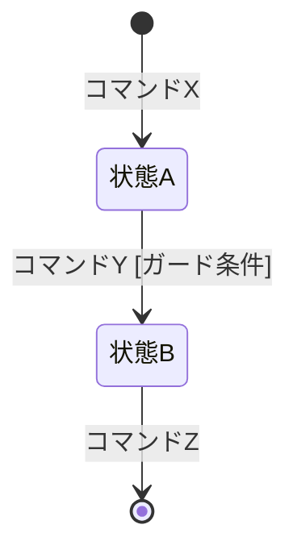

# {domain} イベントストーミング

## ドメインイベント

| # | イベント名（過去形） | 説明 |
|---|---|---|
| [番号] | [イベント名] | [説明] |

## コマンド

| # | コマンド名 | トリガーするイベント |
|---|---|---|
| [番号] | [コマンド名] | [イベント名] |

## アクター

| # | アクター名 | 種別 | 発行するコマンド |
|---|---|---|---|
| [番号] | [アクター名] | 人間/外部システム/ポリシー/時間 | [コマンド名] |

## 集約

### {集約名}

**責務**: [何を管理するか]

**含むコマンド**: [コマンド名のリスト]

**含むイベント**: [イベント名のリスト]

#### 状態遷移

| 状態 | 定義 | 遷移元 | 遷移先 |
|---|---|---|---|
| 状態A | [何をもってこの状態とするか] | - | 状態B |
| 状態B | [定義] | 状態A | 終了 |

## ポリシー

| ポリシー | トリガー | 実行するコマンド |
|---|---|---|
| [名前] | [トリガーイベント] | [コマンド名] |

## ホットスポット

| # | ホットスポット | 関連する集約/イベント | 解消アクション |
|---|---|---|---|
| [番号] | [疑問点・未解決事項] | [関連要素] | [必要なアクション] |

## 用語集（ユビキタス言語）

| 用語 | 定義 | 備考 |
|---|---|---|
| [ドメイン用語] | [定義] | [補足] |
