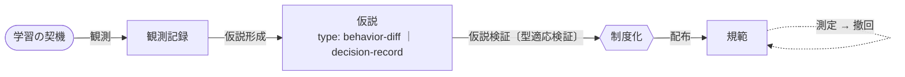
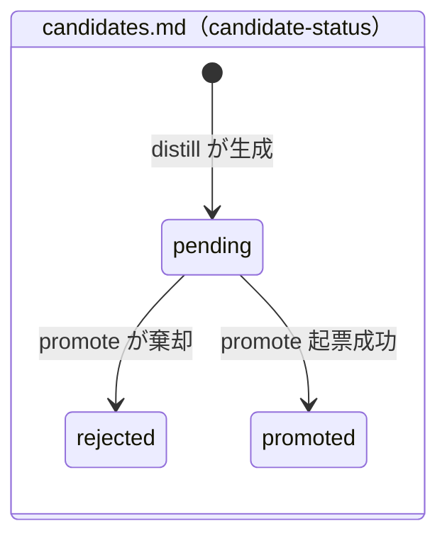

# growth プラグイン 設計ドキュメント

## ステータス

- この文書の位置づけ: 設計の母艦。確定した判断はここに集約し、横断的に再発したものだけを `docs/adr/` へ昇格させる（ADR 運用ルール「迷ったら書かない／まず判断を書き、再発で昇格」に従う）。
- 進捗の出典（単一出典）: 実装進捗・現在地は **GitHub Issue / PR**（Phase 1 = #343–#348、Phase 2–6 エピック = #349–#353）を参照する。本ドキュメントは設計の母艦であり進捗トラッカーではない——§5 ロードマップは Phase 構成と version 対応（設計属性）のみを保持し、進捗状態は持たない。チャット文脈・「次の一手」は memory `project_growth_plugin` に置く。役割分担の詳細は §6 決定事項9。
- 作成日: 2026-06-25（2026-06-26 に未決論点を確定）

---

## 1. 背景・目的

### 解くべき問題

Claude（モデル）はセッションをまたいで重みが変わらない。個体としては学習しない。実際に改善されるのは、モデルを取り巻く足場（`CLAUDE.md` / memory / skill / ADR 等の外部テキスト）である。次のセッションの Claude がより良く振る舞うなら、その源泉は足場の改善にある。

既存の memory 機構はこの足場の一部を担うが、決定的な限界を持つ。memory は個人・ローカルに閉じており、他者と共有できない。ある利用者の現場で得た学びが、他の利用者の Claude Code に届く経路が存在しない。

### 目的

現場で得た学びを持ち寄り、検証し、全利用者の Claude Code に配り返す仕組みを作る。方向は双方向である。

- 自分の現場の学び → 他の利用者の Claude Code へ
- 他の利用者の学び → 自分の Claude Code へ

これを「みんなで成長する」と定義する。本リポジトリ自体がプラグインとして全利用者へ配布されるため、この配布チャネルがそのまま「学びを配り返す」経路になる。

---

## 2. 設計原理

内省を「気付きを保存して共有する仕組み」と捉えると天井が低い。保存中心のナレッジ管理は、肥大化・未検証・効果未測定により形骸化する。本プラグインは内省を**仮説検証ループ**として設計し、以下の原理を背骨に置く。

1. **振る舞い差分を保存する（記述ではなく規範）**: 保存対象は「気付き」ではなく「次回どう違う行動を取るか」という実行可能な差分。実行不能な内省は捨てる。これにより肥大化と腐敗を構造的に防ぐ。（例外として、振る舞い差分へ畳めない一回性の判断知は決定の記録として残す。出力契約と型分類は §3。）
2. **気付きは仮説であり、検証されるまで配布しない**: 内省は幻覚しうる。未検証の気付きを全利用者へ配布することは、毒を配ることに等しい。仮説は予測を伴い、次の機会で検証され、支持されて初めて昇格する。
3. **客観痕跡 > 主観内省（痕跡ベース検出の偽陰性は復元不能性で補う）**: 自己報告は作話（confabulation）でありうる。より信頼できる教師信号は外部の客観痕跡——git revert、CI 失敗、同一指示の反復、ツール拒否、再試行の連続。内省システムは主観内省でなく客観痕跡の計測を主軸に置く。（痕跡を伴わない自発的判断知を痕跡ベース検出が構造的に取りこぼす偽陰性と、それを復元不能性で補う機構は §3「客観痕跡の取得」。）
4. **強制可能な制約 > 書かれたルール**: 最弱の学習はコンテキストにヒントを書くこと（ルールは無視されうる）。最強は「二度と起こせない構造」への変換——test・型・lint・hook・CI。覚えるのではなく、覚えなくて済むようにする。
5. **忘却・圧縮を検証と同格に置く**: 足場の肥大は注意を希薄化させ、ある点を越えると性能を下げる。学びを足場に焼くだけでなく、具体ルールを上位原理・強キャリアへ畳む能動的な**畳み込み**を行う。良い内省システムは足場を太らせず、痩せさせる。（痩せさせる操作の総称＝**整理**〔効かない・害ある学びをエントリごと物理除去する**忘却**＋テキスト規範を上位原理・強キャリアへ昇華して除去する**畳み込み**の2形〕の詳細は [`references/learning-store-spec.md`](references/learning-store-spec.md)「整理」。）
6. **フリート学習**: 一人の N セッションより、M 人の集合ログの方が豊か。共有を「配布（自分→他者）」だけでなく「集約（他者→自分）の教師信号」としても使う。
7. **via negativa（やめる学び）**: 「このルールは要らなかった」「この確認は過剰だった」という除去の気付きを最高品質として扱う。追加を競う内省は必ず肥大化して死ぬ。

加えて、共有先の決定原理を一つ持つ。

- **母集団 = 共有境界**: その気付きがどの母集団に対して予測力を持つかが、共有先を決める。証拠（再現）が母集団を広げる。

---

## 3. アーキテクチャ

### 学習ループ



凡例: 角丸＝起点（学習の契機）／四角＝知識の状態（観測記録・仮説・規範）／六角＝裁定点（制度化＝人による二段ゲート L2）／〔 〕＝動作に伴うゲート／破線＝撤回ループ。

上図がドメインモデルの正典（ユビキタス言語）。知識の状態・ドメイン動作・ゲートを domain 語で一箇所に固定し、実装の担い手は下表へ射影する。学習シグナルの価値は単一でなく2軸——**摩擦知**（環境摩擦・手続違反）と**判断知**（選好・却下理由・設計判断）——で、型は観測記録・仮説を貫く **`type` 属性**として運ばれる（fork でなく同一流路・共有ライフサイクル。ADR-20260701）。1観測が両型にまたがる混在ゾーンの partition 硬度は非排他 tag（多値 set）で確定し、`candidates.md` の `type`（単値）→ `tags`（多値 set）改称を設計決定として記録した（決定事項10・#440）。

| ドメイン概念 | 実装の担い手 |
|---|---|
| 観測 → 観測記録 | `capture`（2検出器: 予測誤差検出器・教示信号検出器）→ `captures.md` |
| 仮説形成 → 仮説 | `distill` → `candidates.md`（`type: behavior-diff｜decision-record`・`candidate-status`） |
| 仮説検証〔型適応検証〕 | `promote`（摩擦系＝予測・反証／判断系＝復元不能・有効・配布価値）→ `gh` で Issue 起票 |
| 制度化（二段ゲート L2） | `intake` → GitHub Issue ＋ refine / DoR / PR |
| 配布 → 規範 | `distribute` → learnings.md（behavior-diff）・ADR 差分（decision-record） |
| 測定 → 撤回 | 使用台帳 → 集約ダイジェスト（fan-in） |

以下は図・表が表せない理由・制約の補足のみ:

- **価値の2軸（ゲートを型に一致させる）**: 摩擦知の価値軸は再発（#417。単発は無価値、横断で「配布ルールが効いていない」が出る）、判断知の価値軸は復元不能性（捕まえないと消える）。1本のゲートで両型を測らないため promote を型適応させる（ADR-20260701）。
- **capture のフィルタ**: ハーネス強制摩擦（File-not-read ガード・worktree ガード・スキーマ検証・API 一時障害等）は既定除外。判断知は予測誤差の形を持たないため教示信号検出器で別途拾う。判断は後回しにする。
- **measure / retire**: 観測値は配布ファイルに持たせず、各コンシューマのローカル使用台帳→集約ダイジェスト（fan-in）に置く。撤回は origin 側 learnings.md からの物理除去。発火観測・使用台帳の事後解析再構成は決定事項7／[`references/learning-store-spec.md`](references/learning-store-spec.md)。
- **用語（本節が現行正典）**: 正典フレーム（`観測 → 仮説形成 → 仮説検証`）を #448 で growth 全ドキュメントへ全面反映した。旧名対応: `観測記録`（旧 観察）・`制度化`（旧 取り込み）・起点 `学習の契機`。`摩擦知`/`判断知`/`type`/`behavior-diff`/`decision-record` 等 #432 の語は維持。distill 出力単位名は ADR-20260705-2 §1 に従い『仮説』へ移行済み（旧名対応は同 ADR §1 を SoT とする。本節の語彙追随は当初 #438 が担う予定だったが、未適用のまま close したため #453 が引き取り本掃引で反映した）。学習語彙での用語見直し（`知` の位置・procedural/declarative 等）・`キャリア`/`スコープ` の日本語化は follow-up の「ユビキタス言語移行」epic（#409）へ。実装識別子（`captures.md`・`candidates.md`・`candidate-status`・各スキル名）は据え置き。**用語集（旧 glossary.md）は #409 で廃止した**——各語の定義は上記の各設計節へ集約し、本設計書が用語の唯一の正典になった（日本語正典名と英語別名の分離規約は ADR-20260705-2 §0 が保持）。glossary が担っていた drift-guard（避ける語台帳）は手動再建せず、正典（本書）＋意味レビュー＋再発 denylist の follow-up 機構へ委ねる（中間期は drift-guard 空白を許容。将来は設計書の DSL 化で用語 drift を parse error 化する方向）。

### Issue と git ファイルの役割分担

学びの共有媒体には性質の異なる2つがある。

| | Issue | git ファイル（配布物） |
|---|---|---|
| 性質 | プロセス（揉む場） | 成果物（配る物） |
| 各 Claude Code への到達 | 届かない（人間が見に行く） | 配布され自動ロード対象になりうる |
| 状態 | open / closed を持つ | コミット履歴のみ |
| 議論・再現集約 | 得意 | 不向き |
| 役割 | 確定前の品質ゲート | 確定後の配布 |

決定的な非対称性は「各 Claude Code に届くのは git ファイルだけ」という点にある。したがって配布の本体は常に git ファイルであり、Issue は確定前に揉むための前段（大きい学び・方針判断を伴う学びのみ）。小さい学びは Issue を省いて PR 直行でよい（既存の「diff 20 行未満は直接」判断と同じ軸）。

学びが共有に至る経路:

```
memory（個人・共有不可） → Issue（揉む・再現集約） → PR → git ファイル（配布） → 受け取り
```

memory と PR の間に欠けていた「共有可能な揉む場」が Issue である。個人 memory を Issue に出した瞬間に「みんなで成長」が始まる。

### 学びの2系統

| 学びの種別 | 行き先 |
|---|---|
| 任意プラグイン／コミュニティの改善還元 | 当該 repo への Issue / PR |
| 汎用の振る舞いルール・メタ手順 | growth 自身の学び置き場（配布される） |

この「種別」軸（改善還元 / 汎用ルール）は、学び置き場内の**共有境界軸**（パブリック / 閉じた ＝ universal / project-local。後述「母集団 × 適用範囲マトリクス」）とは直交する。本表下段「汎用ルール → growth 学び置き場」を、[`references/learning-store-spec.md`](references/learning-store-spec.md) が 2空間（共有境界）へ細分して具体化する（#344）。

上の2系統を配布媒体の粒度へ具体化すると、学びを載せる先は4種の**キャリア（配布先媒体）**に分かれる。キャリアは共有境界軸（空間軸 ＝ universal / project-local）とは直交する独立軸である（**キャリア軸 ⊥ 空間軸**）。

| キャリア | 配布先媒体 | 性質 |
|---|---|---|
| 強キャリア | hook / lint / test / 型 / CI・skill / CLAUDE.md | テキスト規範より強い構造的キャリア。うち hook / lint / test / 型 / CI は**機構強制**（モデルの裁量外で機械的に強制・検出する「二度と起こせない構造」。原理4）、skill / CLAUDE.md は**モデル媒介**（構造化された指示だが遵守は確率的）。learnings.md には載らず、テキスト規範から除去される（畳み込みの移送先） |
| 改善還元 | 当該 repo への Issue / PR | 任意プラグイン／コミュニティの改善（dev-workflow に限らない） |
| ADR 差分 | ADR ファイル | 判断知（decision-record）を設計判断の記録として配布 |
| learnings.md | growth 学び置き場 | テキスト規範として配布される最も弱いキャリア |

- **キャリア（career-hypothesis）**: 仮説形成（distill）が仮説へ付与する「配布先キャリア ＋ 宛先 repo」の仮説タグ（`<career> / repo: <宛先 repo 仮説>` の1行）。スコープと対称・直交。distill 時点では確証せず、キャリアと宛先 repo の最終裁定は集約点（取り込み Issue）が担い、promote はルーティング不可知に運ぶ（ADR-20260628-2）。4分類の判定表は [`skills/distill/references/distill-procedure.md`](skills/distill/references/distill-procedure.md)（「career-hypothesis の判定（決定表）」）を SoT とする。

### 保存設計

学習ループを流れるデータは **観測記録**（旧 観察 / `observation`。観測が記録した事実のみの記録——解釈・原因分析・対策を含まない＝生記録性）→ **仮説**（仮説検証待ちの振る舞い差分。`candidates.md` のエントリ）→ **規範**（learnings.md の見出し一文＝テキストとして配布される最も弱いキャリア）と姿を変える。貫く学びの核は **振る舞い差分**（「次回どう違う行動を取るか」を一文で表す実行可能な差分。原理1）。これらが載る成果物 `captures.md`（観測記録置き場）・`candidates.md`（仮説ファイル。観測記録置き場でも learnings.md でもない第3の成果物）・`learnings.md`（学び置き場）の役割・パスは、射影テーブル（上記「学習ループ」）と各 spec（personal-store-spec.md / learning-store-spec.md）が持つ。

- **学び置き場の形式**: 単一の人間可読ファイル。学びを1ファイルに集約することで全体を一覧でき、肥大が一目で分かる。これが原理5（足場を痩せさせる）の前提になる。内容モデル——2面（origin 権威 / consumer 読み取り専用ミラー）・fan-out 配布と fan-in フィードバックの分離・配布の2空間（パブリック / 閉じた）・per-entry は振る舞い差分（規範）の1欄・忘却は物理除去——および配置・ライフサイクルは [`references/learning-store-spec.md`](references/learning-store-spec.md) で確定（#344）。
- **個人 store**: 生の観測は個人ローカル（memory 等、共有されない）に置く。検証を経て共有価値が確認されたものだけ committed へ昇格させる。二段ゲート（保存＝ローカル自動 / 仕組み化＝committed）と整合し、未検証ノイズをリポジトリに入れない。memory の欠点は「昇格経路を必ず持つ」ことで克服する——ローカルは出発点であって終点ではない。具体形式・置き場・状態管理は [`references/personal-store-spec.md`](references/personal-store-spec.md) で確定（#345）。
- **個人 store のエントリ状態（実装層の正典モデル）**: 状態軸は候補側 `candidate-status` の1本に集約する。`captures.md` は無状態の append-only 観測コーパスであり、エントリ単位の状態フィールドを持たない（ADR-20260711）。`captures.md` と `candidates.md` は `provenance`（由来＝`captures.md` の `## <timestamp>` 見出し）で結ばれるが、これは同一性追跡のためであり状態同期のためではない。distill が処理すべき観測の選定（処理源選択）は、provenance 導出（`promoted`/`pending` 候補を持つ観測の除外）と distill 専用の処理済みカーソル（`distill-state.md` の `distill-cursor`）の合成で有界化する（ADR-20260711-2〔ADR-20260712 が restate〕）。promote（仮説検証）が Issue 起票に成功すると `candidate-status` のみを前進させ、`captures.md` は書き換えない。値のスキーマ詳細は [`references/personal-store-spec.md`](references/personal-store-spec.md) が SoT（#345、ADR-20260711 / ADR-20260711-2〔ADR-20260712 が restate〕）で、下図は状態遷移の正典。



  - **`captures.md` は無状態、distill の処理済みカーソルが有界化を担う**: `captures.md` は append-only の観測コーパスであり、旧 `status`（再走査抑止フラグ）のようなエントリ単位の状態フィールドを持たない（ADR-20260711）。distill の再走査範囲は、専用ファイル `distill-state.md` の `distill-cursor`（ISO8601 timestamp）と provenance 導出（`promoted`/`pending` 候補を持つ観測の処理源からの除外）の合成で有界化する。カーソルは distill が処理後に今回走査した観測の最新 timestamp へ前進させ、前進主体は distill のみ（promote はカーソルに触れない）（ADR-20260711-2〔ADR-20260712 が restate〕、[`references/personal-store-spec.md`](references/personal-store-spec.md)）。
  - **`candidate-status`**: `pending`（検証待ち・既定）/ `rejected`（promote が棄却）/ `promoted`（promote が起票成功後に必須で付与。付与しないと pending のまま二重起票を招く）の3値。状態軸はこの1本に集約する。
  - **`provenance`（由来）**: 仮説の出自を追跡するメタ。値は `captures.md` の `## <timestamp>` 見出し。distill の upsert・処理源選択の同一性判定、および promote の `candidate-status` 前進で同一性判定に使う（避ける語: 出自キー・由来参照）。

### 客観痕跡の取得

原理3（客観痕跡 > 主観内省）の摩擦知側の実装。痕跡はソースごとに取得時期が異なる。取得は hook によるリアルタイム検知ではなく、セッションログの事後解析を主軸とする（hook は発火タイミングと状態管理が複雑なため）。なお判断知のうち**リアクティブ**なもの（当方の出力への応答として現れる訂正・理由付き却下）は会話に痕跡を残し痕跡ベースでも捉えうるが、**プロアクティブ**な表明（自発的な選好・目標宣言）は痕跡を伴わないことがあり、痕跡ベース検出はこれを構造的に取りこぼす——判断知の型の性質でなく痕跡ベース検出のカバレッジ限界（偽陰性）である。これを capture の教示信号検出器が復元不能性を基準に別途観測して補う（精緻化された原理3）。

| 痕跡 | ソース | フェーズ |
|---|---|---|
| 会話内（拒否・訂正・再試行） | 現セッションの会話履歴 | Phase 1 |
| 横断的な再発パターン | 過去セッションログの解析 | Phase 3 |
| git revert | git log | Phase 3 |
| CI 失敗 | CI 連携 | Phase 3 以降 |

過去ログの横断解析は原理2（再現したら本物）と原理6（自分の過去セッション群＝個人版フリート学習）を満たす。

### 二段ゲート

| 段 | 行為 | ゲート |
|---|---|---|
| ナレッジ保存 | 気付きを分類して蓄積 | 無ゲート（自動） |
| 仕組み化 | 将来の振る舞いを変える形（ルール / skill / CLAUDE.md / PR）へ | 承認 または マルチエージェントレビュー |

記述的ナレッジ（受動）は自動、規範的な仕組み（能動）はレビュー必須。この分界が昇格点に立つゲートを定める。

この二段ゲートは新規概念ではなく、既存の自律度モデル L0–L3（ADR-20260601 / ADR-20260602-2）の承認ゲート軸で表現する。ナレッジ保存＝L3（AI 自律・承認段が縮退）、仕組み化＝L2（提案→承認の二段、Proposed→Accepted と同型）。Phase 4 のマルチエージェントレビュー化は、ADR-20260602-2 が述べる「検証能力の成熟に伴う L2→L3 移動」の具体例にあたる。

### 母集団 × 適用範囲マトリクス

共有境界は「誰」軸と「適用範囲」軸の2軸で決まる。

| 誰 ＼ 範囲 | このPJ / リポ | 全PJ |
|---|---|---|
| 個人 | project memory（共有不可） | user CLAUDE.md（共有不可） |
| チーム | 共有リポの CLAUDE.md / ADR | チーム内 private marketplace |
| 全世界 | （該当稀） | public plugin（本リポジトリ） |

共有は「コミットされた配布物」でしか発生しない。memory と user CLAUDE.md は個人・ローカルであり、共有のデッドエンド。越境の本質は「ローカルなナレッジを配布物へ移送すること」である。

配布物（学び置き場）の**2空間**——パブリック/グローバル（全世界 × 全PJ ＝ public plugin セル）と閉じた空間（チーム/プロジェクト ＝ チーム行のセル）——は、本マトリクスのうち**コミットされた配布物が成立するセル**を Route 粒度で畳んだもの。個人行は共有のデッドエンドであり学び置き場では扱わない（既存 memory 機構が担う）。詳細は [`references/learning-store-spec.md`](references/learning-store-spec.md)（#344）。

---

## 4. プラグイン構成

growth プラグインは2つの顔を持つ。

1. **エンジン**: 学習ループの各段を担うスキル群。1段＝1スキルで関心を分離し、段ごとに別タイミングで起動する。
   - `capture` スキル（Capture）: 現セッションの会話履歴から摩擦知（予測誤差検出器）と判断知（教示信号検出器）の2種を検知し、生観察を個人ローカル store に記録する。
   - `distill` スキル（Distill＋Route 統合）: store に溜まった未処理の生観察を Capture と非同期にバッチで仮説形成し、クラスタ化・重複排除して仮説へ変換する。出力は知識型に応じた2系統——摩擦知は実行可能な振る舞い差分（`type: behavior-diff`）、判断知は文脈付き決定知（`type: decision-record`＝decision / rejected-alternatives / rationale / context。behavior-diff 要求と N 再発カウントを免除）。各仮説に**スコープタグ**（`project-local` / `universal`）・**career 仮説タグ**（昇格先キャリア＋宛先 repo の仮説）・provenance を付与し、仮説ファイル（`candidates.md`）へ永続化する（Route をタグ付与として統合。scope・career とも仮説どまりで、確定（裁定）は集約点に置く。仮説永続化までで責務を終える）。
   - `promote` スキル（Promote・新規）: `candidates.md` の仮説を検証し（原理2＝未検証を配布経路に乗せないフィルタ。検証は `type` で適応し、behavior-diff は予測・反証、decision-record は「復元不能で・まだ有効で・配布価値があるか」を検査する）、検証通過仮説を `gh` で**自動起票**（起票前ゲートなし）して既存ワークフローへ疎結合に渡す。起票成功後に候補側 `candidate-status` を `pending → promoted` へ前進させる（`captures.md` は無状態のため書き換えない。ADR-20260711）。promote は**ルーティング不可知**で、distill の scope・career 仮説を昇格 Issue 本文へ注記として運ぶのみ（career の裁定は行わない）。L2 承認は起票後の既存ワークフロー（refine-issue / DoR / PR レビュー）が担う。
   - 残る Distribute（検証済みの学びの `learnings.md` への物理昇格）は後続 Phase（Phase 2）。検証を経た仮説は Issue 起票（小さければ PR）として既存ワークフローに渡す。昇格 Issue のテンプレートは [`references/promotion-issue-spec.md`](references/promotion-issue-spec.md)（#382）で定義する。昇格先キャリアは distill が仮説単位で生成し、確定（裁定）は集約点（取り込み Issue）で人間が行う（career 決定モデルは ADR-20260628-2。#382 は本決定に合わせ再定義予定）。出来事ベースの昇格 Issue を `learnings.md` の1欄エントリへ翻訳する変換規約は [`references/learning-promotion-spec.md`](references/learning-promotion-spec.md)（#383）で定義する。
2. **配布物**: 蓄積された汎用の学び置き場。プラグイン配布によって全利用者の Claude Code に届く学びの実体。

dev-workflow との接続は疎結合とする。エンジンは `gh` で直接 Issue を起票し、その Issue は既存の `refine-issue` / DoR に乗る。スキル同士を直接呼び出さない（各スキルは store／学び置き場というファイルを介して疎に連結する）。足すのはプラグイン1個であり、繋ぎ先（create-issue → refine-issue → plan-issue → implementation、PR レビューは pr-review-toolkit）はすべて既存資産。

本リポジトリ自体が全世界への配布チャネルであるため、「内省 → 仮説 → 検証 → 反証レビュー（既存）→ マージ → 全利用者へ配布 → 効果測定」という閉ループが、新規の仕組みをほとんど足さずに既存資産で閉じる。

---

## 5. ロードマップ

理想形（フル自発・チーム配布・マルチエージェントゲート）へ向け、価値を早く・リスク低く出す順に分割する。

| Phase | 内容 | 何が増えるか | version |
|---|---|---|---|
| 0 | 本設計ドキュメント。原理・スキーマ・境界モデルの固定 | 共通言語 | —（plugin.json 未登録） |
| 1 | エンジン最小: `capture` 明示起動（拾う → 検証 → Issue 起票 / 小さければ PR）。痕跡は現セッションの会話履歴。生の観測は個人ローカル、検証後に committed。学び置き場は単一可読ファイル | 学びの観測と共有開始 | 0.1.0 |
| 2 | 手動ゲートでの昇格: Route + 承認で配布物へ | ナレッジ → 行動変化 | 0.2.0 |
| 3 | 自発トリガー（機構は実装時決定）＋セッションログ横断解析＋git revert 取得 | 自発性と客観痕跡 | 0.3.0 |
| 4 | マルチエージェントレビュー化: 承認ボトルネックを置換 / 補強 | 人手なしで越境スケール | 0.4.0 |
| 5 | チーム / 組織配布: team private marketplace を Route 対象に追加 | 共有範囲の拡大 | 0.5.0 |
| 6 | メタ学習: 内省の仕組み自体（検知基準・昇格閾値）を内省対象に。仕組み変更は人間ゲート必須 | 自己改修 | 0.6.0 |

> **version 規約**: 表の version は `plugin.json` の値。Phase 完了ごとに minor を上げる（Phase N 完了 → `0.N.0`）。Phase 内のバグ修正・スキル調整・配布物フォーマットの破壊的変更は patch。pre-1.0 は配布物（`learnings.md` / `captures.md` スキーマ）フォーマットの非安定を semver 的に表現し、ループが Capture→Retire まで一巡して実運用で安定したら 1.0.0 とする。version の正は `plugin.json`（marketplace / plugin.json は Phase 1 で同時登録）。詳細は §6 決定事項9。

設計上の新規性は「配布物への移送パイプライン」（個人ローカルから共有配布物への昇格）に集中する。個人境界（memory / user CLAUDE.md）は既存機構が担う。

---

## 6. 決定事項

2026-06-26 に論点1〜6を以下のとおり確定した。

1. **学び置き場の形式**: 単一の人間可読ファイル。全体を一覧でき、肥大が見えるため原理5（足場を痩せさせる）に資する。内容モデル（2面・fan-out/fan-in 分離・配布の2空間・1欄スキーマ・忘却＝物理除去）・スキーマ・配置（パブリック空間の確定パス `plugins/growth/learnings.md`）・ライフサイクルは #344 で確定（[`references/learning-store-spec.md`](references/learning-store-spec.md)）。
2. **客観痕跡の取得手段**: 現セッションの会話履歴は Phase 1、過去セッションログの横断解析と git revert は Phase 3、CI 失敗は Phase 3 以降（要連携・価値検証後）。取得は hook リアルタイム検知ではなくログ事後解析を主軸とする。なお過去セッションログは既定 **30 日でローテーション消滅する揮発資産**（`cleanupPeriodDays` 既定 30 日。#378 で確認）であり、横断解析は「消滅前にシグナルを抽出して個人 store に永続化する」ことを前提とする。Phase 3 の自発トリガーは取りこぼし回避のため 30 日より十分短い周期で走査する設計ドライバを持つ（決定事項4 に接続。形式詳細は [`references/session-log-format.md`](references/session-log-format.md)）。
3. **個人 store の置き場**: 生の観測は個人ローカル（共有されない）に置き、検証を経たものだけ committed へ昇格させる。昇格経路を必ず持つことで memory の「個人で終わる」欠点を克服する。具体形式・置き場（`~/.claude/projects/<project-id>/growth/captures-YYYY-MM-DD.md`〔日付バケットのセグメント〕、per-project）・状態管理・有界保持（retention）は #345 / #485 で確定（[`references/personal-store-spec.md`](references/personal-store-spec.md)）。
4. **`capture` の自発性レベル**: 明示起動（Phase 1）から始め、自発化は Phase 3。Phase 3 の本質的論点は機構（SessionEnd hook か Routines か）ではなく、ナレッジ抽出の**解析単位と UX**である（2026-06-27 確定、#350）。単一セッション内の確認と複数セッション横断の一括確認を併存させ（抽出精度の中核は横断解析＝原理2・6）、ライブセッションに相乗りして解析する UX の適否は要検証とする（→ 後掲 2026-06-28 の追補「4-補」で mid-session 割り込み型を不採用と確定）。なお本 UX 論点は決定事項2 の取得手段軸（リアルタイム検知 vs 事後解析）とは直交する——ライブ相乗りを採っても痕跡の取得はセッションログの事後解析のままであり、決定事項2 / §3「客観痕跡の取得」は変わらない。ただしライブ相乗りをリアルタイム痕跡観測まで踏み込ませる変種を採用する場合は、決定事項2 / L105「事後解析を主軸」を見直す可能性がある。機構・#160 の nightly Routine 基盤への相乗りは実装段階の詳細とし、本設計では固定しない。各機構（SessionEnd hook / Desktop scheduled task / `/loop` / OS ネイティブスケジューラ / クラウド Routine）の発火仕様・取得可能データ・解析単位への適合と非対称性は #379 で対称に調査済み（[`references/auto-trigger-spec.md`](references/auto-trigger-spec.md)）。機構選定の決定的な非対称性は2つ: (1) クラウド Routine はローカル `~/.claude/projects/` にアクセスできず横断解析に不適、(2) Desktop scheduled task は macOS/Windows のみで Linux 不可。CLI/Linux 環境（本リポジトリを含む）の横断機構は OS ネイティブスケジューラ＋`claude -p` が既定解。
5. **チーム層**: team private marketplace の実運用を想定する。Phase 5 を本設計の対象とする（共有リポの CLAUDE.md / ADR への縮退ではない）。
6. **メタ学習**: 内省の仕組み自体（検知基準・昇格閾値）の改善を Phase 6 として組み込む。仕組みの変更は必ず人間承認ゲートを通す。

2026-06-27 に論点7（活性化モデルと発火観測）を #380 で確定した。

7. **活性化モデルと発火観測**: #380（Phase 3 の子チケット）で確定。
   - **活性化モデル＝時間軸折衷**。Phase 1–2 は SessionStart hook で `learnings.md` 全文を常時注入する（到達最強・最小実装）。Phase 3 で Measure に着手する際、見出し index は hook 注入のまま残し、本文を読み込み専用スキル経由のオンデマンドロードへ連続移行する。hook を残したまま本文経路だけスキル化するため、後戻りコストが小さい。
   - **発火観測＝可能**。本文をスキル経由にすることでアクセスがツール使用ログ（客観痕跡。§3「客観痕跡の取得」）として残る。**使用台帳はこのツール使用ログから事後解析で再構成する派生ビュー**であり（決定事項2 / L105「事後解析を主軸」と整合。リアルタイム記帳ではないため、hook が避けた発火タイミング・状態管理の複雑性を持ち込まない）、読み込みスキルは痕跡の生成源として機能する。再構成された各コンシューマのローカル台帳は集約ダイジェスト（fan-in。§3 Measure）へ還流する。粒度はスキルが返したエントリ ID ＝発火（段2）に止め、偽陽性は効果測定（revert 再発・同一指示反復＝段5）で補正する。発火×効果の2点測定で Retire を判断する。Phase 3 で実装。
   - **論拠**: 到達保証と発火観測可能性は二律背反である（常時注入は到達最強だが全エントリ常時ロードで「載った」が発火信号にならない。スキル経由はアクセスがログに残るが起動判断依存で到達が落ちる）。時間軸で分離して両立させる。強制力のはしご（原理4）の各段は固有の発火痕跡を持つ（skill / agent＝ツール使用ログ、hook＝hook 実行ログ）が、最下段 learnings.md だけが常時注入だと痕跡を持たない。本文をスキル経由にすればはしご上段（skill / agent / hook）で観測が統一される。ただし最下段 learnings.md の見出し層（規範本体）は Phase 3 でも常時注入のまま痕跡を持たないため、原理3（観測可能性）との整合は本文ロード層に限られる（下記「発火観測の偽陰性リスク」を参照）。
   - **発火観測の偽陰性リスク（Phase 3 未決）**: spec の1欄スキーマでは見出しが規範本体（振る舞い差分の一文要約）で、本文はその理由。一方 Phase 3 活性化モデルは見出し index を常時注入のまま残し本文のみスキル経由とするため、見出しだけで効く学びは本文をロードせず、発火（段2＝本文ロード）の痕跡を残さない。結果、効果があるのに発火が低く出て Retire されうる（偽陰性）。本文側の偽陽性は効果測定で補正するが、こちらは逆方向の誤差で未手当てである。Phase 3 実装前に次のいずれかで Retire の判定根拠を補強する: (a) 発火定義を本文ロードに限らず見出し層の注入痕跡（hook 実行ログ等）も拾う、(b) 見出し index もスキル経由化して全段をログ化する（活性化モデルの再検討）、(c) 過小計上を許容し効果側主導で Retire するなら「発火×効果の2点測定」前提自体を見直す。
   - **エントリスキーマへの波及**は [`references/learning-store-spec.md`](references/learning-store-spec.md) に記録。専用トリガ欄は不要（既存の領域・状況の選択軸で本文選択を代替し簡潔さを維持）、安定 ID は使用台帳の参照キーとして Phase 3 で必須化する。

2026-06-28 に決定事項4 の要検証 UX 論点（ライブセッション相乗り解析の適否）を #381 で確定した。

4-補. **ライブ相乗り解析 UX の適否**: ユーザーのセッション実行中に割り込んで解析・提示する mid-session 型の相乗りは**不採用**とする。「ライブ相乗り」を「ユーザーのライブ作業に割り込まない、セッション境界・別時間での自発解析」と再定義し、決定事項4 の併存設計（単一＝SessionEnd hook、横断＝ローカルスケジューラ）をそのまま採用形とする。

   - **定義の分解**: 「ライブ相乗り」は〔計測タイミング: 実時間での痕跡観測 vs 事後ログ解析〕と〔提示タイミング: セッション中の割り込み提示 vs セッション境界・別時間での提示〕という2つの直交軸を混同していた。UX 論点の本体は提示軸の in-session（割り込み）であり、計測軸は決定事項2 で事後解析に確定済みである。
   - **不採用の論拠（原理的根拠）**: (1) 即時性の便益は弱い。本設計の抽出精度の中核は横断解析＝原理2・6（再現したら本物 / フリート学習）であり、精度は単一セッションの鮮度ではなく複数セッション横断の再現から得る。さらに本設計の観測は決定事項2 でログ事後解析に確定しているため、提示タイミング（mid-session か境界か）は観測される候補シグナルの recall にも影響しない——シグナルはログに残り抽出パスが拾うため、recall を左右するのは抽出走査の頻度（30 日ローテ前に拾えるか）であって提示軸ではない。よって提示軸の即時性は precision にも recall にも寄与しない。なお「mid-session 提示はユーザーのその場確認・訂正を能動的に誘発し、受動ログに存在しない新規の再現シグナルを生むため precision にも寄与する」という異論はありうるが、in-session でのユーザー確認の誘発は原理3（客観痕跡 > 主観内省）が退ける主観内省の要求であり、この経路自体を本設計は採らない。(2) 妨害コストは実在し、かつ横断照合前の未検証・低精度シグナルで割り込む二重ペナルティを伴う。(3) 横断一括確認は構造的にバッチ（複数セッションのログを要し週次・ローカル必須＝#379）であり、単一ライブセッションへの相乗りとは非両立。「ライブ」が意味を持つのは単一セッション内確認のみで、そこでも SessionEnd 境界での観測で足りる。
   - **機構の有無に依存しない（補足）**: mid-session 割り込みを担う発火機構は #379 で確立していないが、これは現時点の実装ギャップ（機構を作れば消える可逆な制約）であり、不採用の原理的根拠ではない。仮に将来 mid-session 機構が確立しても、上記 (1)-(3) により不採用は揺るがない。
   - **決定事項2 との関係**: 採用形は提示を境界・別時間に置き、計測は事後ログ解析のまま据え置くため、**決定事項2 / L105「事後解析を主軸」の見直しは不要**。決定事項4 が留保した「リアルタイム痕跡観測まで踏み込む変種は決定事項2 の見直しを要する」はそのまま生きるが、本判断はその変種を採らない。
   - **compaction 耐性（補強）**: 会話の compaction（コンテキスト圧縮・`/compact`）はオンディスクの JSONL を書き換えず、compaction 前の生エントリは追記専用ログに残る（[`references/session-log-format.md`](references/session-log-format.md) §6、2026-06-28 検証）。よって事後解析主軸（決定事項2）の採用形は compaction に対して構造的に頑健で、抽出精度は劣化しない。逆に mid-session ライブ相乗りがモデルのコンテキストから信号を読む設計だと、compaction 後はコンテキストに要約しか残らず生信号を失い抽出精度が劣化する——これも不採用の補強になる。ただし抽出器は session loader の patched chain を経由せず raw JSONL を全行スキャンすること（実装要件、session-log-format.md §6）。
   - **将来の見直し条件（Phase 3 実測）**: 本判断は実プロダクト・実ユーザー不在の現時点での演繹（原理・制約・#379 の機構非対称性からの論証）であり、Phase 3 で次を実測して再評価する。(a) SessionEnd 境界での提示で文脈鮮度が実用上十分か。(b) mid-session 提示の便益が妨害コストを上回るユースケースが実在するか。(b) は性質の異なる2経路に分けて扱う——(b-1) 未検証シグナルの即時提示は論拠(1)(2) で否定済み。(b-2) 既に横断検証を経た学びを関連する瞬間に just-in-time で差し出す経路（例:「このパターンは過去に再現済み、学習済みルールはこれ」）は低精度割り込みではなく論拠(2) が当たらないが、これは capture/reflect（本 spike の解析単位と UX）ではなく deliver / 活性化層（決定事項7・#380）の論点であり、本 spike のスコープ外として deliver 層で別途検討する。危険操作の即時検知のような real-time guard 機能も capture/reflect とは別系統でスコープ外。(b-2) が deliver 層で便益を実証した場合に限り、限定的な live 提示を再導入しうる。

2026-06-28 に Promote 段の実装（#348）に伴い、段マッピングと検証→起票モデルを以下のとおり確定した。

8. **Promote 段の段マッピングと検証→起票モデル**（#348）:
   - **`reflect` には検証・Route・Promote を追加しない**。reflect/distill 分離（#347 / PR #377）後、reflect は Capture 専任（パイプライン最上流）であり、Distill 出力を消費する下流段は論理的に reflect に同居しない（「1段＝1スキル」）。
   - **Route を `distill` へ統合する**。仮説形成は「どの観点（project-local / universal）で仮説形成するか」の視点を本質的に要するため、スコープタグの付与は Distill と密結合（[`references/learning-store-spec.md`](references/learning-store-spec.md)「仮説形成は project-local と universal の2観点に分かれ…」が裏付け）。distill の責務境界を1段拡張し、仮説を `candidates.md` へ provenance・scope 仮説タグ付きで永続化する。**career（昇格先キャリア）仮説タグの付与も同様に distill の責務とする**（scope と対称・直交。Route→distill 統合を career についても完成させる）。career の確定（裁定）は promote ではなく集約点（取り込み Issue）で行い、promote はルーティング不可知に運ぶのみとする（ADR-20260628-2）。
   - **`promote` スキルを新規作成する**。Route が distill 側へ移るため、新規スキルはループの Promote 段そのもの（検証＋自動起票＋`candidate-status` 前進）になる。
   - **スコープは仮説タグのまま終点とし、確証しない**。適用範囲は Phase 1 でも経験的に確証できず、Phase 3 でも自動確証は約束されない。最終裁定は人間（refine/review）、横断解析は支援証拠どまり。
   - **`candidate-status` 前進の実行主体は `promote`**（**supersede 注記**: 本項は元は「`status` 反転〔`unprocessed → promoted`〕の実行主体は `promote`」としていたが、`captures.md` の状態フィールド `status` は ADR-20260711 で廃止され、それに伴い captures 側への反転責務（#348）も同 ADR（決定1・Consequences）で moot 化した。以降は本文のとおり候補側 `candidate-status` の前進のみを主体とする）。起票成功後にのみ provenance 経由で候補側 `candidate-status` を `pending → promoted` へ前進させる（`captures.md` は書き換えない。起票失敗・仮説棄却・ゲート拒否時は前進しない）。[`references/personal-store-spec.md`](references/personal-store-spec.md) が #348 に名指しで defer した昇格主体を promote と確定した判断自体は有効のまま、状態モデルの正典は ADR-20260711 / ADR-20260711-2〔ADR-20260712 が restate〕に移った。
   - **起票前に人間承認ゲートを置かず自動起票する**。検証段（原理2）が未検証仮説のフィルタとして残るため未検証の配布は防げる。L2 の規範的ゲートは起票後の既存ワークフロー（refine-issue / DoR / PR レビュー）が担う（起票前ゲートは自動化を阻害し下流ゲートと二重になる）。マルチエージェントレビュー化は Phase 4。
   - **照合監査ループ**（学びが置き場へ移ったか ADR/プラグインと定期照合）は Measure/Retire 寄りの別関心としてパーキング（follow-up）。

2026-06-28 に Phase とバージョンの対応、および進捗の単一出典を確定した。

9. **バージョニング規約と進捗の単一出典**:
   - **Phase = minor**。`plugin.json` の version は Phase 完了ごとに minor を上げる（Phase N 完了 → `0.N.0`、Phase 1 → 0.1.0 … Phase 6 → 0.6.0）。Phase 0 は plugin.json 未登録（marketplace / plugin.json は Phase 1 で同時登録）。Phase 内のバグ修正・スキル調整・配布物フォーマットの破壊的変更は patch。pre-1.0 は配布物（`learnings.md` / `captures.md` スキーマ）フォーマットの非安定を semver 的に正しく表現する。ループが Capture→Retire まで一巡し実運用で安定したら 1.0.0。version の正は `plugin.json`。
   - **進捗の単一出典＝GitHub Issue / PR**。実装進捗の正は Issue / PR（Phase 1 = #343–#348、Phase 2–6 エピック = #349–#353）に置く。**DESIGN.md は進捗を一切保持しない**——§5 ロードマップは Phase 構成と version 対応（設計属性）のみを持ち、進捗状態の列を持たない。§ステータスも現在地を書かず Issue / PR を参照する。チャット文脈・「次の一手」は memory `project_growth_plugin` が担う。三者の役割を分離し、従来 §ステータス・§5「状態」列・memory の 3 箇所に分散していた進捗記述を SoT 一本化する。DESIGN 側に写しを持たないため、Phase 遷移時の更新漏れによる乖離（origin/main で実際に「実装は未着手」のまま放置されていた事象）が構造的に起きない。
   - **ADR 化は不要**。運用ルールであり後戻りコストは限定的。本決定事項＋§5 の記述で足り、§7 の ADR 化候補には挙げない（ADR 運用ルールの粒度判定 3 点未満）。

2026-07-05 に混在ゾーン（1観測が両知識型にまたがる領域）の partition 硬度を #440 で確定した。

10. **混在ゾーンの partition 硬度＝非排他 tag**（#440。ADR-20260705-2 decision 2 が委譲した未決事項を確定）:

   本決定事項は自セクションを ADR-20260705-2 の現行正典語彙（観測＝capture / 仮説形成＝distill / 仮説検証＝promote / 仮説 / スコープ・キャリア）で記述する。他セクション（§3 図表・他決定事項）の語彙追随は #438 が担い、本決定では行わない。英語実装識別子（`candidates.md`・`behavior-diff`・`decision-record`・`type`/`tags`）は据え置く（ADR-20260705-2 原則0）。

   - **代表パターン（混在ゾーンの実在）**: 混在ゾーン＝1観測が `behavior-diff`（摩擦知）と `decision-record`（判断知）の両知識型にまたがる領域。知識型は #439 の直交性（検出方法 HOW ⊥ 価値族。検出器が拾った信号の値の帰属は 1:1 でない＝ADR-20260705-2 decision 2 注記）の帰結として構造的に不可避に生じる。signal 値域（判断群: 選好 / 却下理由 / 目標表明 / 設計判断、摩擦群: 訂正 / ツール拒否 / 反復試行 / 期待違反 / 客観痕跡）に接地した代表パターンを2型に分けて示す。
     - **時間解決型（初回は判断知、再発で摩擦知が顕在化）**: user が設計判断を却下理由つきの訂正として述べる観測（例:「プランは追跡対象にしない——追跡可否は利用者に委ねられている」）。初回は教示信号検出器（価値語では旧「判断知検出子」。ADR-20260705-2 検出器名同定注記の HOW 軸命名を正典とする）が却下理由（判断群 signal）として拾い、復元不能な設計境界＝`decision-record` として読める。同一トリガー（プランを追跡対象にしようとする振る舞い）が後続セッションで再発すると、予測誤差検出器（旧「摩擦検出器」）が訂正の反復（摩擦群 signal の N 再発）として拾い、「配布した規範が効いていない」摩擦知＝`behavior-diff` の価値軸（再発）も帯びる。同一の根観測が時間を経て両検出器・両価値軸で読める。
     - **同時型（1観測内に両群の signal が読める）**: user が訂正（摩擦群 signal）に却下理由・設計判断（判断群 signal）を同一発話で添える観測（例:「`git checkout` でなく `git restore` を使え——checkout はブランチ切り替えと混同して危険だから」）。訂正は次回の振る舞い差分（`behavior-diff` の一文規範）として読め、同時に却下理由は「なぜ checkout を避けるか」の rationale / rejected-alternatives（`decision-record` の構造化欄）として読める。1観測の signal 集合が摩擦群・判断群の双方に交わり、知識型導出（signal がどちらの群か）が両型で成立する。
     - **機序の核**: いずれも「1観測の signal 集合が両群に交わる」（同時型）か「同一観測が時間軸で両価値軸を帯びる」（時間解決型）ために生じる。混在ゾーンは例外ではなく #439 直交性の帰結であり、単一 type へ倒す設計はこの構造を平板化する。

   - **partition 硬度＝非排他 tag（J1 確定）**: partition 硬度を**非排他 tag（多値 set）**で確定する。選択肢 A（単一 type へ倒す＝排他）/ B（非排他 tag）/ C（provenance 共有の2仮説へ分割）のうち **B** を採る。
     - **根拠**: 知識型は摩擦知／判断知の2直交属性（#439）であり、2直交属性の忠実な表現は集合（tag）であって enum（type）ではない。enum は2次元を1次元へ落とす非可逆エンコードで、混在ゾーン（直交の帰結＝構造的に不可避）に平板化または N 再発トラッキング喪失の**二重損失**（ADR-20260701 が是正した偽陰性・平板化の再来）を再導入する。A はこの二重損失を招く。C は `candidates.md` の provenance キー一意性（upsert 冪等の前提）を崩す。
     - **廃止されるのは排他制約であって、`behavior-diff` / `decision-record` のカテゴリ自体は tag 値として存続する**。`type` は tag の要素数1特殊ケースであり、tag が type を包含する（確信ケースは要素数1タグで表せるため type を別途持つ必要がない）。#441 の裁定基準「分類の体系的確度が十分なら type、不十分なら tag」も、tag が表現として必須であることを認めている（確信ケース＝要素数1）。

   - **仮説形成（distill）の evidence-gated 分岐（確定）**: 観測段の型仮説（#437「観測段の型は仮説」）を仮説形成（distill）が **evidence-gated** で確定する。既定は単一タグ（最尤の1知識型）、第2タグは**陽性証拠がある時のみ**付与し、**既定 both（無条件の両タグ付与）を禁ずる**。
     - 既定 both を禁ずることで2系統の区別を保ち、仮説検証（promote）の型適応（摩擦系＝予測・反証／判断系＝復元不能・有効・配布価値）を可能にする。強制力を「スキーマの排他禁止」から「distill の論証責務」へ移す。
     - ADR-20260701 §4「distill 出力2系統分離」は**不変**: 系統数は2のまま、両タグ仮説が両系統に入る＝系統メンバーシップが関数（1仮説→1系統）から集合関係（1仮説→1〜2系統）になるのみ。
     - distill/promote の実装手順・spec 書き換えは本決定の OUT（後続実装 Issue）。

   - **`candidates.md` の表現＝`type`→`tags` 改称（AC3 確定）**: partition 硬度＝tag と一貫する `candidates.md` 表現として、`type`（単一値）→ **`tags`（多値 set、値域 {behavior-diff, decision-record} の部分集合）**へ改称する設計決定を記録する。
     - 要素数1が旧 `type` の確信的コミットに相当。閉じた語彙（値域は既定2値の部分集合）で拡張余地を残す。
     - personal-store-spec.md「tags 別スキーマ」の正準（`behavior-diff`/`decision-record` の両型同居・provenance / candidate-status / upsert / 冪等性 / ライフサイクル共有・旧 `type` 欠落は `behavior-diff` 後方互換）と矛盾しない。tags 多値 set 化に伴い**後続実装 Issue が満たすべき制約**を列挙する:
       1. **書式規約**: `tags` は集合を表す記法（例: `tags: [behavior-diff, decision-record]`）とし、要素数1も集合として書く。
       2. **後方互換**: 旧 `type` の解釈——`type` 欠落＝`[behavior-diff]`、単値 `type: X`＝`[X]` へ写す（既存の後方互換規約を集合へ拡張）。
       3. **upsert 冪等**: provenance キーが同一なら tags 集合を集合演算でマージし、重複タグを生まない。
     - **スコープ注記**: `candidates.md` の物理スキーマ改称の実装（personal-store-spec.md の書き換え・distill/promote の tags 対応）は本決定の **OUT**（#438／後続実装 Issue）。本決定は「tags 多値 set とする」設計決定の記録に留める。

   - **整合確認（AC4）**: 本決定（partition 硬度＝非排他 tag）が上流前提・既存 ADR と整合することを各該当節参照つきで確認した。
     - **(1) #437「観測段の型は仮説」**: distill の evidence-gated 分岐（既定単一タグ・第2タグは陽性証拠時のみ）は、観測段の型仮説を仮説形成段で確定する責務そのものであり整合する。
     - **(2) #439 直交性・#441 裁定基準・ADR-20260705-2 decision 2**: `type` は tag の要素数1特殊ケースで tag が type を包含し、確信ケースを要素数1で表せる。decision 2 が委譲した partition 硬度（「不十分なら tag」の tag 寄り示唆）を tag 確定で充足する。
     - **(3) ADR-20260701 §1（価値2軸）/§4（出力2系統分離）**: tag 採用が二重損失（平板化 or N 再発喪失）を回避し、§4 の系統数2が不変（両タグ仮説が両系統に入り、系統メンバーシップが関数から集合関係になるのみ）。
     - **(4) ADR-20260705 の能動推論不採用＝requisite variety（検出器2本維持）**: 非排他 tag 表現は検出器2本（教示信号検出器／予測誤差検出器）・知識型2系統（`behavior-diff`／`decision-record`）を単一検出器・単一値へ畳み戻さない。両知識型が `tags` 多値 set で併存表現され、variety を減らさない。
     - **軸区別（J3・前提確認クリア）**: #440 の混在ゾーン（**知識型軸**: behavior-diff / decision-record）は、distill-procedure.md §4.1 の既存「**混在クラスタ**」（**痕跡種別軸**: user-utterance / tool-result）と直交する別概念。前者は「1観測が両知識型にまたがる」、後者は「痕跡種別の異なる観察が1仮説へ畳まれる」。両者は独立軸であり互いを置換しない。

   - **ADR 記録＝ADR-20260705-2 の Amend（AC5・J2 確定）**: `manage-adr` の粒度判定基準（`plugins/adr/skills/manage-adr/references/adr-scoping.md`）の4項目に本決定を照らすと、①後戻りコスト高（`type`↔`tags` はスキーマ・distill・promote・spec へ波及し事後変更は配布物フォーマットの破壊的変更）②複数モジュール波及（personal-store-spec.md・distill・promote・candidates.md）③採用理由揮発（tag を採る理由＝二重損失回避・直交性は時間で忘れやすい）④ツール自動強制不可（enum/set の設計選択は linter で強制できない）——**4点、ADR 級**。記録形式は新規 ADR ではなく **ADR-20260705-2 の Amend で確定**（J2）。partition 硬度は同 ADR decision 2 が #440 へ委譲した未決事項であり、同一系譜への in-place 追補が自然（新規 ADR は起票しない）。この in-place 追補は現行の3段構え編集機構（ADR-20260711-3 決定3）では非core改訂（ADR-20260705-2 を直接編集し `## 変更履歴` に追記）に相当する（旧 Amend 機構は決定4 で廃止）。ADR-20260705-2 decision 2 へ確定を追補し、同 ADR「関連ADR」節へ #440 逆参照を併記（`Amends:`/`Amended by:` の代替。Status は Accepted 維持）、本決定事項10 と相互参照を張った。

### 実装時に一次確認する事項

- ~~セッションログの保存場所・形式~~ → **#378 で確認済み**。`~/.claude/projects/<project-id>/<session-uuid>.jsonl`（per-project・JSONL・1ファイル1セッション）、既定 30 日でローテ消滅。学習シグナルは全て取得可能、全文走査は実測 0.08 秒。実現可能性＝**条件付き可**（消滅前の抽出・永続化が条件）。詳細は [`references/session-log-format.md`](references/session-log-format.md)。
- ~~自発トリガー機構（SessionEnd hook / nightly Routine 等）の発火仕様と取得可能なデータ~~ → **#379 で確認済み**。SessionEnd hook は payload に終了セッションの `session_id`/`transcript_path` を直渡し（単一セッション即時観測に最適、side-effect 専用）。横断解析はローカル実行スケジューラに限られ（**クラウド Routine はローカル `~/.claude/projects/` にアクセスできず不適**）、その具体は環境で分岐する（GUI＝Desktop scheduled task〔macOS/Win のみ〕、CLI/Linux＝OS ネイティブスケジューラ＋`claude -p`、`/loop` はセッション常時起動時のみ）。単一＝hook・横断＝ローカルスケジューラの併存が #350 解析単位に対応。詳細は [`references/auto-trigger-spec.md`](references/auto-trigger-spec.md)。

---

## 7. ADR 化候補

本構想から切り出しうる確定判断。ADR 運用ルールの粒度判定（後戻りコスト高 / 複数モジュール波及 / 採用理由揮発 / ツール自動強制不可、3点以上で ADR 化）に照らした暫定評価を付す。起票タイミングは「まず本ドキュメントに判断を書き、横断再発または実装 PR 時に昇格」とする。

| 候補 | 粒度判定（暫定） | 昇格タイミング |
|---|---|---|
| 内省機能を dev-workflow に混ぜず独立プラグイン growth として分離 | 後戻りコスト高・横断・却下選択肢あり・自動強制不可 → 3点以上、ADR 級 | 昇格済み: [ADR-20260626-growth-plugin-separation](../../docs/adr/ADR-20260626-growth-plugin-separation.md)（#343 のスケルトン作成 PR で昇格） |
| 学びの共有は配布物（git ファイル）を本体とし、Issue は前段の品質ゲートとする | 横断・採用理由揮発 → 要再判定 | 再発時 |
| 配布ファイルの内容モデル（2面 origin/consumer・fan-out/fan-in 分離・配布の2空間・1欄スキーマ・整理＝物理除去） | 後戻りコスト高・複数モジュール波及・採用理由揮発・自動強制不可 → 3点以上、ADR 級 | #344 で DESIGN.md＋[`references/learning-store-spec.md`](references/learning-store-spec.md) に記述。横断再発または別キャリアへの波及時に昇格（現状は spec 参照で足りる） |
| 二段ゲート（保存=自動 / 仕組み化=レビュー） | 整合確認済み（2026-06-26）。既存の自律度 L0–L3／承認ゲート軸（ADR-20260601 / ADR-20260602-2）で表現でき矛盾なし。新規 ADR 不要 | — |
| 活性化モデル（時間軸折衷）＋発火観測（本文スキル経由の使用台帳・fan-in） | 後戻りコスト高・複数モジュール波及・採用理由揮発 → 3点以上、ADR 級。ただし現状は §6 決定事項7＋[`references/learning-store-spec.md`](references/learning-store-spec.md) の記述で足りる | #380 で DESIGN.md §6＋spec に記述。Phase 3 実装 PR 時に昇格候補 |
| ライブ相乗り解析 UX の適否（mid-session 割り込み型を不採用、境界・別時間型へ再定義） | 後戻りコスト低〜中・複数モジュール波及中・採用理由揮発高・自動強制不可 → 2〜3点。現状は §6 決定事項4「4-補」の記述で足りる | #381 で DESIGN.md §6 に記述。Phase 3 実装 PR 時に昇格候補（争点は (b-2) deliver 層の just-in-time 提示） |
| 学習シグナルの復元不能性基準と distill 出力2系統分離（原理3 精緻化・判断知/摩擦知の2軸・decision-record） | 後戻りコスト高・複数モジュール波及・採用理由揮発・自動強制不可 → 4点、ADR 級 | 昇格済み: [ADR-20260701-learning-signal-recoverability-and-output-forms](../../docs/adr/ADR-20260701-learning-signal-recoverability-and-output-forms.md)（#432 のドッグフーディングを再発契機として昇格） |
| 混在ゾーンの partition 硬度＝非排他 tag（`type`→`tags` 改称・distill evidence-gated 分岐。決定事項10） | 後戻りコスト高・複数モジュール波及・採用理由揮発・自動強制不可 → 4点、ADR 級 | 記録済み（Amend）: [ADR-20260705-2](../../docs/adr/ADR-20260705-2-growth-learning-vocabulary-frame.md) decision 2 へ #440 で追補（同 ADR が委譲した partition 硬度の確定。新規 ADR は起票せず自己 Amend） |

---

## 8. 代替案と却下理由

設計議論で検討し却下した主な選択肢。決定の背景を残し、再検討時の蒸し返しを防ぐ（ADR 運用ルールの記録シグナル「複数の選択肢を検討して片方を却下した」に該当）。

| 採用 | 却下した代替案 | 却下理由 |
|---|---|---|
| 仮説検証ループ | 保存中心のナレッジ管理（KM） | 肥大化・未検証・効果未測定で形骸化する。気付きを溜めるだけでは振る舞いが変わらない |
| 学習ループ（教師信号中心） | 配管中心（トリガー / ルーティング / ゲートの設計に終始） | 配管は手段にすぎない。何を学ぶか（客観痕跡）と検証が核 |
| Issue を前段の品質ゲートに | memory 直行 / Issue を省いて PR 直行のみ | 未検証の学びをそのまま配布する危険。再現集約・議論の場が要る |
| git ファイルを配布の本体に | Issue だけで共有 | Issue は各 Claude Code に届かない。配布は committed ファイルでしか起きない |
| 独立プラグイン growth | dev-workflow に混在 | 関心が異なる（開発ワークフロー vs 学習メタ機構）。常時ロードの分離・単独導入のため |
| plugins/growth/ 同梱 | docs/development/ に設計ドキュメント | 複数プラグイン文書の混在を避け、設計とコードをコロケーション。DESIGN.md は自動ロードされず配布の害がない |
| ローカル → 検証後 committed | 最初から committed | 未検証ノイズがリポジトリを汚す |
| 提示を境界・別時間に置く自発解析（境界・別時間型） | mid-session 割り込み型のライブ相乗り解析 UX | 即時性は precision にも recall にも寄与せず（観測はログ事後解析＝決定事項2）、妨害コストは実在。横断確認は構造的にバッチで非両立。検証済みナレッジの just-in-time 提示 (b-2) は capture/reflect でなく deliver 層の別論点（決定事項4「4-補」/ #381） |

---

## 関連

- 既存 ADR 群（自己評価バイアス対策・自律度ゲート）の逆引き: 各 ADR 本文（Context / Decision）を参照（意味的逆引き索引は廃止、各 ADR 本文で代替＝ADR-20260711-3 決定7）
- dev-workflow プラグイン: `plugins/dev-workflow/`
- 完了判定の原則（早期収束防止）: SessionStart hook 注入の `completion-judgment.md`
