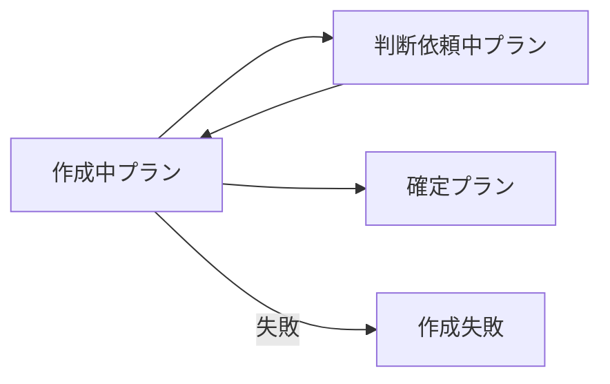

# Valid fixture 04: Mermaid フェンス・矢印・コロンの回帰確認

Mermaid フェンス内の矢印記号が禁止記号扱いされないこと、コマンドエントリ内のコロンが許容されることを検証する。

## サンプル集約

### コマンド

```
プランを確定する:
    契機: 外部指示
    入力: 作成中プラン AND 開発者
    成功時: プランが確定した / 確定プラン
    失敗時:
        - Approve数不足
        - 必須タスク未完了
```

### 状態遷移図（参考）


