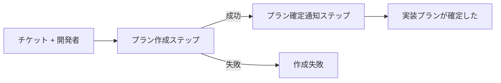

# 関数型ドメインモデル 記法ガイド

イベントストーミング Design Level で明らかになったドメインを、実装言語に依存しない擬似コード記法で形式化するための規約・テンプレートを定める。プロダクトチーム全体（エンジニア・非エンジニア問わず）でドメインモデルを読み書きし、合意形成の土台とすることを狙う。

## 目的・スコープ

- **目的**: Design Level の状態遷移・コマンド・イベントを、実装言語に依存しない擬似コードで形式化する。プロダクトマネージャー・デザイナー・ビジネスサイドを含む全員が読み書きできる記法にする
- **スコープ**: 擬似コードによる型・関数の定義まで。実装コード・特定言語の型システム（F#, TypeScript, Kotlin 等）は扱わない
- **位置付け**: イベントストーミング Big Picture → Design Level → **関数型ドメインモデル** の順に深掘りするフェーズ。本ドキュメントは第3フェーズの記法を定める
- **ベース**: Scott Wlaschin『Domain Modeling Made Functional』序盤で用いられる AND / OR 表記を採用。F# 構文には踏み込まない

## 記法の基本原則

1. **英単語キーワードは最小限**: `AND` `OR` `入力` `成功時` `失敗時` `契機` のみ使用。`type` `of` `let` 等のプログラミングキーワードは使わない
2. **日本語の語彙を優先**: ドメインの用語（ユビキタス言語）をそのまま型名に用いる
3. **記号は控えめ**: 記法上の記号は `=` `:` `( )` のみ。`->` `=>` `<>` `{}` 等の言語固有の型記号は使わない。散文解説で `→` を便宜的に用いることがあるが記法の一部ではない
4. **階層は字下げ**: 構造をインデントで示す
5. **実装詳細は書かない**: カリー化・モナド・ジェネリクス等の言語固有の概念は持ち込まない

## 記法の読み方

### 基本記号

| 記号 | 読み方 | 例 |
|---|---|---|
| `A = B` | 型の定義。「A は B として定める」 | `プランID = 文字列`, `実装プラン = 作成中 OR 確定` |
| `A AND B` | 「A と B の両方を持つ」 | `プランID AND チケットID` |
| `A OR B` | 「A か B のどちらか」 | `作成中 OR 判断依頼中 OR 確定` |
| `A: B` | フィールドの型注釈・コマンドフィールド。「A は B の型を持つ」 | `確定者: 開発者ID`, `契機: 外部指示` |
| `A (説明)` | 自然言語による説明・内容注記 | `仕様不明点あり (質問内容を持つ)` |
| `契機: X` | 「コマンドの契機（外部指示・イベント受信・ポリシー・スケジュール）は X」 | `契機: 外部指示` |
| `入力: X` | 「X を受け取る」 | `入力: チケット AND 開発者` |
| `成功時: X` | 「成功時は X を返す」 | `成功時: 実装プランが確定した / 確定プラン` |
| `失敗時: ...` | 「失敗ケースを箇条書きで列挙」 | `失敗時:`（次行以降にインデント付きで `- 仕様不明点あり` 等） |

**`A: B` の同名禁止**: A（フィールド名）と B（型名）を同名にしない。同名は「フィールド名 = 型名」と読めて型注釈の意味が消えるため、`チケットID: チケットID` ではなく `ID: チケットID` のようにフィールドの役割名を A に置く。例外として、AND の束ねで型名そのものを並べる場合（`プランID AND チケットID` など）はフィールド名を省略しているだけなのでこの規約の対象外。

### 数量の表現

| 表現 | 意味 |
|---|---|
| `X の一覧` | X を 0 個以上持つ |
| `X の一覧（1個以上）` | X を 1 個以上持つ |
| `X を持つ場合がある` | X があるかないか（省略可） |

### 型の種別は「名前の形」で判別する

本ガイドでは型の種別を名前の形で示す。記号ではなく命名規則で区別する。

| 名前の形 | 種別 | 例 |
|---|---|---|
| 名詞句 | データ型・値 | `実装プラン`, `作成中プラン`, `プランID` |
| 過去形「〜した」「〜された」 | イベント | `実装プランが確定した` |
| 動詞句（う段終止形） | コマンド・関数 | `実装プランを作成する`, `タスク消化中に戻す`, `仕様書を書く` |
| 「〜ポリシー」接尾辞 | ポリシー | `プラン再開ポリシー` |

命名から種別が読み取れない場合は命名を見直す。

### 読み方の例

```
実装プランを作成する:
    契機: 外部指示
    入力: チケット AND 開発者
    成功時: 実装プランが確定した / 確定プラン
    失敗時:
        - 仕様不明点あり (質問内容を持つ)
        - 技術方針未決 (相談事項を持つ)
```

→ 「実装プランを作成する」は名前が動詞句（う段終止形）なので **コマンド**。外部指示を契機に「チケット」と「開発者」を受け取り、成功時は「実装プランが確定した」イベントと「確定プラン」状態を返す。失敗ケースは箇条書きで「仕様不明点あり」「技術方針未決」を列挙する。

## 失敗の扱い

コマンドの失敗は、`失敗時:` フィールド配下にインデント付きの箇条書きで失敗理由を列挙する。失敗ケースをドメイン語彙として明示し、プロダクトチーム全体で業務フロー（判断依頼、リトライ、代替案）を合意する対象とする。

```
実装プランを作成する:
    契機: 外部指示
    入力: チケット AND 開発者
    成功時: 実装プランが確定した
    失敗時:
        - 仕様不明点あり (質問内容を持つ)
        - 技術方針未決 (相談事項を持つ)
```

**記述ルール**:
- 失敗理由は `失敗時:` 配下に `- 失敗理由名` の箇条書きで列挙する（曖昧な文字列エラーを避ける）
- 失敗理由が値を持つ場合は `(質問内容を持つ)` のように括弧内に自然言語で内容を注記する
- ドメイン語彙として意味のある失敗のみを列挙する。内部エラー（DB接続失敗等）は実装側の関心として分離する
- **失敗理由型を独立した型として定義しない**。同じ失敗理由が複数コマンドで必要な場合は重複記述を許容する（コマンドエントリの自己完結性を優先）
- 失敗扱いの思想は Wlaschin 本の Railway Oriented Programming と整合

### 複数ドメイン変化の扱い

1コマンドで複数のドメイン変化が起きる場合、成功時に複数のイベント・状態を `/` で並べる。

```
注文を確定する:
    契機: 外部指示
    入力: 注文
    成功時: 注文が確定した / 在庫が引当てられた
    失敗時:
        - 在庫不足
        - 与信不足
```

## 型テンプレート

各ドメインモデル文書で定義する型カテゴリと雛形を示す。

### よく使う原始型

以下は記法上の原始型として、定義なしに型の右辺・フィールド型注釈でそのまま使える:

- `文字列`: 任意長の文字列
- `整数`: 整数値
- `真偽値`: true / false
- `日時`: 日付と時刻

範囲・形式に制約がある値（例: `1以上の整数`, `Email`, `URL`）は次節の「制約を持つ値」として生成ルール付きで定義する。

### 1. 値

ID や単純な値の型を定める。

```
プランID = 文字列
チケットID = 文字列
開発者ID = 文字列
日時 = 日時
```

**制約を持つ値**: 型と生成ルール（コマンド）をセットで書く。失敗理由はコマンドの `失敗時:` 配下にインライン記述する。

```
必要Approve数 = 1以上の整数

必要Approve数を作る:
    契機: 外部指示
    入力: 整数
    成功時: 必要Approve数
    失敗時:
        - ゼロ以下
```

**使いどころ**:
- ドメイン上意味のある ID・識別子
- 値の範囲・形式に制約があるもの（Email、日時、数量等）

**ポイント**:
- 制約は「生成ルール」のコマンドの失敗理由として記述する
- 他の場所で値を使うときは「必ず生成ルールを通した値である」前提で扱う

### 2. 状態

集約の状態を OR で表現し、無効な状態組合せを排除する。

```
実装プラン =
    作成中
    OR 判断依頼中
    OR 確定

作成中プラン =
    ID: プランID
    AND チケットID
    AND タスクの一覧

判断依頼中プラン =
    ID: プランID
    AND チケットID
    AND 質問内容: 文字列

確定プラン =
    ID: プランID
    AND チケットID
    AND タスクの一覧
    AND 確定日時
```

**ポイント**:
- 状態ごとに必要な属性が異なる場合、状態を分けて定義することで「判断依頼中なのに確定日時がある」といった無効状態を排除できる
- 各状態型は独立したレコード（AND の束ね）として書く

### 3. コマンド

コマンドは集約の状態変化を引き起こす契機を表す。外部指示・イベント受信・ポリシー由来・スケジュール起動の全てをコマンドとして統一的に扱い、各エントリで `契機:` フィールドに種別を明示する。

```
実装プランを作成する:
    契機: 外部指示
    入力: チケット AND 開発者
    成功時: 実装プランが確定した / 作成中プラン
    失敗時:
        - 仕様不明点あり (質問内容を持つ)
        - 技術方針未決 (相談事項を持つ)
```

#### 「契機」フィールド仕様

**全コマンドエントリで `契機:` フィールドは必須**。値は以下の4つの列挙値のいずれかを記述する。自由記述は禁止。

| 値 | 用途 |
|---|---|
| `外部指示` | UI操作・APIコール等、集約外部からの直接指示 |
| `イベント受信（{集約名} `{イベント名}`）` | 別集約のドメインイベントを契機とする反映コマンド |
| `ポリシー（{ポリシー名}）` | ポリシー経由でのコマンド発行（複数イベント観測等） |
| `スケジュール` | 時刻起動・定期実行 |

新たな契機種別が必要になった場合は本ガイドを改訂する（規約形骸化防止のため自由記述は禁止）。

**4種の使用例**:

```
プランニングを開始する:
    契機: 外部指示
    入力: チケットID AND 開発者
    成功時: プランニングが開始された / プランニング中プラン

判断依頼の発行を反映する:
    契機: イベント受信（判断依頼集約 `判断依頼が発行された`）
    入力: プランニング中プラン
    成功時: 判断依頼中プラン

実装プランを再開する:
    契機: ポリシー（プラン再開ポリシー）
    入力: 判断依頼中プラン AND 回答内容
    成功時: プランニング中プラン

日次集計を実行する:
    契機: スケジュール
    入力: 集計対象日
    成功時: 日次集計が完了した
```

#### 記述ルール

- コマンド名は動詞句（う段終止形 `う/く/ぐ/す/つ/ぬ/ぶ/む/る`）
- `契機:` フィールド必須。値は4種列挙値（`外部指示` / `イベント受信(...)` / `ポリシー(...)` / `スケジュール`）
- `入力:` で受け取るデータを記述
- `成功時:` で成功時の出力（イベント・状態の組合せ）を記述。複数並べる場合は `/` 区切り
- `失敗時:` 配下にインデント付き箇条書き（`- 失敗理由名`）で失敗ケースを列挙
- 失敗理由型を独立定義しない。共有箇所では重複記述を許容

### 4. イベント

イベントは AND の束ねで表現する。過去の事実であり、後から変更されない。

```
実装プランが確定した =
    プランID
    AND チケットID
    AND 確定者: 開発者ID
    AND 確定日時
```

**記述ルール**:
- **イベント名は過去形**。対象オブジェクトを主語にする
  - 他動詞は受動形「〜された」（例: `PRがマージされた`, `レビューが承認された`）
  - 自動詞は能動過去形「〜した」（例: `実装プランが確定した`, `回答が届いた`）
  - 無理に受動形に統一しない（`確定された` は冗長）
- 発生時刻を含める
- 原因となったアクター・対象を識別できる属性を持つ

### 5. ポリシー

ポリシーは「複数イベントの観測 → 1コマンド発行」のような集約点・条件分岐ロジックを記述する場所。

```
変更要求対応ポリシー:
    きっかけ: 変更が要求された
    実行するコマンド: プランニングを開始する
```

**記述ルール**:
- ポリシー名は「〜ポリシー」接尾辞
- `きっかけ` にイベント名、`実行するコマンド` にコマンド名を書く
- ポリシーが参照するイベント・コマンドは、同文書内の別箇所で定義されている前提とする。未定義の名前が現れた場合はドメインモデル文書の不備として扱う
- ポリシーは実行するコマンドが属する集約（受け手集約）のセクションに配置する

#### コマンド側 `契機: ポリシー(...)` との境界

コマンドエントリの `契機: ポリシー（{ポリシー名}）` と本セクションの `### ポリシー` は粒度が異なり、機能重複しない。役割分担:

| 観点 | 場所 | 記述内容 |
|---|---|---|
| **コマンド側 `契機: ポリシー(...)`** | コマンドエントリ内 | 「このコマンドはポリシーから発行されうる」というメタデータ。発行経路の可視化 |
| **`### ポリシー` セクション** | 集約セクション内 | 「複数イベント観測 → 1コマンド発行」等の集約点・条件分岐ロジック。`きっかけ` と `実行するコマンド` のペアで定義 |

両者を併記することで、コマンド側の `契機:` から「どのポリシーが発行元か」をたどり、ポリシーセクションで「何をきっかけに発行されるか」の詳細を確認できる構造になる。

### 6. 集約

集約は状態型と、その状態を遷移させるコマンドの束ねで表現する。状態遷移はコマンドの `成功時:` フィールドで「どの状態に遷移するか」を表現する（独立した「状態遷移」サブセクションは設けない）。

```
=== 実装プラン集約 ===

状態型: 実装プラン（上で定義）

コマンド:

  プランニングを開始する:
      契機: 外部指示
      入力: チケットID AND 開発者
      成功時: プランニングが開始された / プランニング中プラン
      失敗時:
          - チケット未トリアージ

  判断依頼を発行する:
      契機: 外部指示
      入力: 作成中プラン AND 質問内容: 文字列
      成功時: 判断依頼が発行された / 判断依頼中プラン

  回答を受け取る:
      契機: イベント受信（判断依頼集約 `回答が受理された`）
      入力: 判断依頼中プラン AND 回答内容: 文字列
      成功時: 作成中プラン

  確定する:
      契機: 外部指示
      入力: 作成中プラン AND 開発者 AND 当該チケットIDの未解消判断依頼集約一覧
      成功時: 実装プランが確定した / 確定プラン
      失敗時:
          - Approve数不足
          - 必須タスク未完了
          - 未解消の判断依頼あり (判断依頼IDの一覧を持つ)
```

**ポイント**:
- コマンドは集約の状態変化を引き起こす契機。外部指示・イベント受信・ポリシー由来・スケジュールの全てを「契機」フィールドで明示
- `成功時:` で「成功時に発生するイベント / 遷移後の状態」を `/` 区切りで列挙する
- 失敗理由は `失敗時:` 配下にインライン箇条書き。独立型定義は禁止

### 7. ワークフロー

ワークフローは **外部（他コンテキスト・UI・スケジューラ等）に公開するユースケースの契約**を表す。集約内部で完結するコマンドには書かなくてよい。

```
実装プランを確定する:
    入力: チケット AND 開発者
    成功時: 実装プランが確定した
    失敗時:
        - 仕様不明点あり
        - 技術方針未決

    ステップ:
        1. プラン作成ステップ（実装プラン集約）
        2. プラン確定通知ステップ（通知集約）
```

**記述ルール**:
- **ワークフロー名は動詞句（う段終止形）を既定とする**。契約として何を達成するかを名前に反映する
- 例外として、定型的な状況名が既に業務用語として定着している場合（`日次集計` `月次締め` 等）は名詞句も許容する
- `入力` `成功時` `失敗時` はワークフロー全体の型シグネチャを示す
- `ステップ` は内部の順序付き処理を列挙。詳細な合成順は Mermaid flowchart を併用する
- **ステップ名は `〜ステップ` 接尾辞の名詞句**（`プラン作成ステップ` `通知送信ステップ` 等）とし、括弧内に責任集約を記載する
- ワークフロー = 外部契約。1集約内で完結し外部に出ないユースケースはコマンドで十分

ステップの合成順を図示する場合:



## 不変条件・事前条件の表現

不変条件を「型で表せるもの」と「型では表せないもの」に分けて扱う。

### 型で表せるもの

- **値の制約**: 生成ルールで検査（例: `必要Approve数 >= 1`）
- **状態の制約**: OR で無効な状態組合せを排除（例: 判断依頼中プランには確定日時が存在しない）
- **必須項目**: AND で必須属性として定義

### 型では表せないもの

- **外部リソースに依存する事前条件**: コマンドの入力に前提状態を受け取り、失敗理由として返す
- **ドメインルール**: コマンド内の条件判定として記述

```
チケットを担当する:
    契機: 外部指示
    入力: チケット AND 開発者 AND 現在のアサイン状況
    成功時: 担当が決まった
    失敗時:
        - 既に他の開発者が担当中
        - チケットがクローズ済み
```

現在のアサイン状況は外部リソース（DB 等）から取得する値であり、生成ルールで型に埋め込めない。コマンドの入力として受け取り、条件判定の結果を失敗理由で返す。

## コンテキスト境界の扱い

本コンテキスト外のイベント・コマンドは「外部イベント」「外部コマンド」として明示する。

```
外部_バグチケットが作成された =
    チケットID
    AND 起票元コンテキスト: 文字列
    AND 発見日時

外部_バグチケット作成を依頼する:
    契機: 外部指示
    入力: 不具合報告
    観測するイベント: 外部_バグチケットが作成された
```

**ルール**:
- 外部型は `外部_` プレフィックスで明示
- 外部コマンドは同期的な戻り値を持たない。代わりに **`観測するイベント:`** ラベルで、依頼送出後に他コンテキストから届くイベントを記述する
- `成功時:` は同期的な返り値を表すラベルなので、非同期な外部コマンドでは使わない（内部コマンドと意味が混ざるのを避けるため）
- 処理責任は他コンテキスト。本コンテキストは依頼の送出と結果の受信のみを扱う

## 命名規約

命名規則が型の種別を示す（記法の読み方「型の種別は名前の形で判別する」参照）。

- **基本は日本語型名**: Design Level 文書と用語を揃える。ユビキタス言語を尊重する
- **英単語は最小限**: `AND` `OR` `入力` `成功時` `失敗時` `契機` のみ使用
- **データ型・値は名詞句**: `実装プラン`, `作成中プラン`, `チケットID`
- **イベントは過去形**: 対象オブジェクトを主語にし、他動詞は「〜された」、自動詞は「〜した」。例: `PRがマージされた`（他動詞の受動形）, `実装プランが確定した`（自動詞）
- **コマンド・関数は動詞句（う段終止形）**: 末尾は `う/く/ぐ/す/つ/ぬ/ぶ/む/る` のいずれか。例: `実装プランを作成する`（る）, `タスク消化中に戻す`（す）, `仕様書を書く`（く）, `日報を打つ`（つ）
- **ワークフローは動詞句（う段終止形）を既定**: 契約として達成する結果を名前に反映。例外は業務用語として定着した名詞句（`日次集計` 等）のみ
- **ポリシーは「〜ポリシー」接尾辞**: `プラン再開ポリシー`
- **外部要素のプレフィックス**: 外部コンテキスト由来は `外部_` を付与

### う段終止形の誤許容について

リントはう段9文字（う/く/ぐ/す/つ/ぬ/ぶ/む/る）の末尾判定のみを機械化する。このため、以下のケースは形態素解析を伴わない判定では区別できない:

- **名詞末尾がう段9文字に該当**: 漢字訓読み・カタカナ語等で末尾が「す」「く」「る」等になる名詞は、動詞句でなくても違反として検出されない可能性がある（語尾文字一致のみで判定するため）
- **末尾がう段9文字に該当しない動詞活用形**: 連用形「〜き」（書き）・命令形「〜せ」等の語尾は動詞だがう段ではないため、終止形以外の動詞は機械的に許容できない

本規約は「規約として人が守る」前提で運用し、リントはう段終止形判定のみ機械化する。形態素解析による厳密な動詞句判定は将来課題として別途検討する。誤許容・誤検出のいずれも、規約遵守の観点で人の目によるレビューで補完する。

## 成果物構成（各DL向けテンプレート）

ドメインモデル文書は `docs/{domain}/domain-model.md` に配置する。**集約単位で型定義をまとめる**のが基本方針。1つの集約のライフサイクルを追うとき、その集約のセクション内で完結して読めることを重視する。

### 文書構造

```
1. スコープ
2. 概観
3. 共通値
4. 集約 A
   - 責務
   - 固有値
   - 入力イベント（他集約から）
   - 発火するイベント
   - 状態型
   - コマンド
   - ポリシー
   - 型で表せなかった不変条件
5. 集約 B
   （同じ構造）
...
N. ワークフロー
N+1. コンテキスト境界
N+2. DL文書との対応表
N+3. モデル化で露出した論点
```

### 各セクションの役割

| セクション | 内容 |
|---|---|
| **スコープ** | 対象コンテキスト、対応するDL文書へのリンク、含む集約の一覧 |
| **概観** | 集約・主要コマンド・イベントを一望する早見 |
| **共通値** | 複数集約で参照される値のみ（`日時`, `チケットID`, `開発者` 等） |
| **集約 X の節** | その集約のライフサイクルを完結して読めるように、固有型・イベント・コマンド・ポリシーを全て含める。コマンドが状態変化の契機を担うため独立した「状態遷移」サブセクションは設けない |
| **ワークフロー** | 外部契約として公開するユースケース（集約横断のみ書く、内部完結のものは不要） |
| **コンテキスト境界** | 他コンテキスト由来の外部イベント、他コンテキストへの外部コマンド |
| **DL文書との対応表** | DL のイベント・コマンド・集約と型の対応 |
| **モデル化で露出した論点** | 型定義を試みて見つかった DL の不備・不明点 |

### イベント配置のルール

イベントは集約間の接続点だが、定義は **発火元集約のセクションに1箇所のみ置く**。

- **発火元集約**: `発火するイベント` サブセクションで型を定義
- **受け手集約**: `入力イベント（他集約から）` サブセクションで名前と参照先のみ記載（再定義しない）

これにより、各集約のセクションを読めば「何を受け取って、何を発火するか」が手元で揃う。

### 共通値の判定基準

**原則**: 2つ以上の集約で参照される型のみを「共通」に置く。

| 例 | 置き場所 |
|---|---|
| `日時` | 共通（ほぼ全イベントで使用） |
| `チケットID` | 共通（複数集約で使用） |
| `開発者` | 共通（複数集約のアクター） |
| `プランID` | 実装プラン集約固有 |
| `PRID` | PRレビュー集約固有 |
| `必要Approve数` | PRレビュー集約固有 |

判断に迷う場合は **その集約固有に置き、必要に応じて後から共通に昇格** する（重複記述を避けたいため、共通化は後からでも容易）。

### ポリシーの配置

ポリシーは「イベント受信 → コマンド発行」の橋渡し。**コマンドを発行する側の集約（= 受け手集約）のセクション** に配置する。

例: `変更要求対応ポリシー`（変更が要求された → 実装プランを作成する）は実装プラン集約のポリシー。

## Mermaid 図との併用方針

- 状態遷移図は DL 文書（`event-storming.md`）から引用し、ドメインモデル文書では再掲しない
- ドメインモデル文書は「型定義」に集中し、視覚的表現は DL 側に委ねる
- ワークフローのステップ順序など、型だけでは読み取りにくい処理フローは Mermaid flowchart を併用する
- Mermaid 図は標準の Mermaid 構文（`-->`, `|ラベル|`, `[ ]` 等）に従う。本ガイドの記法ルール（禁止記号 `->` `=>` 等）は Mermaid 記法には適用しない

## 参考文献

- Scott Wlaschin, *Domain Modeling Made Functional*, Pragmatic Bookshelf, 2018
  - 本ガイドの AND / OR 記法は本書序盤（Part 1）の自然言語寄り擬似コードに準ずる
  - 本書後半の F# による厳密な型定義は、実装段階で各言語に翻訳する際の参考として扱う
  - Railway Oriented Programming（失敗理由を型で扱う手法）、状態遷移の OR 排除、生成ルールによる制約表現の原典
