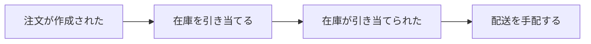
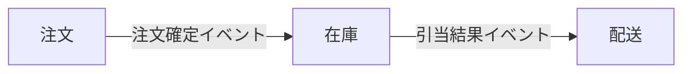

# Big Picture フロー

システム全体を俯瞰し、ドメインを横断したイベントフローの洗い出しとバウンデッドコンテキストの発見を行う。

## 出力先

- `docs/big-picture.md` — イベントフロー図・コンテキスト一覧・コンテキスト間の依存関係・ホットスポット

## Phase 1: システム全体のドメインイベント洗い出し

全ドメインを横断して主要なビジネスイベントを広く収集する。深掘りはせず網羅性を重視。

**ガイド質問:**

- このシステムで、ユーザーの最初のアクションから最後のアクションまでに何が起きますか？
- 主要な業務フロー（ハッピーパス）を端から端まで辿ると、どんなイベントが発生しますか？
- 外部システムとの連携ポイントで起きるイベントはありますか？
- 定期的に発生するイベント（日次バッチ、月次締め等）はありますか？

**進め方:**

1. ユーザーの回答からドメインイベントを抽出し、時系列順に並べた一覧を提示する
2. 「他の業務フローはありませんか？ドメインをまたぐイベントを見逃していませんか？」と確認する
3. ユーザーが「完了」「次へ」等と回答するまで洗い出しを続ける

**表記規則:** Design Levelと同じ（過去形、ビジネス表現、ドメイン用語尊重）

**出力形式:**

| # | イベント名（過去形） | 説明 | 関連する業務フロー |
|---|---|---|---|
| 1 | 注文が作成された | ユーザーが注文内容を確定した | 注文フロー |

**ファシリテーションTips:**

- イベントが特定の業務フローに偏っている場合: 「他の業務フロー（例: 管理者向け、バックオフィス、外部連携）はありませんか？」
- 粒度が細かすぎる場合: 「Big Pictureではシステム全体の流れを掴むのが目的なので、主要なイベントに絞りましょう。詳細は後でDesign Levelで深掘りできます」

## Phase 2: イベントフローの整理

イベントを時系列に並べ、因果関係（イベントA → コマンドB → イベントC）を整理する。

**ガイド質問:**

- このイベントの次に何が起きますか？
- このイベントは何がきっかけで発生しますか？
- 異なる業務フロー間で連鎖するイベントはありますか？

**進め方:**

1. Phase 1のイベント一覧から因果関係を特定する
2. イベントフローをMermaid記法のフロー図で可視化し、提示する
3. 「このフローに抜けている分岐や合流はありませんか？」と確認する

**出力形式:**

## Phase 3: バウンデッドコンテキストの発見

関連するイベント群をグルーピングし、コンテキスト名と責務を定義する。

**ガイド質問:**

- このイベント群は「何の業務」に属しますか？
- もしチームを分けるとしたら、どこで境界を引きますか？
- 同じ用語が異なる意味で使われている箇所はありますか？

**進め方:**

1. Phase 2のイベントフローから、関連するイベント群をグルーピングする
2. 各グループにコンテキスト名を付け、責務を1文で定義する
3. 「このグルーピングに違和感はありますか？境界を動かしたい箇所はありますか？」と確認する

**出力形式:**

| # | コンテキスト名 | 責務 | 含む主要イベント |
|---|---|---|---|
| 1 | 注文 | 注文のライフサイクル管理 | 注文が作成された、注文が確定された |
| 2 | 在庫 | 在庫数量の管理と引当 | 在庫が引き当てられた、在庫が補充された |

**ファシリテーションTips:**

- コンテキストが大きすぎる場合: 「このコンテキスト内で、異なるペースで変化する部分はありますか？」
- 境界が曖昧な場合: 「このイベントは両方のコンテキストに関係しますか？それはコンテキスト間の連携ポイントかもしれません」

## Phase 4: コンテキスト間の関係整理

コンテキスト間の上流/下流の依存方向を特定する。

**ガイド質問:**

- このコンテキストは、どのコンテキストのデータやイベントに依存していますか？
- どちらが情報の発信元（上流）で、どちらが受信側（下流）ですか？

**関係パターン:**

| パターン | 説明 |
|---|---|
| 上流/下流 | 上流コンテキストがイベント/データを提供し、下流が消費する |

**進め方:**

1. Phase 3のコンテキスト一覧から、コンテキスト間のイベント連携を特定する
2. 各連携について上流/下流の方向を決定する
3. 依存関係をMermaid記法で可視化し、提示する
4. 「この関係に違和感はありますか？」と確認する

**出力形式:**

| # | 上流 | 下流 | 連携イベント |
|---|---|---|---|
| 1 | 注文 | 在庫 | 注文が確定された |

## Phase 5: ホットスポットの記録

Phase 1-4で浮上した疑問点・未解決事項を記録する。コンテキスト境界の曖昧さ、コンテキスト間の責務の重複にも注目する。

**進め方:**

1. Phase 1-4の対話中に出てきた曖昧な箇所を振り返る
2. 「まだ決まっていないこと、曖昧なままの箇所はありますか？」と確認する
3. 各ホットスポットに解消アクションを添える

**出力形式:**

| # | ホットスポット | 関連するコンテキスト | 解消アクション |
|---|---|---|---|
| 1 | 「商品」の定義がカタログと注文で異なる | カタログ、注文 | 用語の統一方針を決定する |

## Phase 6: ドキュメント生成

Phase 1-5の結果を `docs/big-picture.md` に出力する。

**進め方:**

1. `docs/` ディレクトリの存在を確認し、なければ `mkdir -p` で作成する
2. `references/big-picture-template.md` を読み込み、テンプレートに従って出力する
3. 生成後、ファイルパスを報告し、内容の過不足がないかユーザーに確認する
4. 発見した各コンテキストについて、「`/event-storming {コンテキスト名}` で詳細なDesign Levelの分析ができます」とテキスト案内する
