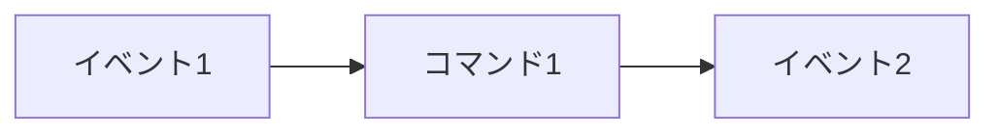
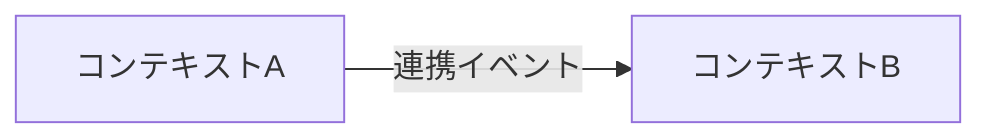

# コンテキストマップ

## イベントフロー図

## コンテキスト一覧

| # | コンテキスト名 | 責務 | 含む主要イベント |
|---|---|---|---|
| [番号] | [コンテキスト名] | [責務] | [主要イベント] |

## コンテキストマップ

| # | 上流 | 下流 | 連携イベント |
|---|---|---|---|
| [番号] | [上流コンテキスト] | [下流コンテキスト] | [イベント名] |

## ホットスポット

| # | ホットスポット | 関連するコンテキスト | 解消アクション |
|---|---|---|---|
| [番号] | [疑問点・未解決事項] | [関連コンテキスト] | [必要なアクション] |
